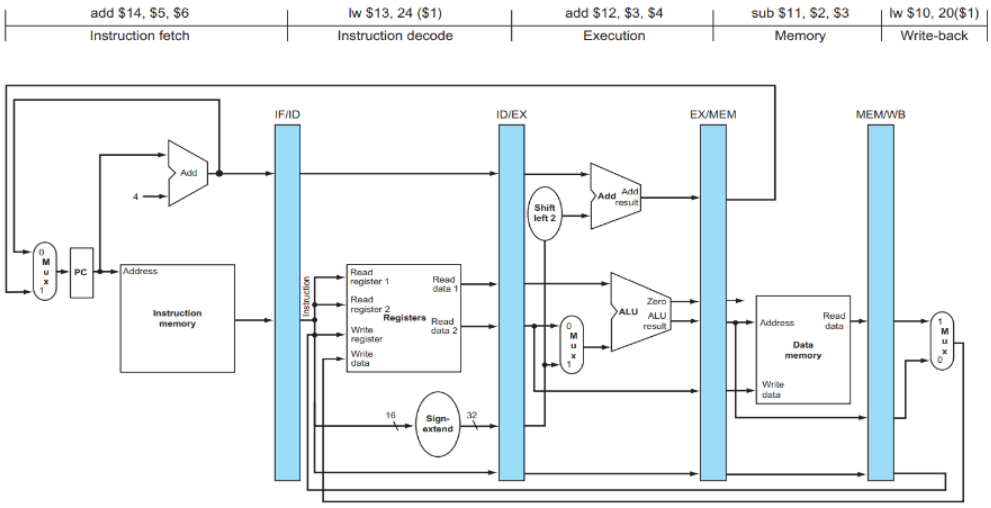

⚙ **Computer Architecture 공부**

## Pipeline DataPath
---

파이프라인 데이터패스는 CPU성능을 향상시키기 위해 명령어 실행을 여러 단계로 나누어 동시에 처리하는 기술

##### 기본 파이프라인 단계들:
* **IF** (Instruction Fetch): 명령어 가져오기
* **ID** (Instruction Decode): 명령어 해석
* **EX** (Execute): 실행
* **MEM** (Memory): 메모리 접근
* **WB** (Write Back): 결과 저장

### Two key points of pipeline datapath
---
##### 1. Pipeline register의 필요성**
한 단계에서 다른 단계로 데이터나 제어 신호를 전달하려면 반드시 **파이프라인 레지스터**에 저장되어야 한다.  
→ 그렇지 않으면 다음 명령어가 해당 단계에 들어오면 **정보가 손실됨!**

* 예시: `sw`명령어에서 ID 단계에서 얻은 regitser 2의 값은 **ID/EX register**를 통해 **EX단계**로, 다시 **EX/MEM register**를 통해 **MEM 단계로 전달**됨 

##### 2. 하드웨어 자원의 단독 사용
각 하드웨어 구성요소(instruction memory, register read ports, ALU, data memory, register write port)는 **한 번에 하나의 단계에서만 사용 가능**   
❌**여러 명령어가 동시에 같은 하드웨어를 공유할 수 없음!**

* 예시: ALU는 EX단계에서만 사용되고, 메모리는 MEM단계에서만 접근

### A CORRECTED PIPELINED DATAPATH: BUG
---
❌`lw`명령어가 WB단계에서 데이터를 레지스터에 쓰려고 할 때 중요한 문제가 발생:
* `lw`명령어가 WB 단계에 있을 때, **읽어온 데이터를 목적지 레지스터에 써야함**
* 하지만 어떤 레지스터에 써야 하는지(**write register number)**를 알아야 함
* 현재 시점에서 ID 단계로 돌아가면 `lw` 다음의 명령어 실행 중!
  * 즉, **잘못된 레지스터 번호를 사용하게되는 BUG 발생!!!**

{:.prompt-tip}
> 이를 해결하기 위해 **Pipeline register 도입!**
>

### A CORRECTED PIPELINED DATAPATH: FIX
---

### EXAMPLE: DIAGRAM OF FIVE INSTRUCTIONS
---
이제 실제 5개 명령어의 파이프라인 실행 예제를 통해 파이프라인의 동작을 이해해보자

* **주어진 5개 명령어**:
1. `lw $10, 20($1)`
2. `sub $11, $2, $3`
3. `add $12, $3, $4`
4. `lw $13, 24($1)`
5. `add $14, $5, $6`

> 각 cycle에서 모든 명령어들은 다른 단계에 있음

> CC5 cycle에서는 동시에 5개의 명령어가 동시에 실행되고 있다.

* **CC5에서 동시에 실행되는 5개 명령어**:
1. **IF**: `add $14, $5, $6` (명령어 페치)
2. **ID**: `lw $13, 24($1)` (명령어 해석, 레지스터 읽기)
3. **EX**: `add $12, $3, $4` (ALU 연산 수행)
4. **MEM**: `sub $11, $2, $3` (메모리 접근 - 실제로는 사용안함)
5. **WB**: `lw $10, 20($1)` (메모리 데이터를 $10에 저장)

✅**register file은 별도의 읽기 포트와 쓰기 포트를 가지고 있어 동시에 작업 가능**  
* **읽기 포트**: `lw $13` 명령어가 `$1` 레지스터 값을 읽음 (ID 단계)
* **쓰기 포트**: `lw $10` 명령어가 `$10` 레지스터에 데이터 저장 (WB 단계)

## CONTROL SIGNALS FOR PIPELINED DATAPATH
---
단일 사이클 CPU에서는 모든 control signal이 한 번에 생성되지만,  
파이프라인에서는 **단계별로 필요한 control signal**만 사용된다.

* 명령어별 Control Signal Mapping

> 1: 활성, 0: 비활성, x: Don't care

### Control signals 실행 예제
---
* 예시 명령어: `lw $t0, 8($s0)`
* 필요한 conrtrol singals:
  * **EX**: `RegDst=0`, `ALUSrc=1`, `ALUOp=00`(주소계산)
  * **MEM**: `MemRead=1`, `MemWrite=0`, `Branch=0`
  * **WB**: `RegWrite=1`, `MemtoReg=1`(메모리 → 레지스터)

⏰ **사이클별 제어 신호 활성화**:

1. **IF, ID 단계**:

> IF에서는 PC 증가만!  
> ID에서 명령어 분석 → 제어 유닛이 모든 제어 신호 생성(사용X)

2. **EX 단계**:

> 주소 계산 `$s0 + 8`

3. **MEM 단계**:

> 메모리 읽기 - 주소: `$s0+8`

4. **WB 단계**:

> 메모리 데이터를 `$t0`에 저장

## Implementing Control Lines
---
파이프라인에서 Control signal은 **데이터와 함께 이동**하며, **각 단계에서 필요한 신호만 사용하고 나머지는 다음 단계로 전달함!**

1. **ID 단계**: 필요한 제어 신호 생성
2. **EX 단계**: 제어 신호 사용 및 전달(`RegDst`, `ALUOp1/0`, `ALUSrc` 사용, EX/MEM에 복사되지 않음)
3. **MEM 단계**: 메모리 제어 신호 사용(`Branch`, `MemRead`, `MemWrite` 사용)
4. **WB 단계**: 최종 레지스터 쓰기(`MemtoReg`, `RegWrite` 사용)

* 전체 메커니즘
