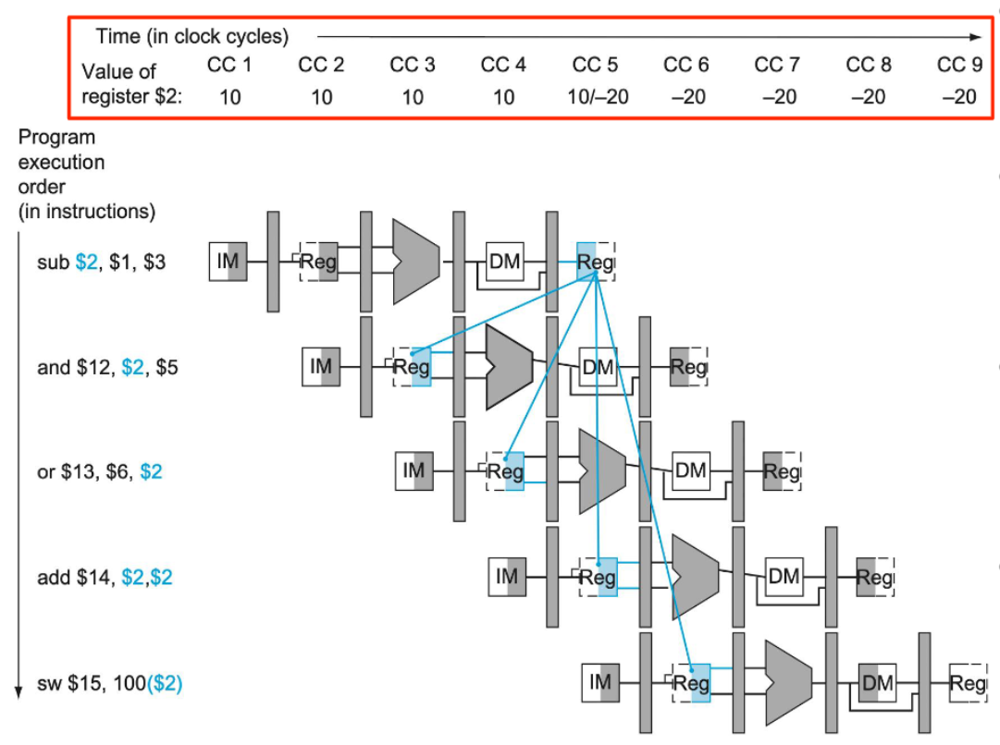
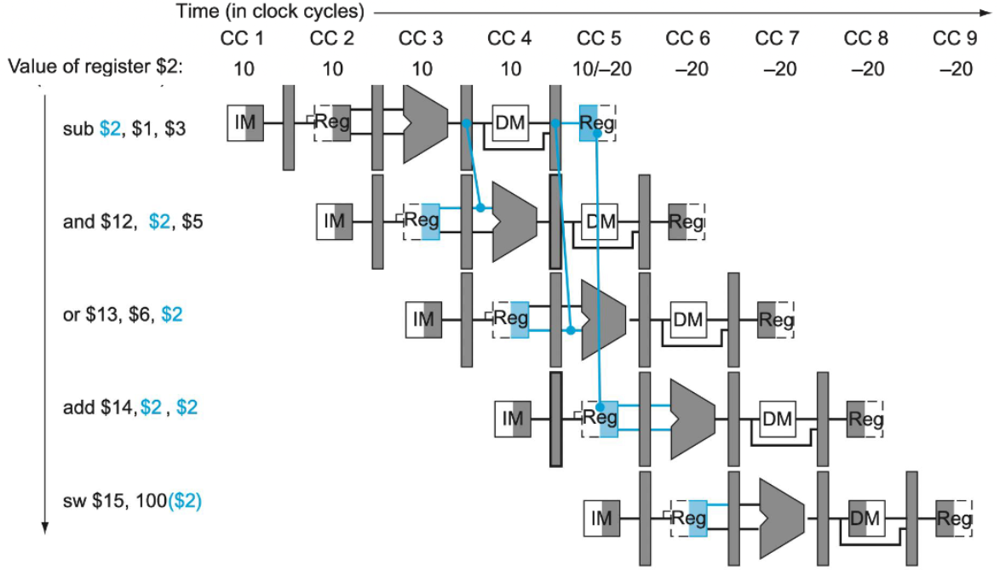
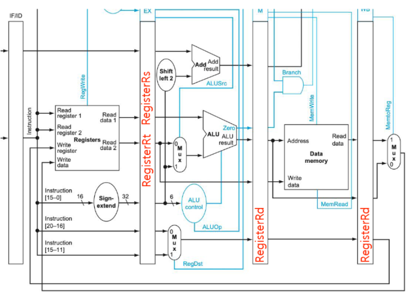
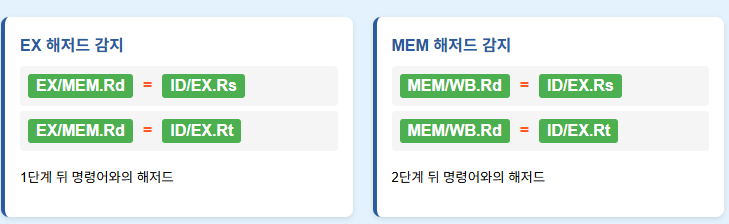
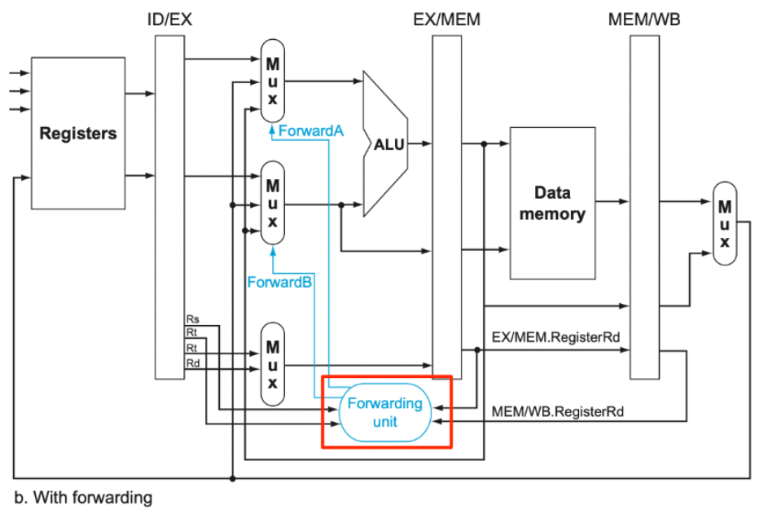
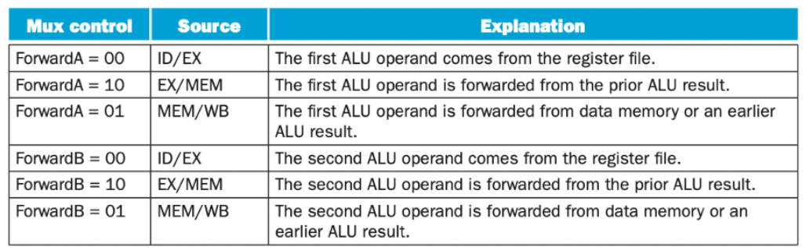

⚙ **Computer Architecture 공부**

## Data Hazard
---
📚**<span style="color: #008000">Data Hazard</span>**: 파이프라인에서 실행되는 명령어들 사이에 **데이터 의존성이 있을 때 발생하는 문제**
*  **명령어의 결과가 다음 명령어의 입력**으로 사용되는데, 아직 결과가 준비되지 않았을 때 발생

#### 예시 시나리오 


**설정**  
* `register $2`의 초기값: `10`
* **Instructions**:
  1. `sub $2, $1, $3` - $2에 결과 저장 (10 → -20)
  2. `and $12, $2, $5` - $2 값을 읽음
  3. `or $13, $6, $2` - $2 값을 읽음
  4. `add $14, $2, $2` - $2 값을 두 번 읽음
  5. `sw $15, 100($2)` - $2 값을 주소로 사용

##### 시나리오 1: sub $2, $1, $3
* **CC5**에서 WB 단계를 통해 `$2`에 -20을 기록
* CC1~CC4까지는 `$2` = 10 유지
* CC5부터 `$2` = -20으로 변경

##### 시나리오 2: and $12, $2, $5 (데이터 해저드 발생)
* CC3에서 ID 단계에서 `$2` 값을 읽어야 함
* 하지만 이때 `$2`는 아직 10 (구값)
* 실제로 필요한 값은 -20 (신값)
* **해저드 발생!**

##### 시나리오 3: or $13, $6, $2 (데이터 해저드 발생)
* CC4에서 ID 단계에서 `$2` 값을 읽어야 함
* 여전히 `$2`는 10 (구값)
* **해저드 발생!**

##### 시나리오 4: add $14, $2, $2 (해저드 없음)
* CC5에서 ID 단계에서 `$2` 값을 읽음
* 이때는 정확히 CC5에서 `$2`에 -20이 기록되는 시점
* 같은 클록 사이클 내에서 앞부분에 쓰고 뒷부분에 읽으므로 해저드 없음

{:.prompt-tip}
> Data Harzard를 해결하기 위한 방법 존재!
>

### Data Forwarding
---
📚**<span style="color: #008000">Data Forwarding</span>**: **레지스터 파일을 거치지 않고 직접 파이프라인 단계 간에 데이터를 전달**하여 데이터 해저드를 해결하는 하드웨어 기법


1. **포워딩 타이밍**
* CC3에서 `sub`: EX 단계에서 ALU가 -20 계산 완료
* CC4에서 `and`: EX 단계에서 `$2` 값이 필요 → **EX/MEM 레지스터에서 포워딩**
* CC5에서 `or`: EX 단계에서 `$2` 값이 필요 → **MEM/WB 레지스터에서 포워딩**

2. **포워딩 경로**
* **EX-to-EX 포워딩**: EX/MEM 레지스터 → ALU 입력
* **MEM-to-EX 포워딩**: MEM/WB 레지스터 → ALU 입력

#### Data Detection
---
📚**<span style="color: #008000">Data Detection</span>**: 언제 포워딩이 필요한지 자동으로 감지하여 포워딩 경로를 활성화


* data harzar 감지 조건


##### 4 Hazard case
1. **<span style="color: #008000">EX/MEM.RegisterRd = ID/EX.RegisterRs</span>**
* 1번째와 2번째 명령어 사이, 2번째 명령어의 첫 번째 소스
2. **<span style="color: #008000">EX/MEM.RegisterRd = ID/EX.RegisterRt</span>**
* 1번째와 2번째 명령어 간, 2번째 명령어의 두 번째 소스
3. **<span style="color: #008000">MEM/WB.RegisterRd = ID/EX.RegisterRs</span>**
* 1번째와 3번째 명령어 간, 3번째 명령어의 첫 번째 소스
4. **<span style="color: #008000">MEM/WB.RegisterRd = ID/EX.RegisterRt</span>**
* 1번째와 3번째 명령어 간, 3번째 명령어의 두 번째 소스

#### Implementation of Data Forwarding
---


* **<span style="color: #008000">forwarding unit</span>**: 4개의 레지스터 번호를 입력받음
  * **EX/MEM.RegisterRd**: 1단계 앞 명령어의 목적지 레지스터
  * **MEM/WB.RegisterRd**: 2단계 앞 명령어의 목적지 레지스터
  * **ID/EX.RegisterRs**: 현재 명령어의 첫 번째 소스 레지스터
  * **ID/EX.RegisterRt**: 현재 명령어의 두 번째 소스 레지스터

* **멀티플렉서**: 각 ALU 입력마다 3가지 소스 중에서 선택
1. 레지스터 파일 출력(기본값)
2. EX/MEM 레지스터 (1단계 앞 결과)
3. MEM/WB 레지스터 (2단계 앞 결과)

* **2-bit signal**
  * `00`: 해저드 없음 → 레지스터 파일에서 읽기
  * `10`: EX 해저드 → EX/MEM에서 포워딩
  * `01`: MEM 해저드 → MEM/WB에서 포워딩


✅**실제 동작 예시:**  

```
add $1, $2, $3  # CC1
sub $4, $1, $5  # CC2
```

**CC4 시점에서:**  

* EX/MEM.RegisterRd = `$1` (add 명령어)
* ID/EX.RegisterRs = `$1` (sub 명령어)
* 포워딩 유닛 판단: **EX/MEM.RegisterRd == ID/EX.RegisterRs**
* 결과: ForwardA = `10`
* 멀티플렉서: **EX/MEM 레지스터의 값을 ALU 첫 번째 입력으로 선택**