>🍀 운영체제 전공 수업 정리

{:.prompt-warning}
> 프로세스들이 돌고있는데 물리적인 메모리가 부족할 때 어떻게 해결할 수 있을까?
>
즉, 메모리 부족 문제를 해결하기 위한 기법이 **Swapping**

## Swapping
---
📚**Swapping**: 돌고 있는 프로세스를 일시적으로 **backing store(보조 저장장치)**로 내보내고, 필요할 때 다시 메모리로 가져오는 방식

✅모든 프로세스들의 **물리적 메모리 공간 합계가 실제 물리 메모리를 초과할 수 있게 만드는 기술**  

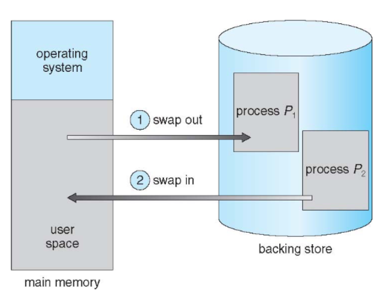
> schematic of Swapping

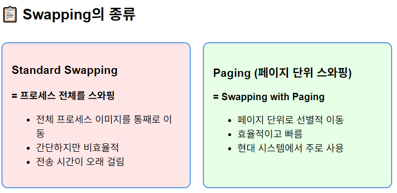
> type of swapping

* Swapping = Standard Swapping

✅**Swapping 과정**:  
1. **메모리 부족 감지**
2. **희생자 선택**: Swap out할 프로세스 결정(낮은 우선순위)
3. **Swap out**: 프로세스를 Backing store로 이동
4. **메모리 할당**: 새로운 프로세스에게 메모리 제공

* **Backing Store**: 모든 사용자의 메모리 이미지 사본을 수용할 수 있을 만큼 큰 fask disk
* **Transfer Time**: Swapping time의 주요 부분, 스와핑되는 메모리 양에 정비례
* **Direct Access**: Backing store는 메모리 이미지에 대한 직접 접근을 제공해야 함

* **Roll Out, Roll In**: **우선순위 기반 스케줄링 알고리즘**에서 사용되는 스와핑 변형
  * `Roll Out`: 낮은 우선순위 프로세스를 스와핑 아웃
  * `Roll In`: 높은 우선순위 프로세스를 로드하여 실행
  * 목적: CPU 스케줄링 효율성 향상

📝**Ready Queue 관리**  
* 시스템은 <u>**디스크에 메모리 이미지가 있는 ready-to-run process들의 ready queue를 유지**</u>한다

{:.prompt-warning}
> backing store에 있던 프로세스가 같은 physical address로 돌아와야 하나?
>

→ 주소 바인딩 방법에 따라 다름!  
I/O는 나갔다 들어올 때 같은 주소로 들어와야하기 때문에 주소 바인딩에 따라 요구될 수도 있다. 그래서 커널에 사용되게 끔 하고 있다는 것이다

⚙️**현대 시스템에서의 Swapping**:  
* Modified Swapping (UNIX, Linux, Windows)
* 일반적으로 비활성화
* 현재 프로세스 일부를 내보내지 않으면 deadlock을 갈 때, 즉 임계점(threshold)일때 할 수 없이 내보내야함

### Context Switch Time including Swapping
---
Context Switching은 CPU가 한 프로세스에서 다른 프로세스로 전환하는 과정인데, **Swapping이 포함되면 시간이 극적으로 증가함**
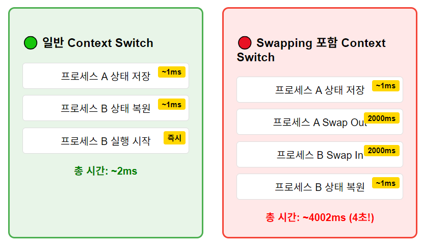

만약 다음에 CPU에서 실행될 프로세스가 메모리에 없는 경우
* **필요한 작업**: 현재 process를 `swap out` + target process를 `swap in`
* → **Context switch time can then be very high**

#### 구체적 계산 예시
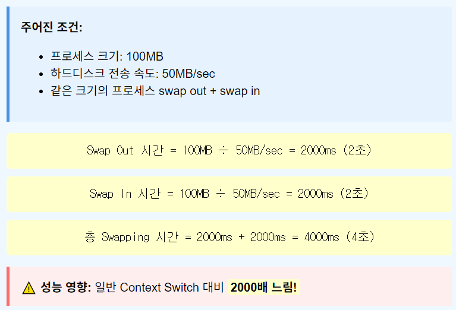

✅스와핑 메모리 양을 줄여서 성능을 최적화 할 수 있다  
* **실제로 사용되는 메모리 양을 파악하여 불필요한 스와핑 방지**
* System call을 통한 메모리 사용 추적
  * `request_memory()` - 메모리 요청 시 OS에 알림
  * `release_memory()` - 메모리 해제 시 OS에 알림

❌**Swapping의 제약 사항**:  
* **pending I/O 문제**: I/O 작업이 진행 중인 프로세스는 Swapping 불가능(I/O가 잘못된 프로세스에 발생할 수 있기 때문)

* 해결책: **double buffering**
  * 항상 I/O를 커널 공간으로 먼저 전송 후, I/O 장치로 전송
  * 단점: overhead 발생

현대 OS에서는 standard Swapping은 사용 X
Modified Version만 사용함

### Swapping on Mobile Systems
---
모바일에서는 swapping이 더 복잡해진다

* Flash memory 기반
  * 공간이 작고 write cycle이 한정되어 있기 때문에 모바일의 CPU와 flash memory 사이에 처리량이 엄청 작다

#### 메모리 관리 대안
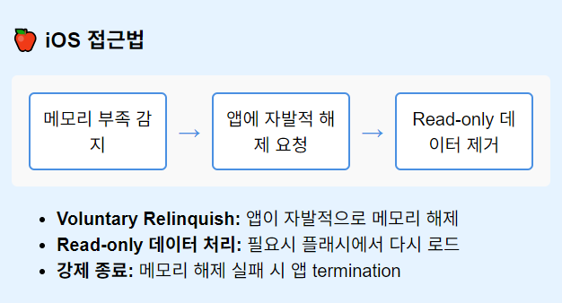

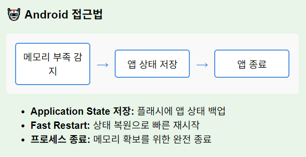

* 공통 기법: **Memory Compression**
  * 사용 빈도가 낮은 메모리 페이지를 압축

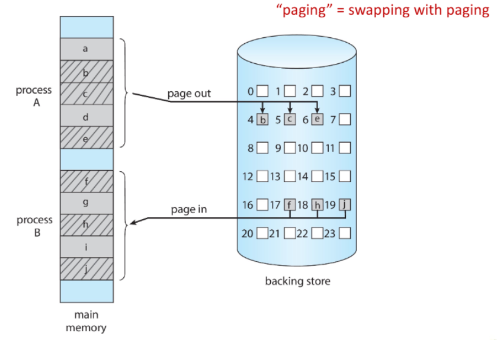
> Swapping with Paging

✅**Paging의 장점**:  
* 선택적 스와핑: 필요한 페이지만 이동
* 빠른 성능
* 효율적 메모리 사용

## Intel 32 and 64-bit Architectures
---
Pentium CPU는 32-bit IA-32 아키텍처이고, 현재 Intel CPU는 64-bit IA-64 아키텍처

각 아키텍쳐의 구조를 알아보자
### Intel IA-32 Architecture
---
* Intel IA-32는 **Segmentation + Paging** 두 방식 모두 지원
* **segment 크기**: 최대 4GB
* **프로세스 당 segment 개수**: 최대 16K개
* **페이지 크기**: 4KB or 4MB
* 두 파티션으로 분할:
  * 첫 번째 8K: **Private** segment(kept in **local descriptor table(LDT)**)
  * 두 번째 8K: **Shared** segment(kept in **global descriptor table(GDT)**)

⚙**CPU logical address** = (`selector`(16bits), `offset`(32bits))
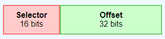

* **Selector 구성**:
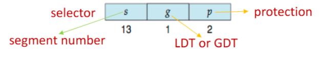
> LTD, GTD의 각 엔트리는 **8bytes segment descriptor**로 구성  
> 여기에는 segment의 **base location과 limit 정보**가 포함됨

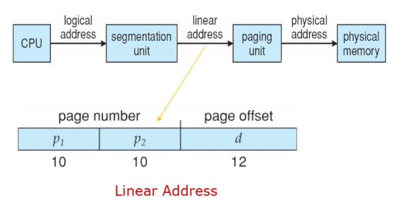
> 주소 변환 과정 + linear address 구성

* **Segmentation**
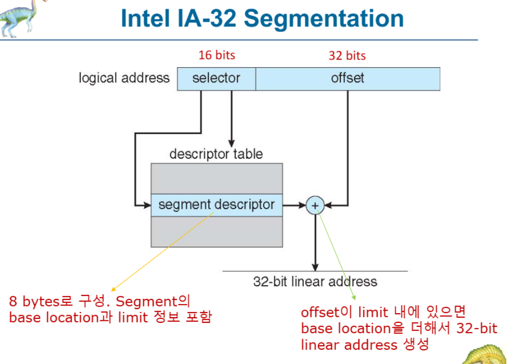
> IA-32 Segmentation

* **Paging 아키텍쳐**:

> IA-32 Paging Architecture

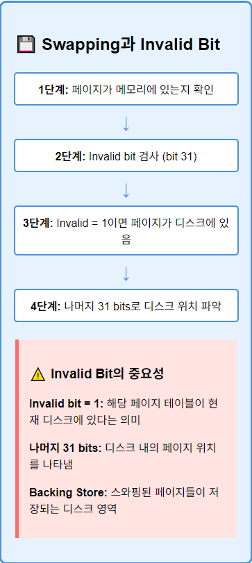

#### Page Address Extensions (PAE)
📚**Page Address Extensions (PAE)**: 32-bit address limit으로 intel이 만든 확장 기술
* 32-bit apps이 **4GB 이상의 메모리 공간에 접근 가능**

✅**주요 변화**:  
* **3-level Scheme**: Paging이 3-level로 확장
* Top 2 bits가 **page directory pointer table** 참조
* **64-bit entry**: Page-directory와 page-table 엔트리 크기 확장
* **36-bits - 64GB 물리 메모리까지 확장**

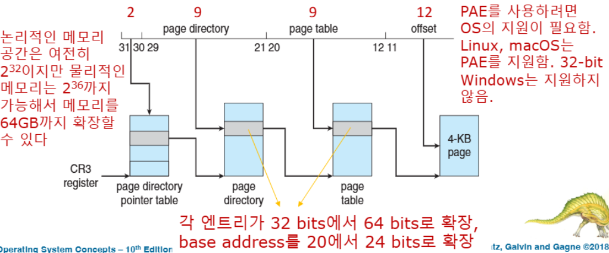
> PAE Structure

### Intel IA-64 Architecture
---
Intel x86-64는 **현재 세대 Intel x86 아키텍처**로, 64-bit 컴퓨팅의 현대적 구현
* 이론적 주소: `64bits(> 16 exabytes)` 엄청 큼!
* 실제 구현: **48bit 주소**만 사용
* page size: `4KB`, `2MB`, `1GB`
* paging level: **4-level hierarchy**
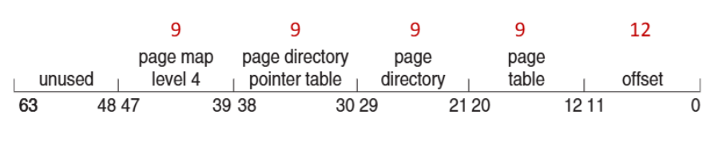

* PAE 확장 기능
  * **virtual addresses**: `48bits (256TB)`
  * **physical addresses**: `52bits (4PB)`

#### Example: ARM Architecture
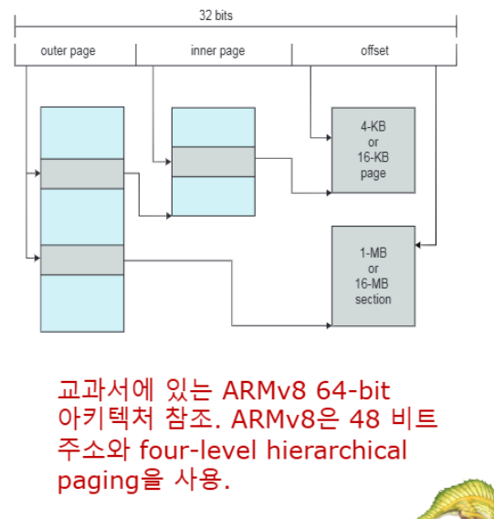

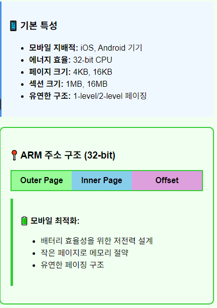