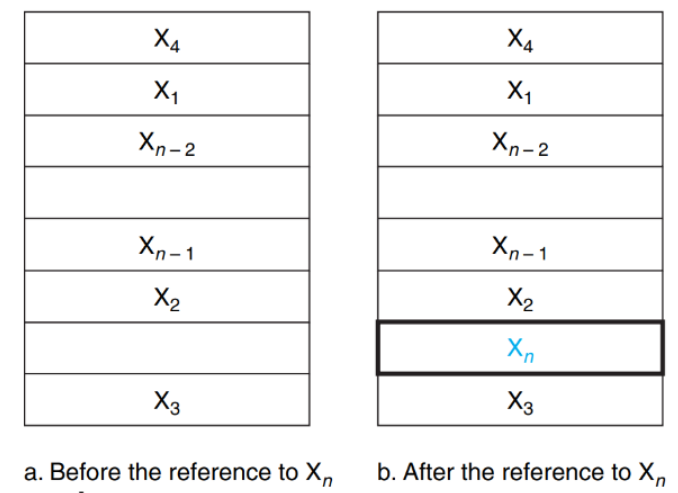

⚙ **Computer Architecture 공부**

## MEMORY TECHNOLOGIES
---

* **SRAM** (Static RAM): 가장 빠르지만 가장 비싸고 용량이 작음 (캐시 메모리로 사용)
* **DRAM** (Dynamic RAM): 중간 속도, 중간 비용, 중간 용량 (메인 메모리로 사용)
* **SSD**: DRAM보다 느리지만 대용량, 상대적으로 저렴
* **HDD**: 가장 느리지만 가장 큰 용량, 가장 저렴

* **Performance(read/write speed)**: SRAM > DRAM > SSD > HDD
* **Cost ($/bit)**: SRAM > DRAM > SSD > HDD
* **Capacity (size)**: SRAM < DRAM < SSD < HDD

{:.prompt-tip}
> 빠를수록 비싸고 작고, 느릴수록 싸고 크다!

## Memory Hierarchy
---

📚**Hierarchical Organization**: 서로 다른 메모리 기술들을 성능과 비용에 따라 **계층적**으로 배치
* 낮은 레벨은 크고 느린 메모리
* 위로 갈수록 빠르고 작은 메모리이다
* **프로세서와의 거리가 증가할수록 메모리의 크기와 접근 시간이 증가**

**데이터도 계층적 구조를 가진다!!**
* 모든 데이터는 가장 낮은 레벨에 저장된다.
* 프로세서에 더 가까운 레벨은 일반적으로 더 멀리있는 레벨의 **'subset'(부분집합)**을 포함한다.
* 이 subset은 두 레벨 간에 데이터를 위아래로 전송함으로써 시간에 따라 변할 수 있다.
  * 필요에 따라 데이터를 **빠른 메모리로 올리거나(upward)** **느린 메모리로 내리면서(downward) 캐시 내용이 동적으로 변함**

* **Level-1 Only Access**: CPU는 물리적으로 최상위 메모리(`L1 cache/register`)만 직접 접근
  * 프로세서는 첫 번째 레벨의 데이터 subset에만 직접 접근 가능
  * 이 때문에 **가장 빠른 메모리로 작업하고 있는 것처럼 착각함**

* 프로세서는 `Level-n` 메모리에 저장된 모든 데이터에 접근할 수 있다
  * 물리적으로는 `Level-1`이지만 논리적으로 `Level-n`까지 가능
  * Level-n의 큰 용량 때문에 **무제한 메모리가 있는 것처럼 착각하게 됨**

✅**Dual Illusion 메커니즘:**  
1. **속도 착각**: `Level-1`의 빠른 속도를 전체 메모리의 속도로 인식
2. **용량 착각**: `Level-n`의 큰 용량을 사용 가능한 전체 메모리로 인식

### Principle of Locality
---
메모리 계층구조가 성공하는 이유는 프로그램의 메모리 사용 패턴이 예측 가능하기 때문! 
* 프로그램들의 **공통적 메모리 접근 페턴 두 가지 존재**

📚**Temporal Locality(시간적 지역성)**: **가까운 시점에 같은 데이터**를 재사용하는 경향
* 어떤 데이터 항목이 참조(접근)되면, 그것은 곧 다시 참조되는 경향이 있음
* 자주 사용하는 데이터를 빠른 메모리에 보관하면 성능 향상
* 예: `for loop`

📚**Spatial Locality(공간적 지역성)**:메모리 주소 공간에서 **인접한 위치의 데이터**를 연속적으로 사용하는 경향
* 한 곳의 데이터를 사용하면 그 주변의 데이터도 사용할 확률이 높음
* 한 번에 여러 개의 인접한 데이터를 **캐시로 가져오면 효율적**
* 예: **array(배열)**

## Cache
---
📚**Cache**: 자주 사용되는 데이터를 임시로 저장하는 고속 메모리
### ✅Cache의 핵심 용어들
---
1. **Block or Line**
* **캐시와 메인 메모리 사이에서 전송되는 최소 단위**
  * 여러 byte로 구성된 데이터 덩어리

2. **Hit and Miss**
* **Hit**: 프로세서가 요청한 데이터가 **캐시에 있는 경우**
* **Miss**: 프로세서가 요청한 데이터가 **캐시에 없는 경우**

3. **Hit Ratio and Miss Ratio**
* **Hit Ratio**: `캐시에서 찾은 접근 횟수 / 전체 접근 횟수`
* **Miss Ratio** = `1 - Hit Ratio`

* **SRAM = Cache**
  * `SRAM (Static Random Access Memory)`: 정적 램, 매우 빠르지만 비싸고 크기가 작음
* **DRAM = Main Memory**
  * `DRAM (Dynamic Random Access Memory)`: 동적 램, SRAM보다 느리지만 용량이 크고 저렴함

* `Processor` ↔ `Cache`: 프로세서는 항상 캐시를 통해 작업

* **캐시 미스**가 발생하면 메인 메모리에서 데이터를 가져와 캐시에 저장
* **캐시가 가득 차면** 오래된 데이터를 **제거**하고 새 데이터를 저장
* → 캐시의 내용이 동적으로 변화

> **cache 용량**: `8 data blocks`  
> **현재 상태**: 6 block 사용 중, 2개 슬롯 비어 있음  
> **저장된 데이터**: `X₄, X₁, Xₙ₋₂, Xₙ₋₁, X₂, X₃`

* **Before the reference to Xₙ**
  * 캐시에 기존 6개 블록이 저장되어 있음
  * 빈 슬롯 2개 존재

* **After the reference to Xₙ**
  * 새로운 블록 Xₙ이 캐시에 추가됨 (파란색으로 표시)
  * 메인 메모리에서 가져와서 빈 슬롯에 저장

{:.prompt-warning}
> 1. How do we know if a data block is in the cache?  
> 2. If it is, how do we find it?

**문제 1**: 데이터가 캐시에 있는지 어떻게 알까?
* `Valid Bit` 사용
* 각 캐시 슬롯마다 1비트로 유효성 표시
* `0` = 빈 슬롯, `1` = 유효한 데이터

**문제 2**: 캐시에서 데이터를 어떻게 찾을까?
* `Tag` 시스템 사용
* 메모리 주소의 일부를 태그로 저장
* 요청 시 태그를 비교하여 정확한 데이터 식별

✅동작 과정:  
1. **주소 분할**: 메모리 주소 → 태그 + 인덱스 + 오프셋
2. **인덱스 확인**: 캐시의 해당 위치로 이동
3. **유효성 검사**: 유효 비트가 1인지 확인
4. **태그 비교**: 저장된 태그와 요청 태그 비교
  
## Direct Mapped Cache
---
📚**Direct Mapped Cache**: **각 메모리 위치가 캐시의 정확히 한 곳(one location)에만 매핑됨**
* **일대일 대응 관계**이지만, **여러 메모리 위치가 같은 캐시 위치를 공유**할 수 있다

> **cache**: 8 blocks (`000`, `001`, `010`, `011`, `100`, `101`, `110`, `111`)  
> **memory**: 32 blocks (`00001 ~ 11101`)
> **매핑 관계**: 4개의 서로 다른 메모리 주소가 **하나의 캐시 블록을 공유**

✅**핵심 원리**:  
1. **일대일 대응**: 각 메모리 위치는 정확히 하나의 캐시 위치에만 매핑
2. **다대일 관계**: 여러 메모리 위치가 같은 캐시 위치를 공유
3. **간단한 검색**: 데이터가 캐시에 있는지 확인하려면 지정된 위치만 확인하면 됨