>🍀 운영체제 전공 수업 정리

우리가 실제로 사용하는 논리 주소는 사실 **가상 주소**이다.

우리가 어떤 프로그램을 돌릴 때 전체 프로그램을 사용하지는 않는다
가상메모리는 필요한 부분만 가져오기 때문!

즉, 프로그램 전체를 가져오지 말고 일부만 가져온다

* 물리적인 메모리도 적게 씀
  * 각 프로그래이 메모리를 적게 쓰기 때문에 **더 많은 프로그램을 동시에 가져올 수 있다**
  * I/O도 적게 사용하게 된다(전체 프로그램을 로드할 필요가 없기 때문)
  * 물리적 메모리보다 큰 프로그램도 실행 가능

## Virtual Memory
---
📚**<span style="color: #008000">Virtual Memory</span>**: 사용자의 논리적 메모리를 물리적 메모리와 분리하는 기술

* 논리적인 메모리를 물리적인 메모리보다 많이 쓸 수 있는 것처럼 보인다.
* 여러 프로세스들과 주소를 공유할 수 있다
* 프로그램 실행을 위해 전체 프로그램이 메모리에 로드될 필요 X
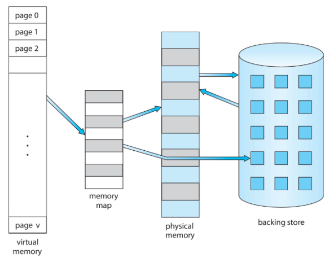

🔄**동작 과정**:  
**1단계**: 프로세스가 가상 주소에 접근 시도
**2단계**: MMU가 가상 주소를 물리 주소로 변환
**3단계**: 페이지가 메모리에 있으면 접근, 없으면 페이지 폴트 발생
**4단계**: 필요시 디스크에서 페이지를 메모리로 로드 (페이지 스와핑)

✅**virtual memory 구현 방법**:  
* **MMU (Memory Management Unit)**:
  * 가상 주소를 물리 주소로 변환
  * page table을 이용한 address mapping
* **Demand Paging** 
* **Demand Segmentation**

자세하게는 차차 알아보자

### Virtual-address Space
---
* **<span style="color: #008000">Virtual address space</span>**: 프로세스가 어떻게 메모리에 저장되는지에 대한 논리적 관점
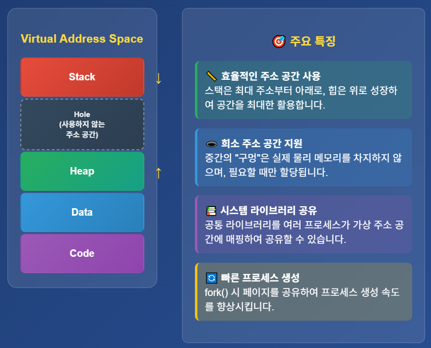

* stack과 heap은 서로 향하는 방향으로 크기가 증가하지만 그 사이가 **거대**하기 때문에 거의 만날 일은 없다.

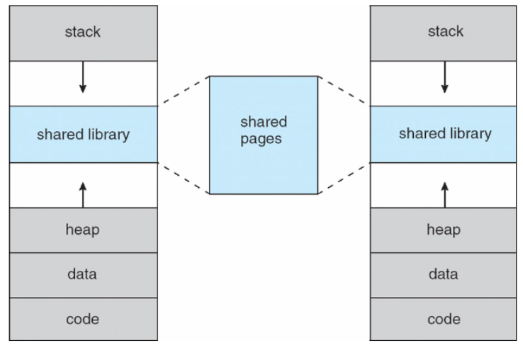
> 가상 메모리로 라이브러리를 공유하면 메모리 절약, 빠른 로딩의 이점 존재

## Demand Paging(⭐)
---
📚**<span style="color: #008000">Demand Paging</span>**: 프로그램의 모든 page를 처음부터 메모리에 로드하지 않고, 필요한 프로세스가 있으면 그때 불러들이는 방식
* 즉 필요한 page만 불러들이는 것
* 메모리 적게 사용, 응답 빠르고 더많은 사용자가 사용 가능
* I/O 적게 사용
* 빠른 프로그램 시작

##### Valid-Invalid Bit
---
* **<span style="color: #008000">Valid-Invalid Bit</span>**: 이 비트는 각 페이지가 현재 메모리에 있는지 여부를 나타냄

✅**특징**:  
* 프로그램 시작 시 모든 page의 Valid-Invalid 비트는 `i`로 설정
* page가 메모리에 로드되면 `i` → `v`로, swap out 되면 `v` → `i`
* **MMU**가 이 bit를 검사해서 특정 페이지가 메모리에 있는지 확인
  * 페이지가 메모리에 있음(`v`) → **물리 주소로 변환하여 접근**
  * 페이지가 메모리에 없음(`i`) → **Page Fault 발생!**
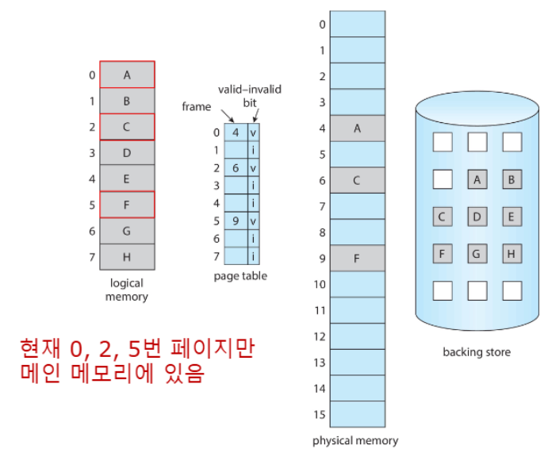

### Page Fault 처리 과정
---
**<span style="color: #008000">Page Fault</span>**: 프로세스가 현재 메모리에 없는 페이지에 접근할 때 발생하는 인터럽트

📝**Page fault 발생 조건**:

```
프로세스 메모리 접근 → MMU 주소 변환 → Valid-Invalid Bit 검사
                                           ↓
                                    [i] Invalid인 경우
                                           ↓
                                    🚨 PAGE FAULT! 🚨
```

✅**페이지 폴트 처리 과정 (6단계)**  
1️⃣ **페이지 폴트 트랩 발생**

```
CPU → MMU → 페이지 테이블 검사 → Invalid Bit 발견 → 🚨 TRAP!
```

* MMU가 Invalid page 접근을 감지
* **trap**이 발생하여 운영체제로 제어 전달
* 현재 실행 중인 명령어 중단

2️⃣ **운영체제의 참조 유효성 검사**

* **Invalid bit는 2가지 의미**:
1. 주소 범위 밖에 있는 경우 - 잘못된 참조 → 프로세스 종료
2. 메모리에 없는 경우 - 정상 참조 → 계속 진행

3️⃣ **빈 프레임 찾기**

* **free frame 있음** → 바로 사용
* **free frame 없음** → 기존 page 교체(swap out)
  * **페이지 교체 알고리즘 사용** (LRU, FIFO, Clock 등)

4️⃣ **페이지 스왑 인 (Swap In)**

```
    디스크 I/O 스케줄링
          ↓
    backing store에서 페이지 읽기
          ↓
    찾은 free frame에 페이지 로드
          ↓
    ✅ 페이지 로딩 완료
```

5️⃣ **페이지 테이블 업데이트**

* **페이지 테이블 엔트리 수정:**

```
┌─────────────────┬─────────────────┐
│     변경 전      │     변경 후      │
├─────────────────┼─────────────────┤
│ Page N → ---    │ Page N → Frame M│
│ Valid Bit: i    │ Valid Bit: v    │
└─────────────────┴─────────────────┘
```

* 페이지 번호 → 프레임 번호 매핑 설정
* Valid-Invalid Bit를 `v`로 변경

6️⃣ **명령어 재실행**

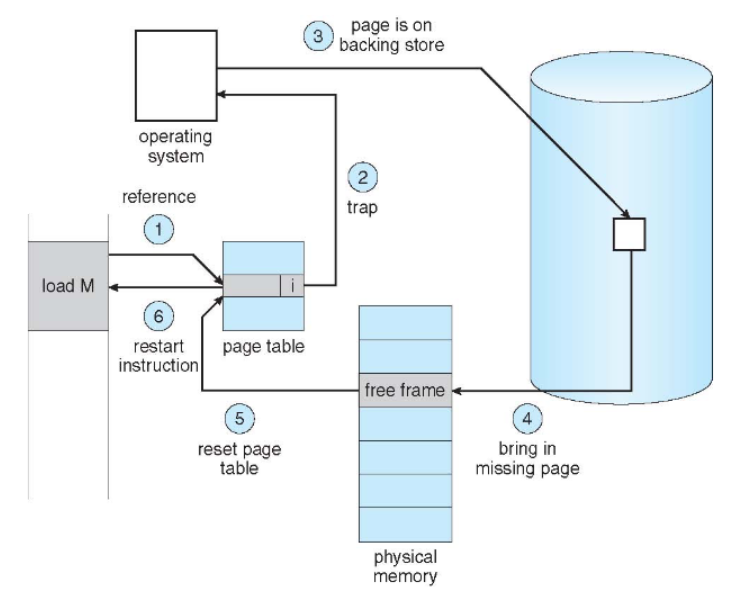
> 앞의 6단계를 도식화

##### Page fault 유형
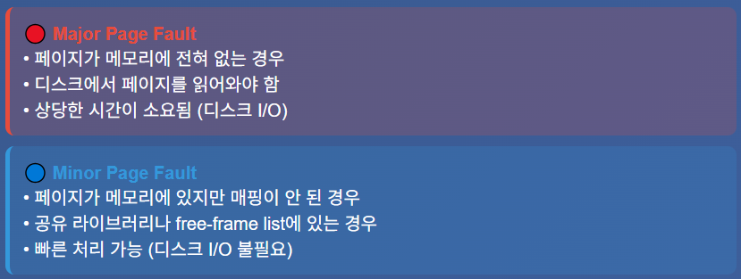

* Linux는 Minor Page Fault가 Major Page Fault보다 훨씬 많이 발생함!
  * 이는 시스템이 공유 라이브러리를 광범위하게 활용하고 있다는 증거 - 메모리 효율성이 크게 향상됨

### Aspects of Demand Paging
---
1. **<span style="color: #008000">Pure Demand Paging</span>**의 극단적인 경우
* 프로세스가 시작할 때 **메모리에 아무 페이지도 없는 상태**
* 첫 번째 명령어를 실행하려고 하면 **즉시 Page Fault 발생**
* 이후 필요한 페이지들이 하나씩 메모리로 로드됨

2. **<span style="color: #008000">Multiple Page Faults</span>**
* 하나의 명령어가 여러 page에 접근 가능
* 예: 메모리에서 두 숫자를 더해서 다시 메모리에 저장하는 명령어
* 최대 4번의 page fault가 발생할 수 있음(명령어, 피연산자1, 피연산자2, 결과 저장)

#### Instruction Restart

#### Page Fault 처리 상세 과정
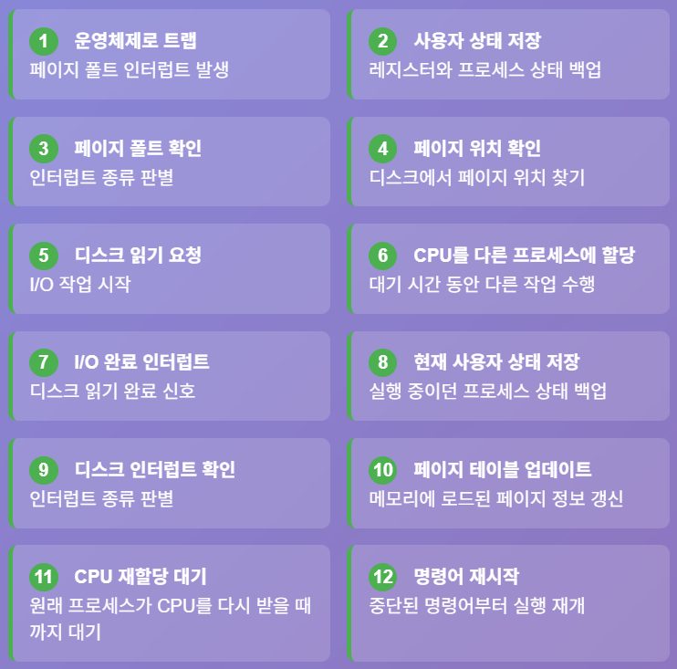

### Free-Frame List
---
📚**<span style="color: #008000">Free-Frame List</span>**: page fault가 발생했을 때 새로운 페이지를 메모리에 로드할 수 있는 free fream들의 목록을 관리함

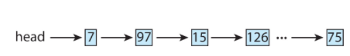
> Free-Frame List 구조

✅**작동 원리**:  
1. **page fault 발생** → 운영체제가 secondary storage(보조저장장치)에서 필요한 페이지를 메인 메모리로 가져와야 함
2. **Free-Frame List 활용** → 사용 가능한 free frame들의 연결 리스트를 유지
3. **Zero-fill-on-demand** → 프레임을 할당하기 전에 내용을 **0으로 초기화** (보안상 이유)
  * **Zero-fill-on-demand**가 중요한 이유는 이전 프로세스가 사용했던 메모리의 민감한 정보(패스워드, 개인정보 등)가 새로운 프로세스에게 노출되는 것을 방지하기 위함
4. secondary storage에서 페이지 로드

### Memory Compression
---
📚**<span style="color: #008000">Memory Compression</span>**: paging 대신 사용되는 메모리 관리 기법, **여러 프레임의 내용을 압축하여 하나의 프레임에 저장함으로써 메모리 사용량을 줄이는 방법**

✅**작동과정**:  
* **초기 상태**: Free-frame list에 6개의 프레임 (`7, 2, 9, 21, 27, 16`)
* **Modified frame list**: 수정된 페이지들 (15, 3, 35, 26)이 **스왑 공간에 써질 예정**
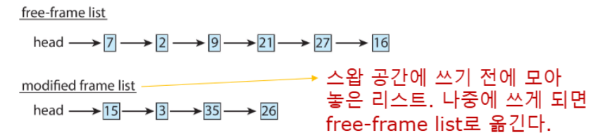

* **압축 과정**: 
  * 프레임 `15, 3, 35`의 내용을 압축하여 프레임 7에 저장
  * 압축된 프레임들(`15, 3, 35`)을 **다시 free-frame list로 반환**
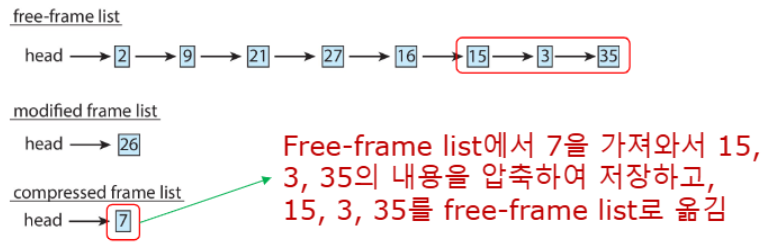

{:.prompt-tip}
> 3개 frame의 데이터를 1개 frame에 저장하여 메모리 효율성 증가!
>

* 📱 **Android & iOS** - Swapping/Paging 대신 **Memory Compression 사용**
* 💻 **macOS & Windows 10** - **Memory Compression 지원** (macOS는 SSD 기반 페이징보다 빠름)

### Performance of Demand Paging
---
Demand Paging에서 **page fault가 발생했을 때 처리되는 세 가지 주요 활동**:
1. **Service the Interrupt** - 수백 개의 명령어 실행 (빠름)
2. **Read the page** - 디스크에서 메모리로 데이터 로드 (매우 느림)
3. **Restart the process** - 적은 양의 시간 소요 (빠름)

##### Page Fault Rate
* `p` = Page Fault Rate (0 ≤ `p` ≤ 1)
* `p = 0`: **페이지 폴트 없음** (이상적)
* `p = 1`: 모든 메모리 접근이 페이지 폴트 (최악)

* **<span style="color: #008000">EAT(Effective Access Time)</span>**

```
EAT = (1 - p) × memory_access_time + p × page_fault_service_time
```
#### Demand Paging Example
---
예제:  
* Memory access time = 200ns
* Average page-fault service time = 8ms
* **EAT** = (1 - `p`) x 200 + `p` x (8ms)  
      = (1 - `p`) × 200 + `p` × 8,000,000ns  
      = 200 + `p` x 7,999,800
* → **EAT는 p에 비례!**

* 만약 1,000번 중 1번 페이지 폴트 발생 시(p=0.001)
* **EAT** = 200 + 0.001 × 7,999,800 = 8,200ns = 8.2ms
❌이는 정상 속도(메모리 접근 속도=200ns)보다 40배 느려진 속도!

🎯**위 예제에서 성능 저하를 10% 이하로 유지하려면**:

```
220 > 200 + 7,999,800 × p  
= 20 > 7,999,800 × p

→ p < 0.0000025
```

✅**400,000번의 메모리 접근 중 1번 미만의 페이지 폴트만 허용 가능!**

### Demand Paging Optimizations
---
Demand Paging의 최적화 기법은 4가지가 있다.

1. **<span style="color: #008000">Swap space I/O 최적화</span>**
* **Swap space가 file system 보다 빠름**(동일한 device라도 성능 차이 발생)
  * 더 큰 chunk 단위로 할당
  * 파일 시스템보다 적은 관리 오버헤드

2. **<span style="color: #008000">프로세스 이미지 전체 복사</span>**
* **프로세스 전체를 시작 전(로드 시점)에 swap space에 복사**
  * 이후 page in/out을 swap space에서 수행
  * 구형 BSD Unix에서 사용

3. **<span style="color: #008000">바이너리에서 직접 Demand Paging</span>**
* **프로그램 바이너리에서 직접 페이지를 요청**
  * 프레임 해제 시 paging out 대신 discard
  * Solaris와 현재 BSD에서 사용
* **Anonymous Memory만 스왑 공간 사용**:
  * file과 연관되지 않은 메모리(Stack, Heap)
  * 수정되었지만 아직 파일에 쓰여지지 않은 메모리

4. **<span style="color: #008000">모바일 시스템 최적화</span>**
* **스와핑을 지원하지 않고 파일시스템을 사용하거나 메모리 압축 기법 사용**

## Copy-on-Write(COW)
---
📚**<span style="color: #008000">Copy-on-Write(COW)</span>**: 부모와 자식 프로세스가 초기에는 같은 페이지를 공유하다가, **어느 한쪽이 페이지를 수정할 때만 복사본**을 만드는 효율적인 메모리 관리 기법
* **효율적인 프로세스 생성** - 수정된 페이지만 복사
* **빠른 fork() 실행** - 전체 메모리 복사 X
* **메모리 절약**

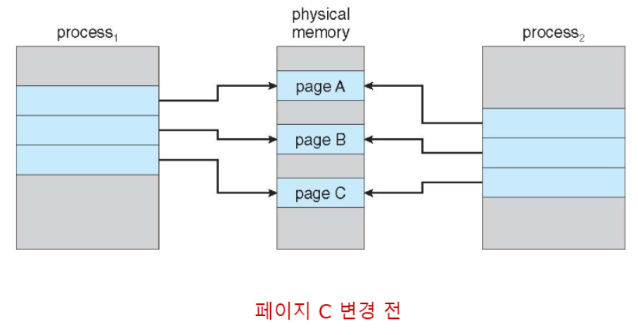

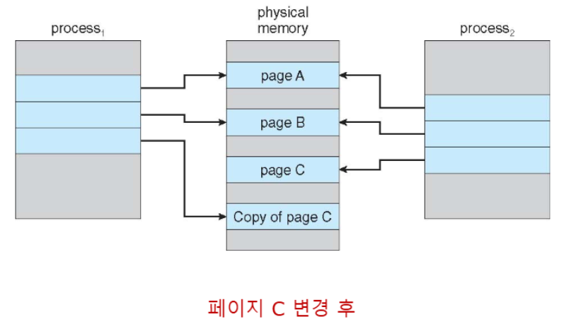

* `vfork()`: `fork()`의 변형으로, 부모 프로세스를 일시 중단하고 **자식이 cow를 사용하여 부모의 주소 공간을 공유** (ex: Linux, macOS, BSD Unix에서 지원)
  * **`exec()` 호출 전까지 효율적인 메모리 사용**