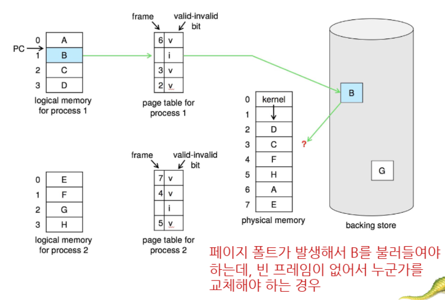
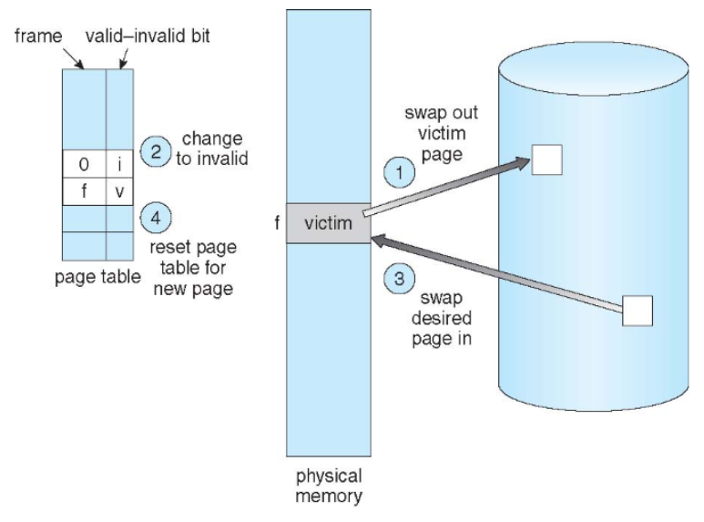
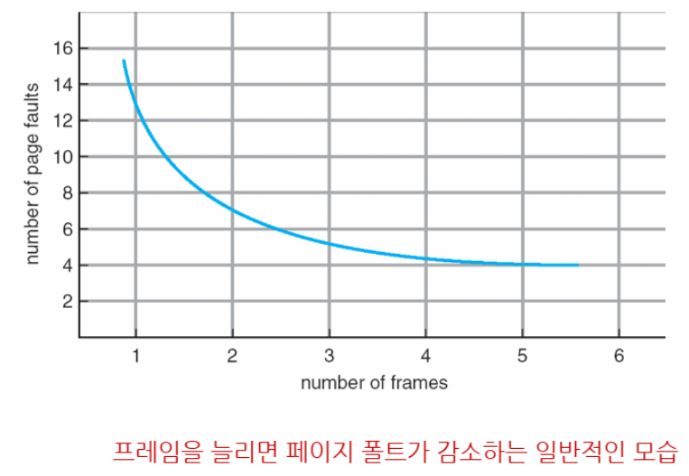
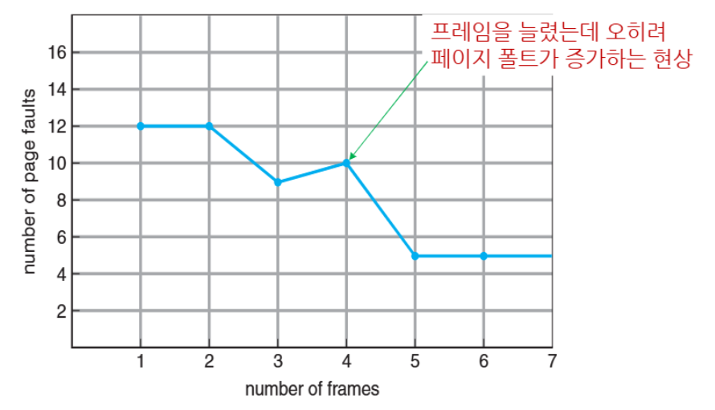
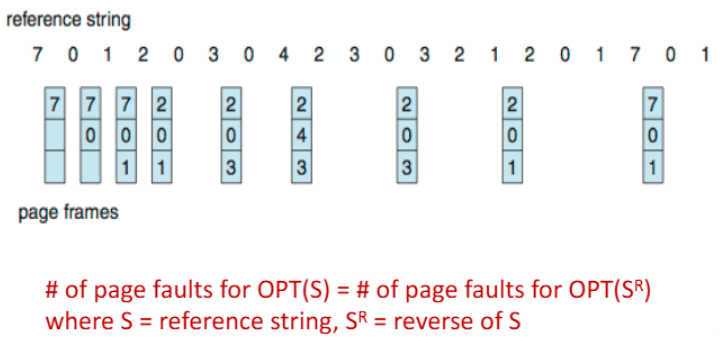
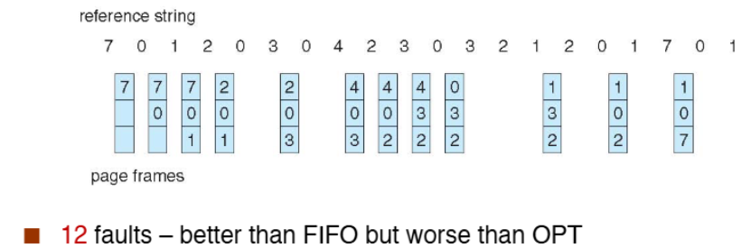
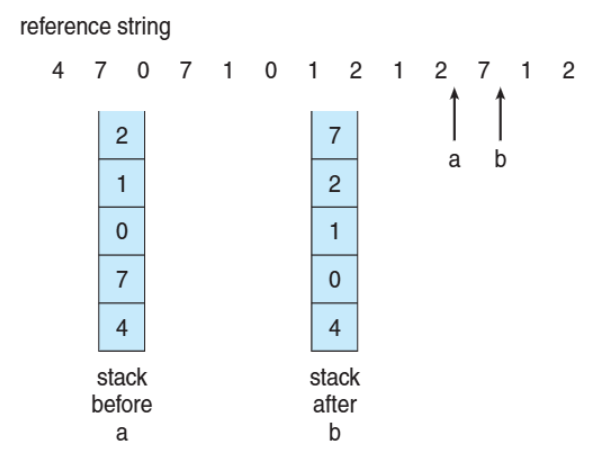
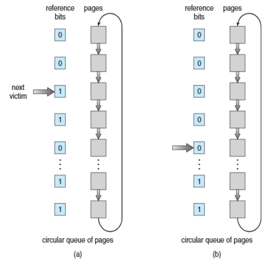
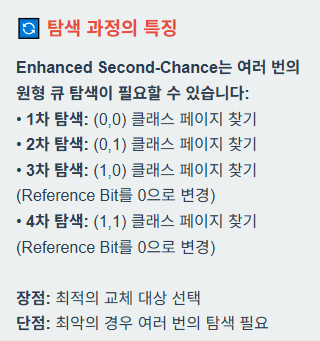
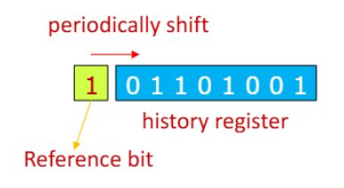

>🍀 운영체제 전공 수업 정리

**메모리가 모두 사용되어 새로운 page를 로드할 공간이 없다면** 어떻게 될까?

{:.prompt-warning}
> 만약 free frame이 없다면??  
>

## Page replacement
---
페이지 교체가 발생함!

📚**Page replacement**: 메모리에 잘 사용되지 않는 page를 찾았다면 page out을 해서 공간을 만들어 냄
* page out된 page는 swap space으로 내보내짐

✅**교체 알고리즘**:  
1. **terminate**
2. **swap out**
3. **replace the page** - 가장 많이 씀
  * 지역, 전역 모두 교체 가능

🎯 **목표**: 한 프로세스가 너무 많은 frame을 소유하지 못하게 해서 **page-falut를 예방**하기(**prevent over-allocation**)

✅**주요 특징**:  
1. **modify (dirty) bit** - 변경이 되지 않은 페이지들은 굳이 overhead하지 않는다
  * → 즉, **modified page**들만 disk에 저장해서 효율을 높임
2. **virtual memory 확장**: **물리 메모리보다 큰 논리 메모리 공간 제공**
3. **Prevent over-allocation**: page fault service routin에 페이지 교체 포함

> B는 아직 메모리에 있지 않아서 **fast disk에서 B를 가져와야 함**  
> 하지만 **physical 메모리가 꽉차서 B를 부를 수 없다면?**  
> 그러면 **원래 있는 페이지를 backing store에 저장**하고 메모리를 비운다
> **그러기 위해 page replacement가 필요함!**

✅**page replacement 과정**:  
1. disk에서 요구된 페이지의 위치를 찾음

2. **free frame 찾기**:
  * 만약 free frame이 있다면, 빈 공간을 활용
  * free freame이 없다면 page replacement 알고리즘 사용(**victim frame**을 고르기 위함)
    * Victime Frame이 수정되었다면(`dirty bit=1`) 디스크에 저장
    * 수정되지 않았다면(`dirty bit=0`) 바로 덮어쓰기 가능

3. 선택된 free frame에 디스크에서 원하는 page를 로드, page table과 frame table을 업데이트

4. page fault를 발생시킨 명령어부터 재시작

> victim frame을 고름(f 바로 위 frame)
>

{:.prompt-warning}
> 이제 한 번의 페이지 폴트에 최대 2번의 페이지 전송이 발생!
>

* **Victim 페이지 스왑 아웃 + 새 페이지 스왑 인** → **EAT 증가**

### Page and Frame replacement Algorithms
---
Page Replacement 알고리즘은 두 가지 주요 결정을 담당:
1. **Frame-allocation algorithm**: 각 프로세스에 **몇 개의 프레임을 할당**할 것인가?
2. **Page-replacement algorithm**: **어떤 프레임을 교체**할 것인가?

📝**성능 평가 방법**:  

* **Reference String**을 사용하여 알고리즘 성능 평가
  * 페이지 번호의 연속된 문자열 (전체 주소가 아님)
  * 같은 페이지에 대한 반복 접근은 페이지 폴트를 일으키지 않음
  * 사용 가능한 프레임 수에 따라 결과가 달라짐

> 프레임 수를 늘릴 수록 page fault가 감소하는 모습

<strong>📝 예제 Reference String:</strong> 
7,0,1,2,0,3,0,4,2,3,0,3,0,3,2,1,2,0,1,7,0,1

#### FIFO Algorithm
---
📚**FIFO Algorithm**: 가장 먼저 메모리에 들어온 페이지를 먼저 교체

❌FIFO 알고리즘에서는 **프레임을 늘렸는데 오히려 page fault가 증가하는 경우가 존재!** - **Belady's Anomaly**

* page의 "나이"만 고려하고 **사용 빈도는 무시하기 때문!**

#### Optimal Algorithm
---
📚**Optimal Algorithm**: 가장 오래 사용되지 않을 페이지를 교체(미래를 내다봐야함)

> 9번의 페이지 폴트  
> **참조열 S에서의 최적해**와 **역참조열 SR에서의 최적해**가 동일한 폴트 수를 가짐

* 미래를 예측해야하기 때문에 구현이 어려움

#### Least Recently Used(LRU) Algorithm
---
📚**Least Recently Used(LRU) Algorithm**: 과거의 정보를 활용하여 가장 오래 사용되지 않은 페이지를 교체(OPT 알고리즘 대안)

> OPT 알고리즘과 같이 **참조열 S에서의 페이지 폴트 수와 역참조열 SR에서의 페이지 폴트 수가 같다**

* **LRU 구현 방법:**
1. **Counter Implementation**
* 각 페이지 엔트리에 카운터 추가
* 페이지 참조 시 시계값을 카운터에 복사
* 교체 시 가장 작은 카운터 값을 찾음
  * **교체 과정**:
  1. 모든 카운터 값 검색
  2. 최소값 찾기
  3. 해당 페이지 교체
❌단점: 테이블 검색 필요

2. **Stack Implementation**
* **더블 링크 형태의 페이지 번호 스택** 유지
* 페이지 참조 시 스택 맨 위로 이동
* 교체 시 스택 맨 아래 페이지 선택
❌단점: 업데이트 비용 높음

* **LRU와 Optimal은 Stack Algorithm!**
  * 이는 Belady's Anomaly가 발생하지 않는다는 의미
  * 프레임 수를 늘리면 **페이지 폴트는 절대 증가하지 않음**

> stack 구현 동작 예시

#### LRU Approximation Algorithms
---
📚**LRU Approximation Algorithms**: LRU는 특별한 하드웨어가 필요하고 여전히 느리기 때문에 **Reference Bit**를 활용한 알고리즘

가장 현실적인 알고리즘!

📝**Reference Bit** 작동원리:  
* **각 페이지에 Reference Bit 연결** (`초기값 = 0`)
* 페이지 참조 시 하드웨어가 자동으로 **비트를 1로 설정**
* 교체 시 Reference Bit=0 인 페이지 중 하나 선택
  * **순서는 알 수 없지만 최근에 사용되지 않은 페이지를 보장**

📚 **Second-Chance Algorithm**: `FIFO + Reference Bit` 조합  
* 기본적으로 FIFO 방식으로 동작
* 교체 대상 페이지의 Reference Bit 확인
* `Bit = 0`이면 즉시 교체
* `Bit = 1`이면 **"두 번째 기회" 부여 (Bit를 0으로 설정하고 큐 뒤로 이동)**

> second-chance algorithm

##### Enhanced Second-Chance Algorithm
📚**Second-Chance Algorithm**: `Reference Bit + Modify(Dirty) Bit`을 함께 사용

* `(0, 0)`: 최우선 교쳬 대상 - **최근에 사용되지 않았고 수정되지도 않음**
* `(0, 1)`: 두 번째 우선순위 - **최근에 사용되지 않았지만 수정됨(→ 교체 전 디스크에 쓰기 필요)**
* `(1, 0)`: 세 번째 우선순위 - **최근에 사용되었지만 수정되지 않음(→ 곧 사용될 가능성 있음)**
* `(1, 1)`: 교체 회피 대상 - **최근에 사용되었고 수정됨(→ 곧 다시 사용될 가능성 + 디스크 쓰기 필요)**

✅**추가 LRU Approximation 기법들**:  
1. **Additional Reference Bits Algorithm**: Timer 인터럽트를 통해 주기적으로 OS가 오른쪽으로 한 비트씩 이동

2. **Demand Paging과 Reference Bit 최적화**: 
* **Demand Paging** 시 페이지 블록되면 즉시 `Reference Bit = 1`로 설정
* **Second-Chance 알고리즘** 수행 시 주기적으로 모든 `Reference Bit = 0`으로 리셋

#### Counting Algorithms
---
📚**Counting Algorithms**: 각 페이지에 대한 **참조 횟수(Reference Count)를 추적하여 replacement를 결정**하는 알고리즘

📉 **LFU (Least Frequently Used)**:  
* **가장 적게 사용된 페이지를 교체**, 참조 횟수가 가장 작은 페이지가 희생양

📈 **MFU (Most Frequently Used)**: 
* **가장 많이 사용된 페이지를 교체**, 참조 횟수가 가장 큰 페이지가 희생양

실제 사용 거의 X!

#### Page-Buffering Algorithms
---
📚**Page-Buffering Algorithms**: 
**Free Frame Pool**을 활용하여 **페이지 폴트 시간을 찾지 않고** 바로 할당!

✅**동작 과정**:  
1. 페이지 폴트 발생 - 필요한 페이지가 메모리에 없음
2. **Pool에서 즉시 할당** - **Free Frame Pool에서 바로 프레임 제공**
3. 프로세스 재시작
4. 백그라운드 보충 - Victim 선택하여 Pool 보충
  
📝 **수정된 페이지들의 별도 리스트를 유지하며 Backing Store가 idle할 때 미리 쓰기 수행** - 시간 절약 가능

💾**Frame Contents 보존**: **Free Frame의 내용을 그대로 보존하고 어떤 페이지가 들어있는지 기록하여 재사용 시 디스크 로드 생략**

### Applications and Page Replacement
---
응용프로그램 입장에서는 page replacement가 안맞을 수 있다.

**그래서 application이 직접 같은 기능을 함!**

* DBSM와 같이 응용프로그램이 **스스로 메모리와 I/O버퍼를 관리**하면 **double buffering**현상이 발생할 수 있다.

OS가 제공하는 **Raw dist mode(파일시스템 우회)**를 사용함으로써 DBMS처럼 응용프로그램 자신에 최적화된 솔루션을 개발할 수 있다.  
그럼에도 대부분의 응용프로그램은 그냥 파일시스템을 사용하는 것이 유리하다