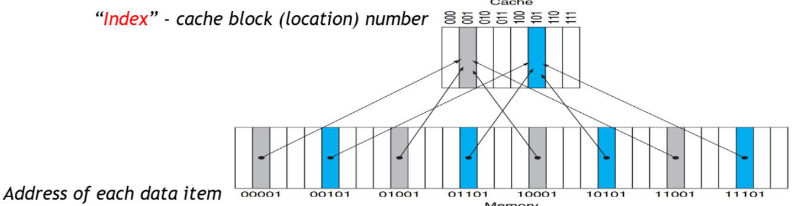
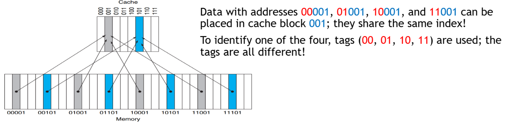
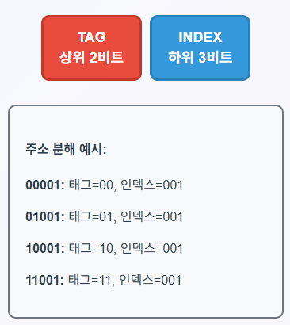
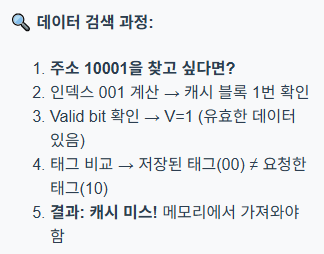
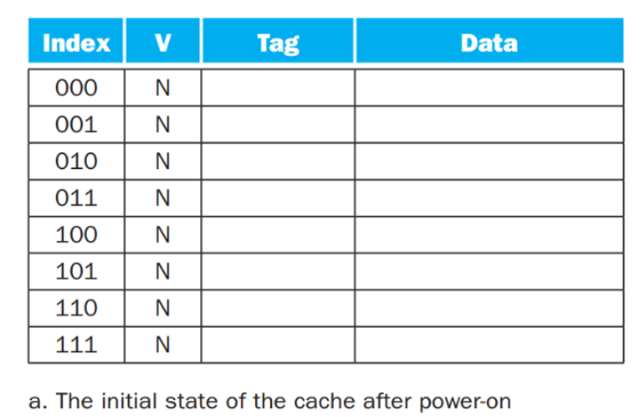
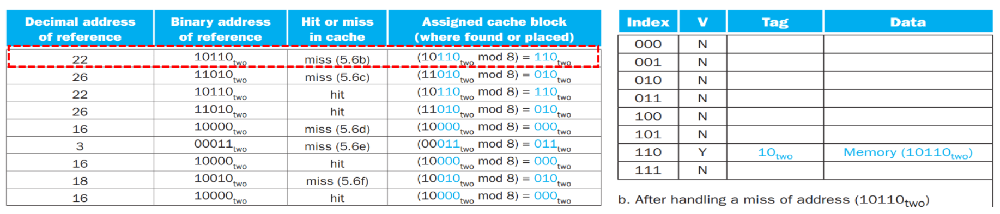
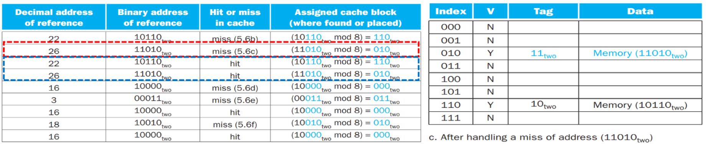
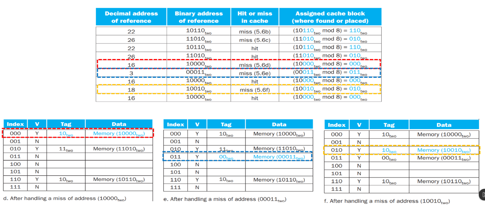

⚙ **Computer Architecture 공부**

## Direct Mapped Cache - Index
---

📚**Index**: cache block number  
    = (Memory Addr) mod (Number of Cache Blocks) (나머지 값)
* 캐시 블록 수가 8개(2³)라면, 메모리 주소의 **하위 3비트가 인덱스**
  * 예: 주소 `00001`, `01001`, `10001`, `11001은` 모두 인덱스 `001`(1번)에 매핑

## Direct Mapped Cache - Tag
---

{:.prompt-warning}
> 같은 캐시 블록에 여러 메모리 주소가 매핑된다면?
>

* 예: 00001, 01001, 10001, 11001 모두 캐시 블록 1번에 매핑  
→ 캐시에 있는 데이터가 어떤 메모리 주소의 것인지 알 수 없음!

{:.prompt-tip}
> 메모리 주소를 Tag와 Index로 나눈다!!

📚**Tag**: 같은 캐시 블록에 매핑되는 서로 다른 메모리 주소들을 구별하는 역할

* 메모리 주소를 **Tag(상위 비트)와 Index(하위 비트)로 분할**

* **Valid bit**는 해당 캐시 블록에 유효한 데이터가 있는지 표시

* 프로세서 시작 시 캐시는 빈 상태
* 캐시 블록이 비어있는지, 유효한 데이터가 있는지 구별 필요
* `Valid bit = 0`: **비어있음** 또는 무효한 데이터
* `Valid bit = 1`: **유효한 데이터 존재**, 태그 비교 필요

✅**data 검색 과정**:  

### Cache 접근 시나리오
---
##### 초기 상태

* 모든 Cache block의 `Valid bit = N` (무효)
* Tag와 Data는 비어있음
* 8 blocks (Index 000~111)

##### Step 1: Data 22 (10110) request

✅**처리 과정**:  
1. index `110` → 캐시 블록 **6번** 확인
2. `Valid bit = N` → 무효한 데이터
3. **Cache Miss**! 메모리에서 데이터 가져오기
1. 블록 6에 저장: `Valid=Y`, `Tag=10`, `Data=Memory(10110)`

##### Step 2: Data 26 (11010) request

✅**처리 과정**:  
1. index `010` → 캐시 블록 **2번** 확인
2. `Valid bit = N` → 무효한 데이터
3. **Cache Miss**! 메모리에서 데이터 가져오기
4. 블록 2에 저장: `Valid=Y`, `Tag=11`, `Data=Memory(11010)`

##### Step 3: Data 22 (10110) request again
✅**처리 과정**:  
1. index `110` → 캐시 블록 **6번** 확인
2. `Valid bit = Y` → **유효한 데이터 있음**
3. **Tag 비교**: 저장된 태그(10) = 요청한 태그(10) ✓
4. **Cache Hit**! 캐시에서 데이터 직접 반환

##### Step 4: Data 26 (11010) request again
✅**처리 과정**:  
1. index `010` → 캐시 블록 **2번** 확인
2. `Valid bit = Y` → **유효한 데이터 있음**
3. **Tag 비교**: 저장된 태그(11) = 요청한 태그(11) ✓
4. **Cache Hit**! 캐시에서 데이터 직접 반환

### Cache Conflict

❌**데이터 교체 발생!**  
* `Step f`: 주소 18 (10010)을 로드할 때, Index `010`의 기존 데이터 (주소 26의 데이터)가 교체됨!
* 주소 26을 다시 요청하면 캐시 미스 발생

{:.prompt-warning}
> 자주 사용되는 데이터들이 같은 인덱스에 매핑되면 지속적인 데이터 교체로 인해 캐시 성능이 크게 저하됨!