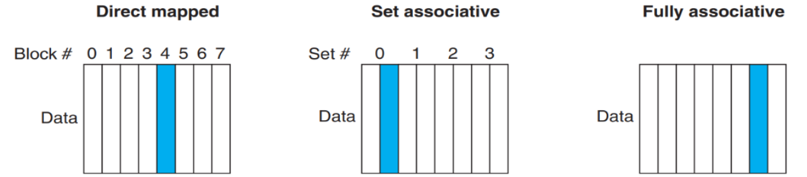
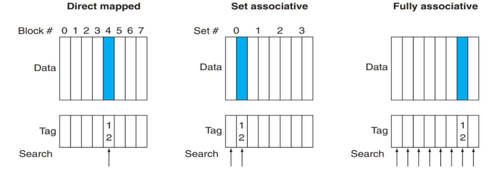
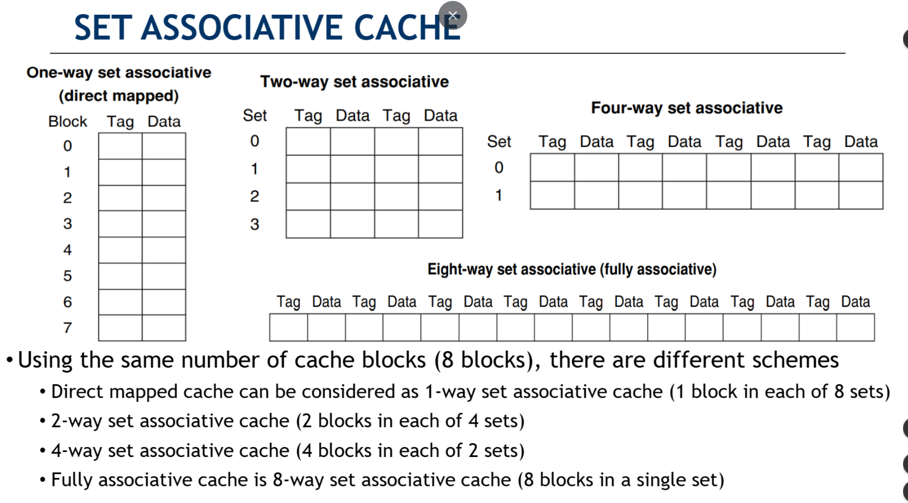
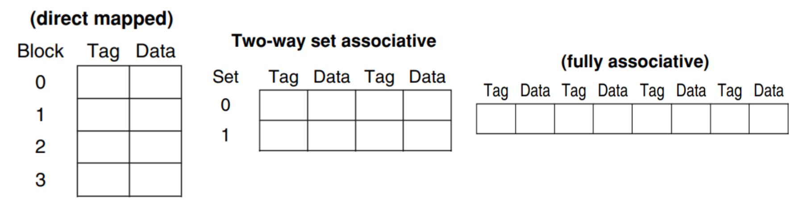
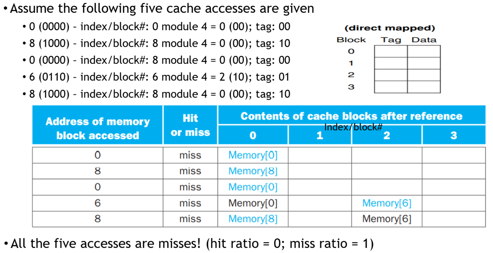
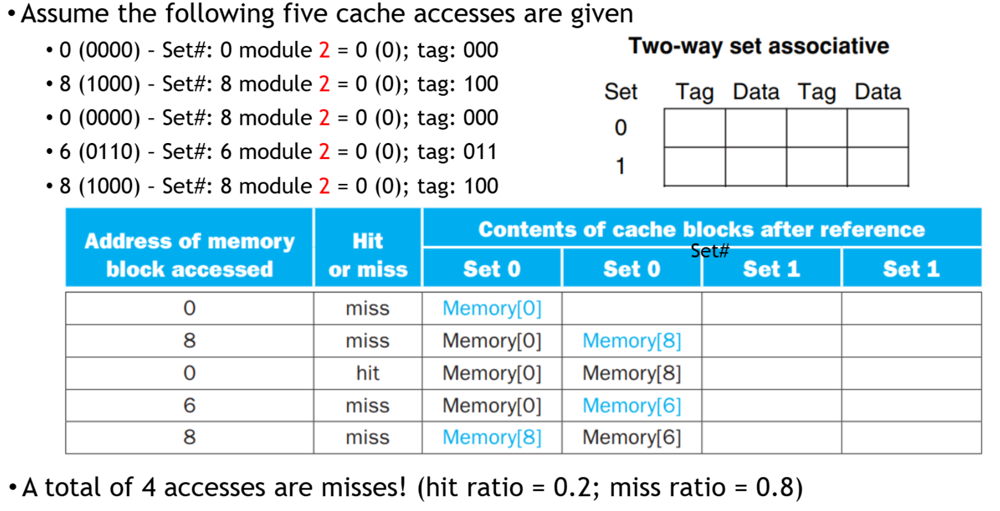
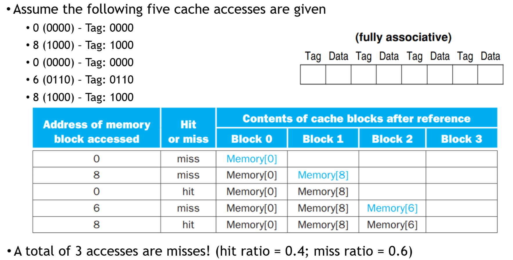

⚙ **Computer Architecture 공부**

Cache 배치 방식은 세 가지 방식이 존재!

1. **Direct Mapped Cache** (직접 매핑 캐시)
* 각 데이터가 캐시에서 **정확히 한 곳에만 저장될 수 있음**
  * 장점: 구현이 간단하고 빠름
  * 단점: 유연성이 떨어짐

2. **Set Associative Cache** (집합 연관 캐시)
* 각 데이터가 **정해진 개수의 위치 중 하나에 저장**될 수 있음
  * 예시: 2-way는 2개 위치 중 선택, 4-way는 4개 위치 중 선택
  * 장단점: 직접 매핑과 완전 연관의 중간 성능

3. **Fully Associative Cache** (완전 연관 캐시)
* 데이터가 캐시의 어느 곳에나 저장될 수 있음
  * 장점: 가장 유연함
  * 단점: 구현이 복잡하고 검색 시간이 오래 걸림

* Tag는 캐시에 저장된 데이터가 어떤 메모리 주소의 데이터인지 식별하는 정보!

1. **Direct Mapped**: 1개 tag만 확인하면 됨 (빠름)

2. **Set Associative**: n개 tag를 확인해야 함 (중간)
   * 예시: data 12 →  set 0의 두 번째 블럭으로 이동 
   * Set 0의 2개 Tag 모두 확인 → 12 일치! - **최대 2번의 Tag 비교**

3. **Fully Associative**: 모든 tag를 확인해야 함 (느림)
  * 모든 블록을 순차적으로 검색

## Set Associative Cache
---

* Set Associative Cache: 같은 8개의 블록으로도 여러 가지 방식으로 구성할 수 있다!

### Miss and Associative in Cache
---
실제 3가지의 캐시 동작을 비교해보자

* 캐시 접근 순서: 0, 8, 0, 6, 8
* 4-bit 주소 시스템
* 각 캐시는 4개 블록

#### Example in a Direct-Mapped Cache
---

* **0% Hit Rate**: 주소 0과 8이 같은 블록(0)에 매핑되어 서로 계속 밀어냄!
* 충돌 패턴 분석:
  * `주소 0`: 0 % 4 = 블록 0
  * `주소 8`: 8 % 4 = 블록 0
  * `주소 0`: 다시 블록 0 (주소 8 데이터를 덮어씀)
  * **이런 식으로 계속 충돌**!

#### Example in a 2-Way Set Associative Cache
---

* **20% Hit Rate**: Set 0에 **두 개의 블록**이 있어서 **주소 0과 8을 동시에 저장**할 수 있기 때문

#### Example in a Fully Associative Cache
---

* **40% Hit Rate**로 가장 우수한 성능: 모든 데이터를 다른 블록에 저장할 수 있어 충돌을 최소화