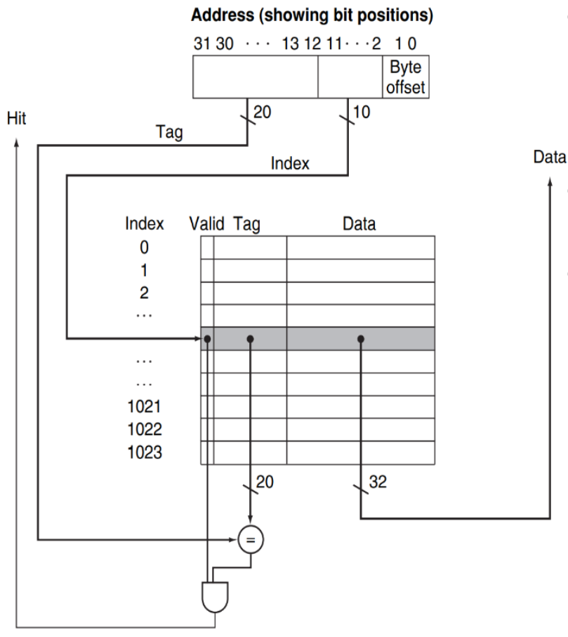
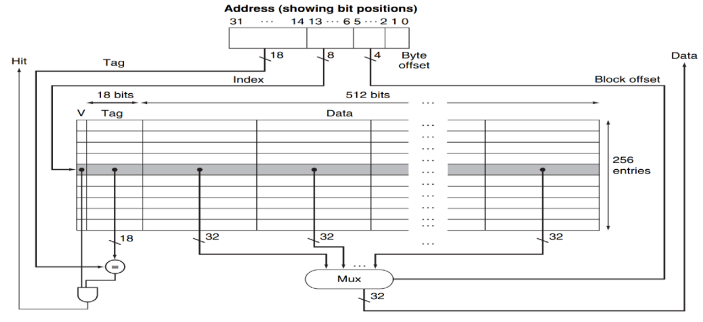

⚙ **Computer Architecture 공부**

## Direct Mapped Cache for Real World
---


📝**주소 구조**(32-bit):  
* **Tag** (20bits): 데이터를 식별하는 고유 번호
* **Index** (10bits): 캐시 블록을 선택하는 번호
* **Byte Offset** (2bits): 블록 내에서 특정 바이트를 선택

💾**Cache 구조**:  
* **캐시 크기**: 2¹⁰ = 1024개 블록
* **블록 크기**: 2² = 4바이트
* **전체 캐시 용량**: 1024 × 4 = `4KB`

✅**캐시 접근 과정**  
1. **Index 추출** - 주소의 11-2번째 비트를 사용하여 캐시 블록을 선택
2. **Tag 비교** - 주소의 31-12번째 비트와 해당 캐시 블록의 Tag를 비교
3. **Hit/Miss 판단**
   * **Hit**: **Tag가 일치**하고 `Valid=1`이면 캐시에서 데이터 반환
   * **Miss**: **Tag가 다르거나** `Valid=0`이면 메모리에서 데이터 가져와서 캐시 업데이트
4. **Byte 선택**: `Offset`(1-0번째 비트)을 사용하여 **4바이트 블록 내**에서 특정 바이트 선택

* **Spatial Locality (공간 지역성)**: **캐시가 한 번에 4바이트를 가져오는 이유**, 프로그램이 특정 메모리 위치에 접근하면, 그 근처의 데이터에도 곧 접근할 가능성이 높음!

## GENERALIZATION Of Direct Mapped Cache
---
Direct Mapped Cache의 일반화 버전 존재

이전 예제는 정된 값들(1024블록, 4바이트)을 사용했다면, 일반화된 버전은 매개변수 `n, m`을 사용하여 **다양한 캐시 크기와 블록 크기를 지원**

* `n`: **캐시 블록 수**를 결정 (2ⁿ blocks)
* `m`: **block size**를 결정 (2ᵐ words = 2ᵐ⁺² bytes)

1. **Byte Offset 확장**
* 이전: 고정 2비트 (4bytes block)
* **일반화**: `m+2` bits (2ᵐ⁺² bytes block)

2. **워드 단위 처리**
* 1 워드 = 4바이트 (32비트 시스템)
* 블록 크기: `2ᵐ words` = `2ᵐ⁺² bytes` = `2ᵐ⁺⁵ bits`
* **m bits**: 워드 내에서 선택
* **2 bits**: 워드 내에서 **바이트 선택**

3. **Tag 크기 계산**

```
Tag 크기 = 32 - Index 크기 - Offset 크기
        = 32 - (n - m + 2)
```

📝**총 Cache memory**: 2ⁿ × [2ᵐ⁺⁵ + (32-n-m-2) + 1] bits

## Bits in Cache
---
캐시 설계 시 실제 필요한 **하드웨어 메모리 용량을 정확히 계산**해야 비용과 성능을 최적화할 수 있다.
* Tag와 Valid 비트까지 포함한 **총 비트 수를 계산**

### 예제 문제 1
---
Direct Mapped Cache 조건:
* 데이터 용량: 16 KiB
* 블록 크기: 4 워드 (16 바이트)
* 주소: 32비트

**전체 캐시에 필요한 총 비트 수는?**

1. **총 블록 수 계산**
* **전체 데이터 크기**: 16 KiB = 2¹⁴ bytes = `2¹² words`
* **각 블록 크기**: 4 words = `2² words`
* **총 블록 수**: 2¹² ÷ 2² = 2¹⁰ = `1024 blocks`
* **Index 비트**: log₂(1024) = 10 bits

2. **Byte Offset 비트 계산**
* **블록 크기**: 4 words = 16 bytes = 2⁴ bytes
* `Byte Offset`: log₂(16) = `4 bits`

3. **Tag bit 계산**
* **Tag = 전체 주소 - Index - Offset**
* 32 - 10 - 4 = `18 bits`

4. **각 블록당 필요한 비트**
* **데이터**: 4 words × 32bits = 128 bits
* **Tag**: `18 bits`
* **Valid**: 1 bits
* **블록당 총합**: 128 + 18 + 1 = 147 bits

→ **cache size**: 1024 x (4 words + 18 bits + 1 bit)   
            = 1024 x (27bits + 18 bits + 1 bit) = 2^10x 147 = `147Kbits`


만약 Cache block size = 512bits 로 더 큰 블록이라면??


* **블록 크기**: 512 bits = 64 bytes = 16 words
* **총 블록 수**: 256개
* **주소**: 32bits

1. **주소 분할 계산**
* **블록 수**: 256 = 2⁸ → Index = `8 bits`
* **블록 크기**: 64 바이트 = 2⁶ → Byte Offset = `6 bits`
* **Tag**: 32 - 8 - 6 = `18 bits`

* 큰 블록에서는 워드 단위 접근을 위해 **Offset을 두 부분으로 나눔!**
  * `Block Offset` (상위 비트): 블록 내 워드 선택
  * `Byte Offset` (하위 2비트): 워드 내 바이트 선택