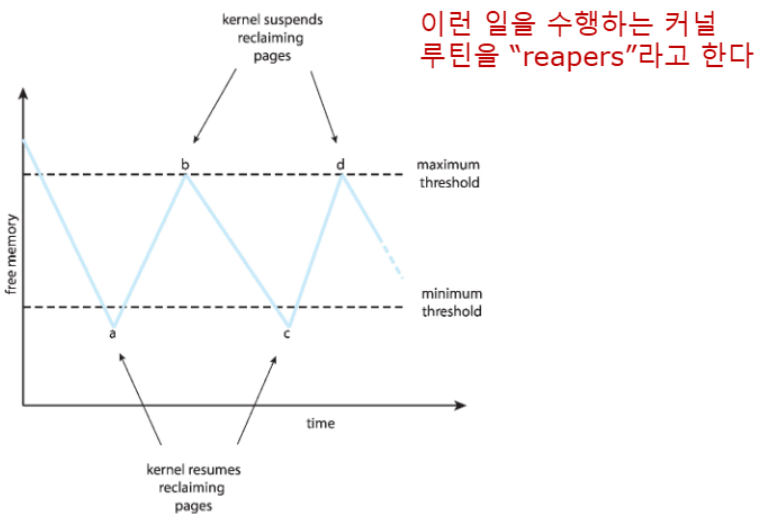
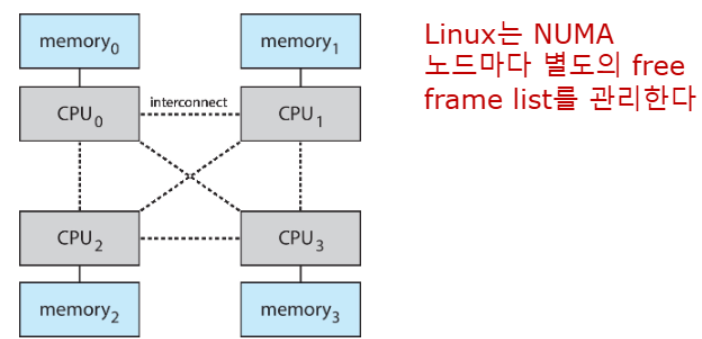
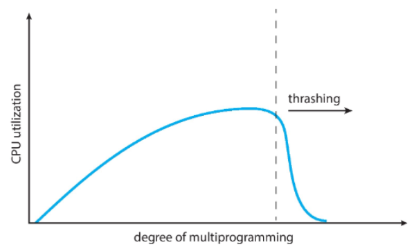
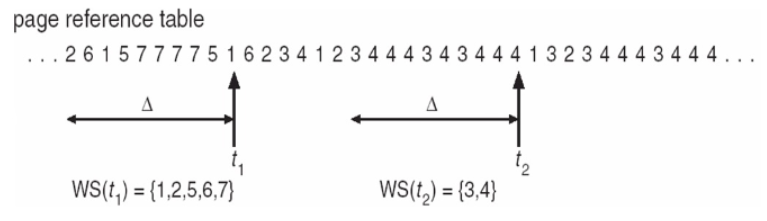
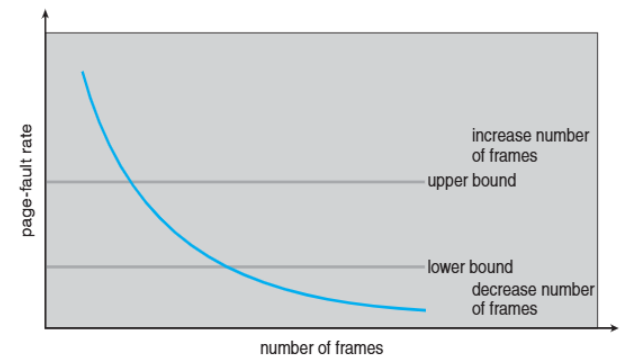
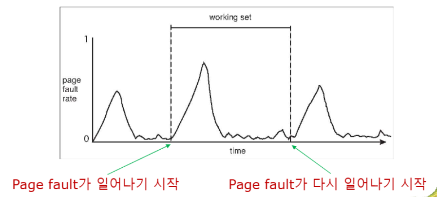
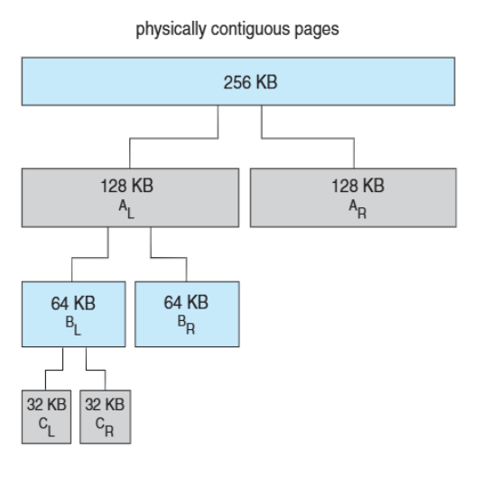
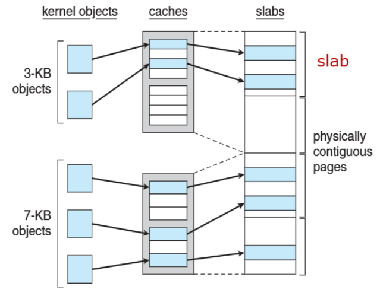

>🍀 운영체제 전공 수업 정리

## Allocation of Frames
---
📚**Allocation of Frames**: 여러 프로세스가 동시에 실행될 때 각각에게 **얼마만큼의 메모리 공간(프레임)을 줄지 정하는 것**
* 각 프로세스가 필요로하는 frame의 수는 **minimum**이 존재함
* **maximum은** 시스템의 **전체 프레임 수**
* 너무 적게 주면 page fault가 자주 발생, 너무 많이 주면 다른 프로세스가 부족해짐

* 예시: IBM 370 - **6 pages** to handle SS MOVE instruction:
  * instruction is `6 bytes`, might span `2 pages `
  * 2 pages to handle from - 데이터 읽기
  * 2 pages to handle to - 데이터 쓰기
  * 최소 필요 프레임: 6개 (이보다 적게 할당하면 page fault 발생)

✅**두개의 allocation schemes**:  
1. **fixed** allocation
2. **priority** allocation

### Fixed allocation
----
* **Equal allocation**: 프레임과 프로세스 수에 따라 균등하게 배분하는 방법

**계산 공식**:  
* 총 프레임 = 100개, OS용 = 20개, 프로세스 = 5개
* 각 프로세스 할당 = (100-20) ÷ 5 = 16개
❌메모리 낭비 가능성 존재

* **Proportional allocation**: process size에 따라 frame을 할당하는 방법

**계산 공식**:  
* `s_i` = 프로세스 i의 크기
* `S` = 모든 프로세스 크기의 합
* `m` = 총 사용 가능한 프레임 수
* `a_i` = 프로세스 i에 할당할 프레임 수 = `(s_i/S) × m`

* **예시 계산:**
* m = 62, s1 = 10, s2=127 → S = 137
  * 프로세스 1: 크기 10, 할당 = (10/137) × 62 ≈ `4 프레임`
  * 프로세스 2: 크기 127, 할당 = (127/137) × 62 ≈ `57 프레임`

#### Global vs Local Allocation
---
📚**Global replacement**: **프로세스가 모든 frame 집합에서 교체할 frame을 고름**

* 하나의 프로세스는 **다른 프로세스로부터 frame을 가져올 수 있음**
* **프로세스 실행 시간이 크게 달라질 수 있음**(→ 할당된 프레임의 수가 자신은 물론 다른 프로세스에 의해 영향을 받기 때문)
* 처리량이 더 높음 - 일반적으로 사용됨

📚**Local replacement**: 각 프로세스가 자신에게 할당된 프레임 내에서만 교체를 수행하는 방식

* 각 프로세스가 독립적인 프레임 집합 사용
* 프로세스별 성능이 일관적임
* 메모리 활용도가 떨어질 수 있음

### Reclaiming Pages
---
**global page-replacement policy**를 적용하기 위한 전략이 존재

📚**Reclaiming Pages**: 메모리 요청이 항상 성공할 수 있도록 **free frame의 수가 어떤 임계치에 도달하면 페이지 교체를 미리 실행하는 전략**

✅**동작 원리**:  
1. **threshold 모니터링**: free-frame list가 특정 임계값(threshold) 이하로 떨어지면 페이지 회수 시작
2. **미리 확보**: free-frame list가 완전히 비기 전에 교체 작업 수행
3. **연속적 서비스**: 새로운 메모리 요청을 대기시키지 않고 **즉시 처리 가능**

### Non-Uniform Memory Access
---
* UMA 시스템에서는 모든 메모리 접근 시간이 동일함

📚**NUMA system**:  
* CPU마다 로컬 메모리 존재
* 로컬 메모리 접근이 원격 메모리 접근보다 빠름
* 시스템 버스를 통해 상호 연결

✅**특징**:  
1. **Locality**: 프로세스를 해당 메모리와 가까운 CPU에서 실행
2. 확장성: 더 많은 CPU-메모리 노드 추가 가능

☀️ **Solaris의 NUMA 최적화: lgroups**
* CPU와 메모리가 가까운 거리에 위치
* 프로세스를 **같은 lgroup 내의 CPU에서 실행**
* 프로세스의 메모리를 **같은 lgroup 내에 할당**

### Thrashing
---
📚**Thrashing**: 프로세스가 프로그램 실행보다 페이징에 더 많은 시간을 보내는 순간 - 즉, **페이지 폴트가 과도하게 발생하는 현상**

만약 프로세스가 충분한 페이지가 없으면, 페이지 폴트가 **급격하게** 증가하게 됨

📝**발생과정**:  
1. page fault 발생
2. 기존 프레임 교체
3. 방금 교체된 프레임 필요
4. 반복적 교체

* **급격하게 증가하는 이유**:
페이지 폴트 때문에 frame을 교체해야하고 그러면 
  * CPU 효율이 떨어짐
  * OS는 CPU 사용률이 낮아 더 많은 프로세스 추가
  * 프로세스가 증가 → 더 심한 thrasing 발생

> thrasing이 발생하는 순간 CPU 사용률이 급격하게 낮아짐

#### Demand Paging and Thrashing
---
Demand paging이 작동하는 이유  
* **Locality Model** - 같이 활발하게 사용되는 페이지의 집합
  * 프로세스가 **특정 메모리 영역을 집중**적으로 사용
  * 여러 지역성이 동시에 활성화될 수 있음

📝**왜 Thrasing이 발생할까?**:  
* Σ(size of locality) > total momory size
* 모든 활성 프로세스의 지역성 크기 합이 전체 메모리보다 클 때 쓰래싱이 발생

✅**local or priority Page Replacement**로 제한적인 thrashing 해결

{:.prompt-warning}
> Local page replacement algorithm도 thrashing 문제를 완전히 해결하지는 못한다.

* 왜냐면 어떤 프로세스가 thrashing이 일어나면 paging device가 바빠지므로 **다른 프로세스는 thrashing이 아니더라도 EAT가 나빠진다**

### Working-Set Model
---
📚**Working-Set Model**: Page의 사용량을 측정하고 적절한 프레임 할당을 위한 model  
* `Δ (Delta)`(Working Set Window): 고정된 페이지 참조 횟수 (예: 10,000개 명령어)
* `WSS_i`(Working Set Size): 최근 Δ번의 참조에서 사용된 고유 페이지 수
* `D`: **모든 프로세스의 WSS 합계 (Total Demand Frames)**

✅ **D > m (사용 가능한 메모리) ⇒ 쓰래싱 발생**

> t1의 WSS는 5  
> t2의 WSS는 2

그럼 Working set을 어떻게 추적해야할까?

바로 **Timer와 reference bit를 사용**하여 근사치를 계산해서 추적한다.

#### Keeping Track of the Working Set
* `interval timer + reference bit`를 이용한 근사 구현
* 예시: Δ = 10,000, 타이머 인터럽트 = **5,000 time units**
  * 각 페이지마다 1개의 참조 비트 + 2개의 히스토리 비트 = 총 3비트
  * 타이머 인터럽트 발생 → **모든 참조 비트를 히스토리 비트로 시프트**
  * 모든 페이지의 **참조 비트를 0으로 설정**
  * **비트 중 하나라도 1이면 Working Set에 포함**

### Page Fault Frequency
---
📊 **Page-Fault Frequency (PFF)**: 실제 page fault 발생률 모니터링

* 상한/하한 임계값 설정
* 임계값 초과 시 프레임 조정

> Working set and PFF

## Allocation Kernel Memory
---
커널은 자신이 사용하는 데이터셋이 정해져 있기 때문에 allocation이 훨씬 쉬움
* 다양한 크기의 메모리를 요청
* 일부 커널 메모리는 연속적(특히 device I/O)

### Buddy System
---
📚**Buddy System**: 커널 메모리를 효율적으로 관리하는 방법

✅**작동원리**:  
1. **고정 크기 세그먼트**에서 물리적으로 연속된 페이지들을 할당
2. **2의 거듭제곱 단위**로만 메모리를 할당
3. 요청된 크기보다 큰 다음 2의 거듭제곱으로 반올림
4. 사용 가능한 것보다 작은 할당이 필요하면 **현재 청크를 둘로 분할**

* **장점**: 사용하지 않는 청크들을 빠르게 더 큰 청크로 병합 가능
* **단점**: 내부 **단편화(fragmentation)** 발생 (21KB 요청에 32KB 할당)

### Slab Allocator (슬랩 할당자)
---
Buddy System의 대안 전략

* **Slab</span.**: 하나 이상의 **물리적으로 연속된 페이지**
* **Cache**: 하나 이상의 슬랩으로 구성
* 각 고유한 커널 데이터 구조마다 **단일 캐시 존재**
* 캐시는 **객체들(objects)**로 채워짐 - 데이터 구조의 인스턴스들

✅**장점:**  
* 단편화(fragmentation) 없음: **정확한 크기의 객체만 할당**
* 빠른 메모리 요청 만족: 미리 할당된 객체 사용

#### Slab Allocator in Linux
📝**Linux에서 실제 사용 예시:**  

* process descriptor는 `struct task_struct` 타입
* 약 1.7KB의 메모리 사용
* 새로운 태스크 생성 시 → **캐시에서 새로운 struct 할당**
* 기존의 자유로운 `struct task_struct` 사용

* **Slab 할당 알고리즘**:
1. **Partial slab** 에서 자유 struct 사용
2. Partial이 없으면 **Empty slab**에서 하나 가져옴
3. Empty slab도 없으면 **새로운 Empty slab** 생성

### Prepaging
---
📚**Prepaging**: 프로세스 시작 시 발생하는 **대량의 페이지 폴트를 줄이기 위한** 기법

* 프로세스가 참조하기 전에 필요할 것으로 예상되는 페이지들을 미리 로드
* 예측 기반 메모리 관리 기법
* 시작 시간 단축 vs 메모리 낭비의 트레이드오프

✅공식:  
* `s`개 페이지를 prepage하고, α가 실제 사용되는 비율일 때
* **이득**: `s × α` (저장된 페이지 폴트)
* **손실**: `s × (1-α)` (불필요한 페이지)
* **조건**: `cost(s prepaging) < cost(s×α page fault)` → prepaging wins

### Page size
---
**Page size**는 시스템 성능에 큰 영향을 미치는 중요한 설계사항이다.

✅고려 요소들:  
* **단편화 ↓**: 작은 페이지가 유리
* **페이지 테이블 크기 ↑**: 큰 페이지가 유리
* **해상도 ↓**: 작은 페이지가 유리
* **I/O 오버헤드**: 큰 페이지가 히트에 유리, 작은 페이지가 양에 유리
* **페이지 폴트 수 ↑**: 큰 페이지가 유리
* **지역성 ↓**: 작은 페이지가 유리
* **TLB 크기와 효율성 ↑**: 큰 페이지가 유리

실제 범위는 2^12(4KB)qnxj 2^22(4MB)까지

### TLB Reach
---
📚**TLB Reach**: TLB가 접근할 수 있는 메모리의 양

* TLB Reach = (TLB Size) × (Page Size)

* 이상적으로는 **각 프로세스의 working set이 TLB에 저장되어야 함**
* **그렇지 않으면 높은 페이지 폴트 발생**

✅**해결 방법**:  
1. **페이지 크기 증가**: **단편화** 증가 위험 존재!
2. **다중 페이지 크기 제공**: 유연성 확보