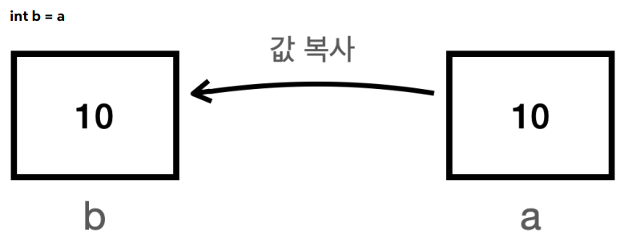
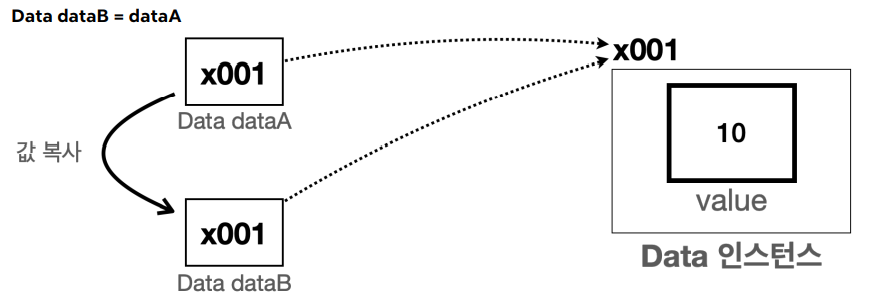
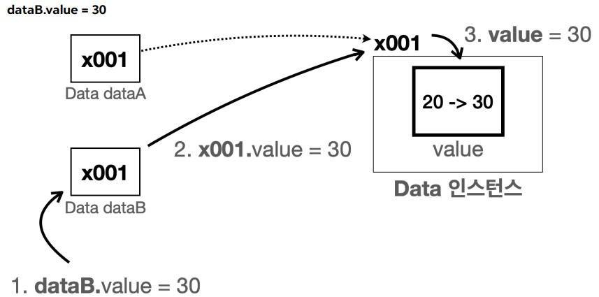

*자바를 깊이 이해하기 위해 반드시 넘어야 할 산, 바로 기본형과 참조형의 차이이다. 이 개념을 확실히 잡아야 변수가 메모리에서 어떻게 동작하는지, 왜 어떤 값은 메서드 안에서 바뀌고 어떤 값은 바뀌지 않는지 명확히 알 수 있다. 이번 포스팅에서 확실하게 익혀 먹어보자.*

-----

## **기본형 vs. 참조형: 무엇이 다른가? 🤔**

자바의 변수 타입은 크게 **<span style="color: #008000">기본형(Primitive Type)</span>**과 **<span style="color: #008000">참조형(Reference Type)</span>**으로 나뉜다. 이 둘의 가장 큰 차이는 변수 안에 **무엇을 담고 있느냐**이다.

* **<span style="color: #008000">기본형 (Primitive Type)</span>**

    * `int`, `double`, `boolean` 등과 같이 **실제 사용하는 값**을 변수 안에 직접 담는다.
    * 마치 `10`이라는 숫자가 적힌 포스트잇 자체
    * **기본형은** 모두 소문자로 시작, 자바가 **미리 만들어 놓은 타입**이다.

* **<span style="color: #008000">참조형 (Reference Type)</span>**

    * `Student` 객체, `int[]` 배열 등과 같이 데이터가 저장된 **메모리의 위치(주소)**, 즉 **참조값**을 담는다.
    * 마치 `친구가 사는 집 주소`가 적힌 포스트잇. 친구를 만나려면 그 주소로 찾아가야 함.

{:.prompt-tip}
> 기본형을 제외한 클래스, 배열 등은 모두 참조형
>

| 구분        | 기본형 (Primitive Type)            | 참조형 (Reference Type)         |
| :---------- | :--------------------------------- | :------------------------------ |
| **저장 값** | 실제 사용 값 (e.g., 10, true)      | 객체의 메모리 주소 (참조값)     |
| **예시**    | `int`, `long`, `double`, `boolean` | `String`, `Student`, `int[]`    |
| **연산**    | `+`, `-` 등 산술 연산 가능         | 참조값 자체는 산술 연산 불가능  |
| **초기값**  | 0, false 등                        | `null` (아무것도 참조하지 않음) |

-----

## **변수 대입: 값 복사 vs. 주소 복사**

이 둘의 차이는 변수 값을 다른 변수에 대입할 때 명확하게 드러난다. 여기서 가장 중요한 **대원칙이 존재**!.

{:.prompt-tip}
> **💡 대원칙: 자바는 항상 변수에 들어있는 값을 복사해서 대입한다.** 
>

-----

### **1. 기본형의 대입**

기본형 변수를 대입하면, 변수 안의 **실제 값이 복사**된다.

```java
int a = 10;
int b = a; // a의 값 10이 복사되어 b에 저장된다 

// a의 값을 변경해도 b는 영향을 받지 않는다. 
a = 20;

System.out.println("a = " + a); // 결과: 20
System.out.println("b = " + b); // 결과: 10
```

`int b = a;`가 실행되는 순간, `a`의 **값 10이 복사되어 완전히 새로운 공간 `b`에 저장**된다.  
이후 `a`와 `b`는 서로에게 아무런 영향을 주지 않는 독립적인 변수가 된다.



-----

### **2. 참조형의 대입**

참조형 변수를 대입하면, 변수 안의 **<span style="color: #008000">참조값(주소)이 복사</span>**된다.

```java
Data dataA = new Data();
dataA.value = 10;

Data dataB = dataA;// dataA의 참조값(주소)이 복사되어 dataB에 저장된다. 

// dataA를 통해 값을 변경하면, dataB에도 영향이 간다.
dataA.value = 20;

System.out.println("dataA.value = " + dataA.value); // 결과: 20
System.out.println("dataB.value = " + dataB.value); // 결과: 20 

// dataB를 통해 값을 변경해도 마찬가지이다.
dataB.value = 30;

System.out.println("dataA.value = " + dataA.value); // 결과: 30
System.out.println("dataB.value = " + dataB.value); // 결과: 30 
```

`Data dataB = dataA;`가 실행되면, `dataA`가 가지고 있던 객체의 **주소값(ex: `x001`)**이 `dataB`에 복사됨.  
그 결과, `dataA`와 `dataB` 두 변수가 **하나의 똑같은 객체를 함께 참조(바라보는)**하게 된다.

따라서 어느 한쪽에서 객체의 내용을 변경하면, 다른 쪽에도 당연히 그 변경사항이 반영된다.  
이건 마치 한 건물의 주소지를 두 사람이 나눠 가진 것으로 생각하면 된다. 누가 그 주소로 찾아가서 건물을 리모델링하든, 건물은 하나뿐이므로 다른 사람도 변경된 건물을 보게 된다.





-----

## **메서드 호출: 값 전달 vs. 참조 전달**

메서드에 인자를 전달할 때도 **"값을 복사해서 전달한다"는 대원칙은 동일하게 적용**!

* **<span style="color: #008000">기본형 인자 전달</span>**: 메서드에 기본형 변수를 넘기면 **실제 값이 복사**되어 전달된다. 메서드 내부에서 그 값을 아무리 바꿔도, **메서드 외부의 원래 변수에는 아무런 영향이 없다**.

* **<span style="color: #008000">참조형 인자 전달</span>**: 메서드에 참조형 변수를 넘기면 **참조값(주소)이 복사**되어 전달된다. 내부의 매개변수도 원본과 같은 객체를 가리키게 되므로, **메서드 안에서 객체의 상태를 변경하면 원본 객체가 영구적으로 변경**된다.

-----

## **Null과 NullPointerException (NPE)**

* **`null` 이란?**: 참조형 변수가 아직 아무것도 가리키고 있지 않은 상태를 나타내는 특별한 값  

* **<span style="color: #008000">NullPointerException (NPE)</span>**
개발자를 <u>가장 괴롭히는 예외 중 하나</u>로, **`null` 값을 가진 참조 변수에 `. (dot)`을 찍고 무언가를 하려고 할 때 발생한다**.  

**즉, 주소 없이 객체를 찾아가려고 할 때 발생하는 예외!**  

```java
Data data = null; // data 변수는 아무것도 가리키지 않는다. 
data.value = 10; // NullPointerException 발생! 
// 존재하지 않는 객체의 value 필드에 접근하려 했기 때문
```

> NPE가 발생하면, **"아! `null`인 변수에 점을 찍었구나"**라고 생각하면 대부분의 원인을 찾을 수 있다.
 
-----

### **핵심 정리**

* **대원칙**: 자바는 항상 **변수 안의 값을 복사**해서 전달
* **메서드 호출**도 대원칙을 따름. 참조형을 넘기면 메서드 안에서 원본 객체의 값을 변경할 수 있다

* **기본형**: 변수에 **실제 값**이 들어있다. 값이 복사되고 서로 영향을 주지 않음
* **참조형**: 변수에 **객체의 주소(참조값)**가 들어있다. 주소가 복사되어 여러 변수가 **하나의 객체를 공유**하게 될 수 있다
* **NPE**: `null` 상태인 참조 변수에 점(`.`)을 찍어 사용하려고 하면 발생. 참조 변수가 객체를 제대로 참조하고 있는지 확인하는 습관이 중요!