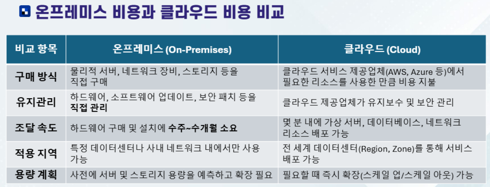
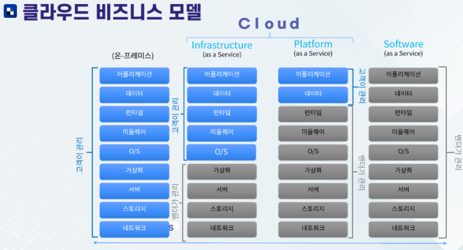

>💾 Cloud DB 전공 수업 정리

## Cloud Computing
---
📚**Cloud Computing**: 고객이 필요한 리소스를 클라우드 상에 **프로비저닝**하여 사용.  
* **프로비저닝(Provisioning)**: IT 시스템을 사용할 수 있도록 미리 준비하는 과정 → IT 자원을 `준비 & 설정 & 배포` 하는 과정 
1. 온디맨드로 서비스에 액세스
2. 필요에 따라 컴퓨팅 리소스 프로비저닝
3. 사용한 만큼만 비용 지불

### On-premise vs Cloud
---

### Cloud Models
---
1. **Public Cloud**
  * 확장을 위한 자본 지출 없음
  * 애플리케이션을 신속하게 프로비저닝 및 해제 가능
  * 사용한 만큼만 비용 지불
2. **Private Cloud**  
  * 시작 및 유지 관리를 위해 하드웨어를 구매해야 함
  * 리소스 및 보안을 완벽하게 제어할 수 있는 조직이 사용
  * 하드웨어 유지 관리 및 업데이트에 대한 책임이 있는 조직
3. **Hybrid Cloud**
  * 최고의 유연성 제공
  * 조직이 애플리케이션을 실행할 위치를 결정
  * 보안, 규정 준수 또는 법적 요구 사항을 제어하는 조직

### Cloud services
---
* **핵심 서비스**: 컴퓨팅, 스토리지, 네트워크
* **추가 서비스**: 사물인터넷, 인공지능, 데이터 분석, 블록체인 등 다양함

### Cloud의 장점
---
#### 고가용성(High Availability)
: **지속적인 서비스 제공**
* 클라우드 인프라는 다중 데이터 센터를 통해 서비스의 중단없이 운영 가능
* 장애 발생 시 자동으로 다른 리전이나 데이터 센터로 전환하여 서비스 지속
* **SLA(Service Level Agreement)**로 보장되는 높은 가동률
  * 99.0% -> 3일 15시간 36분
  * 99.9%-> 8시간 45분 36초
  * 99.99%-> 52분 33초
  * 99.999%-> 5분 15초

#### 확장성(Scalability)
: **무한한 리소스 확장**
* 수평적 및 수직적으로 리소스를 쉽게 확장 가능
* 사용자 요구에 따라 무한한 인프라 리소스 제공
* 빠른 확장을 통해 비즈니스 성장에 대응

#### 탄력성(Elasticity)
: **수요에 따른 자원 조정**
* 사용자 수요에 따라 자원을 자동으로 증설하거나 축소
* 비용 효율성 극대화
* Storage의 Auto-Scaling
* 
#### 안정성(Reliability)
: **지속적인 운영 보장**
* 자동 백업 및 복구 기능 제공
* 다중 리전(Resion) 데이터 복제 기능으로 데이터 손실 방지
* 높은 복원력을 통해 서비스 중단 최소화

#### 예측가능성(Predictability)
: **일관된 성능 제공**
* 예측 가능한 성능과 비용 관리
* 운영 데이터 및 분석을 통해 미래 수요 예측 가능

#### 보안(Security)
: **데이터 및 애플리케이션 보호**
* 클라우드 서비스 제공자의 최신 보안 표준 준수
* 데이터 암호화 및 접근 제어 기능 제공

#### 거버넌스(Governance)
: **정책 및 규제 준수**
* 조직의 규칙과 규제를 클라우드 환경에 쉽게 적용 가능
* 자원 관리 및 비용 통제 기능 제공
* 정책 기반의 자원 할당 및 사용 모니터링

#### 관리 효율성(Operational Efficiency)
: **자동화 및 간소화된 관리**
* 인프라 및 애플리케이션 관리 자동화 도구 제공
* 통합 관리 콘솔을 통한 중앙 집중 관리
* 인프라 유지 보수 시간 및 비용 절감
