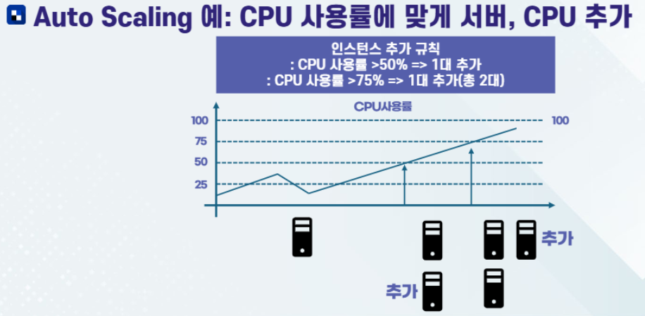
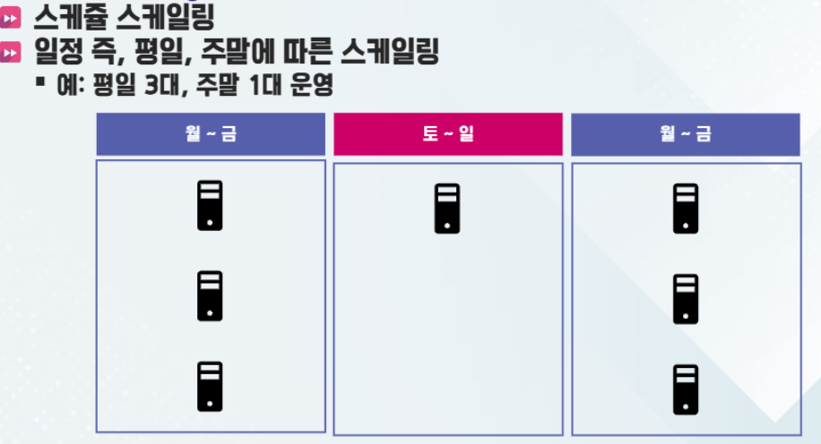

>💾 Cloud DB 전공 수업 정리

## Amazon EC2
---
📚**Amazon EC2(Elastic Compute Cloud)**: 클라우드 환경에서 가상서버 생성하고 관리가 가능한 서비스  
* 별도의 물리 서버 구축 없이도 원하는 컴퓨팅 리소스를 유연하게 활용 가능.
  
### Instance 유형
---
1. **범용(General Purpose)**: CPU와 메모리의 균형이 잘 잡혀 있어 웹 서버나 애플리케이션 서버 등 다방면으로 사용하기 적합
2. **계산 최적화(Compute Optimized)**: CPU 성능에 중점을 둔 인스턴스로, 연산 집약적 작업에 효과적
3. **메모리 최적화(Memory Optimized)**: 메모리 사용량이 많은 데이터베이스나 인메모리 캐시 등에 적합 
4. **스토리지 최적화(Storage Optimized)**: 데이터 입출력이 많은 애플리케이션에 빠른 I/O 성능을 제공
5. **GPU 인스턴스**: 그래픽 처리나 머신러닝 작업 등, 병렬 처리 능력이 필요한 경우에 사용

* **서버 성능 결정 요인**: CPU 코어수, 클럭 속도, 메모리 용량, 스토리지 성능, 네트워크 대역폭 등 구체적인 요구사항에 따라 최적의 인스턴스 유형을 선택

### 서버 자동 추가 및 제거
---
📚**Auto Scaling**: 부하상황에 맞게 서버 추가 및 제거를 자동으로 수행하는 기능  
* 서버 추가: Scale out, 서버 제거: Scale in

## AWS S3
---
📚**Amazon S3(Simple Storage Service)**: Amazon에서 제공하는 **객체 스토리지** 서비스  
* 데이터를 객체 단위로 저장, 무제한 확장 가능, 내구성이 높아 다양한 애플리케이션에서 사용

##### 객체 스토리지
📚**객체 스토리지**: 파일 시스템이나 블록 스토리지와는 달리 **데이터를 객체(파일과 메타데이터의 집합) 형태로 저장하는 방식**. (오로지 파일 보관만 가능)  
* 각 객체는 고유한 식별자인 키(Key)를 가짐.
* 별도의 계층 구조 없이 버킷(Bucket)에 저장됨.
* 확장성, 내구성, 관리 편의성이 뛰어남

* **버킷(Bucket)**
  * S3에서 데이터를 저장하는 기본 컨테이너. 모든 객체는 특정 버킷 내에 저장됨.
  * 전 세계에서 고유 값. 리전에 상관없이 중복된 이름이 존재할 수 있음.

* 글로벌 서비스이지만 데이터는 리전에 저장
* 무제한용량, 하나의 객체는 5TB

### ✅S3 특징
---
1. **확장성**
  * S3는 저장용량에 제한이 없으며, 사용자 요구에 맞춰 자동으로 확장됨 
2. **내구성 및 가용성**
  * S3는 데이터를 여러 가용영역(AZ)에 중복 저장하여 `99.999999999%(11 9's)`의 내구성을 제공
3. **비용 효율성**
  * 사용한 만큼 과금하는 `Pay-as-you-go` 모델이 기본, 데이터 접근 빈도에 따라 다양한 스토리지 클래스를 선택 가능
4. **유연한 데이터 관리**
5. **보안 기능**

#### 다른 서비스와의 연계
---
1. `EC2`와의 연계:  
→ S3에 저장된 데이터를 EC2 인스턴스에서 쉽게 읽거나 쓸 수 있음

2. `CloudFront`와 연계:  
→ CloudFront와 연계해서 **캐싱 및 콘텐츠 전송 네트워크(CDN)으로 활용** 가능
* 정적 콘텐츠를 전 세계 사용자에게 빠르게 전달하기 위해서

3. `Lambda`와 연계:
→ S3에 객체가 추가/수정될 때 트리거되어 자동으로 **AWS Lambda 함수가 실행되도록 구성** 가능

4. `Glacier` 및 기타 분석 서비스와 연계:
→ 데이터 장기 보관이나 데이터 분석 서비스(`Athena`, `Redshift`, `EMR` 등)와의 연계로 **방대한 데이터를 효율적으로 관리 가능**

### ✅S3 객체의 구성
---
* `Owner`: 소유자
* `Key`: 파일의 이름
* `Value`: 파일의 데이터
* `Version Id`: 파일의 버전 아이디
* `Metadata`: 파일의 정보를 담은 데이터
* `ACL`: 파일의 권한을 담은 데이터
* `Torrents`: 토렌트 공유를 위한 데이터

### S3 보안 설정
---
* S3의 모든 버킷은 새로 생성시 기본적으로 **비공개**
  * 설정을 통해 불특정 다수에게 공개 가능
* 보안 설정은 객체 단위와 버킷 단위로 구성
  * **Bucket policy**: 버킷 단위
  * ACL(Access Control List): 객체 단위 → 요즘은 잘 안쓰임
* MFA를 활용해 객체 삭제 방지 가능
* Versioning을 통해 파일 관리 가능
* 액세스 로그 생성 및 전송 가능