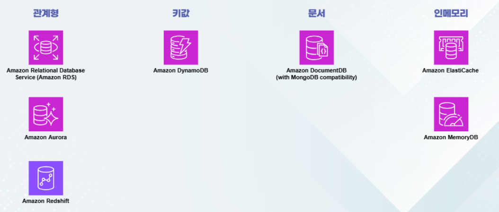
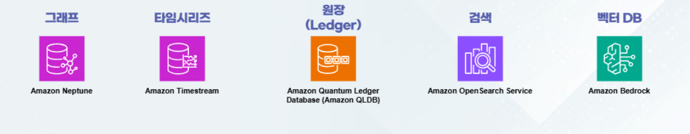
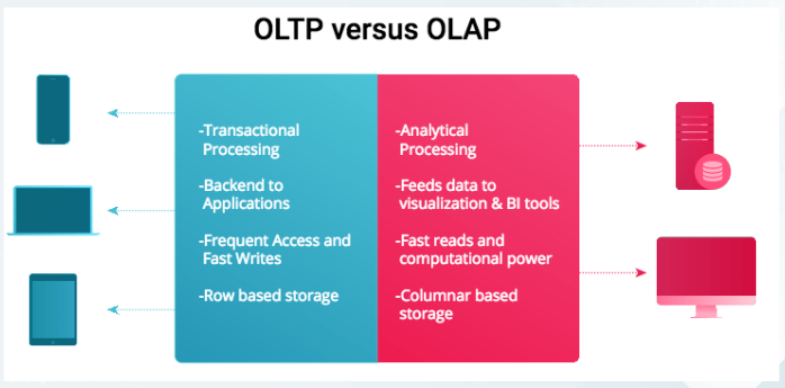
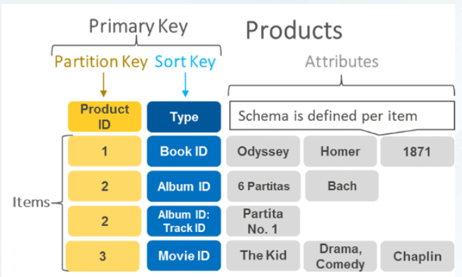
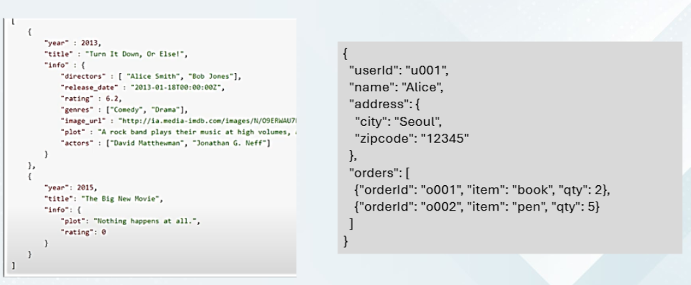
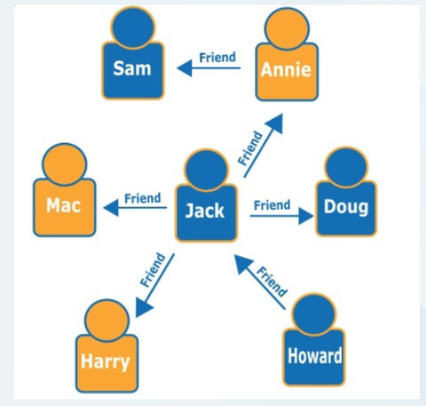
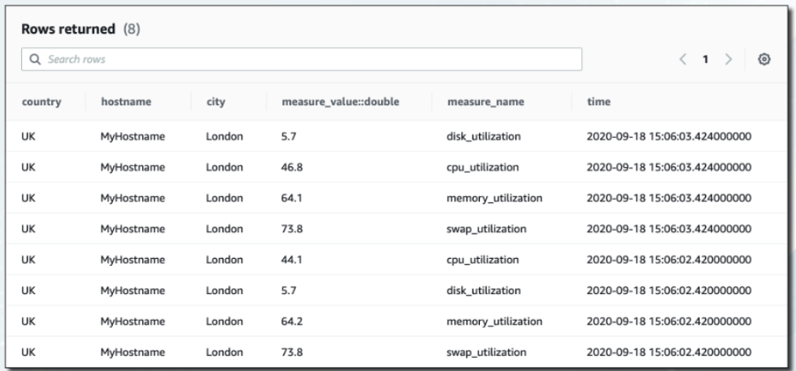
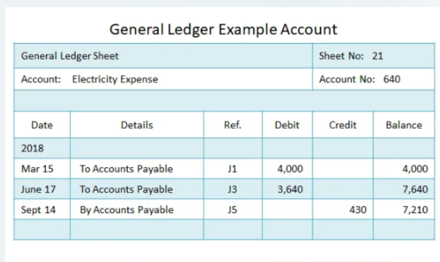

>💾 Cloud DB 전공 수업 정리

## AWS DataBase
---
AWS는 여러 유형의 데이터베이스를 제공

✅**주요 데이터베이스 유형**:  
* 관계형 (`RDS`, `Aurora`)
* 키(Key) - 값(Value) (`DynamoDB`)
* 문서 (`DocumentDB`)
* 인메모리 (`Elasti Cache`)
* 그래프 (`Neptune`)
* 타임시리즈 (`Timestream`)
* 원장 (`QLDB`)
* 검색 (`OpenSearch`)
* 벡터 DB (`OpenSearch KNN, Bedrock 기반`)

> AWS 데이터베이스 서비스 종류

### 관계형 데이터베이스 (Relational DB)
---
📚**관계형 데이터베이스 (Relational DB)**: 데이터를 **테이블(표) 형태**로 저장하고 관리하는 데이터베이스

* **AWS 서비스**: `Amazon RDS`, `Amazon Aurora`

* **기존 사용하는 DB**
  * `Amazon RDS`(MySQL, PostgeSQL, Oracle, MS SQL Server, MariaDB, IBM DB2)
* **Amazon Native DB**
  * `Amazon Aurora`
* **OLAP(분석용 쿼리)**
  * `Amazon Redshift`

✅**특징**:  
1. **ACID 준수**, SQL 지원
* ACID 원칙 준수:
  * `Atomicity(원자성)`: 트랜잭션이 전부 실행되거나 전부 취소
  * `Consistency(일관성)`: 데이터 무결성 유지
  * `Isolation(격리성)`: 동시 실행 트랜잭션 간 독립성
  * `Durability(지속성)`: 완료된 트랜잭션의 영구 저장
2. MySQL, PostgreSQL, MariaDB, SQL Server, Oracle, IBM DB2 지원
3. `Amazon Aurora`는 `RDS`보다 **최대 5배 성능 향상**

#### OLTP vs OLAP
---
📚**OLTP(Online Transactional Processing)**: 트랜잭션 중심 데이터베이스  
* **실시간 데이터** 입력, 수정, 삭제, 조회 처리
* 관계형 데이터베이스에서 처리됨
* 예: 상거래 주문, 은행 계좌 입출금, 실시간 조회, 삭제 행위 등
* `Amazon RDS`

📚**OLAP(Online Analytical Processing)**: 분석 중심 데이터베이스  
* **대량의 데이터**를 분석하고 통계 및 보고서 생성에 최적화됨
* 주로 대용량 쓰기와 읽기 위주의 행위
* 데이터 웨어하우스에서 처리됨
* 예: 특정 기간 동안 가장 많이 팔린 제품 유형 분석
* `Amazon Redshift`

### 키-값 데이터베이스 (Key-Value DB)
---
📚**키-값 데이터베이스 (Key-Value DB)**: 데이터를 고유한 키(`Key`)와 그에 대응하는 값(`Value`)의 쌍으로 저장
* 고유한 키를 **식별자**로 사용하여 데이터를 저장
* 키를 사용해 빠르게 데이터를 조회 가능(고속 성능)
* 관계형 데이터베이스와 다르게 **테이블 스키마가 필요 없음**

* AWS 서비스: `Amazon DynamoDB` - 고성능 NoSQL 키값 데이터베이스

✅**특징**:  
* **수평적 확장 가능** → 대량의 데이터를 빠르게 처리할 수 있도록 파티셔닝 지원
* **고속 읽기/쓰기 성능** → 실시간 에플리케이션에 적합
* 고성능 NoSQL 데이터베이스
* **서버리스 운영** 가능
  * 서버리스 운영: 개발자가 서버를 **직접 관리하지 않고도** 애플리케이션을 빌드하고 실행할 수 있도록 하는 **Cloud Native 개발 모델**

* **사용 사례**
  * 세션 저장: 사용자 로그인 이후 인증된 세션 데이터 저장
  * 장바구니 관리: 대량의 데이터를 실시간으로 저장 및 조회
  * IoT 데이터 저장: 수많은 센서 데이터의 빠른 기록 및 검색

### 문서 데이터베이스 (Document DB)
---
📚**문서 데이터베이스 (Document DB)**:`JSON`, `BSON` 등의 형식으로 데이터를 저장하는 NoSQL 데이터베이스  
* 전통적인 관계형 데이터베이스와 달리 유연한 스키마 구조 제공
* 계층적 데이터 저장 및 빠른 읽기/쓰기 성능 제공
* JSON 기반 문서를 그대로 저장하여 애플리케이션과 연동 용이

* AWS 서비스: `Amazon DocumentDB (MongoDB 호환)`

✅**특징**:  
* **유연한 데이터 스키마** → 정해진 테이블 구조 없이 자유롭게 데이터 저장 가능
* **계층적 데이터 구조** 지원 → `JSON/BSON` 형태의 데이터 저장 및 관리
* **수평적 확장** 가능 → **대량의 데이터**를 효율적으로 저장 및 조회 가능

* **사용 사례**
  * 웹 및 모바일: 사용자 프로필, 상품 정보 저장
  * 콘텐츠 관리 시스템(CMS): 블로그, 뉴스 기사 등 문서 기반 데이터 저장
  * IoT 데이터 처리: 센서 데이터의 계층적 자장 및 분석

### 인메모리 데이터베이스 (InMemory DB)
---
📚**인메모리 데이터베이스 (InMemory DB)**: RAM 기반으로 데이터를 저장하여 초고속 데이터 처리 가능한 데이터베이스  
* **디스크가 아닌 메모리에 데이터를 저장**하여 지연시간 감소
* **대규모 트랜잭션 처리 및 실시간 데이터 분석**에 적합

* AWS 서비스: `Amazon ElastiCache (REdis, Memcached 지원), Amazon Memory DB`

✅**특징**:  
* **초고속 데이터 처리** → 낮은 지연시간으로 빠른 데이터 액세스 가능
* **높은 확장성** →  분산 환경에서 수평 확장 가능
* **데이터 지속성 옵션** → `Snapshot` 및 지속적 백업 기능 제공
* 세션 관리, 캐싱, 실시간 데이터 분석에 활용

📝**`ElastiCache` vs `MemoryDB` 비교**  
* `ElastiCache`: 기존 DB의 워크로드 분산 및 캐싱 기능으로 활용
  * 예: 쿼리 캐싱, 세션 저장 등
* `MemoryDB`: 메모리 데이터베이스로 메인 DB로 직접 사용 가능
  * 예: 타임시리즈 데이터, IoT 기기의 실시간 데이터 저장

### 그래프 데이터베이스 (Graph DB)
---
📚**그래프 데이터베이스 (Graph DB)**: 데이터를 노드(`Node`)와 엣지(`Edge`)로 구성된 그래프 구조로 저장하고 관리하는 데이터베이스  

* AWS 서비스: `Amazon Neptune`

✅**특징**:  
* 데이터보다 **데이터 간 관계가 더 중심**인 데이터베이스
* 각 데이터 주체간 **관계와 연결 분석**에 최적화
* `Property Graph` 및 `RDF` 모델 지원
* 소셜 네트워크, 추천 시스템 등에 활용
  * '이 영화를 본 사람은 이 영화도 좋아했어요'
  * '이 사용자는 몇 단계의 연결을 통해 유명 인플루언서와 연결되어 있나?'
  * 지식그래프
  * 사기 탐지

### 타임시리즈 데이터베이스(TimeSeries DB)
---
📚**그래프 데이터베이스 (Graph DB)**: 시간 단위로 데이터를 저장하고 분석하기 위한 데이터베이스  
* 수십만~수백만 건의 이벤트 데이터를 시간에 따라 정렬하여 관리
* 실시간 데이터 처리가 중요하며, 특정 시점의 이벤트를 빠르게 조회 가능
* 많은 I/O 연산이 발생하여 고성능 처리가 필수적

* AWS 서비스: `Amazon Timestream`  
- 고속 데이터 삽입 및 조회 최적화 → 실시간 스트리밍 데이터 분석 지원

✅**특징**:  
* 고속 데이터 삽입 및 조회 최적화 → 실시간 스트리밍 데이터 분석 지원
* 자동 계층화 저장 → 최근 데이터는 빠르게, 오래된 데이터는 비용 효율적으로 관리
* SQL 호환 기존 데이터 분석 환경과 통합 용이

* **사용 사례**
  * **IoT 기기의 이벤트 관리**: 대규모 IoT 센서 데이터 기록 및 분석 
  * **실시간 로그 분석**: 애플리케이션 로그 및 성능 모니터링
  * **금융 및 거래 데이터 분석**: 주식 시장 데이터, 트랜잭션 기록 분석
  * **스마트 공장 및 에너지 관리**: 기계 상태 모니터링 및 이상 감지

### 원장 데이터베이스 (Ledger DB)
---
📚**원장 데이터베이스 (Ledger DB)**:  데이터의 신뢰성과 투명성이 중요한 데이터베이스  
* 변경 불가능한 트랜잭션 로그 유지
* 금융, 감사 로그, 공급망 관리 등에 활용
* 데이터 조작이 불가능하여 신뢰성이 높음 

* AWS 서비스: `Amazon QLDB (Quantum Ledger Database)`  
- 블록체인과 유사한 구조

✅**특징**:  
* **불변성**: 기존 기록 변경 불가
* **내장된 감시 기능**: 데이터 변경 내역 자동 저장
* **고성능 원장 관리**: SQL 인터페이스 제공

* **사용 사례**
  * 금융 거래 기록: 블록체인 유사 기능으로 안전한 거래 내역 저장
  * 규정 준수 및 감사(Compliance & Audit)
  * 공급망 추적(Supply Chain Tracking)

### 검색 데이터베이스 (Search DB)
---
📚**검색 데이터베이스 (Search DB)**: 데이터 검색에 특화된 데이터베이스
* 인덱싱과 카테고리 기능에 최적화
* 원하는 데이터를 빠르게 찾는 것이 목적
* 저장 목적보다는 특수한 검색 기능 제공

* AWS 서비스: `Amazon OpenSearch Service`(Elasticsearch 호환)

✅**특징**:  
* 대량 데이터 검색 및 분석
* 로그 분석, 보안 분석, 데이터 검색 가능
* 머신러닝 기반 이상 탐지 지원

* **사용 사례**
  * 콘텐츠 검색: 로그 검색, 유저 정보 검색, 색인 등
  * 로그 분석: 방대한 로그에서 원하는 조건에 맞는 검색 및 시각화

### 벡터 데이터베이스(Vector DB)
---
📚**벡터 데이터베이스(Vector DB)**: AWS의 벡터 데이터베이스는 고차원 데이터 검색 및 AI 기반 애플리케이션을 지원

* AWS 서비스: `Amazon OpenSearch kNN`, `Bedrock 기반 벡터 DB`

✅**특징**:  
* 고차원 벡터 데이터 저장 및 검색
* AI 및 머신러닝 애플리케이션 최적화
* 고성능 유사성 검색 지원
* AWS 생태계 내 서비스와 통합

* **사용 사례**
  * 추천 시스템: 사용자 행동 패턴을 분석하여 최적의 상품 추천
  * 이미지 검색: 이미지 벡터화 후 유사 이미지 검색
  * 자연어 검색: 문장을 벡터로 변환하여 의미 기반 검색 수행
  * 사기 및 이상 탐지: 벡터 패턴 분석을 통한 이상 감지