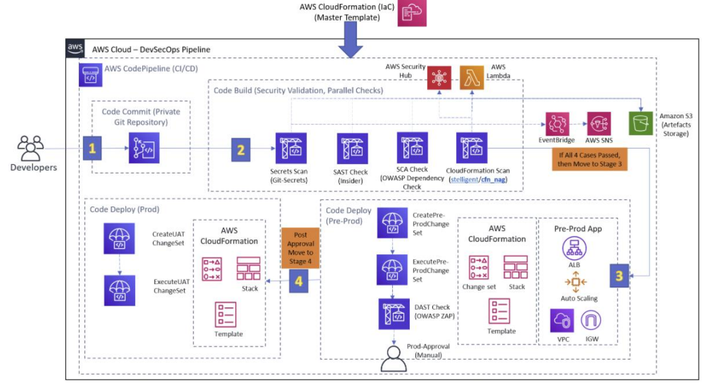
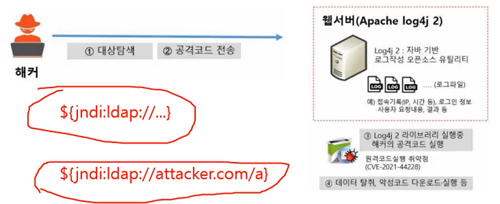

>🔒 시큐어 코딩 수업 정리

국내 SW에서 발견되는 취약점들은 이미 흔히 알려진 취약점인 것으로 나타났다는 결과가 있다. 또한 보안 취약점이 드러나는 것을 사업 리스크나 잘못으로 받아들이기보다, 일상적인 현상으로 이해해야한다는 보고서도 나왔다.

## 현대 애플리케이션의 4가지 보안 과제
---
#### 1. 봇 관리
* 인터넷 트래픽의 52%가 봇에 의한 통신
❌**문제점**:  
* 그 중 절반은 악성 봇
* 기업의 79%는 악성봇과 정상봇을 구분하지 못함
* 악성봇은 네트워크 트래픽 낭비, 데이터 수집, 중요정보 수집에 이용됨

#### 2. API 보안
* **현실**: IoT, 클라우드, 웹, 모바일 등 다양한 환경에서 애플리케이션이 사용되며 API로 연결
* ❌**위험**: API를 통해 서로의 리소스와 정보 공유 시 각종 인젝션, 파라미터 조작, 공격사이트로 리다이렉트 등 공격 증가

#### 3. 서비스 거부(DoS)
* **효과**: 여전히 서비스 장애를 일으키는 효과적인 공격
* **진화**: 애플리케이션 계층 DoS 공격은 매우 오래된 공격 방식이지만 서비스를 장애를 일으키는데 여전히 효과적

#### 4. 지속적인 보안
* **딜레마**: `DevOps` 개발환경에서 민첩성을 위해 희생되는 보안
* **과제**: 신속한 개발과 롤아웃 방법론은 애플리케이션을 지속적으로 수정하고 업데이트 하지만 **보안을 고려하지 못하는 경우**가 발생

{:.prompt-warning}
> 그럼 애플리케이션 보안 과제는 어떻게 해결해야할까?
>

## 애플리케이션 보안
---

> 애플리케이션 보안 방법들

* **'SW개발보안 프로세스 + DevSecOps'**: 애플리케이션 수명주기 따른 반복+지속적 보안 제어 필수
* **보안내재화 + Security By Design**: 안전하게 동작되는 제품을 만들기위해 **제품의 설계 단계에서부터 보안을 고려**함으로써 알려진 **취약점을 조기에 제거**하는 것

### 1. SW개발보안 프로세스
---
📚**SW개발보안 프로세스**: 소프트웨어 개발 각 단계별 적절한 보안활동 수행  
→ SW개발 과정에서 개발자의 실수, 논리적 오류 등으로 인해 발생될 수 있는 보안약점들을 최소화하여 안전한 SW를 개발하기 위해!

### 2. DevSecOps
---
📚**DevSecOps(Development + Security + Operations)**: DevOps에 **보안(Security)을 통합**한 개념, SW개발보안 프로세스와 유사한 보안활동을 수행
개발 단계(Dev) 운영 단게(Ops)로 나뉨

##### 개발 단계(Dev)
1. **Plan**: 보안을 담당하는 부서, DevSec Metrics 관리 방안, 보안취약점 모델링 수립, 보안관련 플래폼 교육 등의 보안 관련 문제를 해결해 나가기 위한 계획 수립
2. **Create**: 통합개발환경에 보안요구사항 적용
3. **Verify**: `SAST`(**정적** 애플리케이션 보안 테스트) / `DAST`(**동적** 애플리케이션 보안 테스트) / `IAST`(**상호작용** 애플리케이션 보안 테스트) / `SCA`(소프트웨어 구성분석)
4. **Preprod**: 카오스 몽키 테스트, 퍼징 테스트, 통합테스트 등 실서비스를 가정하고 실행되는 런타임에서의 자동화된 침투 스트가 여행히 동작되는지 확인

##### 운영 단계 (Ops)
5. **Release**: 적용되는 소프트웨어 또는 애플리케이션에 대한 사용 전략
6. **Prevent**: 서버에 대한 확인, Checksum 등 무결성 확인, 심층 방어 조치 수립
7. **Detect**: `RASP`(런타임 애플리케이션 자가 보안), `UEBA`(사용자 행동 분석, 네트워크 표적공격 및 금융사기 탐지)
8. **Respond**: 보안 요건 계획 등 및 조치, `RASP`/`WAF`(웹 애플리케이션) 등 인티텔 반경에서의 보안 위험 차단
9. **Predict**: `IoC`(데이터와 도메인에서의 관찰된 침입의 징후, 네트워크(SIEM), 위험성 표현 구조), `TAXII`(사이버위협정보 전송구조) 등 예상 가능한 위험성들을 예측
10. **Adapt**: 보안을 담당하는 부서, 보안 위험에 대해 대응

#### DevSecOps AWS 아키텍쳐
---

### 3. 보안내재화 + Security By Design
---
📚**보안내재화**: SW나 시스템 개발 과정에서 보안을 기능처럼 자연스럽게 포함시키는 접근

📚**Security By Design**: 시스템을 설계할 때부터 보안을 핵심요소 고려하는 전략

위 두 개념은 함께해야 강력한 보안을 이룰 수 있다.

#### Threat Modeling (위협 모델링)
📚**Threat Modeling (위협 모델링)**: 시스템의 보안 위협을 체계적으로 식별, 분석, 완화하는 구조화된 접근 방식

> 위협모델링 프로세스 6단계
>

### 4. Zero Trust
---
📚**Zero Trust**: '아무것도 신뢰할 수 없다'는 가정하에 사용자 및 다양한 정보를 바탕으로 **최소한의 권한과 세밀한 통제를 지속적으로 수행**하는 보안 활동

#### BeyondCorp

> BeyondCorp: Google의 Zero Trust
>

##### 🔐 Component 1: 기기인증
: 접근을 요청하는 모든 디바이스의 정상적인 구분을 위해 신뢰할 수 있는 기기인증을 확인
* **디바이스 인벤토리 DB**: 회사 내트워크에 접속하는 모든 디바이스 식별
* **디바이스 아이덴티티**: 관리하는 모든 디바이스는 유일하게 식별, 디바이스 인증서 사용

##### 👤 Component 2: 사용자 인증
: 접근하는 사용자가 정상적인 구글 임직원인지 확인 및 사용자의 소속 그룹과 업무 확인
* **사용자 인증(User, Group DB)**: 모든 User 및 Group DB와 연동되어 있어 사용자명, 소속그룹, 업무범위, 사용자 권한 등을 정보 확인
* **Single Sign-On System**: 외부에서도 SSO portal을 통해 이론에 지원 인증싱싱을 Two-factor로 사용자 계정과 OTP 또는 USB 형태의 물리적 키 사용

##### ⚙️ Component 3: 접근제어 엔진(⭐)
: 기기정보, 사용자 정보, 취약점 정보 등을 상관 분석해 사용자 접근 허용 여부를 결정하는 엔진. **모든 요청은 접근제어 엔진을 거친다.**
접근제어 엔진이 접속 허용 또는 차단 의사 결정을 내릴 때 **관측데이터와 입력데이터를 사용하여 보안등급평가 과정**을 거쳐 반영됨.
* **관측데이터(Observed Data)**: 계획적으로 생성된 데이터(취약점 스캔결과, AD 정책, OS버전 및 패치 여부, 설치된 SW 목록 등)
* **입력데이터(Prescrived Data)**: IT 운영자가 수동으로 관리하는 데이터(기기의 소유자, 기기에 접속할 수 있는 사용자 그룹, DNS, DHCP 정보, 특정 VLAN 등)

## 사고사례를 통한 시큐어코딩 이해
---
📚**시코어 소프트웨어**: 소프트웨어에 실수나 오류로 인한 결함, 결점, 버그가 없어서 장애, 문제가 발생하지 않는 소프트웨어

### 사례 1. 시큐어코딩이 적용되지 않은 스마트 컨트랙트
---

오버플로우를 제대로 처리하지 않아서 잔고를 체크하는 과정에서 문제가 생겼다.

위 그림은 8비트 시스템에서 최댓값을 초과했을 때 발생하는 오버플로우이다.
* 맨 앞 `0`은 사인비트(Sign bit)로 부호를 표현한다.
* 127 + 1 = 128이어야 하지만 비트 시스템에서는 0이 됨!

> 문제가 되는 함수: `transferProxy`

❌**문제점**: `if(balances[_from] < _feeSmt + value) rever();`에서 송금자의 계좌 잔액이 보내려는 수수료+금액보다 적으면 revert()가 실행되서 종료되어야한다.  
하지만 `_feeSmt + _value` 연산에서 오버플로우가 발생하면 매우 작은 값이 되어 잔액 검증을 우회할 수 있게 된다. 그래서 _feeSmt를 매우 크게 설정하게 되면 우회할 수 있다.

그럼 왜 이런 문제가 발생한걸까??

Solidity에서 오버플로우 처리를 위한 **SafeMath** 라이브러리를 제공하는데, 이를 사용하지 않았음. 그냥 사칙연산만 수행하여 발생한 일이다.

### 사례 2. OSS(Open Source Software) 취약점 공격
---
#### Log4j
* 상용 소프트웨어 코드베이스의 76%가 오픈소스
* 그 중 48%가 고위험군 보안 취약점 포함
* **Log4j 취약점**이 2년 이상 방치되었던 사건

* 2021.11.24에 Alibaba Cloud 보안팀이 Apache Log4j 라이브러리에서 원격 코드 실행 취약점을 발견
* Java 기반 로깅 도구인 **Apache Log4j 라이브러리 원격 코드 실행 취약점**
* 공격자가 로그 메세지를 제어할 수 있는 서버에서 로드된 임의의 코드 실행 가능

#### 공급망 해킹

* **위즈베라 해킹**: 웹 서버 침해 후 악성 바이너리 배포
* **SolarWinds 해킹**: 빌드 시스템에 백도어 삽입

이러한 공급망 해킹에 대응하기 위한 여러 방법들이 있다.
그 중에 SBOM을 알아보자
#### 공급망 보안: SBOM

📚**SBOM(Software Bill of Materials)**: 소프트웨어를 빌드하기 위해 사용된 여러 컴포넌트에 대한 내용과 공급망 관계를 형식에 맞춰 기록하는 것

* 소프트웨어 제품을 생산, 소비, 운영하는 자가 공급망에 대해 더 깊이 이해하고 알려진 혹은 새로운 취약점과 위험을 추적하여 **알려진 취약점의 확산을 효과적으로 저지하기 위한 목적**

1. **설계** → 소스코드, 바이너리, 사양
2. **개발** → 인출 정보, 빌드 정보, 패키지
3. **테스트** → 빌드정보, 취약점 정보
4. **배포** → 변경사항, 취약점 정보
5. **유지보수** → 운영 데이터, 실시간 보안
