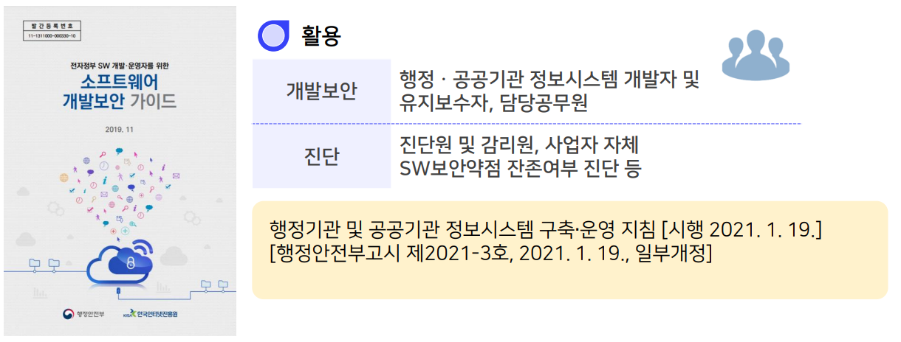
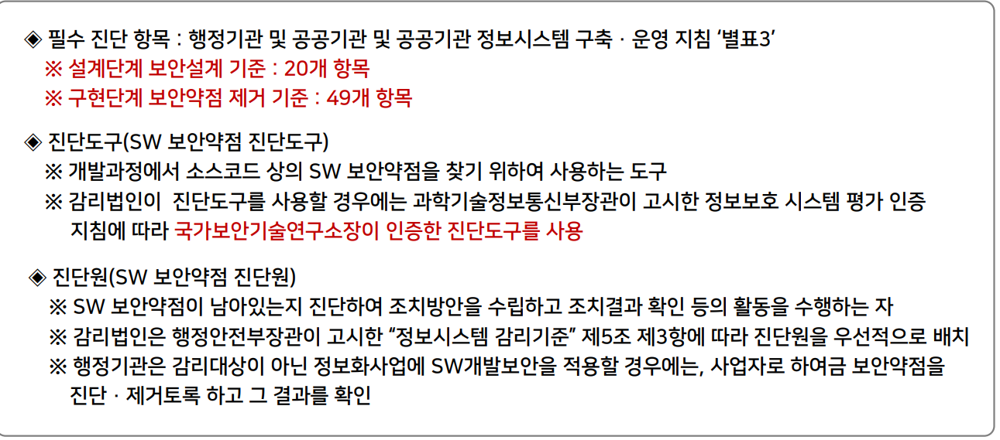
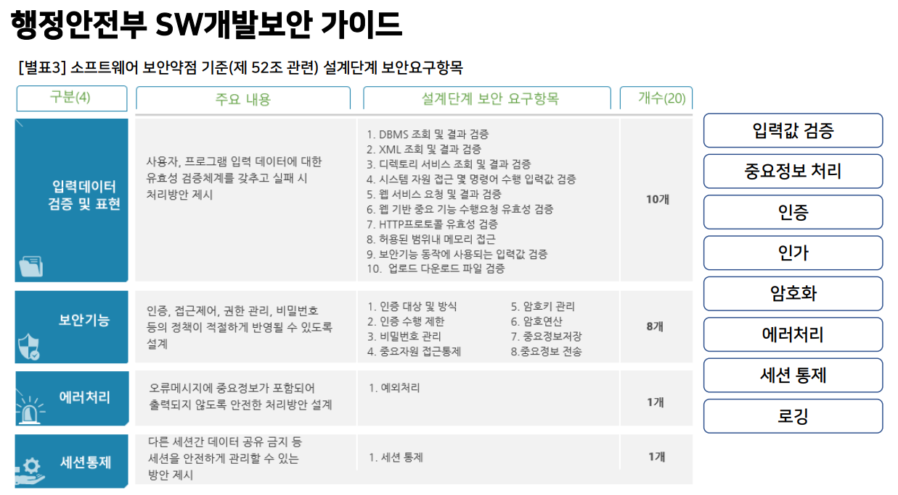
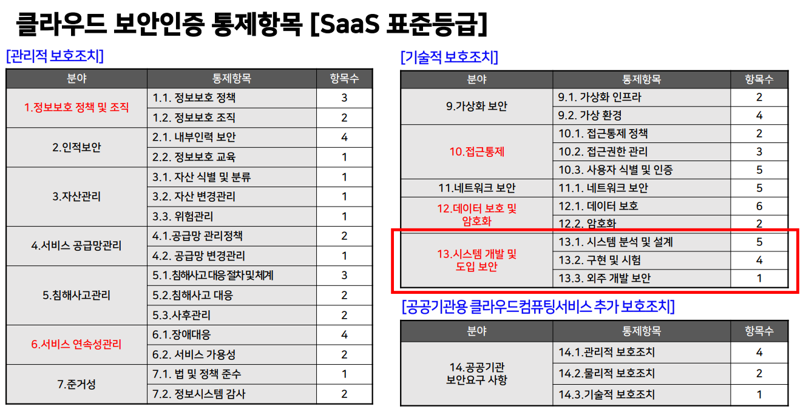
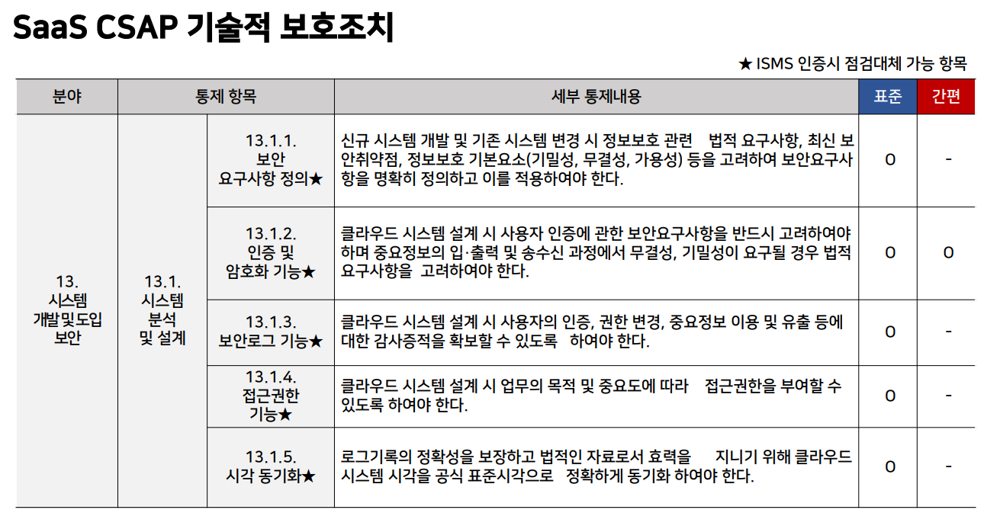
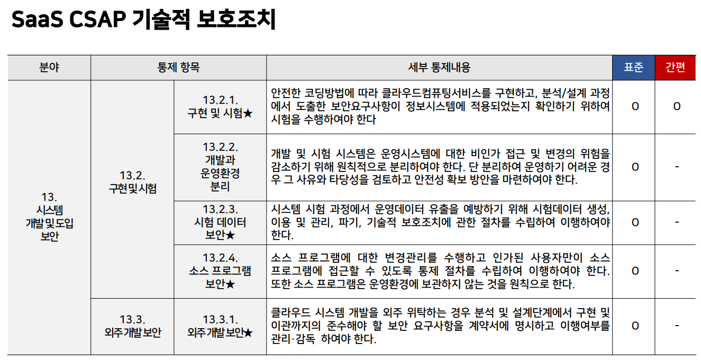

>🔒 시큐어 코딩 수업 정리

## 소프트웨어 개발보안 가이드
---
📚**행정안전부 SW개발보안 가이드**: 행정기관 등이 안전한 소프트웨어를 개발하여 각종 사이버위협으로부터 예방, 대응하기 위해 SW 개발단계 부터 SW개발 보안을 적용하기 위한 기준으로 제공

* **대상**: 정보 시스템 감리 대상 정보화 사업
* **범위**: 설계단계 산출물 및 소스코드 전체

* 2020년에는 SW산업진흥법이 개정되어 민간 기업 SW개발시 SW개발보안을 적용하도록 함

## 클라우드 서비스(Saas) 보안인증 가이드
---
📚**클라우드서비스(SaaS) 보안 인증**: SaaS 표준등급 클라우드 보안인증은 중요 데이터를 처리하는 서비스를 대상으로 하며, 13개 분야에서 총 79개의 통제
항목을 준수해야 함. 이 인증 기준은 클라우드 서비스의 보안성과 신뢰성을 확보하기 위한 관리적, 기술적 보호 조치 포함

✅**소프트웨어 보안과 관련된 통제항목**:   
1. 정보보호 정책 수립 및 운영
2. 서비스 연속성 관리
3. 접근통제
4. 암호화 적용
5. 시스템 개발 및 운영 보안
6. 취약점 관리

