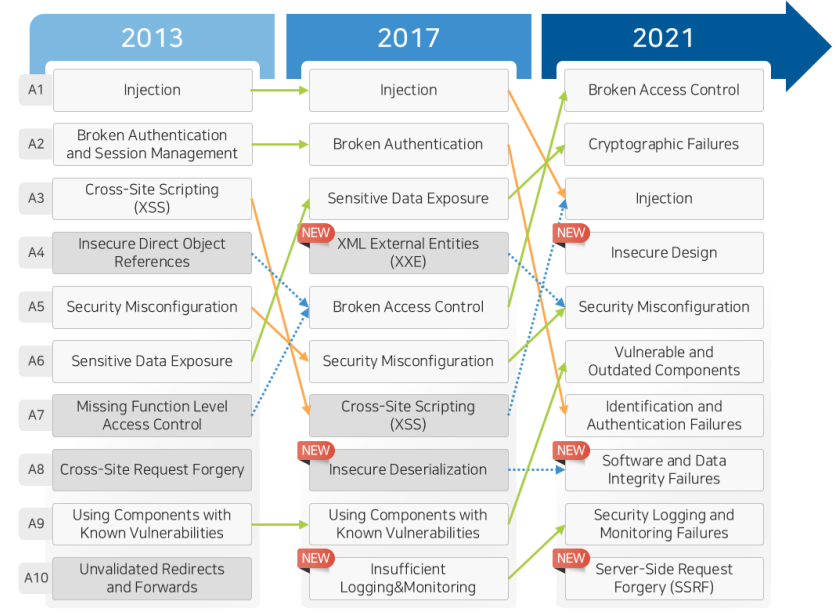

>🔒 시큐어 코딩 수업 정리

## 국외 개발보안 현황
---
국외에서는 소프트웨어 개발보안을 강화하기 위해 다양한 표준과 지침이 마련되어 있다.

### NIST의 안전한 소프트웨어 개발 프레임워크(SSDF) - 미국
📚**SSDF**:  소프트웨어 개발 초기 단계에서 보안 요구사항을 명확히 정의하여 보안을 설계에 반영

* **위험 식별 및 관리**: 빌드 시스템을 포함한 개발 환경의 보안 위험을 식별하고 적절한 보안 통제를 구현
* **자동화 도구 활용**: 코드의 무결성을 확보하기 위해 자동화된 도구를 도입하여 정적 및 동적 분석을 수행
* **소프트웨어 구성요소 검토**: 사용되는 라이브러리나 패키지 등의 구성요소에 알려진 취약점이 없는지 검사

### NIS2 지침 – 유렵연합(EU)
📚**NIS2(Network and Information Security Directive 2)**: 디지털 인프라를 보호하고 사이버 공격에
대한 대응력을 높이기 위한 공통의 사이버 보안 수준을 구축하는 것을 목표

* **위험 분석 및 정보 시스템 보안 정책 수립**: 조직은 정기적인 위험 분석을 수행하고, 이를 기반으로 정보 시스템 보안 정책을 수립
* **사고 대응 및 위기 관리**: 사이버 사고 발생 시 신속하게 대응하고, 비즈니스 연속성을 유지하기 위한 위기 관리 계획 마련
* **공급망 보안 강화**: 공급업체 및 서비스 제공자와의 관계에서 보안 요구 사항을 명확히 하고 관리
* **네트워크 및 정보 시스템의 보안 유지**: 시스템의 개발 및 유지보수 과정에서 보안을 고려하고, 취약점 관리 절차 도입

## OWASP TOP 10
---
📚**OWASP(Open Web Application Security Project)**: 웹 애플리케이션의 보안 강화를 위해
**가장 치명적인 보안 취약점 10가지를 정리한 OWASP Top 10**을 주기적으로 발표  
웹 개발자, 보안 전문가 및 조직이 보안 위협을 예방하는데 중요한 지침으로 활용

2021년도 OWASP TOP 10을 알아보자

### 1. **Broken Access Control(취약한 접근 통제)**
* **인증된 사용자라도 접근이 제한된 데이터나 기능에 접근할 수 있는 취약점**
* **예**: 사용자가 다른 계정의 데이터를 조회하거나, 관리자 기능을 수행할 수 있음

✅**대응방안**:  
* 모든 요청에 대해 접근 권한 확인
* 최소 권한 원칙(Least Privilege) 적용
* 역할 기반 접근 제어(Role-Based Access Control, RBAC) 구현

### 2.**Cryptographic Failures(암호화 실패)**
* 데이터 보호가 제대로 되지 않아 기밀 정보가 노출되는 취약점
* 예: 민감한 데이터를 평문(Plaintext)으로 저장하거나 전송

✅**대응방안**:  
* HTTPS/TLS 사용하여 데이터 암호화
* 안전한 암호화 알고리즘(AES, RSA) 사용
* 비밀번호는 해시 및 솔트(Hashing & Salting) 적용

### 3.**Injection(인젝션 공격)**
* 공격자가 **악성 코드를 삽입**하여 데이터베이스 조작 및 시스템 장악 가능
* 예: `SQL Injection`, `XSS`(Cross-Site Scripting), `Command Injection`

✅**대응방안**:  
* 사용자 입력값을 검증하고 필터링
* SQL 쿼리에서는 Prepared Statement 및 ORM(Object-Relational Mapping) 사용
* 입력값을 실행하지 않고 안전하게 처리

### 4.**Insecure Design(보안 설계 미흡)**
* 보안 요소를 고려하지 않은 시스템 설계로 인해 취약점이 발생
* 예: 비밀번호 없이 관리자 패널 접근 가능

✅**대응방안**:  
* 보안 설계 원칙(Security by Design) 적용
* 위협 모델링(Threat Modeling) 수행
* 보안 설계를 코드에 반영하고 주기적으로 검토

### 5.**Misconfiguration(보안 설정 오류)**
* 기본 설정값 유지, 디버그 모드 활성화 등으로 인해 발생하는 취약점
* 예: 관리자 패널의 기본 아이디/비밀번호 미변경

✅**대응방안**:  
* 불필요한 기능 및 서비스 비활성화
* 보안 패치 및 업데이트 주기적 적용
* 환경 설정 파일의 접근 제한

### 6.**Vulnerable and Outdated Components(취약하고 오래된 구성요소)**
* 오래된 라이브러리, 프레임워크, 플러그인을 사용하여 공격에 노출
* 예: 패치가 적용되지 않은 오픈소스 소프트웨어 사용

✅**대응방안**:  
* 최신 버전의 라이브러리 및 프레임워크 유지
* 사용 중인 오픈소스 및 서드파티 모듈의 보안 이슈 확인
* 소프트웨어 구성 목록(SBOM, Software Bill of Materials) 관리

### 7.**Identification and Authentication Failures(인증 및 세션 관리 취약점)**
* 약한 비밀번호, 세션 하이재킹 등의 문제로 인증이 우회될 가능성이 있는 취약점
* 예: 브루트 포스 공격(무작위 비밀번호 대입), JWT 토큰 유출

✅**대응방안**:  
* 다중 요소 인증(MFA) 적용
* 안전한 세션 관리(토큰 만료 및 회수)
* 강력한 비밀번호 정책 적용 및 보호

### 8.**Software and Data Integrity Failures(소프트웨어 및 데이터 무결성 실패)**
* 무결성을 검증하지 않은 코드 및 데이터로 인해 악성 코드가 실행될 가능성이 있는 취약점
* 예: 코드 서명 없는 업데이트 파일, 신뢰할 수 없는 CI/CD 파이프라인

✅**대응방안**:  
* 코드 서명(Code Signing) 및 무결성 검증
* CI/CD 파이프라인 보안 강화
* 서드파티 구성 요소의 신뢰성 검토

### 9.**Security Logging and Monitoring Failures(보안 로깅 및 모니터링 실패)**
* 보안 이벤트를 로깅하지 않거나 적절한 모니터링이 없어 공격을 탐지하지 못하는 취약점
* 예: 로그인 실패 기록 미비, 이상 트래픽 감지 불가

✅**대응방안**:  
* 보안 이벤트 로깅 및 중앙화된 로그 관리
* SIEM(Security Information and Event Management) 도입
* 보안 인시던트 대응 체계 구축

### 10.**Server-Side Request Forgery(SSRF)**
* 공격자가 서버를 이용해 내부 네트워크를 스캔하거나 외부 사이트를 공격하는 취약점
* 예: 웹 애플리케이션에서 내부 시스템의 민감한 데이터 요청 가능

✅**대응방안**:  
* 외부 요청을 제한하고 허용 목록(Allowlist) 적용
* 입력값 검증 및 보안 헤더(Content Security Policy) 설정
* 네트워크 레벨에서 API 호출 제한

## CVE
---
📚**CVE(공통 취약점 및 노출, Common Vulnerabilities and Exposures)**: 소프트웨어 및 하드웨어의 보안 취약점을 표준화하여 공개하는 시스템

* CVE는 보안 취약점을 표준화하고 추적하는 중요한 시스템이며, 기업과 개발자는 이를 활용하여 보안성 강화
* 특히 SW개발자는 CVE데이터를 활용하여 보안 취약점을 사전에 예방하고 신속하게 패치 적용

✅**작동 방식**:  
1. **취약점 발견**: 보안 연구원, 기업, 기관이 새로운 보안 취약점을 발견
2. **CVE 요청**: CVE Numbering Authority에 취약점 보고
3. **CVE ID 할당**: MITRE가 검토 후 CVE ID 부여
4. 공개 및 업데이트

## CWE TOP 25
---
📚**CWE(Common Weakness Enumeration)**: 미 국토 안보부(The U.S. Department of Homeland Security)에서 관리하고 있으며, 소프트웨어와 하드웨어의 **보안약점**을 체계적으로 정리한 공개 목록

✅**목적**:  
1. 소프트웨어 및 하드웨어 취약점 분류 및 표준화
2. 보안 취약점의 예방 및 완화를 위한 지침 제공
3. 보안 평가 및 코드 분석 도구 연계

* **활용**
1. 개발자의 보안 코딩 가이드라인 제공
2. 보안점검도구(정적분석, 동적분석)에서 CWE 목록 기반 취약점 탐지
3. OWASP, NIST, CVE 등과 연계하여 보안 개선에 활용

### CWE와 CVE 차이점

### CWE TOP 25 선정 목적 및 활용 방안
