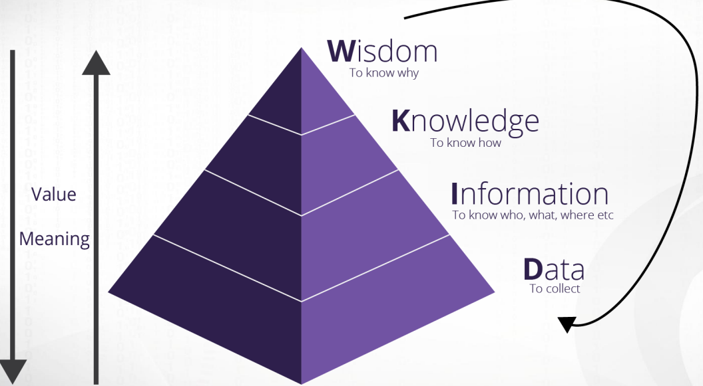
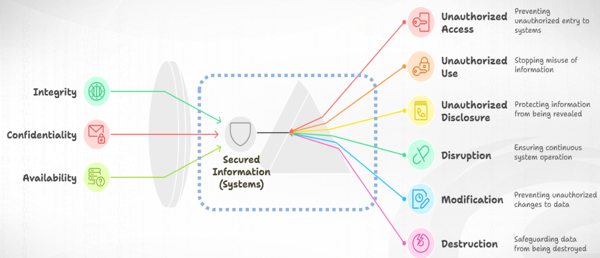
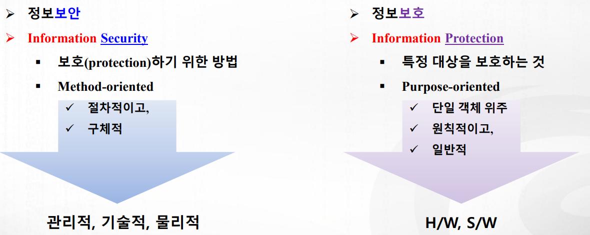
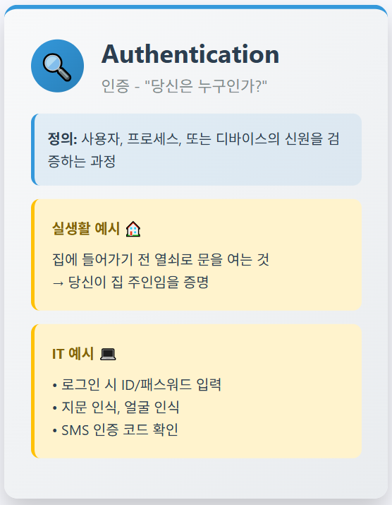
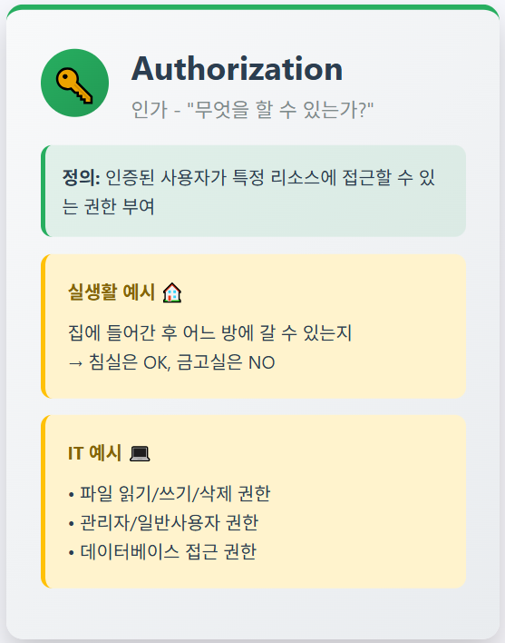
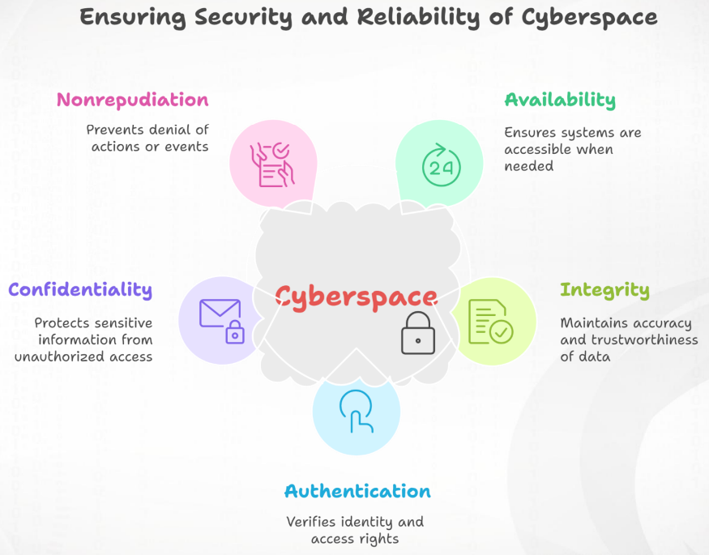
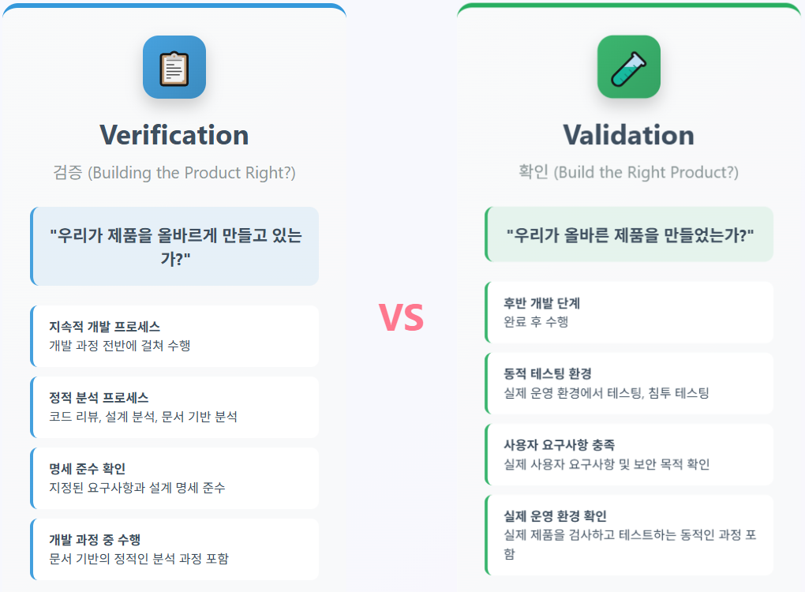
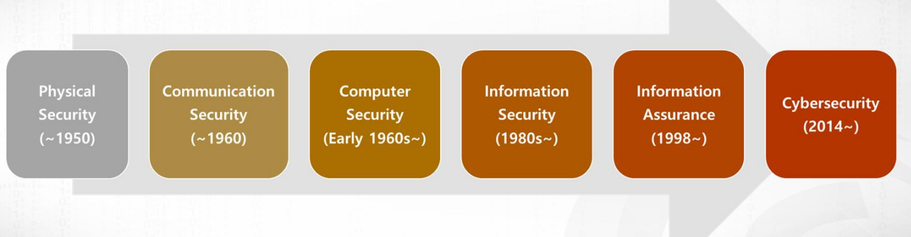
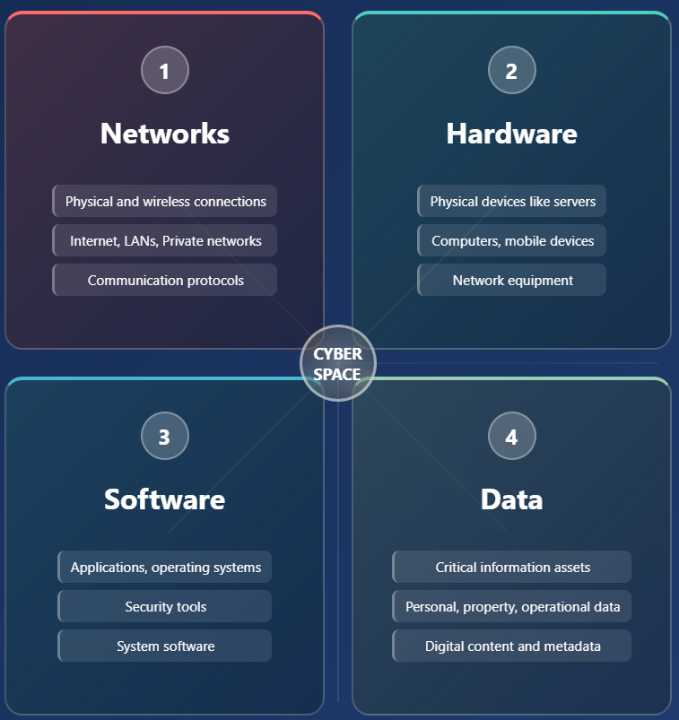

>🔒 사이버 보안 기초 수업 정리

'정보 보안'에서 정보는 어떻게 처리되는 건가?에 대해 Russell L. Ackoff가 제시한 지식 계층 모델인 **<span style="color: #008000">DIKW pyramid</span>**가 있다.



1. **Data**
* 관찰측정을 통해 수집된 단순한 사실의 나열
2. **Information**
* 의미 있는 데이터, 맥락과 목적을 가진 가공된 데이터
3. **Knowledge**
* 가치 있는 정보, HOW(어떻게)에 대한 이해
4. **Wisdom**
* 적절한 경험을 통한 미래 예측, WHY(왜)에 대한 통찰

## Informaion Security
---
📚**<span style="color: #008000">정보 보안(Informaion Security)</span>**:  정보와 정보시스템을 무단 접근(access), 사용(use), 공개(disclosure), 중단(disruption), 수정(modification), 또는 파괴(destruction)로부터 보호하여 **무결성(Integrity), 기밀성(Confidentiality), 가용성(Availability)**을 제공하는 것



📚**<span style="color: #008000">CIA triad</span>**: Informaion Security의 3대 원칙  
- **무결성(Integrity), 기밀성(Confidentiality), 가용성(Availability)**

{:.prompt-warning}
> 정보 '보안'과 '보호'는 다름! '보안'은 '보호'하기 위한 방법
>



### Authorization과 Authentication
---
📚**<span style="color: #008000">Authorization (인가/권한부여)</span>**: 시스템 개체가 시스템 리소스에 접근할 수 있는 권한이나 허가



📚**<span style="color: #008000">Authentication (인증)</span>**: 사용자, 프로세스, 또는 디바이스의 신원을 검증하는 과정



* **흐름도**
```
사용자 접근 요청 → Authentication(신원 확인) → Authorization(권한 검사)
```

## CIA triad
---
1. 🔒 **기밀성 (Confidentiality)**
* 정의: 조직이 데이터를 비밀로 또는 사적으로 유지하기 위한 노력
* 목적: 민감한 정보의 무단 공개 방지
* 정보 공개의 통제

2. ✅ **무결성 (Integrity)**
* **정의**: 데이터가 신뢰할 수 있고 변조로부터 자유로움을 보장
* 핵심 특징:
  * `Trustworthy` (신뢰성): 데이터를 믿을 수 있음
  * `Free from tampering` (변조 방지): 무단 수정 없음
  * `Authentic`, `Accurate`, `Reliable`: 진정성, 정확성, 신뢰성

3. 🔄 **가용성 (Availability)**
* **정의**: 필요할 때 정보와 서비스에 접근 가능함을 보장
* **중요 원칙**:
  * 시스템이 언제 어떻게 작동해야 하는지 정의
  * 권한 있는 사용자의 적시 접근 보장
  * 데이터 접근에 과도한 시간이 소요되지 않음

📚**<span style="color: #008000">CIA triad</span>**: 정보보안 시스템 개발의 기반이 되는 **공통 모델**로, 취약점을 찾고 해결책을 만드는 데 사용됨. 세 가지 기준을 모두 충족했을 때 조직의 보안 프로필이 더욱 강화되고 위협 사고에 대처할 수 있는 능력이 향상된다.

### CIA Triad 사용 사례
---
#### 1. Healthcare
* 환자의 전자의무기록(EMR, Electronic Medical Record)은 암호화를 적용하여 저장
* 의료진이 시스템에 로그인할 때는 다중 인증(MFA, OTP+지문 인식)을 사용해 무단 접근 차단
* 진료기록 변경은 변경자와 시간·변경 내역이 자동으로 가록되고 변경 내역을 추적할 수 있도록 관리
* 처방전 발행이나 의무기록 수정 시 디지털 서명을 붙여서 원본 여부 확인
* 의료 정보는 즉시 접근할 수 있도록 24/7 가용성을 위한 이중화
* 랜섬웨어 공격에 대비해 정기적 백업과 부하분산 시스템 적용

#### Finance
* 온라인 뱅킹 로그인 시 MFA(OTP + PIN)를 요구해 계좌 정보 탈취 방지
* 고객의 카드번호·계좌번호 등 중요 데이터는 암호화 저장
* 금융 거래 내역은 디지털 서명, 이중 서명을 통해 위변조 방지
* 송금 시 종단 간 암호화를 통해 네트워크 중간 탈취 차단
* 24/7 거래를 지원하기 위해 부하 분산과 자동 장애 조치(Failover) 환경 운영

#### Goverment
* 공무원은 스마트카드 + OTP + 지문 인식을 이용해 행정망 로그인
* 개인정보나 국가 기밀 문서 열람은 보안 등급별 권한 분리(Top Secret, Secret 등)
* 주민등록·세금·긴급 재난 문자 시스템은 24/7 운영을 보장해야 하므로 이중화 운영
* 재난·전시 상황에도 시스템이 작동하도록 비상 시스템을 같이 운영
* 전자정부 민원 시스템은 부하 분산 및 대국민 서비스 안정화 장치 적용

## Cybersecurity
---
📚**<span style="color: #008000">Cybersecurity</span>**: 정보통신시스템과 그 안에 포함된 **정보를 손상, 무단 사용이나 수정, 또는 악용으로부터 보호하고 방어하는 활동, 프로세스, 능력, 또는 상태**  

* 여기서 사이버보안이 보호하는 범위를 **<span style="color: #008000">Cyberspace</span>**라고 한다.
**<span style="color: #008000">Cyberspace의 구성요소</span>**:  
1. Computers
2. Electronic Communication Systems (네트워크)
3. Electronic Communication Services (이메일 등)
4. Wire Communication (광섬유)
5. Electronic Communication (무선 통신)
6. Information

#### Cybersecurity의 핵심 목표
**Prevention, Protection, and Restoration (예방, 보호, 복구)를 통해:**  
* 손상(Damage) 방지
* 무단 사용(Unauthorized Use) 차단
* 수정(Modification) 방지
* 악용(Exploitation) 차단
→ 최종적으로 `Confidentiality`, `Integrity`, `Availability`, `Authentication(인증)`, `Nonrepudiation(부인 방지)`을 보장

이 5가지를 **<span style="color: #008000">Cybersecurity의 5대 원칙(CIA+AN)</span>**이라 한다.



4. 🔑 **인증 (Authentication)**
* **정의**: 사용자, 디바이스, 시스템의 신원을 확인하는 원칙

5. 📋 **부인방지(Non-repudiation)**
* **정의**: 정보 처리 행위에 대한 부인을 방지하는 원칙
* 정보 송신자에게는 **전달 증명**을, 수신자에게는 **송신자 신원 증명**을 제공하여 양측 모두 정보 처리 사실을 **나중에 부인할 수 없도록** 보장하는 보안 원칙이다.
* **실생활 예시**
  * 이메일 전송 시 → **디지털 서명 + 수신 확인**을 통해 "내가 보낸 적 없다" 또는 "받은 적 없다"는 주장을 방지

### Verification vs Validation
---


1. **핵심**
* `Verification`: "Are we building the product right?" (과정 중심)
* `Validation`: "Are we building the right product?" (결과 중심)

2. **수행 시기**
* `Verification`: 개발 과정 전반 (Throughout development process)
* `Validation`: 개발 완료 후 (After completion)

3. **분석 방법**
* `Verification`: 정적 분석 (Static analysis)
* `Validation`: 동적 테스팅 (Dynamic testing)

4. **비용과 효과**
* `Verification`: 저비용, 조기 발견, 빠른 수정
* `Validation`: 고비용, 늦은 발견, 수정 어려움

5. **보안 관점에서의 차이**
* `Verification`: 보안 코딩 표준, 설계 검토
* `Validation`: 침투 테스트, 실제 위협 시뮬레이션

#### 사이버보안 용어의 변화


### Cyberspace의 4대 구성요소
---


* 이러한 구성 요소들을 이해하는 것은 **CIA 보안 원칙**을 구현하는 데 필수적이다. 
* 각 구성 요소에서 발생할 수 있는 위협을 파악하고 적절한 보안 통제를 적용함으로써 **기밀성(Confidentiality), 무결성(Integrity), 가용성(Availability)**을 보장할 수 있다.