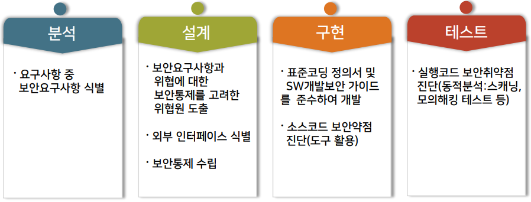
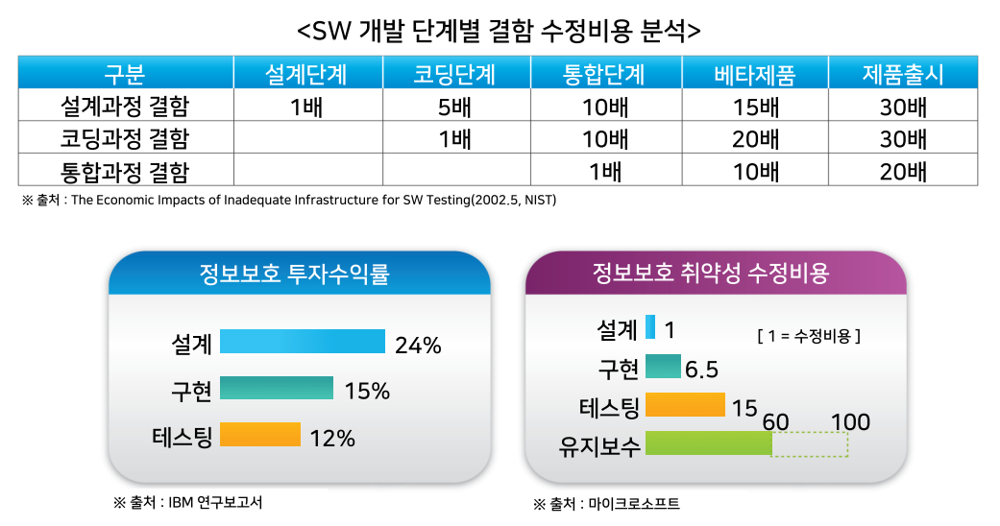
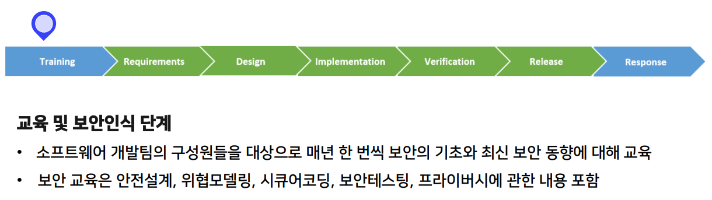
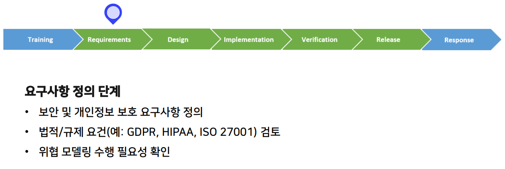
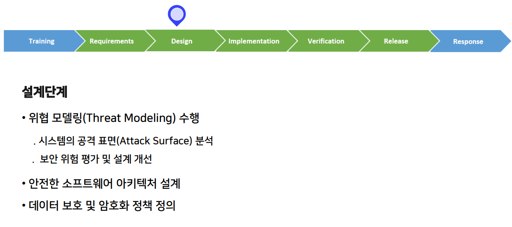
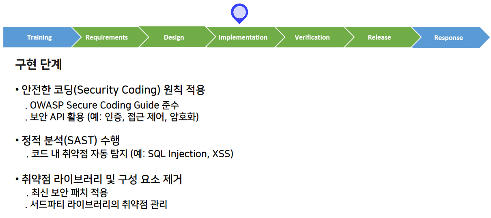
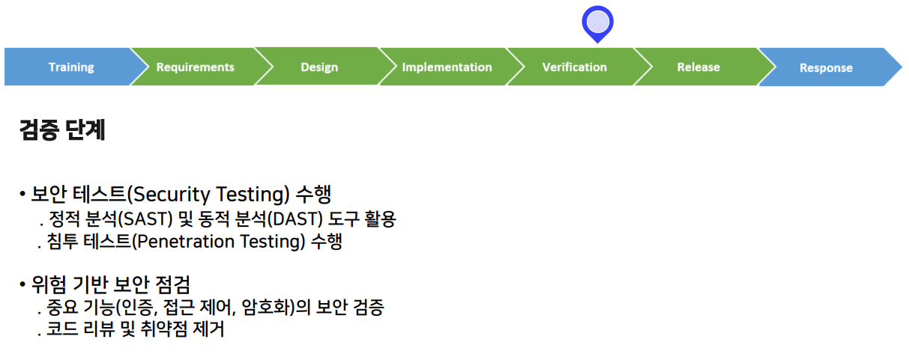
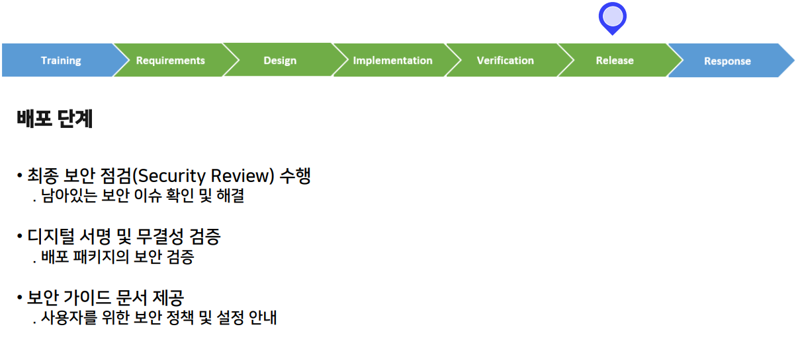
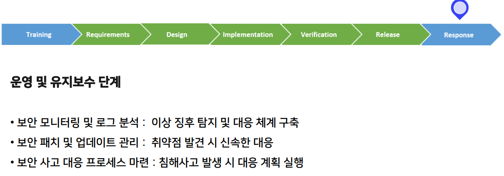

>🔒 시큐어 코딩 수업 정리

## SW개발보안 방법론
📚**SW개발보안 방법론**: 소프트웨어 개발 과정에서 보안성을 강화하기 위해 적용하는 접근 방식
* **소프트웨어 개발 생명주기(SDLC: Software Development Life Cycle)** 전반에 걸쳐 보안 요구사항을 반영하고, 취약점을 예방하는 것을 목표로 함.

💡**주요 개념**:  
1. **보안 내재화**: 개발 초기부터 보안을 고려하여 설계
2. **취약점 최소화**: 코드 및 시스템의 보안 결함을 줄이는 방식 적용
3. **지속적인 보안 점검**: 주기적인 테스트 및 검증 수행

그럼 SW개발보안은 뭘까?

### SW 개발보안
📚**SW 개발보안**: 안전한 SW 개발을 위해 소스코드 등에 존재할 수 있는 **잠재적인 보안 약점을 제거**하고, 보안을 고려하여 기능을 설계º구현 하는 등 **SW 개발 과정에서 실행되는 일련의 보안활동**

1. **분석**
* 시스템 기능 요구사항, 사용자 요구사항
* 자산 식별(개인정보, 기능, 계정 등)
* 보안 목표 설정(기밀성, 무결성, 가용성)
* 법적/정책 요건 반영
* → **보안 요구사항은 실제 개발 명세로 구체화해야함**

2. **설계**
* 위협 모델링 / 위협원 도출
  * 시스템 구조, 데이터 흐름 기반 위협 식별
* 외부 인터페이스 식별
  * API, 인증방식, 송수신 데이터, 입력 검증 지점 명확화
* 보안통제 수집
  * 인증(MFA), 인가(RBAC), 암호화, 로그, 오류 처리, 임력 검증 설계
* → **구현 기준이 되는 보안 설계 수집**

3. **구현**
* 표준코딩 가이드 준수
  * 입력 검증, 출력 인코딩, 암호화 처리 등
* 소스코드 보안 약점 진단
  * 정적 분석 도구 활용 (컴파일 전 분석)

4. **테스트**
* **실행 가능한 코드에 대한 실질적인 보안 점검 수행**
* 보안 취약점 진단(동적 분석)
  * 스캐닝, 모의해킹, 퍼징 등

---

### SW개발보안 적용 시 비용 효과

### SW개발보안 방법론 적용의 중요성
1. 해킹, 데이터 유출 등 보안 사고 예방
2. 법적 규제(개인정보 보호법, GDPR, ISO 27001 등) 준수
3. 개발 비용 절감 (초기 단계에서 보안 문제 해결 시 비용 절감 효과)
4. 신뢰할 수 있는 소프트웨어 제공으로 기업 이미지 및 서비스 경쟁력 강화

---

## MS-SDL
📚**MS-SDL(Microsoft Security Development Lifecycle)**: Microsoft에서 개발한 소프트웨어 보안 개발 방법론
* 소프트웨어 개발 생명주기(SDLC) 전반에 걸쳐 보안을 내재화하는 것을 목표로 함
* 보안 취약점 최소화, 보안 사고 예방
* 강력한 보안 정책을 소프트웨어 개발 과정에 적용하는 방법론

✅**주요 목표**:  
1. **보안 취약점 예방**: 개발 초기부터 보안 요구사항을 반영하여 보안 문제를 사전에 차단
2. **위험 감소**: 보안 테스트 및 코드 검토를 통해 공격에 대한 노출을 최소화
3. **법규 및 규제 준수**: 개인정보 보호, 보안 표준(ISO/IEC 27001, GDPR 등) 준수
4. **비용 절감**: 개발 후반이 아닌 초기에 보안 문제를 해결하여 유지보수 비용 절감

### MS-SDL 7단계
---

