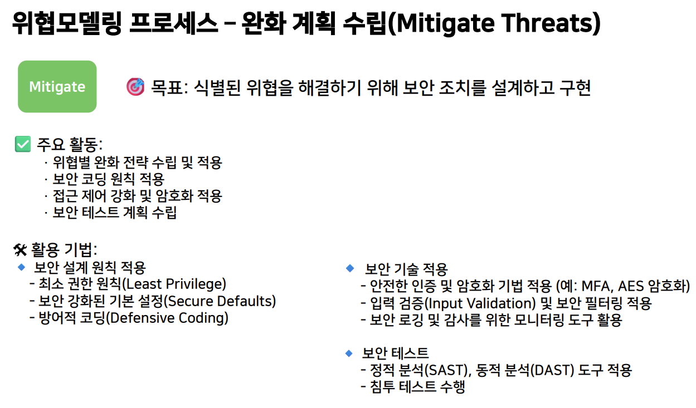

>🔒 시큐어 코딩 수업 정리

## 위협모델링(Threat Modeling) 개요
---
📚**위협 모델링(Threat Modeling)**: 소프트웨어, 시스템 또는 네트워크의 **보안 취약점을 사전에 식별**하고, 이를 평가하여 적절한 보안 대책을 수립하는 과정

→ 설계 단계부터 보안을 고려하고, 실질적인 공격 시나리오를 예측하여 사전 대응할 수 있는 강력한 방법론

💡**주요 개념**:  
* **사전 예방적 보안 접근법**: 설계 단계에서 보안 위협을 예측하고 방어책을 마련하는 방식
* **공격자 관점의 분석**: 공격자가 시스템을 어떻게 악용할 수 있는지를 분석하여, 보안 취약점을 최소화
* **개발 프로세스 내 통합**: 보안이 개발 과정(SDLC)에서 자연스럽게 반영될 수 있도록 구조화된 방법론 적용

### 위협모델링 핵심 목표
---
1. **시스템 이해**: 보호해야 할 자산(데이터, 기능 등)과 이를 둘러싼 환경을 분석
2. **위협 식별**: 해커나 내부 공격자가 악용할 수 있는 취약점을 분석
3. **위험 평가**: 위협의 심각도와 발생 가능성을 평가하여 대응 우선순위를 설정
4. **보안 조치 적용**: 위협을 완화할 수 있는 설계 및 보안 제어(암호화, 접근제어 등)적용

### 위협모델링이 중요한 4가지 이유
---
1. **사전 보안 강화**
   * 개발 초기에 보안을 고려하여 **비용 절감** 및 **보안성 향상**
2. **보안 사고 예방**
   * 공격자의 시작에서 보안 취약점을 찾아 **사고를 미리 방지**
3. **법규 및 표준 준수**
   * 금융, 의료 등 특정 산업에서는 보안 규정을 지켜야 함
4. **DevSecOps 연계**
   * 보안이 개발 및 운영 과정에서 지속적으로 관리될 수 있도록 지원

### 위협 모델링 참가자 및 역할
---

### 위협 모델링 흐름(3단계)
---
#### 1단계: 워크숍 진행(Threat Modeling Workshops)
* 개발자, 보안 전문가, 아키텍트 등이 함께 모여 위협 모델링 세션 진행
* 시스템 다이어그램(DFD, Sequence Diagram 등)을 그리며 위협 분석

#### 2단계: 위협 분석 및 평가
* STRIDE, DREAD, PASTA 등의 프레임워크를 사용하여 위협 분석
* 각 위협의 심각도를 평가하고 대응 우선순위 결정
  * **심각도(Severity)**: 이 공격이 성공하면 얼마나 큰 피해가 발생하나?

#### 3단계: 보안 설계 개선 및 구현
* 개발팀이 보안 요구사항을 코드에 반영
* 운영팀이 보안 모니터링 및 대응 체계 구축

### 위협 모델링 프레임워크
---
프레임워크마다 적용 방식이 다르며, 특정 환경과 목적에 따라 적절한 프레임워크를 선택해야 함

#### STRIDE
📚**STRIDE**: Microsoft에서 개발한 가장 널리 사용되는 위협 모델링 기법으로, 6가지 주요 보안 위협 유형을 체계적으로 분류

#### DREAD
📚**DREAD**: DREAD는 각 위협을 5가지 기준으로 평가하여 0~10점을 부여하고, 총점(최대 50점)으로 위협의 심각도를 수치화

> DREAD 세부 점수 기준

> DREAD 총점 기준 위험 수준
>

## 위협모델링 프로세스
---

