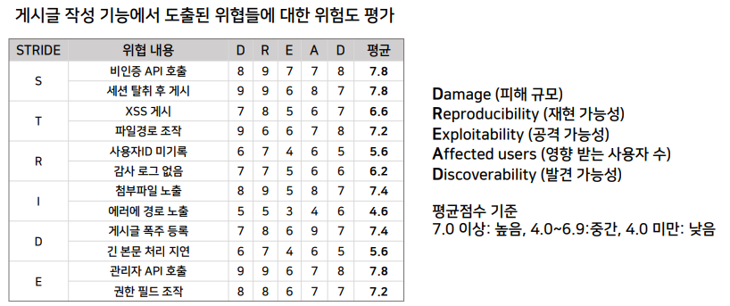

>🔒 시큐어 코딩 수업 정리

## 위협모델링 도구 활용
---
📚**위협 모델링 도구**: 자동화, 시각화, 협업 기능, 보안 프레임워크 지원 여부 등을 고려하여 선택

✅**도구를 선정할 때 고려해야 할 요소**:  
* **자동화 지원 여부**: 위협 모델을 자동으로 생성하고, 위협을 분석할 수 있는 기능
* **UI 및 사용 편의성**: 직관적인 인터페이스와 시각화 기능 제공
* **보안 프레임워크 지원**: `STRIDE`, `PASTA`, `CVSS` 등과 연게 가능 여부
* **협업 기능**: 여러 팀이 동시에 작업할 수 있는 기능 (`DevSecOps` 환경 지원 여부)
* **무료/유료 여부**: 비용 및 라이선스 정책

### 위협모델링 도구들

### 도구 선정 가이드
🟢**무료 도구가 필요하다면?**  
* **Microsoft Threat Modeling Tool** (MS-SDL 기반, STRIDE 분석)
* **OWASP Threat Dragon** (웹 기반 협업 기능)
* **CAIRIS** (UX 및 보안 요구사항 통합 가능)

🟠**DevSecOps 파이프라인에서 사용하려면?**  
* **ThreatModeler** (CI/CD 연계, 클라우드 보안 지원)
* **IriusRisk** (자동 위협 모델링 및 보안 요구사항 생성)
* **OWASP Threat Dragon** (GitHub 연동 가능)

🔴**네트워크 및 인프로 보안을 강화하려면?**  
* **SecuriCAD** (공격 시뮬레이션 및 네트워크 보안 평가)
* **ThreatModeler** (AWS, Azure 등 클라우드 환경 지원)

## 위협모델링 실무 적용 실습
---
> 서비스 시스템 전체가 아닌 웹 게시판 기능 일부를 대상으로 하여, 위협모델링 과정을 단계적으로 실습

* 대상 기능: 게시글 작성, 댓글 작성

✅**위협모델링 분석 절차**:  
1. 시스템 이해 및 범위 정의
2. `STRIDE` 위협 도출
3. `DREAD` 위험도 평가
4. 위협 완화 및 대응 전략 수집
5. 보안 검증 및 지속적인 개선

### 1단계: 시스템 이해 및 범위 정의
---
: 게시글 작성 기능으로만 범위를 정하고 이에 대한 시나리오와 관련 구성 요소를 도출한 후 `DFD` 작성

#### DFD 그리기

> 게시글 작성 기능에 대한 DFD

### 2단계: STRIDE 위협 도출
---

> 게시글 작성 기능에 대한 STRIDE 위협 도출

### 3단계: DREAD 위험도 평가
---

> 게시글 작성 기능에서 도출된 위협들에 대한 평가

* 정확한 점수보다는 **왜 위험한지에 대한 근거가 중요함**

### 4단계: 위협 완화 및 대응 전략 수립
---

> 도출된 위협 내용들을 완화할 수 있는 대응 방안 마련

### 5단계: 보안 검증 및 지속적인 개선
---
* 앞 4단계 과정을 통해 수립된 대응 전략을 실제로 수행, 사후 테스트를 통해 검증
* 변경사항이 발생하면 위협모델링 과정이 다시 반복되어야 함
* 로그 및 모니터링 시스템을 구축하여 지속적으로 감시

> 개별 실습 추가 예정