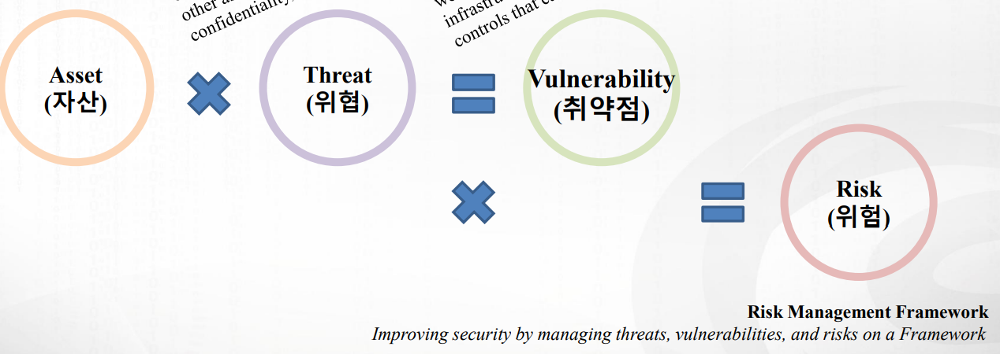
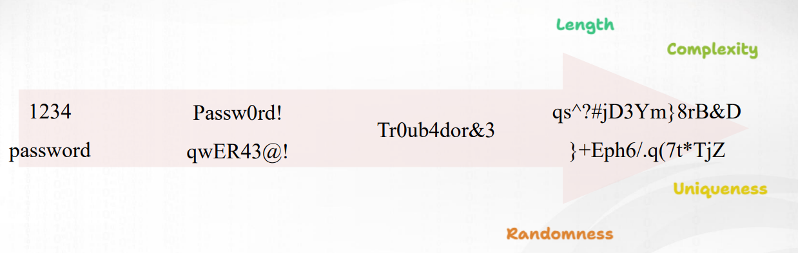

>🔒 사이버 보안 기초 수업 정리

## Asset, Theatsm, Vulnerability, Risk
---
#### 1. Security Asset (보안 자산)
📚**Security Asset**: 회사나 조직이 보호해야 하는 모든 '가치있는 것들'

두 가지 종류가 있다:  
* **유형 자산(Tangible Assets)**: 손으로 만질 수 있는 물리적인 것들
  * 하드웨어
  * 펌웨어
  * 네트워크 장비
* **무형 자산(Intangible Assets)**: 손으로 만질 수 없지만 매우 중요한 것들
  * 데이터
  * 소프트웨어
  * 지적재산권
  * 회사의 평판

#### 2. Security Threat  (보안 위협)
📚**Security Threat  (보안 위협)**: 우리 자산을 해칠 수 있는 '나쁜 가능성'

이 가능성들은 CIA 3요소를 공격한다:  
* `Confidentiality` (기밀성): 허가받지 않은 사람이 정보를 보는 것
* `Integrity` (무결성): 정보가 변조되거나 손상되는 것
* `Availability` (가용성): 필요할 때 시스템을 사용할 수 없게 되는 것

#### 3. Security Vulnerability (보안 취약점)
📚**Security Vulnerability (보안 취약점)**: 시스템의 '약한 부분', 위협이 터질 수 있는 '구멍'

**예시들**:  
* 패치되지 않은 소프트웨어의 버그
* 약한 비밀번호 정책
* 불안전한 네트워크 설정

#### 4. Security Risk (보안 위험)
📚**Risk Management Framework**: 보안 향상을 위해 실제로 피해가 발생할 '확률과 영향'을 계산한 것

> `R = A x T X V`

→ 위험(R)은 3요소(`Asset`, `Threat`, `Vulnerability`)가 모두 존재할 때 발생한다.

{:.prompt-tip}
> 위험을 줄이기 위해서는 3요소 중 하나라도 줄이기 위해 노력해야한다.
>

## Attacks
---
### Passive Attacks(수동 공격)
---
📚**Passive Attacks(수동 공격)**: 공격자가 **몰래 엿듣기**만 하고, **시스템을 직접 변경하지 않는** 공격 

✅**특징**:  
* 데이터를 **관찰만** 하고 수정하지 않음
* 피해자가 공격당한 걸 모름 (탐지하기 어려움)
* **은밀**하게(Stealth) **정보를 수집**하는 것이 목표

#### 수동 공격 3가지 주요 유형
1. **Eavesdropping**: 네트워크 트래픽을 **중간에서 가로채서** 통신 내용을 엿듣는 공격

2. **Monitoring**: 네트워크 활동을 지속적으로 관찰하여 취약점이나 패턴을 찾아내는 공격

3. **Data Theft**: 민감한 정보(패스워드, 개인정보, 기밀문서 등)를 몰래 복사해서 훔쳐가는 공격

💡**예시**:
* **Traffic Analysis (트래픽 분석)**
  * 통신 빈도와 크기를 분석해서 누가 누구와 얼마나 자주 통신하는지 파악
* **Keylogging (키로깅)**
  * 사용자가 키보드로 입력하는 모든 내용을 몰래 기록하여 패스워드 등을 훔침

### Active Attacks (능동 공격)
---
📚**Active Attacks (능동 공격)**: 공격자가 직접적으로 시스템을 변경, 파괴, 또는 방해하는 공격

✅**특징**:  
* 시스템에 **직접 개입**하여 변화를 일으킴
* 피해자가 공격을 **쉽게 감지**할 수 있음
* **파괴**나 **통제**가 주목적 (단순 정보 수집이 아님)

#### 능동 공격 3가지 주요 유형
1. **Modification (변조 공격)**: 공격자가 데이터나 시스템 설정을 **직접 변경**하여 손상을 입히는 공격 → 원본 데이터의 **무결성(`Integrity`)**을 파괴

2. **Disruption (방해)**: 정당한 사용자들이 시스템을 **정상적으로 사용할 수 없게** 만드는 공격 → 시스템의 **가용성(`Availability`)**을 파괴

3. **Unauthorized Access (무단 접근)**: 취약점을 악용하여 **권한 없이 시스템을 통제**하고 민감한 정보에 접근하는 공격 → **모든 CIA 요소를 위협**할 수 있는 가장 위험한 공격

💡**예시**:
* **Malware (악성코드)**
  * 동작 방식: 시스템에 감염되어 파일 손상, 정보 유출, 시스템 장악
  * 종류: 바이러스, 웜(worms), 트로이 목마(Trojans), 랜섬웨어
* **DDoS (분산 서비스 거부)**
  * 동작 방식: 수많은 컴퓨터로 동시에 트래픽을 보내 서버 마비
  * DDoS = Distributed Denial of Service
* **Spoofing (스푸핑)**
  * 동작 방식: 신뢰받는 사용자나 시스템으로 가장하여 속임
  * Spoofing = 신원 위장

## Relativeness of Security
---
현실적으로 보안 시스템들이 100% 안전하다고 보장할 수 없다. 그래서 보안 단계 중 첫 번째 방어선은 패스워드이다. 
아무리 고급 보안 시스템이 있어도 **패스워드**가 뚫리면 모든 것이 무너지기 때문!!

> 패스워드 강도 시각화

### 강력한 패스워드의 4대 원칙
---
1. **Complexity**
   * 다양한 종류의 문자를 섞어서 사용하여 예측하기 어렵게 만듦

2. **Length**
   * 최소 12-16자 이상의 길이를 사용하여 **브루트 포스 공격**을 방어

3. **Uniqueness**
   * 모든 계정마다 다른 패스워드를 사용하여 **연쇄 침해 방지**

4. **Randomness**
   * 예측 가능한 패턴을 피하고 완전히 랜덤한 조합을 사용

* 패스워드 선택 및 이용안내서 존재: **KISA**