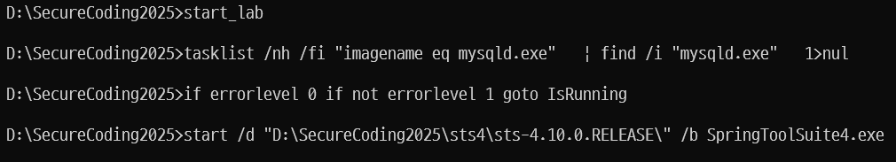

>🔒 시큐어 코딩 수업 정리

## 실습환경 구축
---


* 웹 서비스 직접 연결이 아니라 프록시 서버를 거쳐 연결하면 간편하게 통신 내용 조작을 통한 취약점 공격, 중요 정보를 가로챌 수 있음.

수업에서는 C드라이브에 압축 해제를 권장하여 이를 바탕으로 실습을 진행
{:.prompt-warning}
> 하지만 용량 부족으로 인한 D드라이브 환경 설정 정리
>

#### 1. 시스템 변수 3가지 추가
```
변수 이름: JAVA_HOME
변수 값: D:\SecureCoding2025\download\jdk-15.0.2\

변수 이름: MAVEN_HOME  
변수 값: D:\SecureCoding2025\download\apache-maven-3.8.1\

변수 이름: MYSQL_HOME
변수 값: D:\SecureCoding2025\download\mariadb-10.5.10-winx64\
```

#### 2. 시스템 변수의 Path 변수에 3가지 경로 추가

```
%JAVA_HOME%\bin\
%MAVEN_HOME%\bin\
%MYSQL_HOME%\bin\
```

그 뒤에 위 경로 3가지를 맨 위로 올려야 함

#### 3. 환경변수 정상 작동 확인
* `cmd`에서 다음 명령어를 실행해서 확인
  
```
java -version
mvn -version  
mysql --version
```


#### 4. 사용하고 있는 포트 확인
* 우리가 사용하려는 포트를 확보하기 위해 현재 프로세스의 포트들 확인
* `netstat –ano | more`

#### 5. start_lab.bat 실행
* LAB 실습에 사용할 데이터베이스(MariaDB)와 웹 서비스 개발환경(Spring Tool Suite 4) 실행
* cmd 창에서 D:\SecureCoding2025로 이동하여 준비되어 있는 시작 배치 파일 실행

❌**문제 1**: DB가 실행되지 않음



* mysql 에러 로그 확인

```
D:\SecureCoding2025\download\mariadb-10.5.10-winx64\bin>mysqld.exe --console
2025-10-03 18:06:33 0 [Note] mysqld.exe (mysqld 10.5.10-MariaDB) starting as process 21088 ...
2025-10-03 18:06:33 0 [Warning] Can't create test file C:\SecureCoding2025\download\mariadb-10.5.10-winx64\data\DESKTOP-3T3RRQR.lower-test
mysqld.exe: Can't change dir to 'C:\SecureCoding2025\download\mariadb-10.5.10-winx64\data\' (Errcode: 2 "No such file or directory")
2025-10-03 18:06:33 0 [ERROR] Aborting
```

❌**문제점**: **MariaDB가 C드라이브를 찾고 있는데, 실제로는 D에 있기 때문!!**

{:.prompt-tip}
> `MariaDB` 폴더에서 `my.ini` 설정 파일 수정
>

**C**를 **D**로 수정

#### 6. Update Project 실행
* SecureCoding 프로젝트의 의존성과 설정을 최신 상태로 동기화  
 프로젝트명에서 마우스 오른쪽 클릭 > Maven > Update Project 선택
* Update Maven 창에서 OK 선택

#### 7. Run As > Spring Boot App 실행
* 프로젝트의 업데이트가 모두 완료되면 서버 실행  
 프로젝트명에서 마우스 오른쪽 클릭 > Run As > Spring boot App 선택
* Select Java Application에서 `SecureCodingLabTestApplication` 확인 후 OK 선택

* 콘솔창에 `Tomcat started on port(s): 8000` 이 보이면 정상

{:.prompt-warning}
> 8000 포트가 이미 바인딩 되어있다고 뜨면서 실행 실패!!
>

무슨 이유에서인지는 모르겠지만 Tomcat이 8000 포트로 초기화를 시작해서 바인딩을 시도하면 거의 동시에 다른 인스턴스도 같은 8000포트로 바인딩을 시도하는 듯

`netstat -ano | findstr :8000` 을 실행해도 아무 결과도 나오지 않음
→ 포트가 비어있음 ✅, 하지만 spring boot app은 실행 실패

{:.prompt-tip}
> application.properties 파일에서 `server.port=8080`를 8000 으로 변경!
>


> 8080으로 실행이 된 모습


> 접속 완료

#### 8. BurpSuite 패키지 실행 후 설정 수정
* 프록시 서버의 인터페이스 설정 수정
  * 상단 메뉴에서 Proxy > Options 선택
  * Proxy Listener 목록에서 127.0.0.1:8080 인터페이스 체크 및 선택

* 프록시 서버의 Bind Port 수정
  * Edit proxy listener 창에서 ‘Bind to port’ 항목을 `8081`로 변경


#### 9. 프록시 설정
실습 pdf에서는 파이어폭스를 권장하며 알려주지만 설치하기 귀찮은 관계로.... 크롬에서 설정을 했다.

1. **chrome 설정에서 프록시 설정을 누르면 시스템 네트워크 설정이 열림**


2. **프록시 서버 사용 클릭 후 주소와 포트 설정**
  * 주소: `127.0.0.1`
  * 포트: `8081`

Firefox는 `network.proxy.allow_hijacking_localhost`를 설정해줘야 하지만 **Chrome**은 따로 필요 없음!

3. **Chrome에 BurpSuite CA 인증서 설치**
  1. BurpSuite에서 Proxy → Intercept is on 상태로 변경
  2. Chrome에서 http://burpsuite 접속 (프록시 활성화 상태에서)
  3. "CA Certificate" 클릭하여 인증서 다운로드
  4. Chrome 설정 → 개인정보 및 보안 → 보안 → 인증서 관리
  5. "신뢰할 수 있는 루트 인증 기관" 탭으로 이동
  6. 다운로드한 BurpSuite 인증서 가져오기

## 웹과 HTTP 구조 이해
---

> Web 구조

* **Presentation Layer (표현 계층)**: 사용자가 보는 화면 (UI)
* **Business Layer (비즈니스 계층)**: 실제 업무 로직을 처리
* **Data Layer (데이터 계층)**: 데이터베이스와 통신

마치 회사 조직처럼, 각 부서가 자기 역할만 하면 전체가 효율적으로 돌아간다. 프론트엔드 개발자는 UI만, 백엔드 개발자는 비즈니스 로직만 신경쓰면 된다.


### HTTP
---
📚**<span style="color: #008000">HTTP</span>**: 웹에서 HTML 문서나 리소스를 주고받을 수 있게 해주는 프로토콜

* **요청(Request)/응답(Response) 구조**: 클라이언트가 요청하면 서버가 응답
* **무상태(Stateless)**: 서버는 이전 요청을 기억하지 않음 (쿠키/세션으로 해결)


### BurpSuite로 HTTP 구조 보기
---
* 수동 웹 프록시로 BurpSuite를 경유하도록 설정한 경우 
  * `Proxy > HTTP history` 에서 `HTTP Request/Response` 내용 조회 가능


> HTTP Request message 구조
* Server는 **<span style="color: #008000">Cookie</span>**를 통해 유저의 세션을 유지한다.


> HTTP request method


> HTTP Response message 구조


## 데이터 인코딩
---
📚**<span style="color: #008000">데이터 인코딩</span>**: 데이터를 특정 규칙에 따라 다른 형식으로 변환하는 과정

✅**인코딩이 필요한 이유**:  
1. **데이터 전송 (Data Integrity)**: 다양한 환경(서버, 클라이언트, 데이터베이스)에서 데이터를 올바르게 해석하고 저장하기 위해 필요
2. **보안 강화 (Security)**: 입력 값을 안전하게 처리하여 XSS(Cross-Site Scripting), HTML 인젝션 등의 보안 취약점을 예방
3. **호환성 (Compatibility)**: 서로 다른 시스템 간에 데이터 포맷의 차이로 인한 오류를 방지

### 인코딩 vs 암호화
---
| 구분       | 인코딩              | 암호화                     |
| ---------- | ------------------- | -------------------------- |
| **목적**   | 형식 변환           | 보안                       |
| **복원**   | 누구나 가능(디코딩) | 복호화 키 필요             |
| **공개성** | 알고리즘 공개       | 알고리즘 공개, 키는 비공개 |

### BASE64 인코딩
---
📚**<span style="color: #008000">BASE64 인코딩</span>**: **이진(Binary) 데이터를 텍스트 형식으로 변환**하는 인코딩 방식

✅**특징**:  
* 데이터를 6비트 단위로 분할
* 총 64개의 문자 사용 (`A-Z`, `a-z`, `0-9`, `+`, `/`)
* 6비트씩 처리하므로 **부족한 비트는 0으로 패딩**
* 패딩된 부분은 `=` 기호로 표현

💡**BASE64를 사용하는 이유**:  
* email, JSON, XML 등 텍스트 전송 환경에서 안전하게 사용 가능
* 네트워크나 시스템간 전송 시 발생할 수 있는 데이터 손상 및 인코딩 문제를 방지


> 인코딩 사례

### URL 인코딩
---
📚**<span style="color: #008000">URL 인코딩</span>**: URL에서 사용할 수 없거나 특별한 의미를 가진 문자들을 `%` 기호 + `ASCII 16진수 코드`로 변환하는 방식


> 인코딩이 필요한 문자


> URL 인코딩 예시

## BurpSuite를 통해 BASE64 디코딩 실습
---
1. 로그인 홈페이지 `http://httpbin.org/basic-auth/user/passwd` 접속 후 BurpSuite Proxy에서  `[Intercept is off]` 버튼을 눌러
`[Intercept is on]` 으로 전환

2. 사용자 이름 및 암호에 아무 값이나 입력한 후 `[확인]` 버튼
3. BurpSuite Intercept 화면에 Request 내용이 보임
HTTP Request의 Header 내용 중 `Authorization` 내용에
BASE64 인코딩된 내용이 들어있음


4. **Decode 메뉴에서 디코딩**
* 복사한 BASE64문자열을 입력창에 붙여 넣고 우측 'Decode as …' 에서 `Base64` 선택
* 하단에 디코딩된 문자열이 출력됨


## BurpSuite를 통해 URL 디코딩 실습
---
1. **입력창에 사이트 주소 붙여 넣고 인코딩**
* 앞서 접속했던 사이트 주소를 입력창에 넣고 'Encode as …' 선택
종류 중 'URL' 선택
* 하단에 인코딩된 문자열이 출력됨


2. 인코딩 된 문자열로 다시 URL 디코딩

