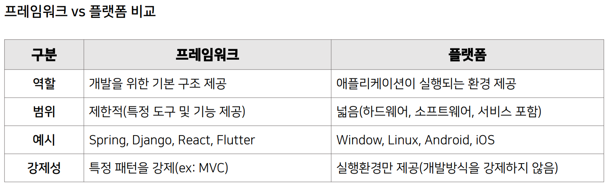
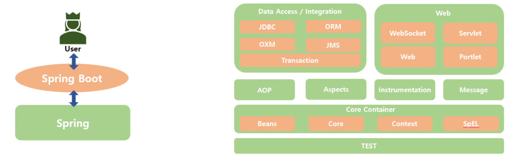
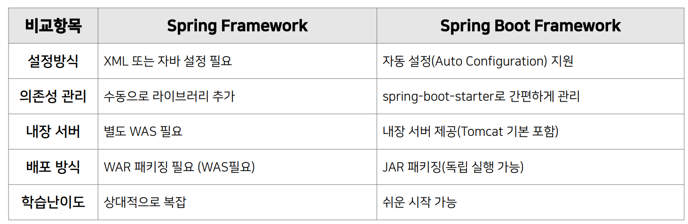

>🔒 시큐어 코딩 수업 정리

## Framework와 Platform
---
### Framework
---
📚**Framework**: 소프트웨어 개발을 위한 구조(틀)와 규칙을 제공하는 재사용 가능한 코드 라이브러리

✅**특징**:  
1. **개발에 필요한 기본 구조 제공**
  * 코드 아키텍처
  * 디자인 패턴
  * 표준화된 개발 방식

2. **반복적인 작업을 자동화**
  * 인증/권한 관리
  * 데이터베이스 연결
  * 로깅, 에러 처리

3. **특정한 개발방식(패턴)을 강제**
  * 예: MVC 패턴 (Model-View-Controller)
  * 개발자는 정해진 규칙을 따라야 함

4. **개발자가 핵심 로직에 집중 가능**
  * 반복적인 코드 작성 불필요
  * 비즈니스 로직 개발에 집중

**주요 프레임워크 예시**
* **Spring(Java)**: 엔터프라이즈급 웹 애플리케이션 개발 프레임워크
* **Django(Python)**: MVC 패턴기반의 파이썬 웹 프레임워크
* **React(Javascript)**: UI 컴포넌트기반의 웹 프론트엔드 개발 프레임워크

### Platform
---
📚****: 애플리케이션이 실행될 수 있는 환경. 하드웨어와 소프트웨어의 조합을 포함하며, 개발자나 사용자가 서비스를 만들고 운영할 수 있도록 지원

✅**특징**:  
1. **애플리케이션이 실행될 기반**
  * 운영체제 (Windows, Linux, macOS)
  * 하드웨어 환경

2. **개발자에게 API 및 서비스 제공**
  * AWS, Azure, GCP: 클라우드 서비스
  * Android, iOS: 모바일 플랫폼

3. **하드웨어 또는 소프트웨어 기반의 서비스 생태계 형성**
  * 앱 스토어, 개발 도구, 배포 환경

#### 플랫폼 종류
* **운영체제 플랫폼**: 애플리케이션 실행 환경 제공
  * `Windows`, `macOS`, `Linux`

* **클라우드 플랫폼**: 클라우드 기반 컴퓨팅 및 서비스 제공
  * `AWS (Amazon Web Services)`
  * `Azure (Microsoft)`
  * `GCP (Google Cloud Platform)`

* **모바일 플랫폼**: 모바일 앱 개발 및 실행 환경
  * `Android`, `iOS`

* **게임 엔진 플랫폼**: 게임 개발 및 실행 환경
  * `Unity`, `Unreal Engine`

## Spring Boot 프레임워크
---
📚**Spring Boot**: 자바기반의 웹 애플리케이션을 만들 수 있는 Spring 프레임워크를 기반으로 개발 프레임워크

* **설정(Configuration) 없이 빠르게 Spring 기반 애플리케이션을 개발** 할 수 있도록 지원
* **내장 웹서버 제공**, **자동설정(Auto Configuration)**, **의존성 관리 등**의 기능을 통해
개발자의 생산성을 극대화 함

> Spring vs Spring Boot