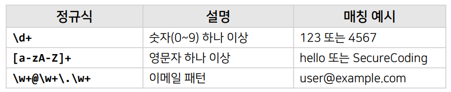
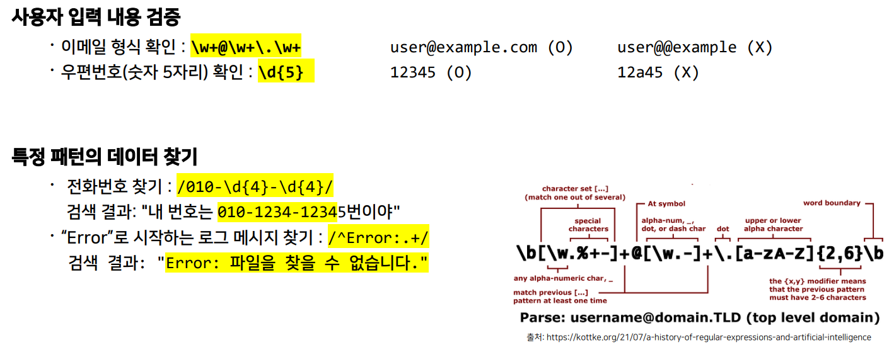
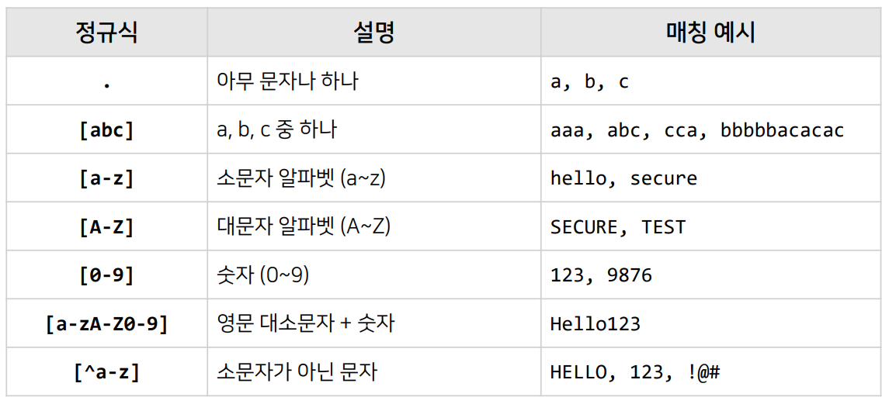
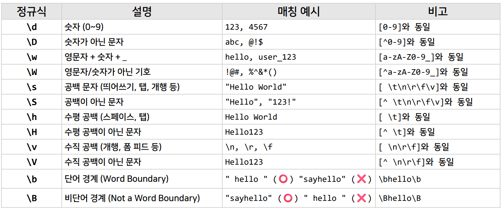
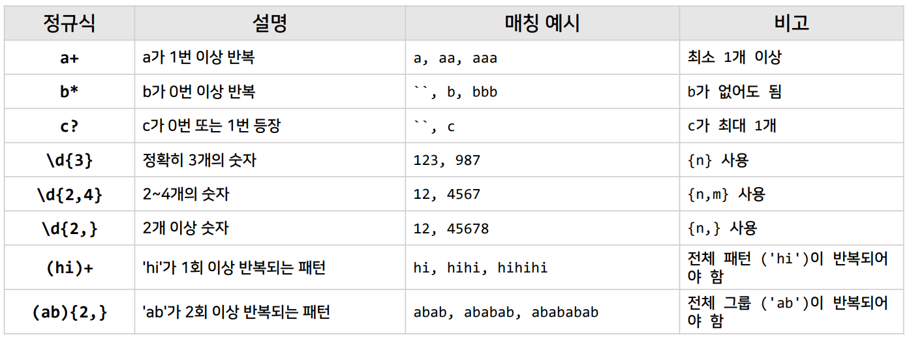
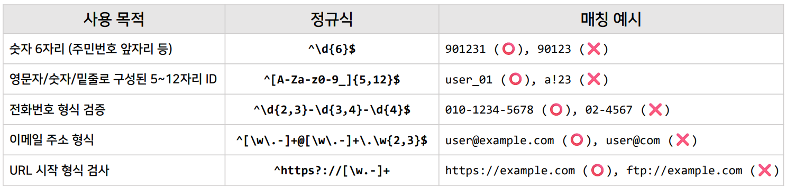
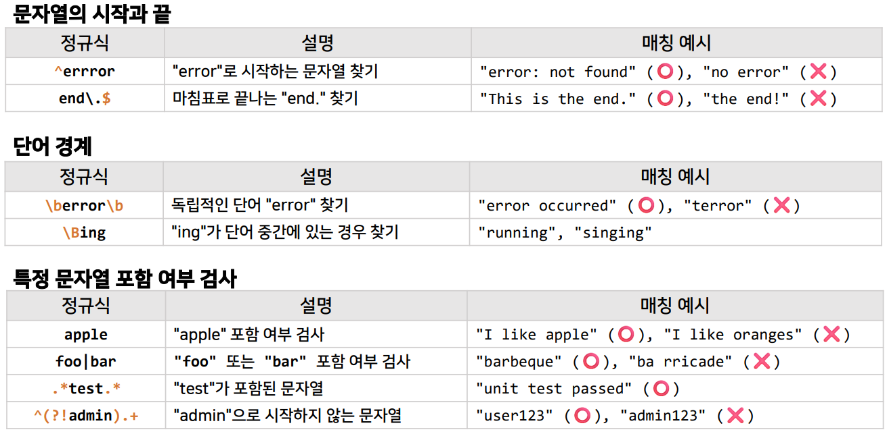
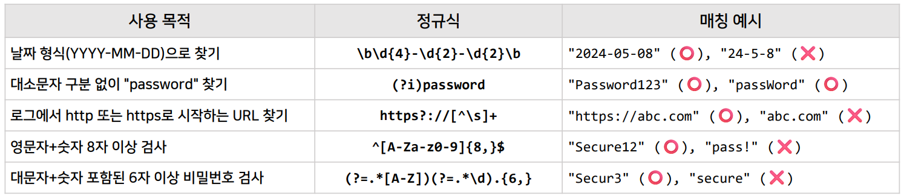
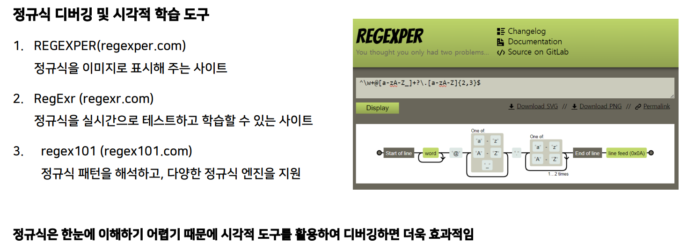

>🔒 시큐어 코딩 수업 정리

## 정규식이란?
---
📚**정규식(Regular Expression, Regex)**: 텍스트 패턴을 정의하는 표현식으로, 특정 문자열을 검색, 검사, 치환하는 데 사용

* 다양한 프로그래밍 언어에서 지원하며, 입력 검증, 데이터 추출, 문자열 변환 등에 활용

✅**주요 기능**:  
* 특정 패턴의 문자열 찾기 (search, match)
* 문자열 변환 및 치환 (replace, sub)
* 데이터 필터링 (validate, sanitize)

> 기본 예시 1

> 기본 예시 2

✅**활용 사례**:  
* **로그 분석**: 서버 로그에서 특정 패턴을 포함한 로그 검색
* **데이터 변환 및 정제**: 대량의 CSV, JSON 데이터를 필터링
* **보안 필터링**: SQL Injection, XSS, Command Injection 탐지
* **웹 크롤링**: HTML 소스에서 특정 데이터 추출

{:.prompt-warning}
> 정규식은 다양한 분야에서 활용되지만, 잘못 사용하면 성능 저하와 보안 문제가 발생할 수 있음
>

### 정규식 문자
---
* **문자 다루기**

* **기본 문자 클래스 (Character Class)**

### 정규식 반복
---
* **반복 메타문자**

* **실무 활용 예시**

### 정규식 문자열
---

* **자주 사용되는 정규식**

### 정규식 디버깅 사이트

