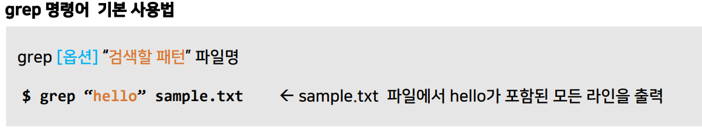
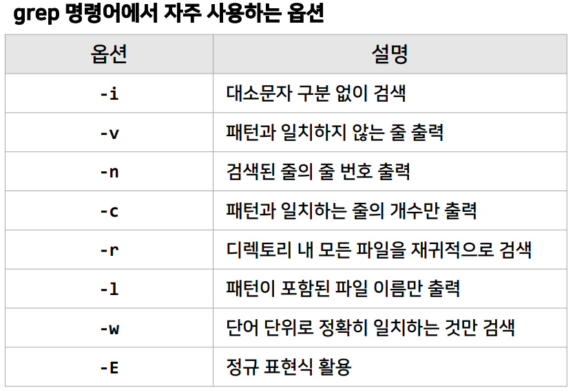
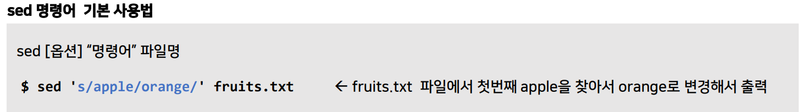
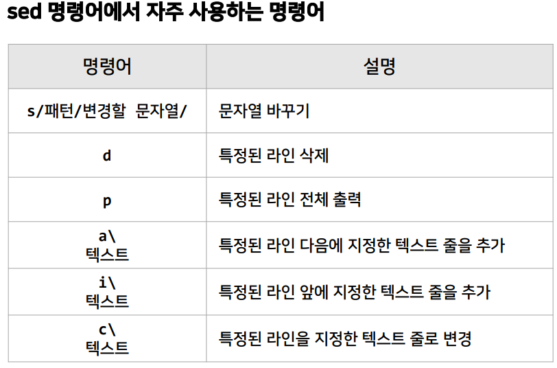
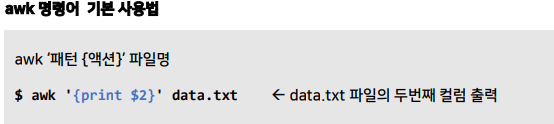
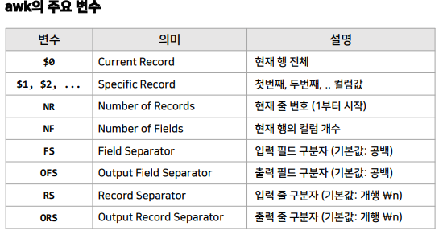
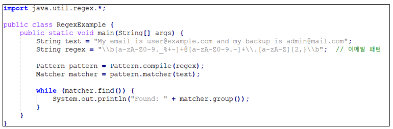
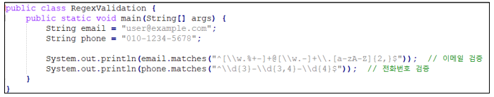
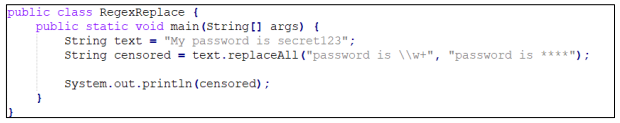
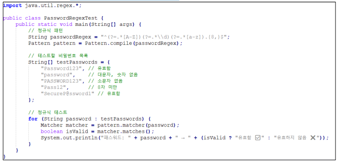

>🔒 시큐어 코딩 수업 정리

## 명령어에서 정규식 활용
---
### grep 명령어
---
📚**<span style="color: #008000">grep 명령어</span>**: grep(Global Regular Expression Print)은 리눅스에서 문자열을 검색하는 강력한 명령어

* **특정 패턴을 파일이나 표준 입력에서 찾아 출력하는 역할**을 하며, 정규 표현식을 지원하여 다양한 패턴 매칭을 수행 가능





#### grep 명령어 활용 예시
1. `log.txt` 파일에서 “error” 또는 “warning” 이 포함된 줄 출력

```bash
grep -E "error|warning" log.txt
```

2. `number.txt` 파일에서 숫자로 시작하는 줄만 출력

```bash
grep -E "^[0-9]+" number.txt
```

3. `user.txt` 파일에서 이메일 주소 패턴을 찾아서 출력

```bash
grep -E "[a-zA-Z0-9._%+-]+@[a-zA-Z0-9.-]+\.[a-zA-Z]{2,}" user.txt
```

### sed 명령어
---
📚**<span style="color: #008000"></span>**: sed(Stream Editor)는 텍스트 파일을 수정하거나 필터링할 때 사용하는 강력한 스트림 편집기

* grep이 텍스트에서 특정 패턴을 찾는다면, sed는 **텍스트를 수정(변경, 삭제, 추가 등)할 수 있는 도구**





#### sed 명령어 활용 예시
1. HTML 주석문 제거

```bash
sed -E –i.bak 's/<!--.*?-->//g' index.html
```

2. IPv4 주소 마스킹

```bash
sed -E –i.bak 's/([0-9]{1,3}\.){3}[0-9]{1,3}/***.***.***.***/g' access.log
```

3. 전화번호 형식 통일

```bash
sed -E –i.bak 's/\b([0-9]{3})-?([0-9]{3,4})-?([0-9]{4})\b/\1-\2-\3/g' contact.txt
```

### awk 명령어
---
📚**<span style="color: #008000">awk 명령어</span>**: awk는 텍스트 데이터 처리와 분석을 위한 강력한 도구, 특히 **열(column) 단위 데이터 처리, 조건별 출력, 연산** 등을 쉽게 수행

* 주로 로그 분석, CSV 파일 처리, 텍스트 필터링 등에 사용됨





#### awk 명령어 활용 예시
1. 특정 도메인의 이메일 주소 추출

```bash
awk '/@example\.com$/ { print $0 }' users.txt
```

2. 숫자로만 이루어진 행을 제외하고 출력

```bash
awk '!/^[0-9]+$/ { print $0 }' data.txt
```

3. ERROR 또는 WARN으로 시작하는 로그 줄만 추출

```bash
awk '/^(ERROR|WARN)/ { print $1, $3 }' log.txt
```

## 자바 프로그램에서 정규식 활용
---
**정규식을 다루는 주요 클래스**:  
* `Pattern`: 정규식을 받아들여 패턴을 정의
* `Matcher`: 입력 문자열과 정의된 패턴을 비교하여 일치 여부 검사
* String의 `.matches()`, `.replaceAll()`: 간단한 작업을 정규식으로 처리

✅**주요 용도**:  
* 특정 패턴이 포함된 문자열 찾기 (Pattern & Matcher)
* 입력 검증 (이메일, 전화번호, 비밀번호 등)
* 문자열 치환 및 필터링 (.replaceAll())

#### 1. 특정 패턴이 포함된 문자열 찾기



#### 2. 사용자 입력 검증



#### 3. 문자열 치환



#### 4. 패스워드 강도 검사(최소 8자, 대소문자, 숫자 포함)



### 정규식 사용 시 문제점
---
#### 1. 성능 문제
* 정규식은 **백트래킹(Backtracking)을 사용하여 패턴을 찾기 때문에 복잡한 정규식일수록 실행 속도가 느려 질 수 있음**.
〮 특히 비효율적인 패턴(ex: `.*` 사용, 중첩된 그룹 등)은 지수적 시간 복잡도를 초래할 수 있음.

* 비효율적인 정규식 예

```bash
grep -E "(a+)+b" largefile.txt
```

> `a+`가 여러 번 반복되면서 백트랙킹이 많아져 속도가 느려짐

#### 2. 과도한 매칭(Overmatching)
* 정규식이 **너무 많은 결과를 매칭**하는 경우가 있음
〮 특히 `.*` 를 사용하면 예기치 않은 부분까지 매칭될 수 있음

* 과도한 매칭 예

```bash
echo "<title>Example</title>" | grep -o "<.*>"
```

> `<title>`태그 하나만 찾으려 했지만 모든 태그를 포함하는 부분을 찾음

#### 3. 예상치 못한 미매칭(Undermatching)
* 정규식이 **특정한 경우를 잡아내지 못하는 경우**가 있음
〮 예를 들어 **공백, 특수문자, 대소문자 변형** 등을 고려하지 않으면 중요한 데이터를 놓칠 수 있음

* 미매칭 예

```bash
grep -E "http://" urls.txt
```

> `https://example.com` 은 매칭 되지 않음 “https?://” 정규식을 사용하면 http:// 와 https:// 모두 매칭 가능

#### 4. 정규식 가독성 문제( Readability Issues)
* 정규식이 길어지면 읽기 어렵고 유지보수가 힘들어짐.

* 가독성이 낮은 정규식 예

```bash
\b[A-Za-z0-9._%+-]+@[A-Za-z0-9.-]+\.[A-Za-z]{2,}\b
```

> 이메일 주소를 찾는 정규식이지만 가독성이 떨어짐.  
> 설명 주석을 추가하거나 구조적 표현을 사용해서 가독성을 개선할 수 있음

#### 5. 보안문제(ReDoS, Regular Expression Denial of Service)
* 일부 정규식은 **특정 입력에 대해 매우 느리게 동작하여 서비스거부(DoS) 공격을 유발 할 수 있음**
〮 특히 `.*`, `.+`, `(a|b|c|d|e|f)*` 같은 패턴이 문제를 일으킬 수 있음.

* ReDos 발생 가능 예

```bash
echo "aaaaaaaaaaaaaaaaaaaaaX" | grep -E "^(a+)+X$"
```

> `(a+)+` 패턴은 백트래킹이 많아져 실행 시간이 길어짐. 