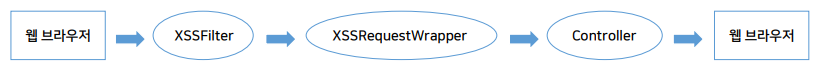

>🔒 시큐어 코딩 수업 정리

## 입력값 필터 만들기
📚**<span style="color: #008000">필터(filter)</span>**: **클라이언트의 HTTP 요청과 응답을 가로채어 특정 작업을 수행**하는 서블릿 기반 컴포넌트

* 웹 애플리케이션에서 보안, 로깅, 데이터 변환등의 작업을 수행할 때 사용

✅**주요 역할**:  
* 요청/응답 로깅
* 인증(Authentication) & 권한 검사(Authorization)
* CORS 처리(다른 도메인의 요청 허용 또는 차단)
* 데이터 검증 & 변환(요청 데이터 가공 및 유효성 검사)
* 응답변환(JSON,XML 등 특정형식으로 변경)
* 보안강화(SQL Injection, XSS 등의 공격 방어)


> Spring Boot Filter 구조

---

### 필터 구현 방법

#### **1. 기본 필터 클래스 구현**

```java
public class CustomFilter implements Filter {
    
    @Override
    public void init(FilterConfig filterConfig) throws ServletException {
        // 필터 초기화 (서버 시작 시 1회 실행)
    }
    
    @Override
    public void doFilter(ServletRequest request, ServletResponse response, FilterChain chain)
            throws IOException, ServletException {
        
        HttpServletRequest httpRequest = (HttpServletRequest) request;
        System.out.println("Request URI: " + httpRequest.getRequestURI());
        
        // 다음 필터 또는 컨트롤러로 진행
        chain.doFilter(request, response);
    }
    
    @Override
    public void destroy() {
        // 필터 종료 (서버 종료 시 1회 실행)
    }
}
```

* `init()`: 필터가 생성될 때 딱 한 번 실행 (초기화 작업)
* `doFilter()`: 요청이 올 때마다 실행되는 핵심 로직
* `destroy()`: 필터가 제거될 때 실행 (정리 작업)
* `chain.doFilter()`: 매우 중요! 다음 단계로 넘어가는 명령

#### **2. 필터를 Spring Boot에 등록**
* **(방법 1)** `@Component` 어노테이션 사용 - 자동 등록

```java
@Component
public class CustomFilter implements Filter {
    
    @Override
    public void doFilter(ServletRequest request, ServletResponse response, FilterChain chain)
            throws IOException, ServletException {
        
        HttpServletRequest httpRequest = (HttpServletRequest) request;
        System.out.println("Request Method: " + httpRequest.getMethod());
        
        chain.doFilter(request, response);
    }
}
```

* 장점: 코드가 간단함
* 단점: 필터 순서 지정 불가, URL 패턴 세밀하게 설정 불가

* **(방법 2)** `FilterRegistrationBean` 사용하여 수동 등록(우선순위 지정이 필요한 경우)

```java
@Configuration
public class FilterConfig {
    
    @Bean
    public FilterRegistrationBean<CustomFilter> loggingFilter() {
        FilterRegistrationBean<CustomFilter> registrationBean = new FilterRegistrationBean<>();
        registrationBean.setFilter(new CustomFilter());
        registrationBean.addUrlPatterns("/api/*");  // 특정 URL 패턴에만 적용
        registrationBean.setOrder(1);  // 필터 실행 순서 지정 (낮을수록 먼저 실행)
        return registrationBean;
    }
}
```

* 장점: 필터 실행 순서 제어 가능, URL 패턴 세밀하게 설정 가능, 여러 필터 관리 용이

#### Spring Security와 기본 필터

```java
@Configuration
public class DefaultSecurityConfig {
    
    @Bean
    public SecurityFilterChain securityFilterChain(HttpSecurity http) throws Exception {
        http
            .authorizeHttpRequests(auth -> auth
                .anyRequest().authenticated()  // 모든 요청은 인증 필요
            )
            .formLogin()  // 기본 로그인 폼 활성화
            .httpBasic(); // HTTP Basic 인증 활성화
            
        return http.build();
    }
}
```

1. `.authorizeHttpRequests()`: 어떤 요청에 인증이 필요한지 설정
2. `.formLogin()`: 로그인 페이지 자동 생성
3. `.httpBasic()`: HTTP Basic 인증 방식 사용

---

### XSS 공격
📚**<span style="color: #008000">XSS (Cross-Site Scripting)</span>**: 게시판처럼 입력 내용 그대로 표출되는 곳에 악성 스크립트를 넣어, 서비스 이용자의 브라우저에서 실행되도록 하는 공격

💡**예시**:  
* 게시판에 글을 쓸 때:
  * 공격자: <script>alert('해킹!');</script> 라고 입력
  * 결과: 게시글을 보는 모든 사람의 브라우저에서 경고창이 뜸! 😱

```
실제 피해 사례:
❌ 쿠키/세션 탈취 → 계정 도용
❌ 사용자 정보 수집
❌ 악성 사이트로 리다이렉트
❌ 키로깅 (입력 내용 훔치기)
❌ 가짜 로그인 페이지 표시
```

* **🛡️ XSS 방어 전략**
* 사용자 입력값에서 위험한 패턴의 문자열을 필터링
* SpringBoot의 ServletFilter와 HttpServletRequestWrapper를 이용하여 모든 요청의 입력값을 가로챔
* 입력값의 내용을 정규식으로 패턴을 확인하여 필터링 처리



#### XSS 필터 구현
1. **XSSFilter 만들기**

```java
@Component
public class p043_XSSFilter implements Filter {
    
    @Override
    public void doFilter(ServletRequest request, ServletResponse response, FilterChain chain)
            throws IOException, ServletException {
        
        // 1. 일반 Request를 HttpServletRequest로 변환
        HttpServletRequest httpRequest = (HttpServletRequest) request;
        
        // 2. 🔑 핵심: Request를 XSSRequestWrapper로 감싸기
        chain.doFilter(new p043_XSSRequestWrapper(httpRequest), response);
        
        // 이제 Controller에서 받는 모든 파라미터는 
        // XSSRequestWrapper를 거쳐서 자동으로 필터링됨
    }
}
```

2. **XSSRequestWrapper 만들기**

```java
public class p043_XSSRequestWrapper extends HttpServletRequestWrapper {
    
    public p043_XSSRequestWrapper(HttpServletRequest request) {
        super(request);
    }
    
    // 1. 단일 파라미터 가져올 때
    @Override
    public String getParameter(String name) {
        String value = super.getParameter(name);
        return (value != null) ? sanitize(value) : null;
    }
    
    // 2. 여러 파라미터 값 가져올 때 (checkbox 등)
    @Override
    public String[] getParameterValues(String name) {
        String[] values = super.getParameterValues(name);
        if (values != null){
          // 배열의 모든 값을 sanitize 처리
          for (int i = 0; i < values.length; i++) {
              values[i] = sanitize(values[i]);
          }
        }
        return values;
    }
    
    // 3. 핵심 메서드: 위험한 문자열 제거
    private String sanitize(String input) {
        if (input == null) return null;
        
        String clean = input;
        
        // (1) <script> 태그 제거
        clean = clean.replaceAll("(?i)<script.*?>.*?</script>", "");
        
        // (2) onclick, onerror 등 이벤트 핸들러 제거
        clean = clean.replaceAll("(?i)on\\w+\\s*=\\s*[\"'][^\"']*[\"']", "");
        
        // (3) javascript: 프로토콜 제거
        clean = clean.replaceAll("(?i)javascript:", "");
        
        return clean;
    }
}
```

---

## LAB1 - 소스코드의 XSS 취약점 확인

1. 환경 구축한 LAB을 실행시켜 크롬으로 로그인
2. 게시판 메뉴 진입
3. '쓰기' 버튼을 눌러 게시글 작성
4. 제목 부분에 아래와 같이 입력
`안녕하세요<script>alert('XSS!!');</script>`

5. 화면 아래로 내려가 '확인' 버튼
6. 게시판 목록 화면에서 해당 게시글 제목에 스크립트 내용이 보여짐
7. 해당 게시글을 클릭하면 스크립트가 동작하여 화면에
경고창이 나타남

{:.prompt-warning}
> XSS 취약점 있는 것이 확인됨
>

