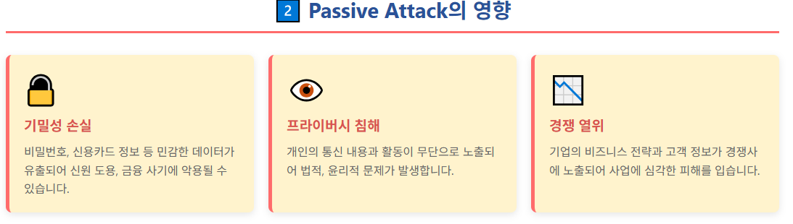
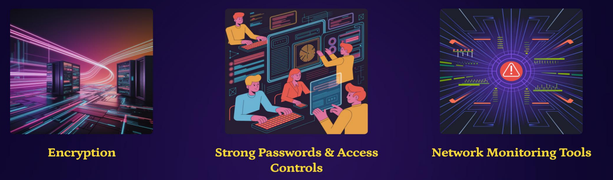
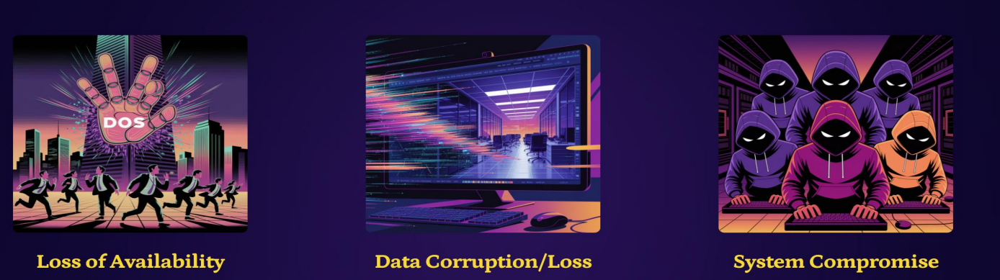
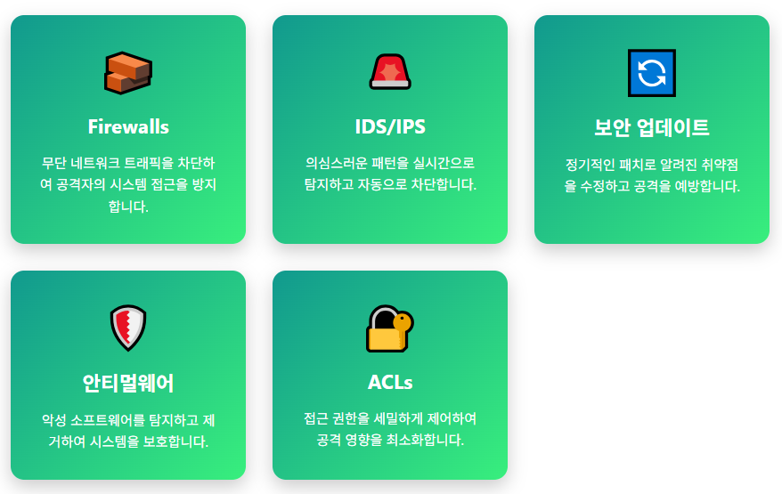
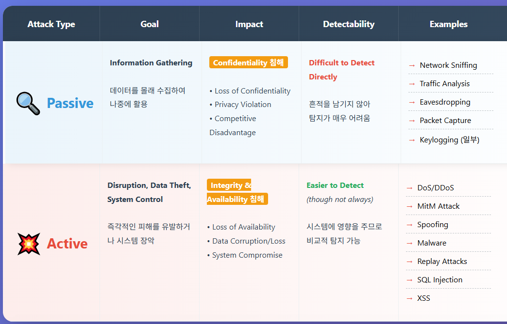

>🔒 사이버 보안 기초 수업 정리

## Passive Attack
📚**Passive Attack**: 공격자가 네트워크 트래픽을 **엿듣는(eavesdropping)** 공격 방식

✅**특징**:  
* 데이터를 변경하지 않음 - 오직 **"관찰"**
* 시스템에 흔적을 남기지 않아서 탐지가 어려움
* 목표: 비밀번호, 신용카드 정보 등 민감한 데이터 수집

### Passive Attack 3가지 유형
1. **Eavesdropping(도청)**: 통신을 가로채서 무단으로 정보에 접근
* ex: 공공 WiFi에서 암호화되지 않은 통신 가로채기

2. **Monitoring(모니터링)**: 네트워크 활동을 관찰하여 취약점을 찾음
* ex: 어떤 서버와 자주 통신하는지 패턴 분석

3. **Data Theft(데이터 탈취)**: 자격증명(credentials) 같은 민감한 정보를 수집
* ex: 암호화되지 않은 로그인 정보 캡처

---

### Passive Attack 예시
1. **Traffic Analysis(트래픽 분석)**: 네트워크 트래픽 패턴을 분석
  * 누가 누구와 통신하는지, 통신 빈도, 데이터 크기 등을 알아냄
  * 예시: 회사 직원이 경쟁사 웹사이트와 자주 통신한다면, 공격자는 "기밀 정보 유출"을 추론할 수 있다.

2. **Keylogging(키로깅)**: 사용자의 키보드 입력을 몰래 기록
  * 아이디/비밀번호, 신용카드 번호, 개인 메세지 등이 캡쳐됨

---

### Passive Attack의 영향

---

### Passive Attack 방어 전략

1. **Encryption (암호화)**: **전송 중(in transit)과 저장 중(at rest) 데이터를 암호화**하여, 가로채더라도 읽을 수 없게 만듦 - 가장 효과적

예시:  
* HTTPS (웹사이트 통신 암호화)
* VPN (가상 사설망)

2. **Strong Passwords & Access Controls (강력한 비밀번호와 접근 제어)**
* 복잡한 비밀번호 사용 (대소문자, 숫자, 특수문자)
* 다단계 인증 (MFA)
* 역할 기반 접근 제어 (RBAC)
* 최소 권한 원칙

3. **Network Monitoring Tools (네트워크 모니터링 도구)**: 비정상적인 패턴이나 이상 징후를 탐지하는 도구 사용

도구 예시:  
* IDS (Intrusion Detection System)
* SIEM (Security Information and Event Management)
* Network Analyzer

❌**한계**: Passive Attack은 정상 트래픽처럼 보이므로 직접 탐지가 어렵다.

---

## Active Attack
📚**Active Attack**: 공격자가 시스템이나 데이터를 **직접 변경/방해**하는 공격 방식

✅**특징**:  
* 데이터 변조: 단순히 관찰만 하지 않고 실제로 수정, 삭제, 삽입함
* 시스템과 상호작용: 네트워크에 능동적으로 개입
* 피해 유발 목적: 시스템을 손상시키거나 무단 접근
* 탐지 가능: 시스템에 영향을 주므로 Passive Attack보다 발견이 쉽다

---

### Active Attack 3가지 유형
1. **Modification (변조)**: 데이터나 시스템 설정을 변경하여 피해를 입힘
   * 예시: 이메일 내용 변조 후 전달

2. **Disruption (방해)**: 서비스 중단을 일으켜 정상 사용자의 접근을 막음
   * 예시: DDoS로 서버 다운, 랜섬웨어로 파일 암호화

3. **Unauthorized Access (무단 접근)**: 취약점을 악용하여 민감한 정보나 시스템에 대한 통제권을 획득
   * 예시: SQL Injection으로 데이터베이스 접근

---
### Active Attack 예시

1. **Malware (악성 소프트웨어)**: `Virus`, `Worm`, `Trojan` 등을 포함

2. **DDoS (Distributed Denial of Service)**: 시스템에 과도한 트래픽을 줘서 과부화를 발생시킴

3. **Spoofing (스푸핑)**: 정당한 사용자나 시스템을 가장하는 공격

---
### 주요 Active Attack
1. **🔄Replay Attack**: 네트워크 트래픽을 캡처한 후 나중에 재전송하여 보안을 우회
* 공격 프로세스:
1. 공격자가 정당한 네트워크 트래픽 캡처 (예: 로그인 패킷)
2. 나중에 동일한 패킷을 재전송
3. 보안 조치를 우회하고 무단 접근 획득
* 예시: 인증 토큰을 재사용하여 로그인

2. **🕵️Man-in-the-Middle (MITM, 중간자 공격)**: 공격자가 사용자와 서버 사이에 끼어들어 모든 통신을 가로채고 수정
* 공격 프로세스:
1. 공격자가 두 통신 당사자 사이에 위치
2. 양측의 메시지를 가로채서 읽음 (`Eavesdropping`)
3. 메시지를 수정한 후 전달 (`Modification`)
4. 양측은 직접 통신한다고 믿음

3. **💉SQL Injection**: 악성 SQL 코드를 주입하여 데이터베이스를 무단으로 조작하고 정보를 탈취

4. **📜Cross-Site Scripting (XSS)**: 악성 스크립트를 웹사이트에 삽입하여 사용자 세션을 탈취하거나 피싱
* 예시: 댓글란에 `` 삽입

---
### Active Attack의 영향

1. **Loss of Availability (가용성 손실)**
- **DDoS 공격**: 서비스 완전 중단
- **재정적 피해**: 다운타임당 수백만 원 손실
- **평판 손상**: 고객 신뢰 상실

2. **Data Corruption/Loss (데이터 손상/손실)**
- **무결성 침해**: 데이터 변조로 신뢰성 상실
- **비즈니스 중단**: 중요 데이터 손실로 업무 마비
- **법적 문제**: 개인정보 유출 시 과징금

3. **System Compromise (시스템 침해)**
- **완전한 통제**: 관리자 권한 탈취
- **추가 공격 발판**: 다른 시스템 공격에 활용
- **데이터 유출**: 모든 민감 정보 접근 가능

---
### Active Attack 방어 전략

1. **Firewalls (방화벽)**: 네트워크 트래픽 필터링

**작동 방식**:  
- 인바운드/아웃바운드 트래픽 검사
- 정의된 규칙에 따라 차단/허용
- 포트, IP 주소, 프로토콜 기반 필터링

2. **IDS/IPS (침입 탐지/방지 시스템)**

**IDS (Intrusion Detection System)**:  
- 의심스러운 활동 **탐지 및 경고**
- 로그 기록 및 알림 전송
- 수동적 모니터링

**IPS (Intrusion Prevention System)**:  
- 의심스러운 활동 **자동 차단**
- 실시간 위협 대응
- 능동적 방어

{:.prompt-tip}
> IDS는 "경보기", IPS는 "자동 소화기"
>

3. **Access Control Lists (ACLs)**: 리소스 접근 권한 규칙 정의

## Passive vs Active Attacks

