>🔒 시큐어 코딩 수업 정리

## 인증과 인가 개요
* **인증과 인가 차이**

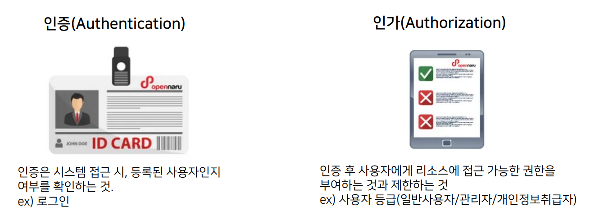
> **인증으로 “내가 누구인지” 확인하고, 인가로 “무엇을 할 수 있는지”를 제어**

### 인증(Authentication)
📚**<span style="color: #008000">인증(Authentication)</span>**: 내가 나인지’ 증명하는 방법  
* 인증방법에 따라 다음 3가지 방식으로 구분됨
1. 지식기반 인증(ID/PW) - 가장 널리 사용됨
2. 소유기반 인증
3. 생체기반 인증

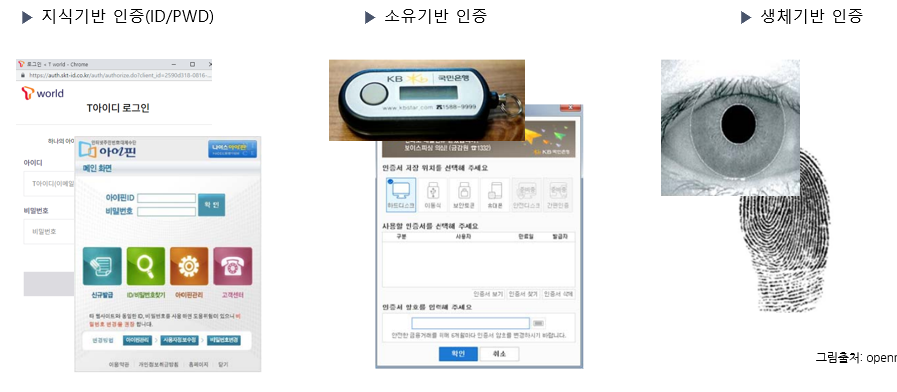

#### 지식기반 인증
📚**<span style="color: #008000">지식기반 인증</span>**: 사용자가 알고 있는 정보를 기반으로 본인 여부를 확인하는 인증 방식(예: 비밀번호, PIN, 보안 질문)

✅**장점:** 구현 및 사용이 비교적 간편하고 사용자에게 익숙 (비밀번호)

❌**단점:** 사회공학적 공격, 정보 유출 시 위험 증가, 예측 가능한 질문의 경우 보안 취약

🛡️**보완 방안**: 다단계 인증(MFA)과 결합하여 보안 강화, 주기적인 질문 및 답변 업데이트 권장

#### 소유기반 인증
📚**<span style="color: #008000">소유기반 인증</span>**: 사용자가 물리적으로 소유하고 있는 장치나 토큰을 기반으로 본인 확인을 수행하는 인증 방식

* **적용 사례**
  * OTP (One-Time Password) 토큰
  * 스마트 카드
  * 모바일 디바이스 인증

✅**장점:**  
* 실제 소유한 장치가 필요하므로, 정보 유출이나 사회공학 공격에 대한 방어력이 향상됨
* 지식기반 인증과 결합한 **2차 인증 수단**으로 활용되어 보안 강화

❌**단점:**  
* 소유하는 장치의 분실 또는 도난 시 인증이 무력화될 수 있음
* 추가 장치 소지 필요, 장치 **재발급**, 분실 신고 및 관리 체계 구축 필요

#### 생체기반 인증
📚**<span style="color: #008000">생체기반 인증</span>**: 사용자의 신체적 또는 행동적 특성을 기반으로 본인 여부를 확인하는 인증 방식

* **적용 사례**: 
  * 지문 인식: 스마트폰, 노트북 등에서 흔히 사용
  * 안면/홍채 인식: 보안 시스템 및 모바일 기기 잠금 해제
  * 음성 인식: 콜센터나 음성 비서 인증

✅**장점:**  
* 복제나 도용이 어려워 보안성이 높음
* 기억할 필요 없이 간단한 생체 정보만으로 인증하므로 편리

❌**단점:**  
* 생체 정보 유출 시 치명적 피해 우려
* 조명, 소음, 센서 오류 등으로 인한 인식 실패가 잦음 
* 고성능 센서 및 기술 도입 비용 부담

#### 최신 인증 기술
1. **<span style="color: #008000">비밀번호 없는 인증 (Passwordless Authentication)</span>** 
* 공개키 기반으로 사용자 장치의 생체 인증, PIN 등을 활용하여 비밀번호 없이 인증 수행 → 비밀번호 유출·추측 위험을 근본적으로 제거
  * (예) FIDO2, WebAuthn

2. **<span style="color: #008000">리스크 기반 / 적응형 인증 (Risk-based/Adaptive Authentication)</span>**
* 로그인 시 사용자의 위치, 디바이스, 네트워크 환경, 접속 시간 등 다양한 컨텍스트 정보를 활용하여 리스크를 평가

3. **<span style="color: #008000">분산 인증 (Decentralized Authentication)</span>**
* 블록체인 등 분산원장 기술을 활용하여 중앙 집중식 사용자 데이터베이스 없이 인증 진행
  * (예) 분산 신원(`DID`, Decentralized Identity) 기반의 인증 솔루션
  * `DID`: 사용자가 검증 가능한 디지털 증명서(Verifiable Credential) 형태로 자기 신원 정보를 직접 발급·검증할 수 있음

---

## 인증과 인가 프로세스
웹 애플리케이션에서 인증/인가 방식은 다음과 같이 나뉜다.

* **인증방식**
  * **세션기반 방식**: 서버 메모리나 데이터베이스에 **세션 정보를 저장하고, 로그인 후 발급된 세션 쿠키를 통해 사용자를 인증**하는 방식
  * **토큰기반 방식**: `JWT` 같은 **서명된 토큰을 발급해 클라이언트가 로컬에 보관**하고, 이후 요청 시 `Authorization` 헤더에 담아 보내는 방식
  * **외부 인증 방식**: `OAuth2`나 `SAML` 같은 프로토콜을 통해 **구글·페이스북 등 타사 인증 서비스를 활용해 로그인**하는 경우

* **인가방식**
  * **역할기반 접근제어(RBAC**): 사용자에게 ‘관리자’, ‘일반 사용자’ 같은 역할을 부여해 권한을 설정
  * **속성기반 접근제어(ABAC)**: 사용자 속성, 리소스 속성, 환경 속성 등을 조합해 더 세밀하게 접근을 통제
  * 요청에 포함된 토큰/세션 정보 기반으로 접근 권한을 갖고 있는지 확인
  * 최소 권한 부여 원칙: 기본적으로 모든 동작을 금지하고 필요한 경우에만 최소한으로 열어주는 운영 방침

### 일반적인 인증/인가 프로세스
**1단계:** 사용자 로그인 → 서버에서 자격 증명 확인  
**2단계**: 성공 시 세션/토큰 발급 → 이후 요청 시 포함  
**3단계**: API 게이트웨이나 미들웨어에서 토큰/세션 검증 → 권한에 따른 접근 제어

---

### 세션기반 인증

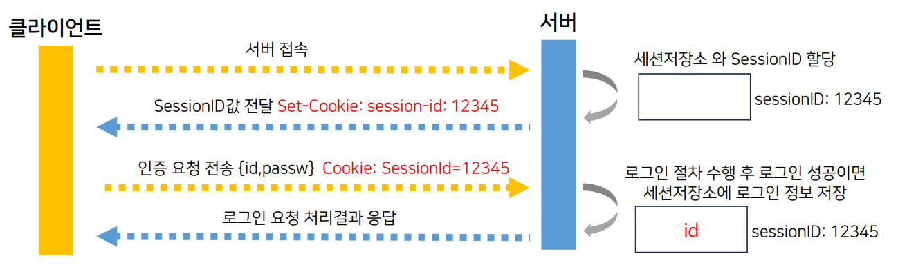

✅**동작과정**:    
1. 사용자가 웹사이트에 접속하게 되면 세션저장소가 할당, 할당된 저장소를 식별하기 위해 `SessionID`가 할당됨
2. 할당된 `SessionID는` 응답메시지의 헤더에 Set-Cookie 값을 통해 브라우저에게 전달됨
3. 사용자는 인증을 요청하기 위해 아이디와 패스워드를 서버에 전달
4. 서버는 사용자로 부터 전달받은 ID와 패스워드를 검증
5. 정상적인 사용자이면, 할당된 세션저장소에 인증정보를 저장

#### LAB 세션처리 확인
1. BurpSuite Proxy가 Intercept Off로 동작 중인 상태에서 LAB 웹 서비스 접속 시도
2. BurpSuite Proxy 메뉴에서 HTTP History 메뉴로 들어가 최초 접속 항목을 선택
3. 하단에 **HTTP Response 내용** 확인 - Set-Cookie 헤더에, 새로운 세션 ID 값 확인

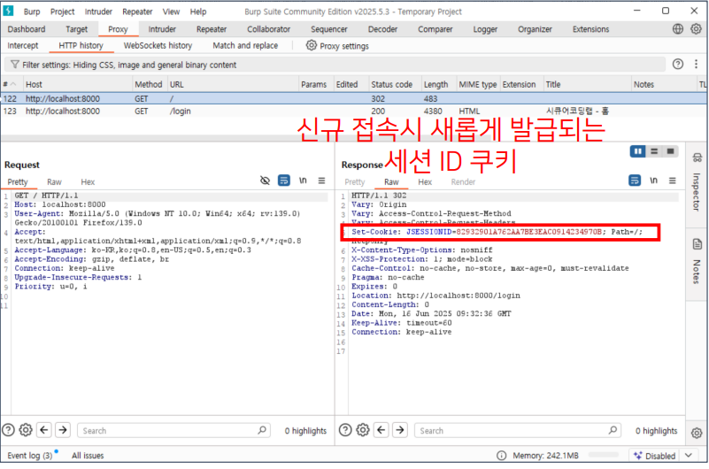

* 발급된 세션 아이디는 리퀘스트가 전송될 때마다 함께 전송됨

4. HTTP History 목록에서 자동으로 이동한 로그인 페이지 요청 항목 선택
5. 하단에 **HTTP Request 내용** 확인
6. 새롭게 발급받은 세션 ID값이 쿠키값으로 함께 전송되는 것이 확인됨

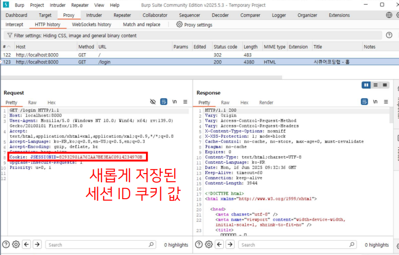
> 발급된 세션 ID 쿠키가 포함되어 전송되는 것을 확인할 수 있다.

---

### 토큰기반 인증

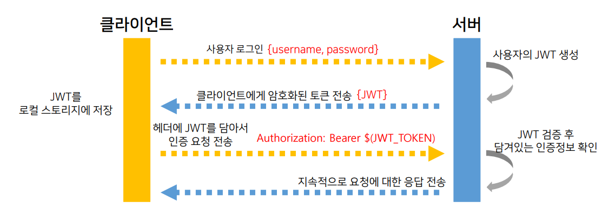

✅**동작과정**:   
1. 사용자가 로그인 정보를 POST 전송 → 서버는 우선 유효성을 검증 → 서명된 JWT를 응답에 `JSON` 형태로 담아 반환
2. 클라이언트는 이 토큰을 로컬 스토리지나 보안 쿠키에 저장 → **모든 API 요청시 Authorization 헤더에 Bearer 키워드와 함께 JWT를 보냄**. (`Authorization: Bearer <JWT>`)
3. 서버는 토큰의 서명을 확인한 후, 페이로드에 담긴 claim 정보를 통해 사용자의 신원과 권한을 검증

```
사용자가 로그인 시도 → 서버가 JWT 발급 → 클라이언트가 JWT 저장 → 요청마다 JWT를 포함하여 전송 → 서버에서 검증 후 응답
```

* 이런 방식은 상태 비저장인 **stateless 구조**로, 마이크로서비스 환경에서 **확장성**이 뛰어나기 때문에, 많이 활용되고 있음

* `세션 기반`: 서버에서 세션 저장 필요 → 사용자 증가 시 서버 부하 증가
* `JWT`: 서버 상태 저장 불필요 → 확장성이 높음

#### JWT 로그인 세션 확인
HTTP 통신 내용을 보면서, JWT 기반 로그인 방식을 알아보자

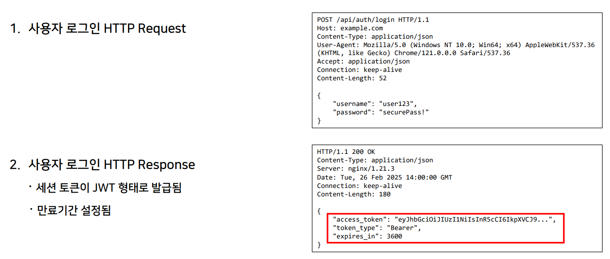

* 성공적인 로그인 요청을 보내고 나면, response body에 발급된 `access_token` 필드 확인 가능
* 이 JWT 형태의 토큰이 클라이언트 측 로컬 스토리지나 쿠키에 저장된 후, 인증된 사용자만 사용할 수 있는 API를 호출할 때마다 **Authorization header**에 `Bearer` 키워드와 함께 토큰이 담겨져 전송되는 것 (Authorization: Bearer <토큰>)

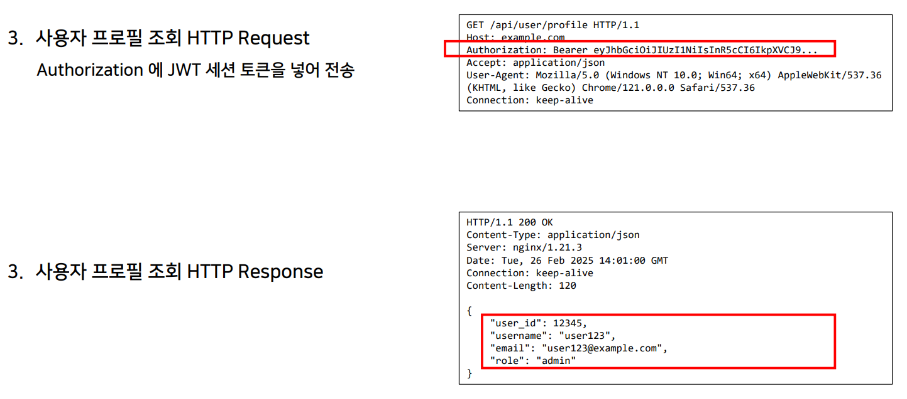
> 인증된 사용자만 접근할 수 있는 프로필 조회 화면으로 이동할 경우

* 클라이언트가 해당 URL로 GET 요청을 보낼 때, **Authorization header에 Bearer와 함께 토큰**이 담겨져 있는 것이 보인다.
* 서버는 이 토큰을 검증한 뒤, 그 안 페이로드에 들어 있던 **유저아이디(user_id), 유저네임(username), 역할(role) 값이 담긴 JSON 응답을 반환**

---

## 보안 위협 및 해결방법

### 주요 인증 보안 위협

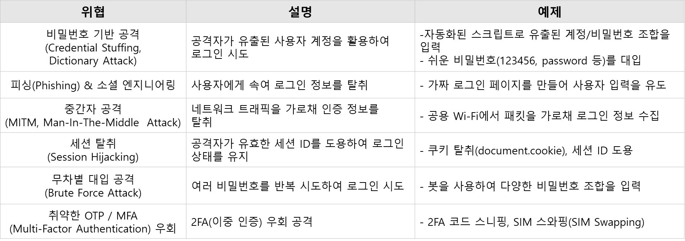

### 주요 인증 보안 위협 대응 방안

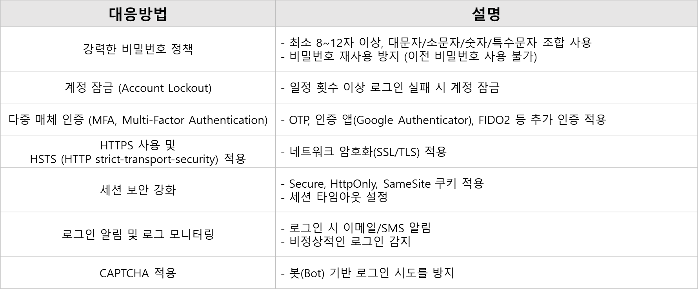

### 주요 인가 보안 위협

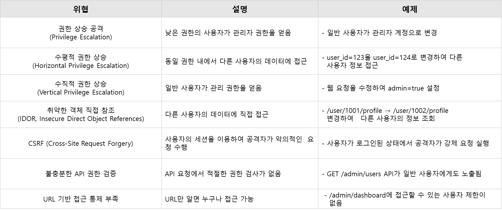

### 주요 인가 보안 위협 대응 방안

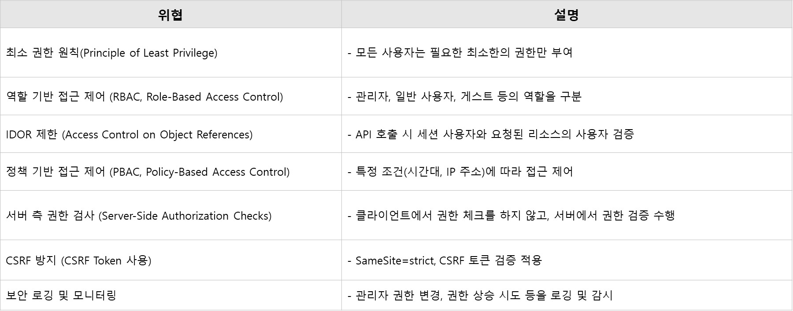