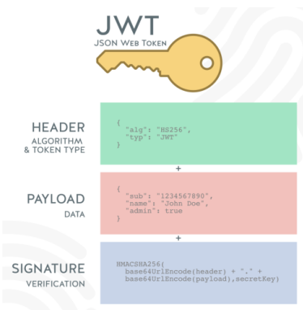
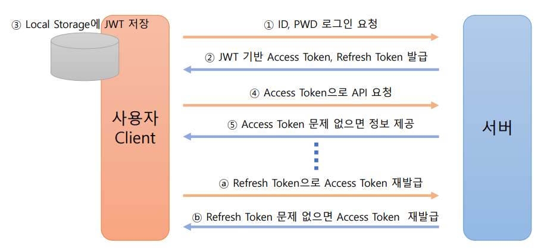
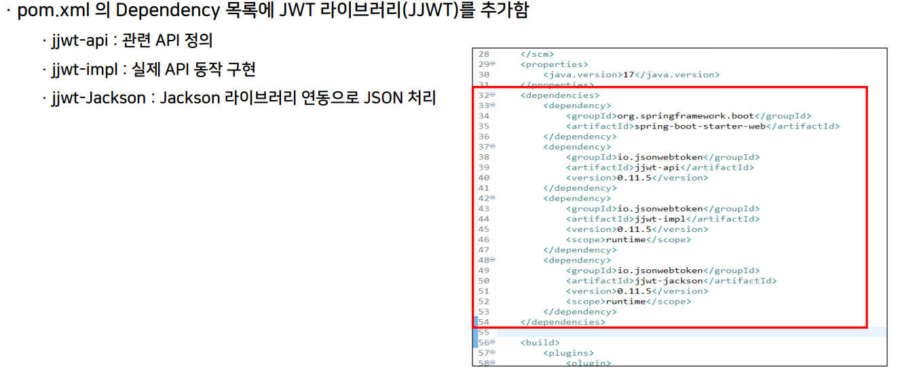
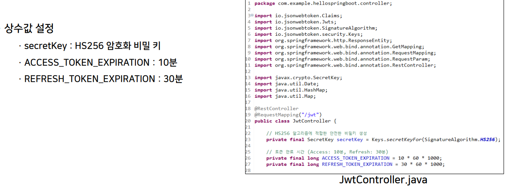
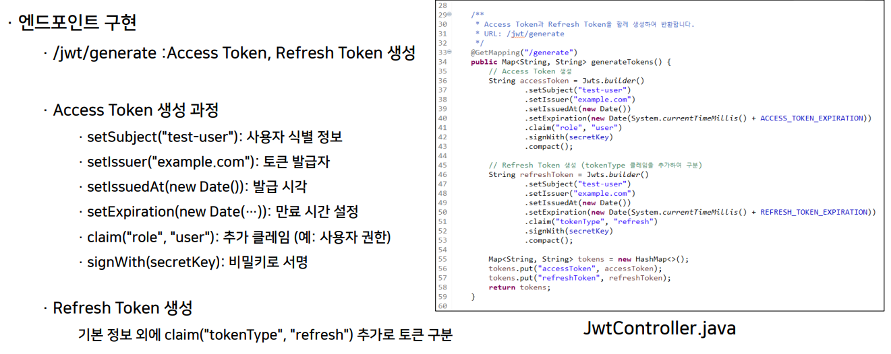
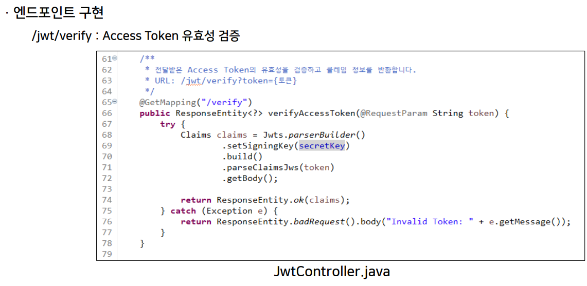
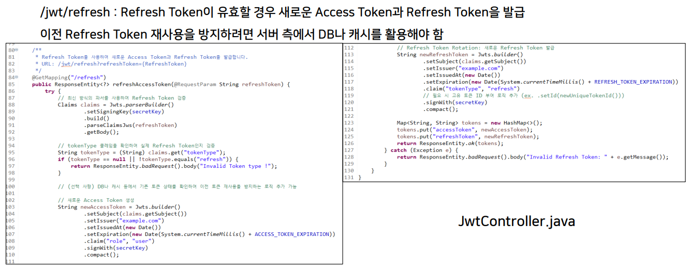
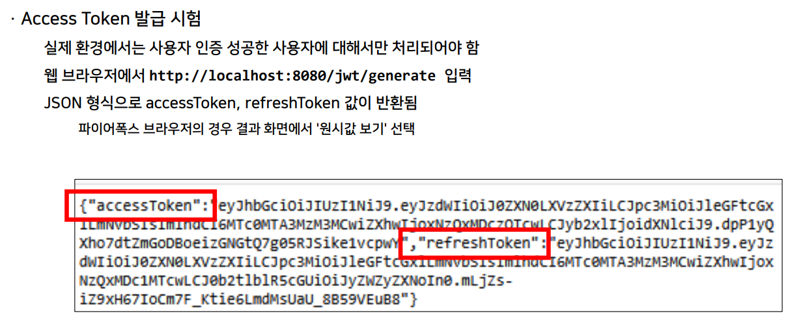
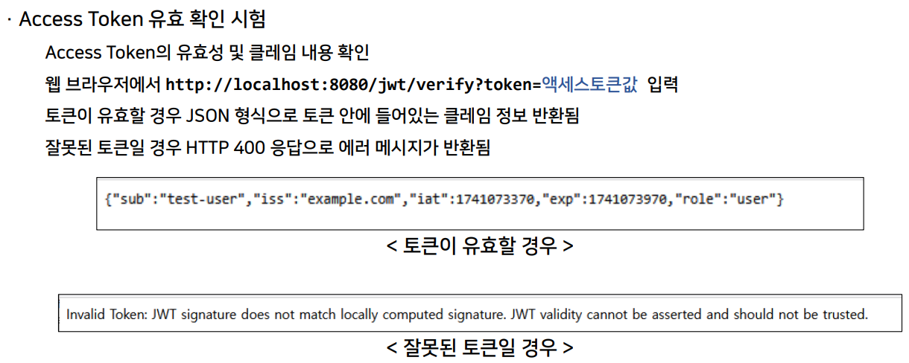
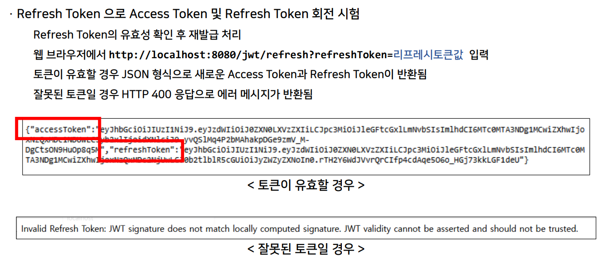

>🔒 시큐어 코딩 수업 정리

## JWT(JSON Web Token)
📚**JWT(JSON Web Token)**: JSON 형식의 데이터를 안전하게 전송하기 위한 개방 표준(RFC 7519)  
* 주로 **인증(Authentication)과 인가(Authorization)**에 사용되며, 클라이언트-서버 간 정보를 교환하는 용도로 활용

✅**특징**:  
1. **자체 포함**: 토큰 내에 사용자 정보, 만료 시간 등의 정보를 포함하여 별도 저장소 없이 인증 가능
2. **경량(Compact)**: URL, 헤더, 쿠키 등 다양한 환경에서 전송하기 적합한 크기
3. **서명(Signature)**: 토큰의 위변조 여부를 확인하기 위해 `HMAC`, `RSA`, `ECDSA` 등의 알고리즘으로 서명

### JWT 구성 및 동작 방식

✅**JWT 구성요소**:  
* **헤더(Header)**
  * 토큰의 타입(JWT)과 서명에 사용할 알고리즘 정보(예: `HS256`, `RS256`)
* **페이로드(Payload)**
  * 인증 관련 정보(클레임, claims)
  * 표준 클레임: iss(발급자), exp(만료시간), sub(주체), aud(대상) 둥
  * 커스텀 클레임: 애플리케이션별 추가 데이터
* **서명(Signature)**
  * 헤더와 페이로드를 비밀 키로 서명하여 위변조 방지

✅**동작 원리**:  
* **클라이언트**: 인증 후 JWT를 발급받아 이후 요청할 때마다 포함
* **서버**: JWT의 서명을 검증하여 토큰의 유효성을 확인한 후, 페이로드 내 정보를 기반으로 권한 부여

---

### JWT 장점
✅**장점:**  
1. **무상태성(Stateless & Self-contained)**
* 서버에 별도의 세션 저장소가 필요 없어, 확장성과 분산 시스템에 적합
2. **빠른 검증 및 성능**
* JWT는 자체에 모든 정보를 포함하므로, 데이터베이스 조회 없이도 신원 검증 가능
3. **유연한 클레임 구조**
* 표준 클레임 외에도 애플리케이션 맞춤형(claims) 데이터를 포함할 수 있어 다양한 정보 교환이 용이
4. **표준 기반**
* RFC 7519에 의해 정의되어 다양한 플랫폼과 언어에서 지원 및 호환성 보장\

### JWT 단점
❌**단점:**  
1. **정보 노출 문제**
* 기본적으로 Base64 인코딩 → 암호화하지 않으면 누구나 페이로드 내용을 확인 가능
2. **토큰 탈취 위험**
* 토큰 자체에 중요한 정보가 포함되어 있으며, 만료 기간 동안 노출 시 악용 가능 (HTTPS 등 전송 보안 필요)
3. **토큰 무효화의 어려움**
* 발급된 JWT는 만료 전까지 유효 → 탈취 시 빠른 무효화가 어렵고 재발급 관리가 복잡
4. **크기 및 오버헤드**
* 여러 클레임을 포함할 경우 토큰 크기가 커져 전송 오버헤드가 발생 가능

---

### JWT 기반 인증 흐름

#### JWT를 활용한 사용자 인가 및 권한 관리
* **토큰 내 Claims 활용**
  * JWT 페이로드에 사용자 식별자, 역할(role), 권한(permission) 등의 정보를 포함
  * 클라이언트는 인증 후 JWT를 발급받아, 이후 요청 시 HTTP 헤더에 포함 (`Bearer <token>`)
* **서버 측 검증 및 인가 과정**
  * 서버는 JWT의 서명, 만료시간, 발급자 등을 검증하여 **토큰의 무결성 확인**
  * 페이로드의 클레임을 기반으로 사용자의 접근 권한 및 인가 결정
  * 예) 특정 API에 접근하기 위해 필요한 역할 또는 권한이 JWT 클레임에 포함되어 있는지 확인
* **무상태(Stateless) 인증**
  * 서버는 별도의 세션 저장소 없이, JWT 내 정보를 활용하여 인가를 수행
  * 분산 시스템 및 마이크로서비스 환경에서 효과적
* **토큰 만료 및 갱신**
  * 짧은 만료 시간 설정으로 권한 변경 시 빠른 반영 가능
  * Refresh Token과 토큰 회전 전략을 통해, 오래된 권한 정보를 가진 토큰 사용 방지
* **동적 권한 관리의 한계 및 보완**
  * 사용자 권한 변경 시, 기존 JWT에 반영되지 않으므로 주기적 토큰 갱신 또는 별도 인가 체크 필요
  * 중앙 인가 서버와의 연계를 통해 실시간 권한 업데이트 구현 고려
* **보안 강화**
  * HTTPS를 통한 안전한 전송, `HttpOnly`/ Sec`ure 쿠키 등 안전한 저장소 활용
  * 최소한의 정보만 포함하고, 민감 정보는 별도 암호화 또는 안전한 관리

---

## JWT 구현

### 1. JWT 라이브러리(JJWT) 추가

### 2. 상수값 설정

### 3. 엔드포인트 구현

### 4. 구현된 JWT 기능 테스트

---

## JWT 보안 및 취약점 대응

### 서명과 키 관리
* **JWT 서명의 역할**
  * **토큰의 무결성과 진위 보증**: 헤더와 페이로드가 변조되지 않았음을 확인
  * 토큰 위변조 방지를 위한 디지털 서명 적용'

* **서명 알고리즘 종류**
  * 대칭키 알고리즘: `HS256`, `HS384`, `HS512`
  * **대칭키**: 동일한 비밀키로 서명과 검증 수행
  * 비대칭키 알고리즘: `RS256`, `RS384`, `RS512`, `ES256` 등
  * **비대칭키**: 개인키로 서명, 공개키로 검증 수행

* **서명 과정**
  * **헤더와 페이로드를 Base64 URL 인코딩 → 비밀 키(또는 개인키)로 서명 생성 → 최종 JWT 구성**

* **알고리즘 혼동 공격**
  * 공격자가 "`none`"알고리즘을 이용하거나 다른 알고리즘으로 위장하여 서명 우회 시도
  * **대응 방안**: 허용 알고리즘(`HS256`, `RS256`)을 명시적으로 설정, 라이브러리 알고리즘 검증 강화

* **비밀 키/개인 키 유출**
  * 키가 노출되면 토큰 위조가 가능 → 인증 우회 및 권한 탈취 위험 증가
  * **대응 방안**: 
    * 강력한 키 생성 및 안전한 저장(HSM, 클라우드 키 관리 서비스)
    * 키 접근 권환 최소화 및 정책 강화

* **키 교체 및 회전 관리 미흡**
  * 키 회전 시 기존 토큰 검증 문제, 만료되지 않은 토큰이 악용될 위험
  * **대응 방안**: 정기적인 키 회전 정책과 토큰 재발급, `JWKS` 엔드포인트 활용

---

### 유효기간 관리
📚**JWT 유효기간의 역할**: 
만료 시간을 통해 탈취된 토큰의 사용 기간을 제한하여 피해 최소화  
* **만료 시간(exp) 클레임**: JWT 내에 포함되어 토큰의 유효 기간을 명시

* **유효기간 설정의 중요성**
  * 너무 긴 유효기간은 토큰 탈취 시 장기간 악용 위험 증가
  * 너무 짧은 유효기간은 사용자 경험 저하 및 잦은 재인증 요구
  * 서비스 특성에 맞게 적절한 유효기간 판단 필요
* **유효기간 관리 전략**
  *** 짧은 만료 시간으로 설정한 Access Token** 사용하면서 **상대적으로 긴 만료 시간의 Refresh Token**을 통한 재발급 전략 사용

---

### JWT 탈취
**주요 JWT 탈취 경로**  
* **XSS 공격**
  * 웹 애플리케이션의 입력값 검증 미흡 취약점을 악용하여 악성 스크립트 삽입을 통해 JWT를 탈취
* **불안전한 저장소**
  * 로컬 스토리지나 세션 스토리지에 JWT를 저장할 경우, 악성 코드에 의해 유출 위험 존재
* **전송 중 탈취**
  * HTTPS 미적용 또는 취약한 TLS 설정 시 네트워크 스니핑 공격에 노출

**위험 요소 요약**
* JWT 탈취 시, 탈취된 토큰으로 정상 사용자의 권한을 도용하여 시스템에 접근할 수 있음
  * 대응 방안
  * 충실한 XSS 방어
  * 안전한 저장소 사용
  * 전송 보안 확보