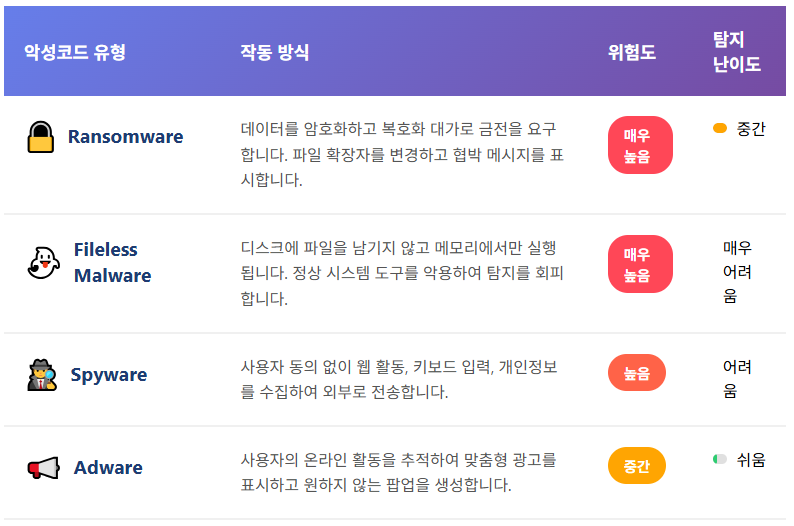
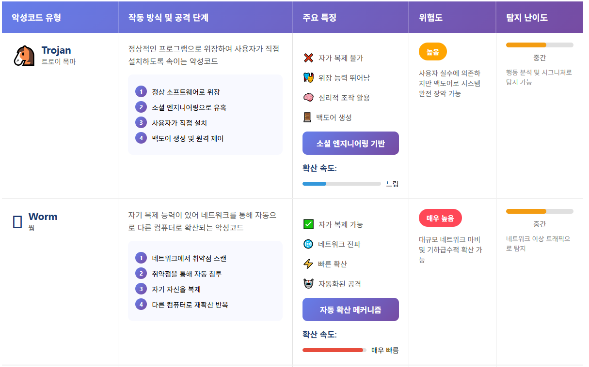
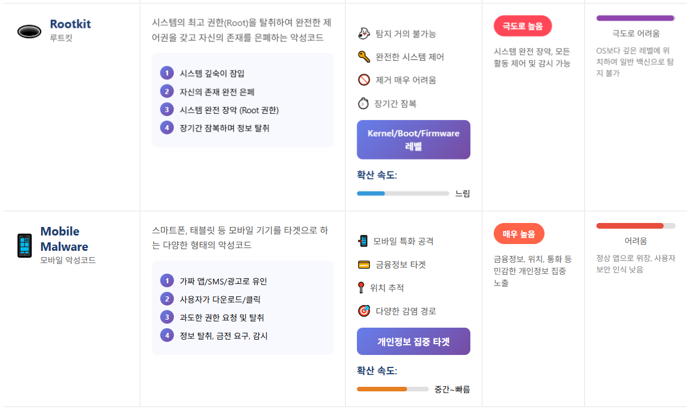
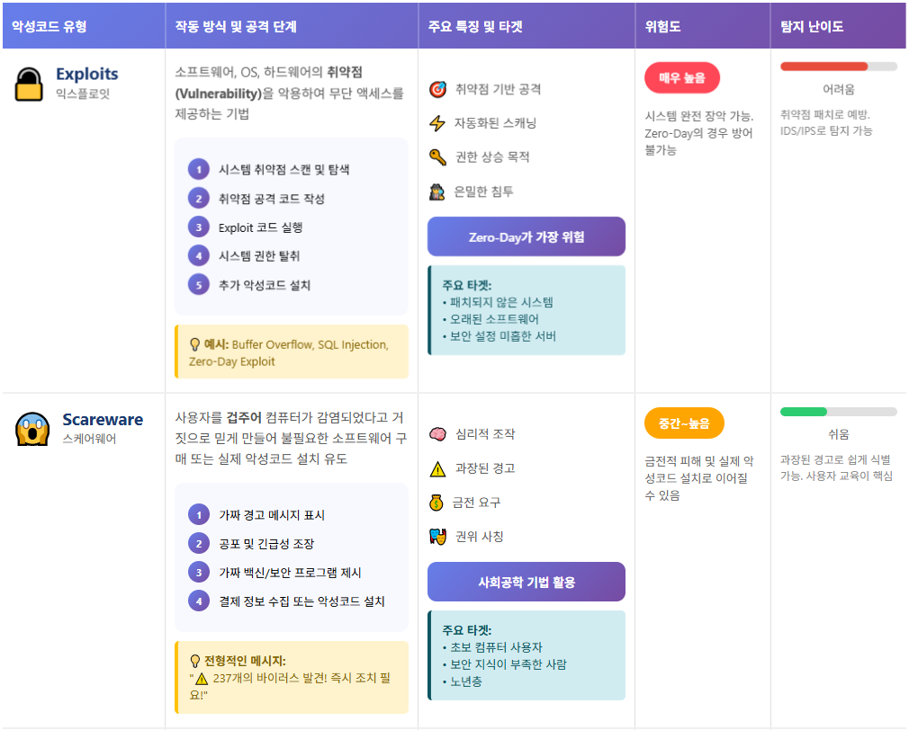
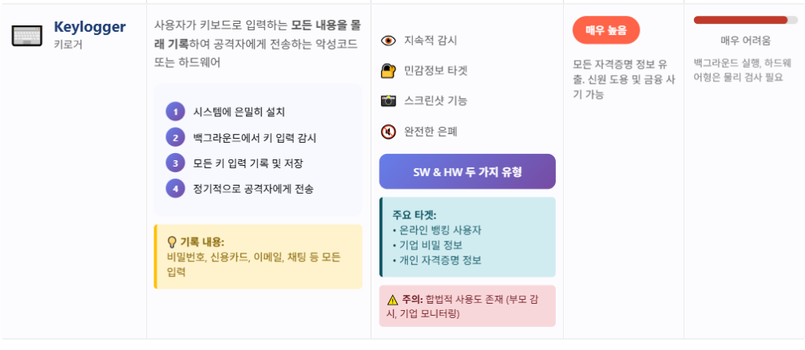
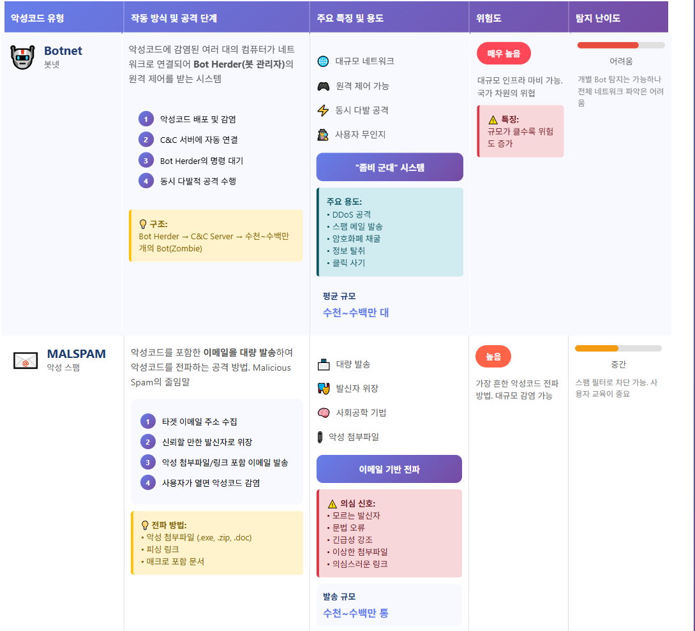
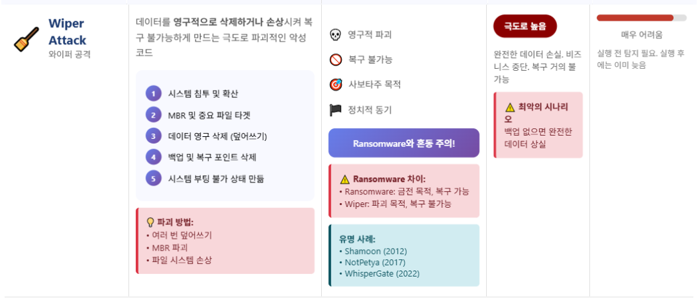

>🔒 사이버 보안 기초 수업 정리

12개의 주요 CyberAttack에 대해서 알아보자.

## Malware(악성코드)
📚**<span style="color: #008000">Malware</span>**: **"Malicious Software"**의 줄임말로, 컴퓨터, 네트워크, 서버를 해치기 위해 설계된 악의적인 소프트웨어

---

### Malware의 주요 types



#### 1. Ransomware
📚**<span style="color: #008000">Ransomware</span>**: 사용자의 파일을 **암호화(encrypt)** 해서 못 쓰게 만듦
* 돈을 요구하고, 돈을 주면 **복호화 키(decryption key)**를 준다고 약속

#### 2. Fileless Malware (파일리스 악성코드)
📚**<span style="color: #008000">Fileless Malware</span>**: 파일로 저장되지 않고 메모리(RAM)에서만 실행
* 정상적인(legimitate) 도구(PowerShell, WMI 등)를 악용
* 탐지가 매우 어려움

#### 3. Spyware (스파이웨어)
📚**<span style="color: #008000">Spyware</span>**: 사용자 동의 없이 웹 활동을 수집
* 방문한 사이트, 입력한 비밀번호, 개인정보 등을 훔침

#### 4. Adware (애드웨어)
📚**<span style="color: #008000">Adware</span>**: 온라인 활동을 감시해서 맞춤형 광고를 보여줌
* 원하지 않는 팝업이 계속 뜸

✅**Spyware와 차이점:**  
* `Spyware`: 정보를 "훔치는" 것이 목적
* `Adware`: 광고를 "보여주는" 것이 목적 (하지만 정보도 수집함)

---

#### Fileless Malware 탐지 방법

{:.prompt-warning}
> 바이러스 백신 S/W, 화이트리스트 기반 방식으로는 탐지 불가!
>

##### 1. Malware 관련 활동 식별
* **침해지표(IOC) 분석 대신 공격지표(IOA) 기반**
  * `IOC (Indicator of Compromise)`: 이미 침해당한 "흔적"을 찾음 → 사후 대응
  * `IOA (Indicator of Attack)`: 공격 "행동 패턴"을 찾음 → 사전 차단
* 비정상적인 코드 실행 분석
* Malware 파일 시그니처 탐지 대신 **행동 분석** 집중
  * 전통적 방법: "이 파일이 악성코드다"라는 데이터베이스와 비교
  * **Fileless 대응**: "이런 행동을 하면 악성코드다"라는 패턴 분석

##### 2. 관리형 위협 헌팅 (Managed Threat Hunting)
* 지속적인 모니터링
* 의심스러운 활동 발생 시 상세 분석 및 대응





#### 5. Trojan (트로이 목마)
📚**<span style="color: #008000">Trojan</span>**: 정상적인 소프트웨어로 **위장**하여 사용자가 직접 설치하도록 속이는 악성코드
* 스스로 복제하지 않음
* 백도어(Backdoor)를 만들어 해커가 원격 제어 가능

#### 6. Worms (웜)
📚**<span style="color: #008000">Worms</span>**: **자기 복제(Self-replicating)** 능력이 있는 악성코드
* 사용자의 행동 없이도 **스스로 네트워크를 통해 다른 컴퓨터로 확산함**

#### 7. Rootkits (루트킷)
📚**<span style="color: #008000">Rootkits</span>**: **시스템의 가장 깊은 곳(Root Level)**에 숨어서 악의적인 공격자에게 완전한 제어권을 주는 악성코드
* 탐지가 거의 불가능: 운영체제보다 깊은 곳에 숨어서 백신도 발견 못함
* 제거 어려움: 발견해도 완전히 제거하기 매우 어려움

#### 8. Mobile Malware (모바일 악성코드)
📚**<span style="color: #008000"> Mobile Malware</span>**: 스마트폰, 태블릿 등 모바일 기기를 타겟으로 하는 악성코드
* 감염경로:
  * 가짜 앱 다운로드: 정상 앱처럼 보이지만 악성코드 포함
  * 피싱 SMS/MMS: 문자 메시지에 포함된 악성 링크
  * 공공 Wi-Fi: 보안되지 않은 무료 Wi-Fi에서 감염





#### 9. Exploits
📚**<span style="color: #008000">Exploits</span>**: 소프트웨어, 운영체제, 또는 하드웨어의 **취약점(Vulnerability)**을 악용하여 **무단 액세스(Unauthorized Access)**를 제공하는 악성코드 또는 기법

#### 10. Scareware (스케어웨어)
📚**<span style="color: #008000"></span>**: 사용자를 겁주어(Scare) 컴퓨터가 감염되었다고 거짓으로 믿게 만들어, 불필요한 소프트웨어를 구매하거나 실제 악성코드를 설치하도록 유도하는 악성코드

예시 메세지:

```
⚠️ 경고! ⚠️
귀하의 컴퓨터가 237개의 바이러스에 감염되었습니다!
즉시 "Super Antivirus Pro"를 다운로드하지 않으면
모든 데이터가 삭제됩니다!
[지금 다운로드] [취소]
```

#### 11. keylogger
📚**<span style="color: #008000">Keylogger </span>**: 사용자가 키보드로 입력하는 모든 내용을 몰래 기록하여 공격자에게 전송하는 악성코드 또는 하드웨어





#### 12. Botnet (봇넷)
📚**<span style="color: #008000">Botnet (봇넷)</span>**: 악성코드에 감염된 여러 대의 컴퓨터들이 네트워크로 연결되어, Bot Herder(봇 관리자)라고 불리는 공격자의 원격 제어를 받는 시스템

#### 13. MALSPAM (악성 스팸)
📚**<span style="color: #008000">MALSPAM (악성 스팸)</span>**: "Malicious Spam"의 줄임말로, **악성코드를 포함한 이메일**을 대량으로 발송하여 악성코드를 전파하는 공격 방법

#### 14. Wiper Attack (와이퍼 공격)
📚**<span style="color: #008000">Wiper Attack (와이퍼 공격)</span>**: 데이터를 **영구적으로 삭제하거나 손상**시켜 복구 불가능하게 만드는 극도로 파괴적인 악성코드 공격