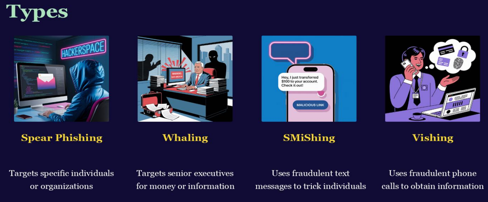
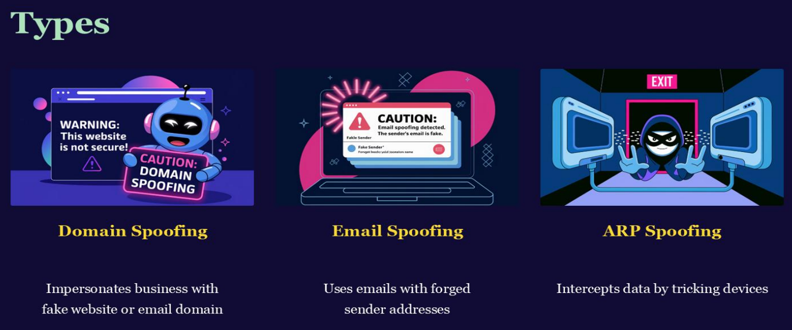
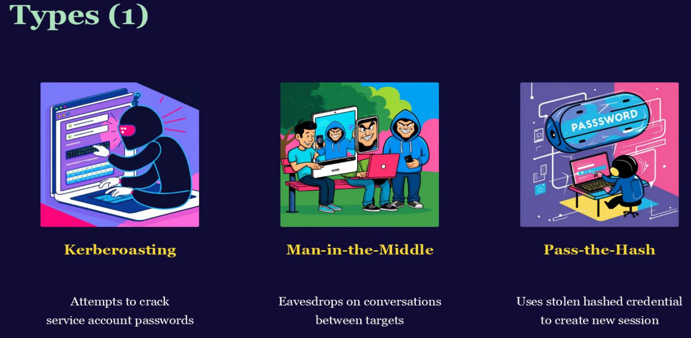
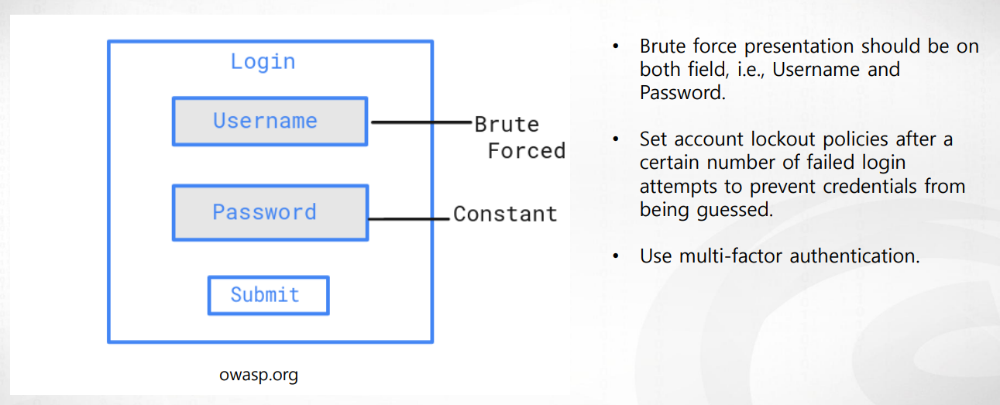
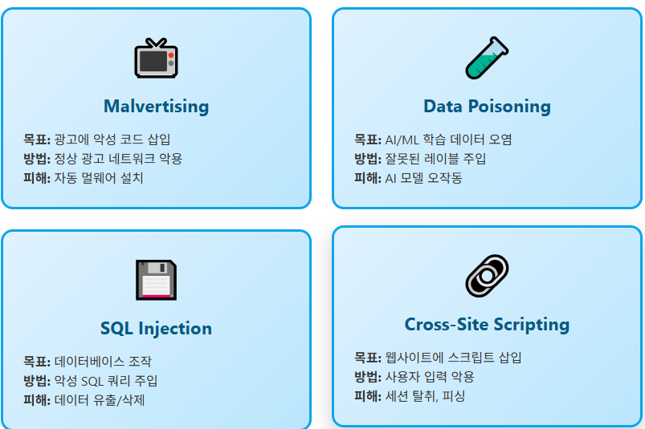

>🔒 사이버 보안 기초 수업 정리

## DoS (Denial-of-Service)
📚**<span style="color: #008000">DoS (Denial-of-Service)</span>**: 네트워크를 가짜 요청(false requests)으로 가득 채워서 정상적인 서비스 운영을 방해 - 서버의 자원을 고갈시키는 게 목표

* 일반 사용자들이 웹사이트 접속, 이메일 전송 등 일상적인 작업을 수행할 수 없게 됨

* **DDoS vs DoS**
  * `DoS`: 단일 시스템에서 공격 (막기 상대적으로 쉬움)
  * `DDoS` (Distributed DoS): 여러 시스템에서 동시에 공격 (훨씬 더 차단하기 어려움)

---

## Phishing (피싱)
📚**<span style="color: #008000">Phishing (피싱)</span>**: 합법적인 기관이나 사람인 척 속여서 민감한 정보를 훔치는 사이버 범죄

1. **Method (방법)**
* 이메일, SMS, 전화, 소셜 미디어를 통해 접근
* 피해자를 속여서 악성 링크 클릭이나 개인정보 입력을 유도

2. **Goal (목표)**
* 민감한 정보(비밀번호, 계좌번호) 획득
* 악성 소프트웨어(malware) 설치

3. **Targets (타겟)**
* 비밀번호, 계좌번호, 개인 데이터

---

### Phishing Types



#### 1. Spear Phishing (스피어 피싱)
📚**<span style="color: #008000"></span>**: 특정 개인이나 조직에 맞춤화된 공격(피해자의 이름, 직장, 관심사 등을 조사해서 활용)

#### 2. Whaling (웨일링)
📚**<span style="color: #008000"> Whaling (웨일링)</span>**: 고위 임원 (CEO, CFO 등)의 큰 물고기를 노리는 공격

#### 3. SMiShing (스미싱)
📚**<span style="color: #008000">SMiShing (스미싱)</span>**: 일반 개인들 대상으로 SMS(문자 메시지)를 통한 피싱

#### 4. Vishing (비싱)
📚**<span style="color: #008000">Vishing (비싱)</span>**: 일반 개인 대상으로 전화를 통한 피싱

---

## Spoofing (스푸핑)
📚**<span style="color: #008000">Spoofing (스푸핑)</span>**: 공격자가 신뢰할 수 있는 출처인 것처럼 위장하여 시스템이나 사람을 속이는 공격

* **알려진(known) 또는 신뢰받는(trusted) 출처**로 위장
* 신뢰를 얻기 위한 **사칭(Impersonation)**
* **목적:**
  * 시스템에 무단 접근
  * 민감한 정보 탈취
  * 악성 소프트웨어 설치

---

### Spoofing types



#### 1. Domain Spoofing (도메인 스푸핑)
📚**<span style="color: #008000">Domain Spoofing (도메인 스푸핑)</span>**:  정상적인 기업의 웹사이트나 이메일 도메인을 모방

예시:  
* 진짜: `amazon.com`
* 가짜: `amazοn.com` (그리스 문자 'ο' 사용)
* 가짜: `amazon-security.com`
* 가짜: `support-amazon.com`

#### 2. Email Spoofing (이메일 스푸핑)
📚**<span style="color: #008000"></span>**: 발신자 주소를 위조하여 신뢰받는 사람이나 기관에서 온 것처럼 보이게 함

* SMTP(Simple Mail Transfer Protocol)는 기본적으로 **발신자 인증을 하지 않음**

#### 3. ARP Spoofing
📚**<span style="color: #008000">ARP Spoofing</span>**: 네트워크에서 장치들 간의 통신을 가로채는 기술적 공격

**ARP(Address Resolution Protocol)**  
- IP 주소를 **MAC 주소(물리적 주소)**로 변환하는 프로토콜
- `192.168.1.1`은 누구야? → "저요! 제 MAC은 AA:BB:CC:DD:EE:FF입니다"

**공격 과정:**
1. 공격자가 네트워크에 연결
2. 가짜 ARP 응답을 브로드캐스트: "나는 라우터입니다!"
3. 컴퓨터 A는 모든 데이터를 공격자에게 전송
4. 공격자는 데이터를 복사한 후 진짜 라우터로 전달 (눈치채지 못하게)
5. Man-in-the-Middle (중간자) 공격 성공!

---

## Identity-based Attacks (신원 기반 공격)
📚**<span style="color: #008000">Identity-based Attacks (신원 기반 공격)</span>**: 공격자가 합법적인 사용자의 신원(credentials)을 훔쳐서 정상 사용자처럼 행동  
* 탐지가 매우 어려움

**1. Challenge (도전 과제)**
- 유효한 자격 증명을 사용할 때 탐지하기 어려움
- 정상적인 로그인과 구별이 불가능

**2. Method (방법)**
- 공격자(Adversary)가 합법적인 사용자로 가장
- 피싱, 데이터 유출, 크리덴셜 스터핑 등으로 자격 증명 획득

**3. Impact (영향)**
- 일반적인 행동과 구별하기 어려움
- 정상 사용자처럼 보이므로 보안 시스템을 우회

### Identity-based Attacks의 Types



#### 1. Kerberoasting (커버로스팅)
📚**<span style="color: #008000">Kerberoasting (커버로스팅)</span>**: Kerberos 인증 시스템의 취약점을 악용하여 서비스 계정의 비밀번호를 크래킹하는 공격  
* kerberos: Windows Active Directory의 기본 인증 프로토콜
  * 티켓 기반 시스템 (Ticket Granting System)
  * 사용자가 한 번 로그인하면 여러 서비스에 접근 가능

#### 2. Man-in-the-Middle (MitM, 중간자 공격)
📚**<span style="color: #008000">MitM(Man-in-the-Middle)</span>**: 두 당사자 간의 통신을 공격자가 몰래 가로채고 엿보거나 조작하는 공격

**MitM 공격:**  

```
[Alice] ←→ [공격자] ←→ [Bob]
         ↓
    모든 데이터 복사/조작
```

#### 3. Pass-the-Hash (PtH, 해시 전달)
📚**<span style="color: #008000">Pass-the-Hash (PtH, 해시 전달)</span>**: 비밀번호를 몰라도 해시값만으로 인증할 수 있는 공격  
- Windows는 비밀번호를 `해시(NTLM)`로 저장
- 일부 프로토콜은 **해시만으로 인증 가능** (비밀번호 불필요!)

#### 4. Golden Ticket (황금 티켓)
📚**<span style="color: #008000">Golden Ticket (황금 티켓)</span>**: Kerberos의 최고 권한인 **도메인 관리자 티켓을 위조**하는 공격

* **공격 효과:**

```
공격자: KRBTGT 해시로 "나는 도메인 관리자"라는 위조 티켓 생성
시스템: (티켓 검증) → 유효한 티켓이네요! 통과!
공격자: 도메인의 모든 시스템/리소스에 접근 가능!
```

#### 5. Silver Ticket (은색 티켓)
📚**<span style="color: #008000">Silver Ticket (은색 티켓)</span>**: 특정 서비스에만 접근 가능한 위조 티켓을 만드는 공격  

✅**Golden vs Silver:**  

| 특징        | Golden Ticket | Silver Ticket    |
| ----------- | ------------- | ---------------- |
| 필요한 해시 | KRBTGT (DC)   | 특정 서비스 계정 |
| 권한 범위   | 전체 도메인   | 특정 서비스만    |
| 탐지 가능성 | 극도로 낮음   | 낮음             |
| 난이도      | 어려움        | 상대적으로 쉬움  |

#### 6. Credential Harvesting (자격증명 수집)
📚**<span style="color: #008000">Credential Harvesting (자격증명 수집)</span>**: 다양한 방법으로 사용자의 로그인 정보를 수집하는 공격

#### 7. Credential Stuffing (자격증명 채우기)
📚**<span style="color: #008000"></span>**: 한 사이트에서 유출된 자격증명을 **다른 사이트에 자동으로 시도**하는 공격  

✅**작동 원리:**  

```
1단계: 데이터 유출 사건에서 자격증명 수집
        예: 포럼 사이트 해킹 → 100만 개 계정 유출

2단계: 자동화 도구로 다른 사이트에 대량 로그인 시도
        이메일: test@email.com
        비밀번호: Password123!
        ↓
        은행, 쇼핑몰, 소셜미디어 등 모두 시도

3단계: 성공한 계정 발견 (많은 사람이 같은 비밀번호 재사용!)
```

#### 8. Password Spraying (비밀번호 뿌리기)
📚**<span style="color: #008000">Password Spraying (비밀번호 뿌리기)</span>**: 많은 계정에 소수의 일반적인 비밀번호를 시도하는 공격

```
많은 계정에 하나의 비밀번호 시도
user1: Password123! ✅ (성공!)
user2: Password123! ❌
user3: Password123! ❌
user4: Password123! ✅ (성공!)
...
user1000: Password123! ❌
→ 계정 잠김 정책 우회!
```



#### 9. Brute Force (무차별 대입)
📚**<span style="color: #008000">Brute Force (무차별 대입)</span>**: 가능한 모든 조합을 체계적으로 시도하여 비밀번호를 찾는 공격  

```
한 계정에 모든 비밀번호 시도
user1: password1 ❌
user1: password2 ❌
user1: password3 ❌
...
user1: password9999 ❌
→ 계정 잠김! 🔒
```

#### 10. Downgrade Attack (다운그레이드 공격)
📚**<span style="color: #008000">Downgrade Attack (다운그레이드 공격)</span>**: 시스템을 더 취약한 보안 모드나 프로토콜로 강제하는 공격  

❌**공격 과정:**  

```
클라이언트: "TLS 1.3으로 연결하고 싶어요"
공격자: (연결 실패인 척) "TLS 1.3 안 돼요"
클라이언트: "그럼 TLS 1.2는요?"
공격자: "그것도 안 돼요"
클라이언트: "SSLv3?"
공격자: "OK!" (취약점 악용 준비 완료)
```

---

## Code Injection Attacks
📚**<span style="color: #008000">Code Injection Attacks</span>**: 공격자가 악의적인 코드를 취약한 시스템에 주입하여 시스템의 동작을 변경시키는 공격  

1. **Method (방법)**
* 취약한 시스템에 악성 코드를 주입
* 사용자 입력이 제대로 검증되지 않을 때 발생

2. **Purpose (목적)**
* 대상 시스템의 행동 과정을 변경
* 권한 없이 데이터 접근, 수정, 삭제가 가능

3. **Types (유형)**
* 여러 변형이 존재하며, 각각 다른 대상과 방법 존재

### Code Injection Attacks Types

