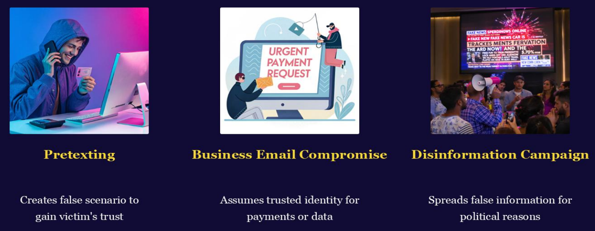
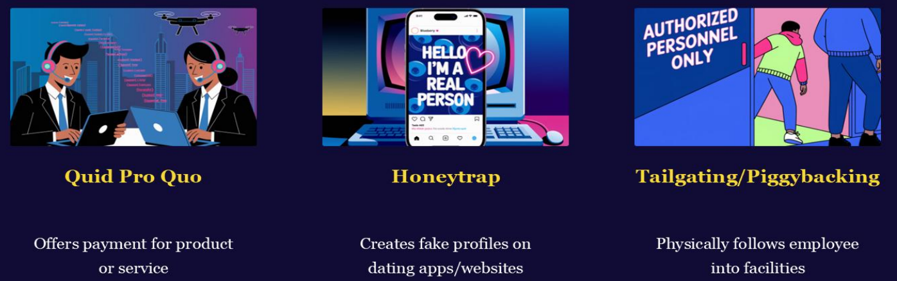
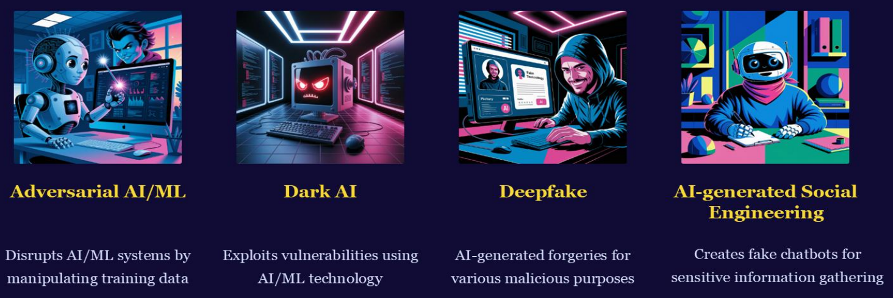

>🔒 사이버 보안 기초 수업 정리

---

## Supply Chain Attacks (공급망 공격)
📚**<span style="color: #008000">Supply Chain Attacks (공급망 공격)</span>**:신뢰하는 제3자를 통해 침투하는 공격  
* 직접 공격하기 어려운 대상을, 보안이 취약한 공급망을 통해 우회 공격

1. **Target (타겟)**
* 신뢰받는 제3자 벤더 (Trusted third-party vendors)
* 소프트웨어/하드웨어 공급업체

2. **Types (유형)**
* `Software Supply Chain Attacks` (소프트웨어)
* `Hardware Supply Chain Attacks` (하드웨어)

3. **Vulnerability (취약점)**
* 현대 소프트웨어는 수많은 오픈소스 컴포넌트를 사용합니다
* 평균적으로 프로젝트의 80%가 제3자 코드

---

## Social Engineering Attacks (사회공학 공격)
📚**<span style="color: #008000">Social Engineering Attacks (사회공학 공격)</span>**: "인간의 심리"를 공격하는 기법  

1. **Technique (기법)**
* 심리적 조작 (Psychological manipulation)
* 사람의 신뢰, 두려움, 호기심 악용

2. **Motivators (동기 유발 요소)**
* Love (사랑): 로맨스 스캠
* Money (돈): 복권 당첨, 투자 사기
* Fear (두려움): 계정 정지, 법적 문제
* Status (지위): VIP 초대, 독점 제안

3. **Goal (목표)**
* 민감한 정보 수집 (비밀번호, 계좌번호)
* 갈취 (Extortion)
* 이득 획득 (Advantage)

### Social Engineering Types



#### 1. Pretexting (구실 만들기)
📚**<span style="color: #008000">Pretexting (구실 만들기)</span>**: 가짜 시나리오를 만들어 피해자의 신뢰를 얻는 기법  

#### 2. Business Email Compromise (BEC, 비즈니스 이메일 침해)
📚**<span style="color: #008000">Business Email Compromise (BEC, 비즈니스 이메일 침해)</span>**: 신뢰받는 사람(보통 임원)인 척하여 송금이나 데이터를 요구하는 공격  

#### 3. Disinformation Campaign (허위정보 캠페인)
📚**<span style="color: #008000">Disinformation Campaign (허위정보 캠페인)</span>**: 정치적, 사회적 목적으로 대규모 허위 정보를 퍼뜨리는 공격  



#### 4. Quid Pro Quo (대가 교환 공격)
📚**<span style="color: #008000">Quid Pro Quo</span>**: 격자가 서비스나 혜택을 제공하는 대가로 정보를 요구하는 공격  
* `Quid Pro Quo`: 라틴어 - "무언가를 얻기 위해 무언가를 주다"라는 뜻

```
이메일: amrazon@email.com
"축하합니다!

Amazon 고객 만족도 설문에 참여하시면
$100 기프트 카드를 드립니다!

간단한 5개 질문에 답해주세요:

1. 성명:
2. 이메일:
3. 전화번호:
4. Amazon 계정 이메일:
5. 가장 최근 구매 제품:

설문 완료 후 기프트 카드를 보내드립니다!"
```

#### 5. Honeytrap (허니트랩, 미인계)
📚**<span style="color: #008000">Honeytrap (허니트랩, 미인계)</span>**: 로맨스나 성적 매력을 이용하여 타겟에게 접근하고 정보를 얻거나 조작하는 공격

#### 6. Tailgating/Piggybacking (동행 침입)
📚**<span style="color: #008000">Tailgating/Piggybacking (동행 침입)</span>**: 물리적 보안을 우회하기 위해 권한이 있는 사람을 따라 출입 통제 구역에 들어가는 기법  

✅**차이점:**  
* **Tailgating**:
  * 허가 없이 몰래 따라 들어감
  * 직원이 모르거나 무시함
  * 의도적으로 보안 무시

* **Piggybacking**:
  * 직원이 문을 잡아주도록 속임
  * 직원의 친절함 악용
  * 동의하에 진입 (하지만 속임)

---

## Insider Threats (내부자 위협)
📚**<span style="color: #008000">Insider Threats (내부자 위협)</span>**: 조직 내부에서 발생하는 보안 위협  
* 외부 해커보다 더 위험할 수 있는 이유는 이들이 이미 시스템 접근 권한을 가지고 있기 때문!

1. **Actors (행위자)**
* 현직 직원: 현재 회사에서 일하고 있는 직원으로, 정상적인 접근 권한을 남용
* 전직 직원: 퇴사 후에도 계정이 비활성화되지 않았거나, 재직 중 얻은 정보를 악용

2. **Motivators (동기)**
* `Financial gain` (금전적 이득): 데이터를 판매하거나 경쟁사에 정보 제공
* `Emotional coercion` (감정적 강요): 불만, 복수심, 또는 협박에 의한 행동

3. **Types (유형)**
* `Malicious threats` (악의적 위협): 의도적으로 조직에 피해를 주려는 행위
  * 예: 고의로 데이터 삭제, 기밀 정보 유출

* `Negligent threats` (부주의 위협): 실수나 보안 인식 부족으로 인한 위협
  * 예: 피싱 이메일 클릭, 비밀번호를 포스트잇에 적어두기

---

## DNS Tunneling (DNS 터널링)
📚**<span style="color: #008000">DNS Tunneling (DNS 터널링)</span>**:  DNS 프로토콜을 악용하여 방화벽과 보안 시스템을 우회하는 공격 기법  

1. **Method (방법)**
* **DNS 쿼리 활용**: DNS는 도메인 이름을 IP 주소로 변환하는 정상적인 프로토콜
* 보안 우회: 대부분의 방화벽이 DNS 트래픽을 차단하지 않는다는 점을 악용
* 데이터 은닉: DNS 요청/응답에 악성 데이터를 숨김

2. **Purpose (목적)**
* 데이터 전송: 네트워크 내부에서 외부로 데이터 유출
* 코드 전송: 악성 코드를 네트워크 내부로 전송

3. **Impact (영향)**
* `Command-and-Control (C&C)`: 공격자가 감염된 시스템을 원격으로 제어
* 지속적인 접근: 장기간 탐지되지 않고 활동 가능

---

## IoT-based Attacks (IoT 기반 공격)
📚**<span style="color: #008000">IoT-based Attacks (IoT 기반 공격)</span>**: 스마트 기기들의 보안 취약점을 악용하는 공격

1. **Target (공격 대상)**
* **IoT 기기**: 인터넷에 연결된 모든 스마트 기기
  * 예: 스마트 도어락, IP 카메라, 웨어러블 기기, 스마트 온도조절기

* IoT 네트워크: 이러한 기기들이 연결된 네트워크 전체

2. **Impact (영향)**
* 기기 제어: 공격자가 기기를 원격으로 조작
  * 예: 카메라를 통한 도청, 도어락 열기

* 데이터 탈취: 기기가 수집한 개인정보 유출
  * 예: 위치 정보, 생활 패턴, 음성 데이터
* 봇넷 구축: 여러 기기를 감염시켜 DDoS 공격에 활용

3. **Future (미래 전망)**
* 5G 네트워크와 함께 성장: 5G로 더 많은 기기가 연결되면서 공격 표면 확대
* 스마트 시티: 교통, 전력 등 사회 기반시설도 표적이 될 수 있음

---

## AI-powered Attacks
📚**<span style="color: #008000">AI-powered Attacks</span>**: 공지능(AI)과 머신러닝(ML) 기술을 악용하여 수행되는 차세대 사이버 공격

1. **Trend (추세)**
* 공격자의 `AI/ML` 활용: 해커들이 인공지능과 머신러닝 도구를 공격 무기로 사용
* **자동화**된 공격: AI가 취약점을 자동으로 찾고 공격을 최적화

2. **Purpose (목적)**
* **네트워크 침투**: 보안 시스템의 약점을 AI로 분석하여 접근
* 민감 정보 탈취: 자동화된 방식으로 대규모 데이터 수집

3. **Challenge (도전과제)**
* 양날의 검: 사이버보안 전문가들도 AI/ML을 방어에 사용

---

### AI-powered Attacks Types



#### 1. Adversarial AI/ML (적대적 AI/ML)
📚**<span style="color: #008000">Adversarial AI/ML (적대적 AI/ML)</span>**: 머신러닝 시스템을 속이거나 무력화시키기 위해 훈련 데이터나 입력 데이터를 조작하는 공격

* **훈련 데이터 조작 (Data Poisoning)**
  * AI 모델이 학습하는 데이터에 악성 샘플을 주입
  * → 모델이 잘못된 패턴을 학습하도록 유도

* **입력 데이터 조작 (Evasion Attack)**
* 이미 훈련된 모델을 속이기 위해 입력을 미세하게 변경

#### 2. Dark AI (다크 AI)
📚**<span style="color: #008000">Dark AI (다크 AI)</span>**: AI/ML 기술 자체의 취약점을 악용하거나, AI를 악의적인 목적으로 사용하는 공격 

#### 3. Deepfake (딥페이크)
📚**<span style="color: #008000">Deepfake (딥페이크)</span>**: AI를 사용하여 실제처럼 보이는 가짜 이미지, 오디오, 비디오를 생성하는 기술

#### 4. AI-generated Social Engineering (AI 생성 소셜 엔지니어링)
📚**<span style="color: #008000">AI-generated Social Engineering (AI 생성 소셜 엔지니어링)</span>**: AI를 활용하여 사람을 속이고 민감한 정보를 얻어내는 정교한 사회공학 공격

* 가짜 챗봇 생성
  * 실제 사람처럼 대화하는 AI 챗봇
  * 자연스러운 대화로 신뢰 구축
  * 점진적으로 민감한 정보 수집