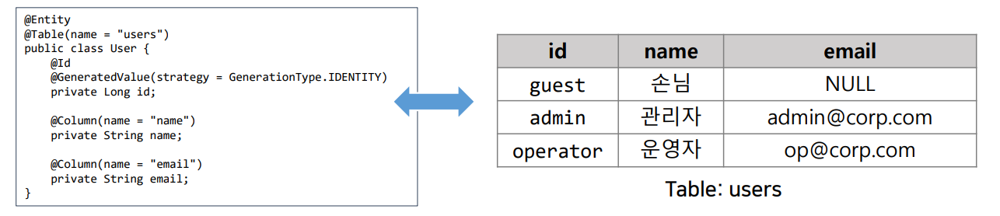
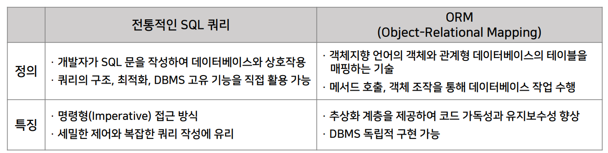
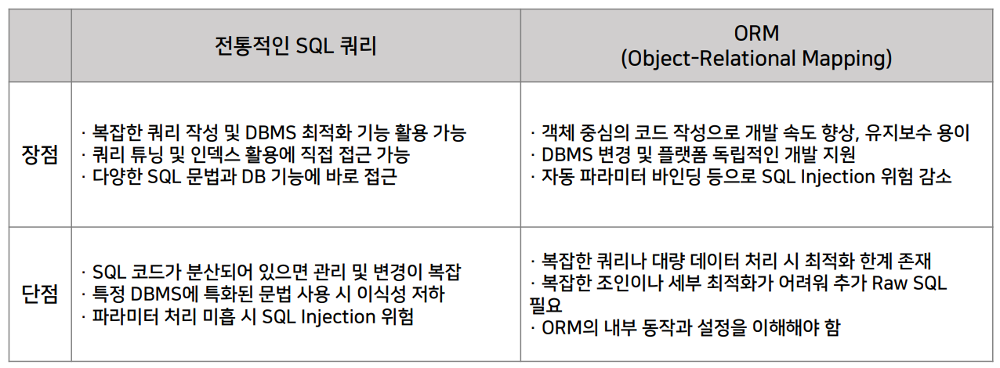
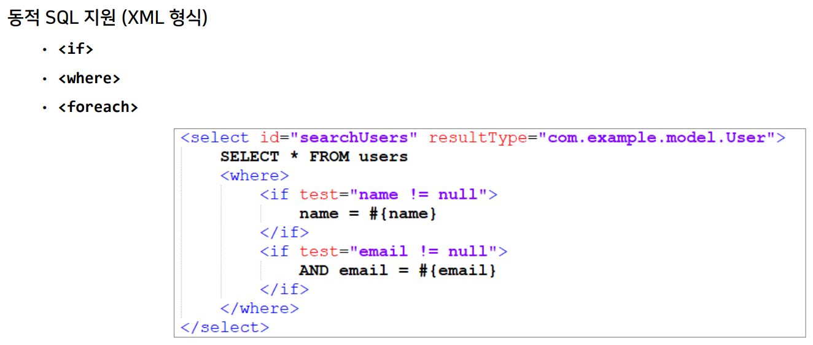
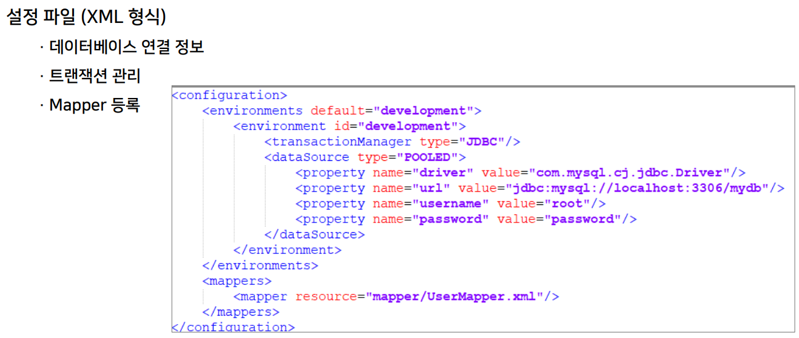
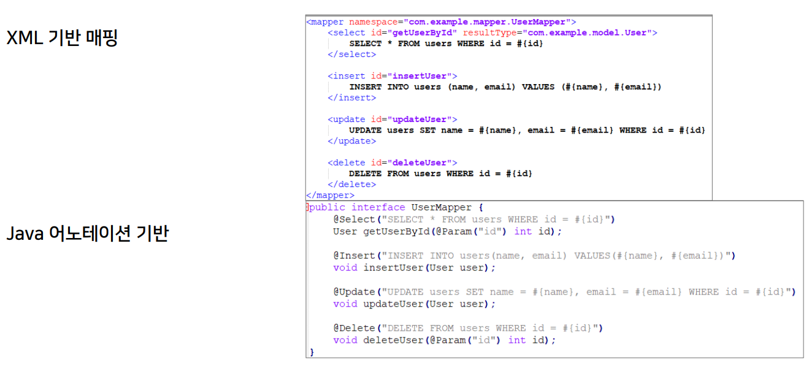

>🔒 시큐어 코딩 수업 정리

## ORM 프레임워크
📚**ORM**: 객체 지향 언어의 객체와 관계형 데이터베이스의 테이블 간 데이터를 자동으로 매핑하는 기술

✅**ORM 필요성**:  
* **불일치 문제 해결**: 객체 모델과 스키마 간 불이치 해소
* **개발 생산성 향상**: SQL 직접 작성 부담 감소, 코드 간결화
* **유지보수성 및 보안 강화**: 데이터베이스 접근 추상화로 보안 취약점(예: SQL Injection) 최소화

### 전통적 SQL 쿼리 VS ORM 비교

> 각각 정의와 특징 비교

> 장점과 단점 비교

* **전통적 SQL 쿼리 방식이 적합한 경우**
  * 성능 튜닝이 중요한 경우
  * 복잡한 다중 조인 쿼리 작성 시
  * 특정 DBMS 고유 기능(예: 저장 프로시저, 윈도우 함수)을 적극 활용할 때

* **ORM 사용이 적합한 경우**
  * CRUD 중심의 애플리케이션, 빠른 프로토타이핑 및 유지보수가 중요한 경우
  * 데이터베이스 독립성이 필요하거나 객체 지향 패러다임을 선호할 때

---

### ORM 주요 기능
1. **매핑 기능**
* **객체-테이블 매핑**
  * 클래스와 테이블, 필드와 컬럼을 자동 매핑 → SQL 작성 없이 데이터 조작
* **관계 매핑**
  * `1:1`, `1:N`, `N:M` 관계를 어노테이션 또는 XML 설정을 통해 정의 및 관리
* **자동 스키마 생성**
  * 도메인 모델 변경에 따라 DB 스키마를 자동 생성하거나 업데이트 가능

2. **CRUD 작업 지원**
* `Create`, `Read`, `Update`, `Delete` 기능을 **객체 조작**만으로 처리
* 데이터베이스 직접 접근 없이, **객체 상태 변경에 따른 자동 동기화**(`DIRTY CHECKING`)

3. **고급 쿼리 기능**
* **객체 지향 쿼리 언어 (HQL, JPQL 등)**
  * SQL보다 **추상화된 방식**으로 데이터 조회 및 조작 가능
* **Criteria API**
  * 프로그래밍 방식으로 동적 쿼리 작성 지원
* **네이티브 쿼리 지원**
  * 필요시 직접 SQL을 실행할 수 있는 기능 제공

4. **Lazy Loading & 캐싱**
* **지연 로딩(Lazy Loading)**
  * 실제 사용 시점에 연관 데이터를 로드하여 초기 로딩 비용 절감
* **1차/2차 캐시**
  * 동일 세션(1차 캐시) 내, 애플리케이션 전역(2차 캐시)에서 캐시를 활용해 성능 최적화

5. **트랜잭션 관리**
* **자동 트랜잭션 처리**
  * 명시적 트랜잭션 없이, ORM 프레임워크가 트랜잭션 경계를 관리
  * 일일히 커밋과 롤백 코드를 작성 안해도 됨
* **동시성 제어 및 낙관적/비관적 Lock 지원**
  * 데이터 무결성을 유지하며 여러 사용자의 동시 접근 처리
  * **낙관적 Lock**: 데이터를 읽을 때 버전을 읽고 수정할 때 버전 번호 확인 → 버전이 다르면 다른 사람이 먼저 수정함, 즉 충돌!
  * **비관적 Lock**: 데이터를 읽을 때 DB에서 Lock을 걸고 수정, 작업 완료 후 Lock 해제

6. **기타 부가 기능**
* **연관 관계 및 Fetch 전략**
  * 연관 객체 로딩 전략 설정으로 성능 및 메모리 최적화
* **유연한 설정 및 확장성**
  * XML, 어노테이션, 플러그인 등을 통한 다양한 설정 옵션과 확장성 제공

---

## MyBatis 프레임워크 활용
📚**MyBatis**: Java Persistence 프레임워크로, **SQL 쿼리와 자바 객체 간의 매핑**을 지원  
* 개발자가 직접 SQL을 작성한 후, **XML이나 어노테이션을 통해 매핑을 설정**하여 DB와 상호작용

✅**특징**:  
* 복잡한 쿼리와 최적화에 유리
* ORM의 추상화 없이 직접 SQL 작성으로만 세밀한 제어 가능
* XML, 어노테이션 등 다양한 방식으로 매핑 설정 가능

### MyBatis 주요 기능
1. **SQL 매핑 및 실행**
* Mapper 파일(`XML`) 또는 어노테이션 기반으로 SQL 문을 정의
* SQL 문과 자바 객체 간의 **자동 매핑 제공**

2. **동적 SQL 지원**
* **조건문(`<if>`, `<choose>`) 및 반복문(`<foreach>`)**을 사용하여 유연한 쿼리 작성 가능

3. **타입 핸들러(Type Handler)**
* **자바 객체와 DB 데이터 간 변환**을 위한 사용자 정의 타입 핸들러 지원

4. **플러그인 기능**
* 인터셉터를 통해 쿼리 실행 전/후 로직을 확장하거나 커스터마이징 가능

---

### Mybatis 설정 및 구성

1. **설정 파일(mybatis-config.xml)**
* 환경(데이터소스, 트랜잭션 매니저 등) 설정 및 전역 옵션 구성

2. **Mapper 파일 구성**
* SQL 문과 매핑 정보를 담은 XML 파일 또는 어노테이션 사용
* 네임스페이스를 통해 Mapper를 구분하고 재사용성 향상

3. **데이터 소스 및 세션 관리**
* **DB 커넥션 풀**과 `SqlSessionFactory`를 이용해 세션 생성 및 관리
* 스프링과 연동 시, **스프링 부트 자동 설정 및 통합 활용**

---

### Mybatis 장단점 및 사례
✅**장점:**  
* SQL을 직접 작성하므로, 복잡한 쿼리 및 성능 튜닝에 유리
* ORM보다 간단한 설정으로 데이터 매핑을 관리
* DB 작업의 전 과정을 개발자가 직접 관리 가능

❌**단점:**  
* 직접 SQL 작성 시, 비슷한 쿼리의 중복 관리 필요
* ORM처럼 완전한 객체 관계 자동 매핑은 제공하지 않음
* XML/어노테이션 매핑 파일 관리 및 동적 SQL 작성에 대한 학습 필요

💡**사용 사례**:  
* 대규모 데이터 처리, 복잡한 쿼리 최적화가 요구되는 애플리케이션
* 기존 JDBC의 반복 작업을 줄이면서도 세밀한 SQL 제어가 필요한 프로젝트

---

## ORM 사용 시 보안 이슈
* ORM의 역할
  * 객체와 관계형 데이터베이스 간 매핑을 자동화하여 개발 생산성을 높임
  * SQL을 직접 작성하지 않고도 CRUD 및 복잡한 쿼리 수행 가능

* **보안 이슈의 중요성**
  * ORM 자체가 `SQL Injection` 등을 기본적으로 방어하지만, 잘못된 사용 시 취약점이 발생할 수 있음
  * 매핑, 캐싱, 동적 쿼리 등 여러 요소가 보안에 영향을 미칠 수 있음

### SQL Injection + 동적 쿼리 취약점

{:.prompt-warning}
> 기본적인 ORM은 파라미터 바인딩으로 보호되지만, **동적 쿼리를 문자열 결합 방식으로 작성**하면 SQL 인젝션 발생할 수 있음
>

**→ Native Query 사용 시 주의 필요!**

✅**대응 방안**:  
* 항상 안전한 파라미터 바인딩 방식을 사용해야 함
* 동적 쿼리 작성 시 - ORM이 제공하는 동적 SQL 태그(예: MyBatis의 `if`, `choose` 등) 사용
* Native Query 사용 시 별도 검증 및 파라미터 바인딩 철저

---

### 캐싱 및 지연 로딩 관련 보안 이슈
* **캐싱 취약점**
  * 2차 캐시나 공유 캐시 설정 시 민감 데이터가 의도치 않게 **노출될 가능성**
  * 캐시 무결성 관리 미흡 시, 캐시 변조 공격(`Cache Poisoning`) 위험

* **지연 로딩 및 데이터 노출**
  * 필요 이상으로 연관된 데이터가 지연 로딩되어, 예상치 못한 데이터 노출 발생 가능
  * ORM 매핑 시 **민감 정보가 포함된 엔티티를 불필요하게 로드**하는 문제

✅**대응 방안**:  
* 캐시 설정 시 민감 데이터 제외 및 접근 제어 강화
* `Lazy Loading` 설정과 연관 데이터 조회 시 **필요한 데이터만 선택적으로 로드**하도록 설계

---

### 매핑, 설정 및 권한 관리 취약점
* **잘못된 매핑 설정**
  * 엔티티 매핑 오류로 인한 데이터 누락 또는 과도한 데이터 노출
  * 양방향 매핑 및 연관 관계 설정 미흡 시, 무한 루프 또는 불필요한 데이터 로드 발생

* **Mass Assignment (대량 할당) 취약점**
  * 클라이언트 입력 값을 그대로 엔티티에 바인딩할 경우, 원치 않는 필드 변경 가능

✅**대응 방안**:  
* 엔티티 매핑 시 - 민감 필드는 **명시적으로 제외하거나 읽기 전용**으로 설정
* 입력값 검증과 DTO(Data Transfer Object)를 활용하여, 대량 할당 공격 방지