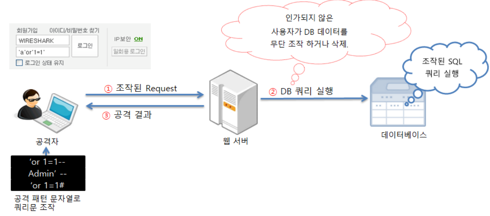
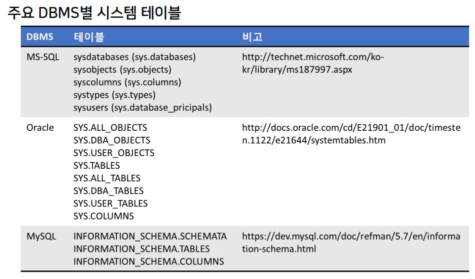
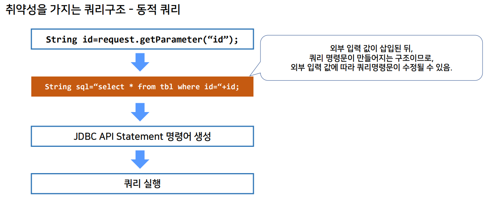
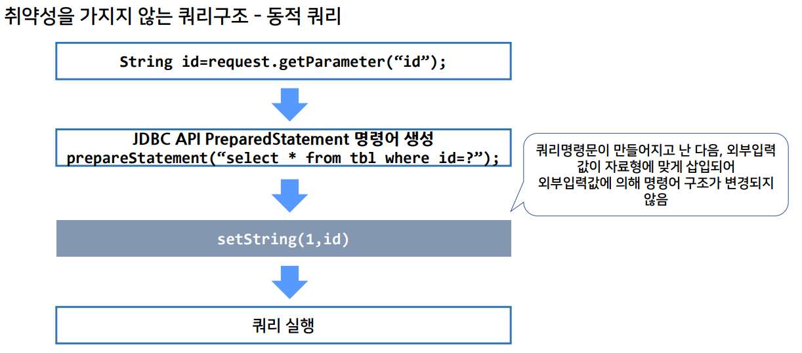
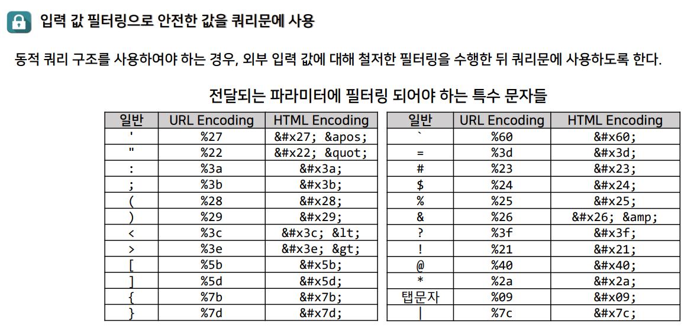

>🔒 시큐어 코딩 수업 정리

## SQL Injection
📚**<span style="color: #008000">SQL Injection</span>**: 웹앱에서 입력 받아 DB로 전달하는 **정상적인 쿼리(CRUD)를 변조, 삽입하여 데이터베이스에 불법적인 데이터 열람, 시스템 명령 수행 등 비정상적인 데이터 베이스에 접근하는 기법**  
* 모든 종류의 DBMS(Database Management System)에 적용 가능한 공격 기법이며, 지속적으로 발전되고 있음

❌**피해내용:**  
* 악성 스크립트 실행, 외부 프로그램 사용가능, DB 정보 열람,추가,수정,삭제 가능
* 프로시저를 통한 운영체제 명령어 수행, 불법 로그인 등의 침해 사고가 발생 가능



### SQL Injection 발생 원인

1. **동적 쿼리에서 사용자 입력 검증 부족**
* 폼, URL 파라미터, API 요청 등 **모든 외부 입력에 대해 검증 로직이 없는 경우** 발생
* 입력 값 내 특수문자(`'` , `"`, `;` 등)를 처리하지 않아 SQL 구문이 의도치 않게 변경됨

```sql
-- userInput에 admin' OR '1'='1 을 삽입하면 항상 참이 되어 인증 우회됨
SELECT * FROM users WHERE username = '" + userInput + "';
```

2. **에러 메세지 및 정보 노출**
* 애플리케이션에서 내부 에러 메시지 및 데이터베이스 정보를 노출할 경우, 공격자가 이를 분석하여 추가 공격을 설계할 수 있음.
* **에러 메시지에 포함된 내용으로 다양한 정보 획득 가능**
  * → SQL 구문 오류, 테이블명, 컬럼 명, DB 버전 등

```sql
-- userInput에 1' AND db_name() = 0-- 삽입하면 에러 메시지에 데이터베이스 이름이 드러남.
SELECT * FROM users WHERE usernamne = '" + userInput + "';
```

3. **권한 및 보안 설정 미흡**
* 애플리케이션에서 사용하는 DB 계정이 불필요한 권한(예: `DROP`, `ALTER`, `EXECUTE` 등)을 가지고 있을 경우, 공격자가 이를 악용 가능
* 취약한 저장 프로시저를 통해 시스템 명령어 실행이나 추가 권한 상승 공격 가능

---

### SQL Injection 공격 방식

```html
<form action="login.jsp">
    ID : <input type="text" name="id" />
    Password : <input type="password" name="password" />
</form>
```

위의 html에서의 id와 password 값이 서버로 보내지면 다음 java의 sql에 문자열로 저장된다.

```java
String sql = "select * from member where id = '" + request.getParameter("id") + "' " + "and password = '" + request.getParameter("password") + "' ";
statement.executeQuery(sql);
```

입력 예시  
* 정상 요청: `login.jsp?id=gildong&password=gdhong` 
* 공격 코드: `login.jsp?id=a' or 'a'='a&password=a' or 'a'='a`  
            `login.jsp?id=admin' -- &password=x`  
            `login.jsp?id=admin' # &password=x`

#### Error-based SQL Injection
📚**<span style="color: #008000">Error-based SQL Injection</span>**: 추가 공격에 필요한 정보가 오류 메시지에 포함되어 노출될 수 있도록 입력 값을 조작  

💡**공격 예시**:  
* `'`: 1개의 따옴표 → 인젝션 가능 여부 및 에러 메시지 내용 확인이 가능
* `' having 1 = 1 --` → 오류에서 테이블명, 컬럼 명 확인이 가능
* `' and db_name() = 1 --` → 현재 데이터베이스의 이름 확인이 가능
  * 오류메세지: `Conversion failed when converting the nvarchar value 'database_xmoonanx' to data type int.`
* `' and 1 = (select @@version) --` → 현재 설치된 SQL Server의 시스템 및 빌드 정보 확인이 가능

---

#### Union-based SQL Injection
📚**<span style="color: #008000">Union-based SQL Injection</span>**: UNION 명령어를 사용하여 원래 쿼리 결과와 공격자가 원하는 정보를 함께 출력시키는 기법

```sql
-- 첫번째 작은 따옴표는 무시
-- 1단계: 컬럼 수 확인 
'   admin' union select 1,2,3,4,5,6 #

-- 2단계: 데이터베이스 버전 확인 
'   admin' union select version(),2,3,4,5,6

-- 3단계: 스키마 정보 추출 
'   admin' union select schema_name,2,3,4,5,6 from information_schema.schemata #

-- 4단계: 테이블 목록 확인
'   admin' union select group_concat(table_name),2,3,4,5,6 from information_schema.tables where table_schema=database() #

-- 5단계: 사용자 계정 정보 탈취 
'   admin' union select idx,userid,userpw,username,5,6 from board_member #
```



* 공격자들이 DB 내부구조를 활용해서 공격하려면 DBMS 시스템 테이블의 구조를 파악해야한다.
* DB가 동작하는 동안 사용하는 테이블이므로 막는 것도 어렵다.
* 많은 애플리케이션들이 이런 시스템 테이블을 활용하는 경우도 많기 때문에
이런 상황이 아니라면 일반 사용자들의 권한을 막는게 좋다.

---

#### Blind SQL Injection
📚**<span style="color: #008000">Blind SQL Injection</span>**: 직접적인 결과 출력 없이 서버의 반응 차이를 이용하여 정보를 한 글자씩 추출하는 기법  
* **참인 조건(쿼리 실행 결과가 존재)과 거짓인 조건(쿼리 실행 결과가 없음)을 번갈아 가면서 입력**되도록 입력 값을 조작

`Content-based` 방식과 `Time-based` 방식이 있음

* **<span style="color: #008000">Content-based</span>**: 조건문의 참/거짓에 따른 페이지 내용 차이를 이용

```sql
-- 첫번째 작은 따옴표는 무시
-- a~z까지 첫 번째 글자가 'a'인지 확인 
'   Data' and substring(user_name(1),1,1)='a' --

-- 두 번째 글자 확인
'   Data' and substring(user_name(1),2,1)='d' --
```

* **<span style="color: #008000">Time-based</span>**: 조건문에 따른 응답 시간 차이를 이용

```sql
-- 조건이 참이면 5초 지연
'   Data' and substring(user_name(1),1,1)='a' waitfor delay '0:0:5'
-- 지속적으로 반복. 공격시간이 많이 걸리므로 툴에 의해 자동화 공격을 시도한다.
```

---

## SQL Injection 진단 방법

### 코드 리뷰
📚**<span style="color: #008000">코드 리뷰</span>**: 개발자가 작성한 소스 코드를 체계적으로 검토하여 버그 및 보안 취약점을 찾아내는 프로세스  
* SQL 인젝션과 같은 취약점은 코드 리뷰를 통해 조기에 발견할 수 있음

💡**SQL 인젝션 취약점의 주요 원인**  
* **동적 SQL 사용**: 사용자 입력 값을 문자열로 직접 쿼리에 삽입
* **입력 값 검증 미흡**: 사용자 입력에 대한 필터링 또는 이스케이핑이 부족
* **잘못된 권한 설정**: 데이터베이스 접근 권한이 과도하게 부여됨

✅**코드 리뷰 중요성**:  
* 보안 취약점이 제품 출시 전 단계에서 사전에 제거됨
* 팀 내 보안 인식 제고 및 모범 사례 공유
* 자동화 도구와 수동 리뷰를 병행하여 취약점 탐지율 향상

#### 코드 리뷰 방법
1. **<span style="color: #008000">동적 SQL 구문 사용 여부 점검</span>**
* **사용자 입력 값을 직접 쿼리 문자열에 결합**하는 경우

```java
public User findUserByUsername(String username) {
    String sql = "SELECT * FROM users WHERE username = '" + username + "'";
    try {
        return jdbcTemplate.queryForObject(sql, new BeanPropertyRowMapper<>(User.class));
    } 
    catch (EmptyResultDataAccessException e) {
        return null;
    }
} 
```

2. **<span style="color: #008000">입력 값 검증 및 이스케이핑 점검</span>**
* 사용자 입력 값에 대해 **화이트리스트 기반의 유효성 검증** 수행
* 특수문자나 위험 문자에 대한 이스케이핑 적용 여부 확인

---

### 자동화된 진단 도구 활용

#### **<span style="color: #008000">정적 분석 도구</span>**
* 소스 코드를 분석하여 보안 취약점(예: 동적 SQL, 입력값 처리 미흡 등)을 자동으로 탐지
  * 예: `SonarQube`, `Checkmarx`, `Fortify`

#### **<span style="color: #008000">동적 분석 도구</span>**
* 실행 중인 애플리케이션에 대해 실제 공격 시나리오(예: OWASP ZAP)를 적용해 취약점 검증
  * 예: `OWASP ZAP`

* **자동화 도구의 필요성**
  * **광범위한 코드 검증**: 수동 리뷰만으로는 놓치기 쉬운 취약점을 체계적으로 탐지
  * **반복적 검사**: CI/CD 파이프라인에 통합하여 코드 변경 시마다 자동 점검

* **SQL 인젝션 취약점 탐지 역할**
  * 사용자 입력과 동적 SQL 구문 조합을 자동으로 스캔하여 위험 패턴을 식별
  * 취약한 코드 패턴(예: 문자열 결합으로 SQL 생성)을 보고서로 제공

---

### 시큐어 코딩 적용





### 프레임워크별 SQL Injection 방어 방법
#### JDBC Statement 방식
* `PreparedStatement` 의 setXXX()메소드로 외부 입력 데이터를 쿼리문에 설정하여 쿼리 구조가 변조되는 것을 방지
  * **파라미터 바인딩**으로 SQL과 데이터 분리

```java
// ❌안전하지 않은 코드
String query = "SELECT * FROM users WHERE userid ='"+ userid + "'" +
"AND password='" + password + "'";

Statement stmt = connection.createStatement();
ResultSet rs = stmt.executeQuery(query);
```

```java
// ✅안전한 코드
String query = "SELECT * FROM users WHERE userid=? AND password=?";
PreparedStatement stmt = connection.prepareStatement(query);
stmt.setString(1, userid);
stmt.setString(2, password);
ResultSet rs = stmt.executeQuery();
```

#### Hibernate Query Language (HQL)
* 객체 지향 쿼리 언어로 SQL 직접 조작 방지
* 위치 기반(`?0`) 및 이름 기반(`:param`) 파라미터

```java
// ❌안전하지 않은 코드
List results = session.createQuery(
"from Orders as orders where orders.id = " + currentOrder.getId()).list();
```

```java
// ✅안전한 코드
Query hqlQuery = session.createQuery("from Orders as orders where orders.id = ?0");
List results = hqlQuery.setString(0, "123-456-7890").list();
```

#### MyBatis 방식
* `#{}` 구문으로 **자동 PreparedStatement 생성**
* 동적 SQL에서도 **파라미터 바인딩** 유지

```xml
<!-- ❌안전하지 않은 코드 -->
<select id="getPerson" parameterType="String" resultType="org.application.vo.Person">
    SELECT * FROM PERSON WHERE NAME LIKE '${name}'
</select>
```

```xml
<!-- ✅안전한 코드 -->
<select id="getPerson" parameterType="String" resultType="org.application.vo.Person">
    SELECT * FROM PERSON WHERE NAME = #{name}
</select>
```

#### Java Persistence API(JPA) 방식
* JPQL(Java Persistence Query Language) 사용
* **엔티티 기반 쿼리**로 SQL 직접 조작 방지

```java
// ❌안전하지 않은 코드
List results = entityManager.createQuery("Select order from Orders order where order.id = " + orderId).getResultList();
```

```java
// ✅안전한 코드
Query jpqlQuery = entityManager.createQuery("Select order from Orders order where order.id= ?1");
List results = jpqlQuery.setParameter(1, "123-456-7890").getResultList();
```

#### 입력 값 필터링


> 특수 문자 인코딩을 통해 위험 문자를 안전한 형태로 변환

---

### 입력 값 검증
* **SQLMap을 활용한 검증 테스트**
📚**<span style="color: #008000">SQLMap</span>**: SQL 인젝션 취약점을 자동으로 탐지하고 악용하는 오픈소스 침투 테스트 도구

* SQLMap을 활용하여, 구현된 입력값 검증이 제대로 작동하는지 테스트

#### 검증 테스트 예시

```
sqlmap -u "http://example.com/search?keyword=test" --risk=3 --level=5 --batch
```

* `-u`: 타겟 URL 지정 (GET 파라미터 포함)
* `--batch`: 모든 질문에 자동으로 기본값 사용
* `--risk [1-3]`: 위험 수준 설정 (높을수록 다양한 페이로드 시도)
* `--level [1-5]`: 테스트 강도 조정 (높을수록 검사하는 파라미터와 페이로드가 많아짐)
* `--dump`: 데이터베이스 내용을 덤프 (테스트 목적 시에만 사용, 운영 환경에서는 주의해야 함)

✅**테스트 결과 판단**:  
* `"Parameter: keyword (GET) appears to be 'safe'"` 출력 시 성공적으로 방어되었음
* SQL인젝션 관련 취약점 경고가 출력되면, 입력 값 검증 로직을 보완해야 함

---

### 보안 로그 기록 및 모니터링
#### 필요성
* 🚨**조기 탐지**
  * SQL 인젝션 공격을 중심으로 비정상적인 쿼리 패턴이나 오류 로그를 탐지하여 **실시간으로 공격 징후를 빠르게 파악**

* 🔍**사후 분석**
  * 공격 발생 시 로그를 통해 원인 분석 및 대응 전략 수립
  * 법적 대응 및 보안 감사 자료로 활용 (쿼리 파라미터: 숫자, 날짜, 식별자 등 쿼리에서 사용되는 모든 값)

#### **로그 기록 대상**
  * 🌐 **웹 애플리케이션 요청 로그**: 입력 값, URL, IP 등
  * 🗄️ **데이터베이스 에러 로그**: SQL 문법 오류, 타입 변환 오류 등
  * 🔐 **인증/인가 관련 이벤트**: 로그인 실패, 권한 상승 시도 등

#### ⚠️ 로그 기록시 고려사항
* **쿼리 파라미터 및 입력값**
  * 사용자 입력값, 특히 특수문자나 SQL 예약어 포함 여부 기록
* **에러 및 예외 처리 로그**
  * SQL 실행 오류, 구문 오류, 타입 변환 오류 등 상세 에러 메시지 기록
* **사용자 및 요청 정보**
  * 요청한 IP, timestamp, User Agent 등 공격 추적에 유용한 정보 기록

{:.prompt-warning}
> 민감 정보(예: 비밀번호, 개인정보)는 로그에 기록하지 않도록 주의
>

#### 모니터링 도구 및 기술
* **<span style="color: #008000">SIEM(보안정보 및 이벤트 관리) 시스템</span>**
  * Splunk, ELK Stack (Elasticsearch, Logstash, Kibana), Graylog 등을 활용하여 로그 집계 및 실시간 분석

* **알림 및 자동 대응**
  * 특정 패턴(예: SQL 구문 오류, 이상한 파라미터 값) 감지 시 관리자에게 알림 발송
  * 일정 기준 초과 시 자동으로 방어 조치(예: IP 차단) 수행