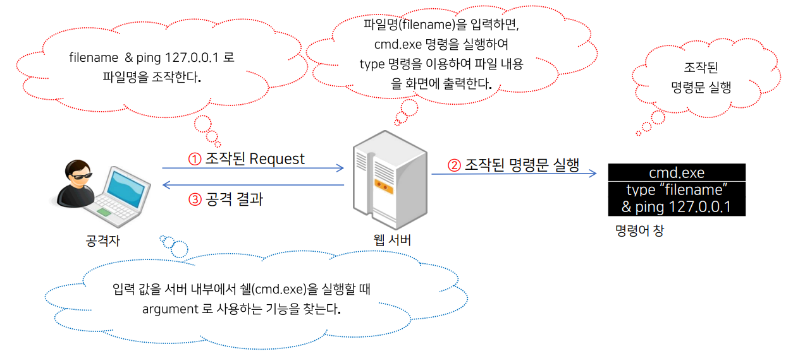
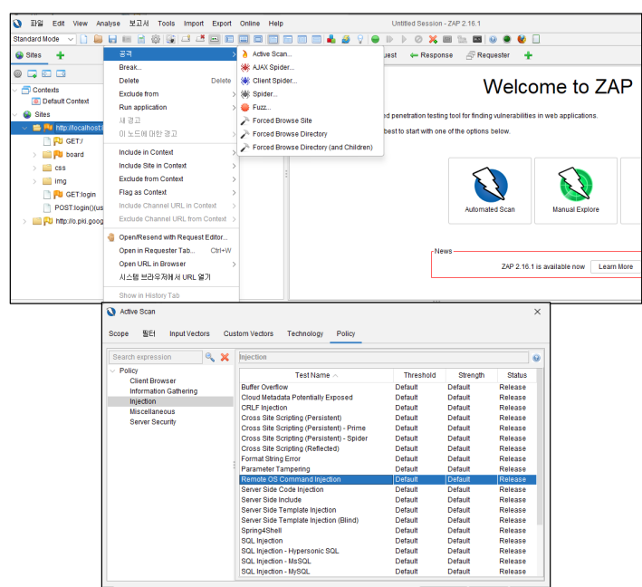

>🔒 시큐어 코딩 수업 정리

## Command Injection
📚**<span style="color: #008000">Command Injection</span>**: 사용자 입력값이 적절한 검증 없이 시스템 명령어의 일부로 사용될 때 발생하는 보안 취약점

💡**발생 원인**  
* 운영체제 명령을 실행하는 함수를 사용하는 경우
* 검증되지 않은 사용자 입력 값이 명령이나 명령의 파라미터로 사용되는 경우



### 운영체제별 명령어 실행 방식 이해

#### <span style="color: #008000">Windows</span>
* **기본 명령어 인터프리터**
  * 주로 `cmd.exe`와 최근에는 `PowerShell` 사용
  * 내부 명령어와 외부 프로그램 호출 방식 구분

* **명령어 파싱 및 실행 과정**
  * 특수문자(예: `&`, `|`, `>`)를 이용한 명령어 연결 및 리다이렉션

* **보안 고려사항**
  * Command Injection 시, **cmd.exe의 특수문자 해석을 악용 가능**
  * PowerShell의 스크립트 실행 정책 및 명령어 확장 취약점 존재

#### <span style="color: #008000">Linux</span>
* **기본 명령어 인터프리터**
  * 기본적으로 `/bin/sh`(대부분 Bash 기반) 사용
  * 쉘의 확장 기능(파이프, 리다이렉션, 와일드카드 등) 활용

* **명령어 파싱 및 실행 과정**
  * 공백, 따옴표, 이스케이프 문자() 처리 방식
  * 환경 변수, 명령어 치환(`, $() 등)의 해석 과정 포함

* **보안 고려사항**
  * 쉘 메타문자 및 파이프, 명령어 치환의 잘못된 처리로 인젝션 위험 증가
  * 환경 변수 조작 및 경로 변조 공격 가능성

---

## Command Injection 진단

### 수동 진단
* **목표**
  * 사용자 입력이 시스템 명령어와 결합되어 실행되는 경우, **악의적인 조작이 가능한지 확인**
  * 의도치 않은 명령 실행이나 출력 조작을 통해 취약점을 탐지

💡**기본 접근 방법**  
* 테스트 입력 값에 특**수문자 및 제어 문자를 삽입**하여 명령어의 실행 흐름 변화를 관찰
* 다양한 OS(Windows, Linux)와 쉘의 파싱 규칙을 고려하여 테스트 케이스 설계

#### <span style="color: #008000">명령어 연결자 테스트</span>
* `&`, `&&`, `||`, `;` 등으로 추가 명령어 실행 테스트
  * 예) `"test && cat /etc/passwd"` 또는 `"test; ls"`

#### <span style="color: #008000">파이프 및 리다이렉션 테스트</span>
* `|`, `>`, `<` 등을 활용해 명령어 조작 테스트
  * 예) `"test | ls"`, `"test > output.txt"`

#### <span style="color: #008000">환경 변수 활용 테스트</span>
* `$PATH`, `$IFS` 등을 이용하여 **명령어 실행 환경 변경하거나, 검증 우회 시도**
  * 예) `"test $PATH"` 또는 `"test$IFSls"` 처럼 환경변수 활용 가능한지 테스트

#### <span style="color: #008000">서브 명령 실행 테스트</span>
* **백틱 (\`) 또는 $()\`**를 사용해 서브 명령어 실행되는지 테스트
  * 예) "test \`ls\`" 또는 "test $(ls)"

---

### 자동화도구 ZAP
* ZAP 공식 사이트(https://www.zaproxy.org/)에서 최신 버전 다운로드 및 설치
* ZAP 실행 후, 프록시 포트(기본 `8080`) 확인

* 진단 대상 웹 서비스 준비
* 브라우저 프록시 설정
  * 브라우저의 프록시 설정을 ZAP의 프록시(예: `localhost:8080`)로 변경하여 **모든 트래픽이 ZAP을 통해 흐르도록 설정**

* **ZAP의 자동 검사 Active Scan 수행 방법**
  * ZAP 좌측 트리에서 테스트 대상 URL 선택 후, `우 클릭 → "Attack" → "Active Scan" 실행`

* **스캔 결과 확인**
  * 스캔 결과 창에서 "Command Injection" 관련 알림 (예: 에러 메시지, 비정상 응답 코드 등) 확인
  * 알림 상세 정보를 통해 의심되는 입력 필드 및 실행 결과 분석



---

## Command Injection 대응

### 시큐어 코딩 적용
* Command Injection이 발생하는 경우

```java
// ❌안전하지 않은 코드
String version = request.getParameter("version"); // version이 검증 없이 명령어에 직접 결합
String cmd = new String("cmd.exe /K \"run.bat \""); // 전체 명령어가 하나의 문자열로 구성되어 쉘에서 해석
Runtime.getRuntime().exec(cmd + " c:\\prog_cmd\\" + version);
```

```java
String version = request.getParameter("version");
if(version.matches("[0-9.]+")) { // 정규식 [0-9.]+로 숫자와 점만 허용
    Runtime.getRuntime().exec(new String[]{"cmd.exe","/c", "run.bat", version}); //String[] 배열로 각 인수를 분리하여 쉘 해석 방지
} else {
    부적합한 값으로 처리
}
```

1. **<span style="color: #008000">안전한 API 사용</span>**
* **직접 OS 명령어를 실행하지 않고**, 안전하게 프로세스를 실행하는 API (예: 인자 배열 방식의 `ProcessBuilder`, `execvp()` 등) 사용  
→ Command 인젝션 위험을 줄이기 위해 **파라미터와 명령어를 명확하게 분리**

2. **<span style="color: #008000">사용자 입력 값 검증</span>**
* 화이트리스트 기반 검증: **허용된 값만 받아들이고, 예상치 못한 입력은 모두 거부**  
→ 정규 표현식, 타입 체크 등을 활용하여 올바른 포맷만 통과

3. **<span style="color: #008000">메타 문자 필터링</span>**
* 사용자 입력에서 **특수문자** (&, ;, |, >, <, $(), `` 등)를 제거하거나 이스케이프 처리  
→ 입력 값에 포함된 메타문자를 명시적으로 치환하거나 제거하여, **명령어 결합 우회 방지**

4. **<span style="color: #008000">에러 핸들링 및 로깅</span>**
* 입력 값 검증 실패 및 명령어 실행 오류 시, 민감 정보가 노출되지 않도록 안전하게 처리  
→ 오류 발생 시 내부 로그에만 기록하고, 사용자에게는 최소한의 정보만 제공

5. **<span style="color: #008000">코드 리뷰 및 정적 분석</span>**
* 정기적인 **코드 리뷰와 정적 분석 도구를 활용**하여 Command 인젝션 취약점 사전 탐지
* 보안 관련 라이브러리 및 프레임워크의 최신 업데이트 적용

6. **<span style="color: #008000">테스트 케이스 마련</span>**
* 다양한 악의적 입력(우회 페이로드, 인코딩 변형 등)을 포함한 단위 테스트, 통합 테스트를 수행

---

### 시스템 보호 전략

1. **<span style="color: #008000">최소 권한 원칙 적용</span>**
* 애플리케이션 또는 명령어 실행 시 **비권한 사용자 계정을 활용**
* 시스템 서비스나 웹 서버의 **실행 권한 제한**을 통해 공격 성공 시 피해 범위 최소화

2. **<span style="color: #008000">애플리케이션 샌드박싱 및 컨테이너화</span>**
* 샌드박스 환경 또는 컨테이너(예: Docker)를 이용해 **애플리케이션 격리**
* 외부 명령 실행 시 격리된 환경 내에서 실행하여 시스템 전체에 영향을 주지 않도록 구성

3. **<span style="color: #008000">로깅 및 모니터링 활성화</span>**
* **명령어 실행 로그, 에러 로그, 접근 로그**를 체계적으로 기록
* 이상 행동 감지 시 즉각 알림 및 대응할 수 있는 **모니터링 시스템 구축**