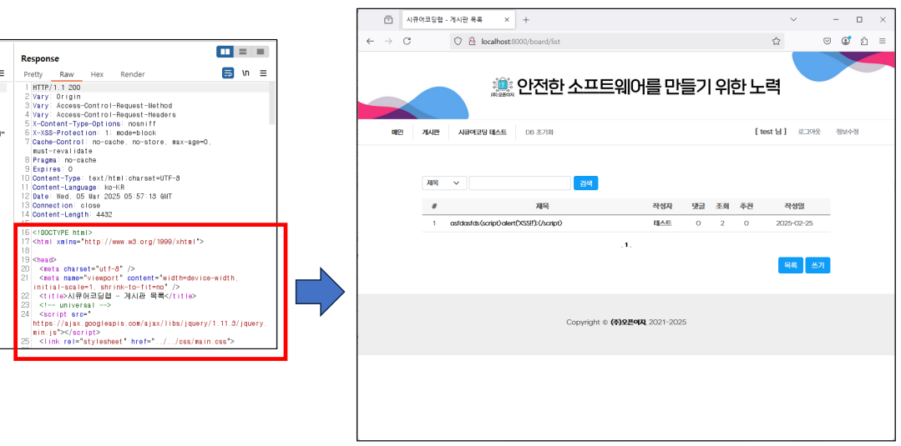
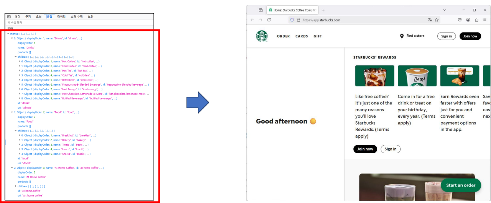

>🔒 시큐어 코딩 수업 정리

## 클라이언트 서버 구조
* 📚**<span style="color: #008000">Client</span>**: 사용자 인터페이스(UI)를 제공, 사용자의 요청(예: 브라우저, 모바일 앱)이 발생하는 프론트엔드 부분
* 📚**<span style="color: #008000">Server</span>**: 클라이언트의 요청을 처리하고 필요한 데이터를 생성하거나 제공하는 백엔드 시스템  
* **통신방식**: 웹 환경에서 클라이언트와 서버는 주로 HTTP/HTTPS 프로토콜을 통해 네트워크 상에서 데이터를 주고받음
**통신 과정**:  
1. **요청 전송**: 클라이언트가 `HTTP/HTTPS` 프로토콜을 통해 서버에 요청
2. **요청 처리**: 서버가 비즈니스 로직을 실행하고 데이터베이스에서 정보 조회
3. **응답 전송**: 처리 결과를 클라이언트에 반환


✅**특징**:  
* **분리된 역할**: 클라이언트는 사용자 경험에 집중, 서버는 데이터 처리와 비즈니스 로직 수행
* **중앙 집중식 처리**: 서버가 모든 요청을 받아 처리하고, 클라이언트는 결과를 화면에 표시
* **확장성**: 서버를 확장하여 여러 클라이언트의 요청을 처리할 수 있음

---

## 프론트엔드
📚**<span style="color: #008000">프론트엔드</span>**: 사용자와 직접 상호작용하는 웹 애플리케이션의 "보이는 부분"  
* 브라우저에서 실행되며 `HTML`, `CSS`, `JavaScript` 등을 활용

✅**주요 역할**:  
* **UI/UX 제공**: 사용자 친화적인 인터페이스 설계 및 반응형 디자인 구현
* **데이터 시각화**: 사용자 입력 처리, 애니메이션 및 동적 콘텐츠 제공, 클라이언트-서버 간 데이터 교환 및 API 호출 처리
* **표준 성능 최적화**: 페이지 로딩 속도 향상, 리소스 압축 및 캐싱 전략 적용

### 프론트엔드 데이터 처리 방식

#### **<span style="color: #008000">입력 데이터 캡쳐</span>** 
* **이벤트 리스너 활용**
  * 이벤트 리스너(Event Listener): `onChange`, `onInput`, `onSubmit` 등의 이벤트를 통해 실시간으로 사용자 입력을 감지
* **양방향 데이터 바인딩**: `React`, `Angular`, `Vue` 등의 프레임워크에서 UI와 상태를 동기화

#### 입력 데이터 유효성 검증
* **HTML5 내장 검증**: required, pattern, min, max 등의 속성 활용
* **JavaScript 검증**: 정규표현식과 커스텀 함수를 통한 복잡한 유효성 검증
* **즉각적 피드백**: 실시간 에러 메시지 표시 및 UI 업데이트

#### **입력 데이터 보안 처리**
* **<span style="color: #008000">입력값 이스케이핑(Escaping)</span>**: XSS 공격 방지를 위한 사용자 입력값 안전화
* **<span style="color: #008000">필터링</span>**: DOMPurify 등의 라이브러리로 HTML 및 스크립트 태그 제거
* **정적 분석 및 테스트**: 클라이언트 코드 내 입력 처리 로직 보안 리뷰

#### 입력 데이터 서버로 전송
* **안전한 AJAX/Fetch 요청**
  * HTTPS를 통한 암호화된 통신으로 데이터 전송
* **오류 처리 및 로깅**
  * 전송 실패나 검증 오류 시 사용자에게 명확한 메시지 제공 및 클라이언트 측 로그 기록

1. **특정 페이지 요청을 백엔드가 받아 적절히 HTML을 완성하여 응답한 것을 렌더링하여 화면 표출**
* **Static HTML(화면구성) + JavaScript(입력제어)**



2. **기능별 API 요청에 따른 백엔드 처리 결과 정보를 프론트엔드에서 적극적으로 화면에 구성하여 표출**
* **Dynamic HTML(화면구성) + JavaScript(입력 제어 및 API 호출제어)**



---

## 프론트엔드 보안 이슈

### DOM 기반 보안 문제
📚**<span style="color: #008000">DOM(Document Object Model) 보안 문제</span>**: 웹 애플리케이션에서 DOM을 직접 조작하는 과정에서 발생하는 보안 취약점  
* 클라이언트 사이드에서 사용자 입력 또는 외부 데이터를 **적절한 검증 없이 DOM에 반영하면, 공격자가 악의적 스크립트를 삽입할 수 있음**
  * **DOM**: 웹페이지의 **HTML 문서를 JavaScript가 조작할 수 있도록 객체 형태로 표현한 구조**

✅**특징**:  
* 서버에서 처리되지 않고 브라우저에서만 발생
* 기존 XSS와 달리, DOM 조작 로직 내부에서 발생하는 경우가 많음

#### **주요 공격 유형**
1. **<span style="color: #008000">DOM 기반 XSS</span>**: 문서 객체를 직접 조작하여 공격자가 임의의 스크립트를 실행
2. **<span style="color: #008000">클라이언트 사이드 데이터 조작</span>**: 사용자 입력이나 URL 파라미터를 통한 DOM 변조

#### 발생 경로
* **취약한 DOM 조작 함수 사용**
  * `innerHTML`, `document.write`, `outerHTML` 등으로 사용자 입력을 직접 삽입
* **부적절한 입력 검증**
  * URL 파라미터, 해시(fragment) 값 등 외부 데이터를 제대로 필터링하지 않음
* **동적 콘텐츠 생성**
  * 클라이언트에서 API 응답 또는 사용자 입력을 기반으로 동적으로 HTML을 생성할 때

💡**예시**:  
* URL 파라미터를 `location.hash`를 통해 DOM에 그대로 반영하는 경우
* 사용자 입력을 검증 없이 `element.innerHTML`에 할당하여 악성 스크립트 실행 가능

```javascript
// 취약한 코드 - innerHTML 사용 
function vulnerableUpdate() {
    var userInput = document.getElementById('vuln-input').value; document.getElementById('vuln-output').innerHTML = userInput; 
}

// 취약한 코드 - URL 파라미터 직접 사용 
function updateFromURL() { 
    var hash = location.hash.substring(1); document.getElementById('url-output').innerHTML = hash; 
}
```

{:.prompt-warning}
> 공격자가 문서의 URL을 변조해두면, 해당 페이지를 로드할 때 악성    스크립트가 실행되어 쿠키 탈취, 세션 하이재킹 등이 발생
>

---

### JavaScript 실행 환경 속 보안 문제

* **JavaScript 실행 환경 특성**
  * 클라이언트 브라우저에서 동적으로 코드가 실행됨
  * 다양한 방식으로 외부 데이터를 처리하고, **동적 코드 실행(dynamically executed code)이 가능**함

#### 보안 위협의 발생 원인
* **<span style="color: #008000">동적 코드 실행 함수 사용</span>**
  * `eval()`, `new Function()`, `setTimeout()`/`setInterval()`에서 문자열 인자 사용
* **<span style="color: #008000">글로벌 객체 노출</span>**
  * `window`나 `document` 같은 전역 변수가 공격자에게 조작 가능한 상태로 노출
* **<span style="color: #008000">서드파티 스크립트 및 라이브러리</span>**
  * 외부 스크립트나 패키지의 취약점, 불충분한 검증 시 위치 않는 코드 실행 위험
* **<span style="color: #008000">프로토타입 체인</span>**
  * 객체의 프로토타입에 악의적 속성을 추가하여 애플리케이션 전체에 영향

---

### 로컬 저장소 보안 문제
📚**<span style="color: #008000">로컬 저장소</span>**: HTML5에서 제공하는 클라이언트 측 저장소 (`localStorage`, `sessionStorage`, `IndexedDB`)  
* → **브라우저에 데이터를 저장**할 수 있는 편리한 기능

* **주요 활동 범위**
  * 사용자 선호도, 테마, 임시 캐시 데이터 저장
  * 비동기 웹 애플리케이션에서 상태 관리 및 빠른 데이터 접근

✅**장점:**  
* 서버와의 통신 없이 빠른 데이터 읽기/쓰기 가능
* 영구적 저장 (`localStorage`) or 세션 기반 저장 (`sessionStoage`)

#### 보안 위험 요소
* **<span style="color: #008000">XSS 공격을 통한 데이터 탈취</span>**
  * XSS 취약점으로 악의적 스크립트가 실행될 경우, **localStorage의 모든 데이터에 접근 가능**
  * → 저장된 민감 정보(인증 토큰, 개인정보 등)가 공격자에게 노출

* **<span style="color: #008000">암호화 미적용</span>**
  * 로컬 저장소는 기본적으로 평문으로 데이터를 저장하므로, 민감 정보가 그대로 노출될 위험

* **<span style="color: #008000">데이터 무결성 위험</span>**
  * 악성 스크립트가 저장된 데이터를 수정, 삭제하거나 조작할 수 있음
  * 클라이언트 사이드에서 쉽게 접근 및 변경이 가능

* **Same-Origin Policy 한계**
  * 도메인 간 격리 적용되지만, **동일 도메인 내에서는 모든 스크립트가 접근 가능**

---

### 보안에 취약한 API 호출 방식
* **API 호출의 역할**
  * 프론트엔드에서 **백엔드 서버와 데이터를 주고받기 위한 핵심 통신 수단**
  * 사용자 인터렉션에 따라 동적으로 API를 호출하여 데이터를 갱신

#### 취약한 API 호출 방식
* **<span style="color: #008000">민감 데이터 노출</span>**
  * API 호출 시 **URL의 쿼리스트링에 민감 정보를 포함**할 경우, 브라우저 기록, 로그, 캐시 등에서 쉽게 탈취 가능

* **<span style="color: #008000">네트워크 통신 취약점</span>**
  * HTTPS 미사용, 취약한 SSL/TLS 설정 등으로 **중간자 공격(MITM) 위험 증가**
  * 암호화되지 않은 채널을 통해 **민감 데이터가 평문 전송되는 경우**

* **<span style="color: #008000">인증/권한 관리 취약점</span>**
  * 프론트엔드에서 관리되는 토큰이 안전하게 보호되지 않으면, 탈취 후 권한 상승 공격 가능
  * 만료되지 않은 토큰 또는 재발급 절차 미흡으로 인한 부적절한 접근 제어

* **<span style="color: #008000">CORS 및 API 접근 제어 문제</span>**
  * 잘못 구성된 CORS 정책으로 인해 외부 악의적 도메인에서도 API 호출이 가능해짐
  * 공개 API로 오인하여 불필요한 데이터 노출 위험

---

## 프론트엔드 보안 개발 방법
✅**목적 및 필요성**:  
* 사용자 입력이 악의적 코드(예: 스크립트, 명령어 등) 삽입 등 보안 공격의 진입점이 될 수 있음  
→ 클라이언트 측에서 **입력 값을 선별적으로 허용(화이트리스트)**하거나, **불필요한 문자를 제거**하여 `XSS`, `Command Injection` 등 다양한 취약점을 방어

### 검증 vs 필터링
📚**<span style="color: #008000">검증(Validation)</span>**: 입력값이 기대하는 형식과 범위에 부합하는지 확인(예: 이메일 형식, 숫자 범위 등)

📚**<span style="color: #008000">필터링(Sanitization)</span>**: 입력값에서 위험한 특수문자를 제거하거나 안전하게 변환

* **프론트엔드 역할**
  * 즉각적인 사용자 피드백 제공 및 초기 보안 방어선 역할 수행
  * 하지만, 클라이언트 측 검증은 우회 가능하므로, 서버 측 검증이 병행되어야 함

### 다양한 검증 방법

#### **<span style="color: #008000">HTML5 기본 검증</span>**
* `<input>` 태그의 `type`, `required`, `pattern`, `min`, `max` 등 속성을 활용해 기본적인 형식 검증
* **브라우저 내장 검증**으로 사용자 경험(UX) 개선

#### **<span style="color: #008000">JavaScript를 이용한 커스텀 검증</span>**
* 정규표현식을 사용하여 **복잡한 형식의 유효성 검사 구현**
  * (예) 이메일, 전화번호, 날짜 형식 등
* **실시간 유효성 검사**로 에러 메시지 및 인라인 피드백 제공

#### **<span style="color: #008000">입력 값 필터링 라이브러리 활용</span>**
* `DOMPurify`, `sanitize-html` 등 **서드 파티 라이브러리를 사용**하여 HTML, **스크립트 태그 제거 및 안전한 값으로 변환**
* 프레임워크(React, Angular, Vue 등)의 내장 기능을 활용해 **XSS 공격을 사전에 차단**

#### **<span style="color: #008000">최소 혀용 원칙(Whitelist) 적용</span>**
* 허용할 입력 형식을 명시적으로 정의하고, 그 외의 값은 모두 거부
* 사용자 정의 입력의 경우, 미리 정의된 안전한 패턴과 비교하여 필터링

#### **<span style="color: #008000">입력값 이스케이프 처리</span>**
* 출력 전 HTML 엔티티 인코딩을 통해 DOM 삽입 시 악의적 스크립트 실행 방지
* 서버와 클라이언트 모두에서 일관되게 적용

#### **클라이언트와 서버 검증의 이중 방어**
* 클라이언트 측은 사용자 경험을 위한 초기 검증 수단으로 활용하고,
* 반드시 서버 측에서 최종 검증 및 필터링을 수행하여 보안 취약점을 최소화

#### **정기적인 보안 테스트 및 코드 리뷰**
* 정적 분석 도구와 보안 스캐너를 활용해 입력값 처리 로직에 취약점이 없는지 점검
* 개발 및 배포 주기마다 최신 보안 모범 사례를 반영하도록 업데이트

---

### CSP(Content Security Policy) 적용
📚**<span style="color: #008000">CSP(Content Security Policy)</span>**: 허용하는 **콘텐츠 출처를 명시적으로 정의**하여, XSS, 데이터 인젝션 등 악의적 콘텐츠 실행을 방지하는 보안 표준  
* **HTTP 응답 헤더(또는 HTML 메타 태그)**를 통해 정책을 브라우저에 전달

✅**필요성**:  
* XSS 공격 완화: 스크립트 인젝션 시 공격자가 실행 가능한 스크립트 소스를 제한
* 데이터 무결성 보장: 외부 악성 리소스 로드를 방지하여, 안전한 콘텐츠만 렌더링
* 보안 강화를 위한 추가 레이어: 기존 보안 조치와 함께 적용 시 다중 방어 체계 구축

#### 주요 CSP 지시문
* `default-src`: 기본 콘텐츠 출처 지정 (예: 'self')
* `script-src`: 스크립트 출처 제한 (신뢰된 도메인 및 inline 스크립트 제한)
* `style-src`: 스타일시트 출처 제한
* `img-src`: 이미지 로드 출처 지정
* `connect-src`: AJAX, WebSocket, API 호출 등 네트워크 요청 출처 제한
* `report-uri` / `report-to`: 정책 위반 시 리포트 전송

✅**구성 방법**  
* **HTTP 헤더 설정**:
(예) Content-Security-Policy: default-src 'self'; script-src 'self' https://trusted.cdn.com; object-src 'none';

* **Meta 태그 사용** (보조 방식):
(예)  

```html
<meta http-equiv="Content-Security-Policy" content="default-src 'self'; script-src 'self'">
```