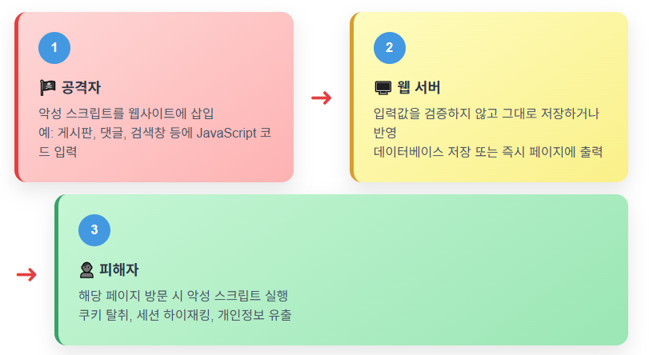
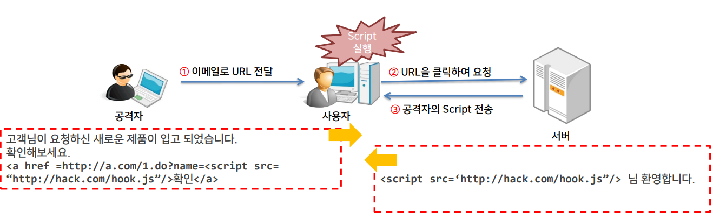
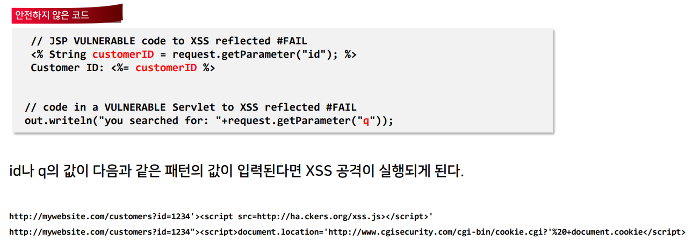
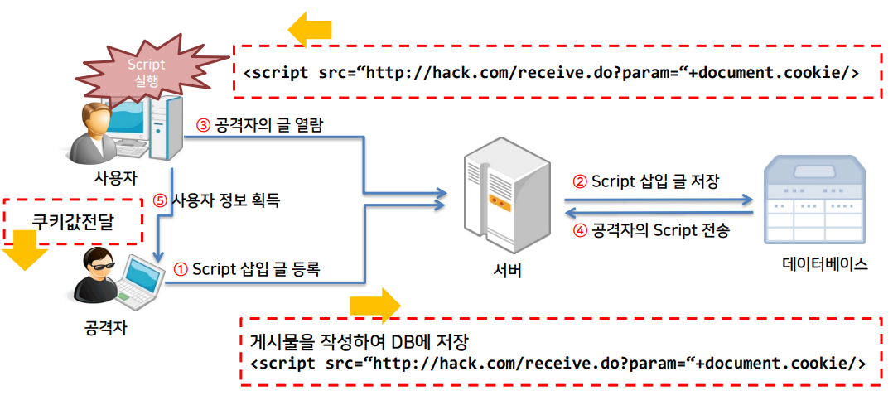
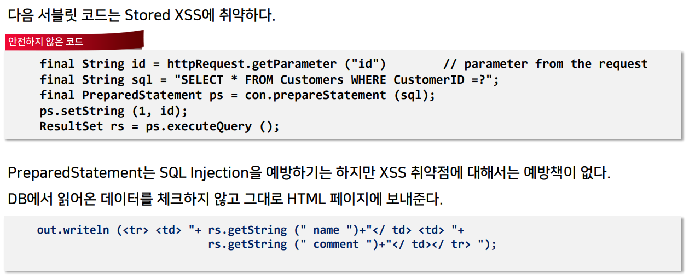
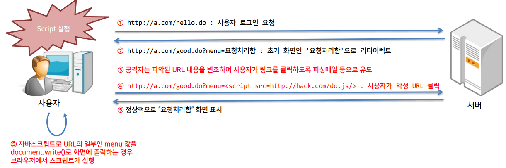
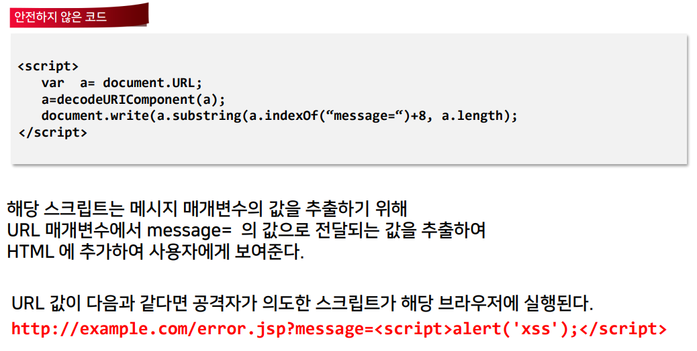
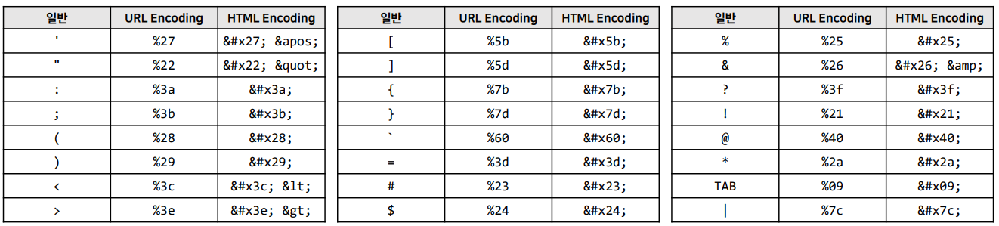
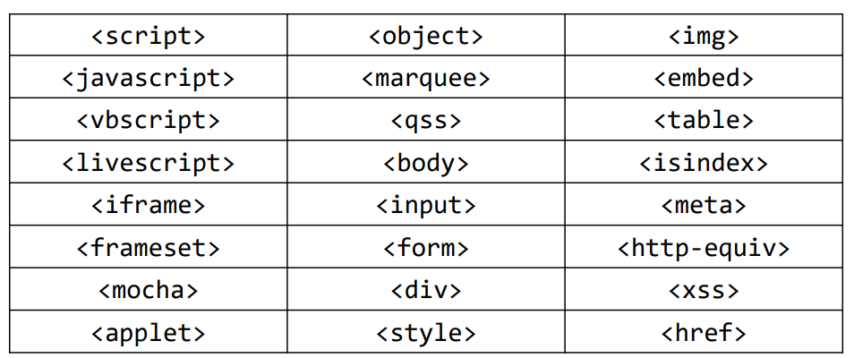
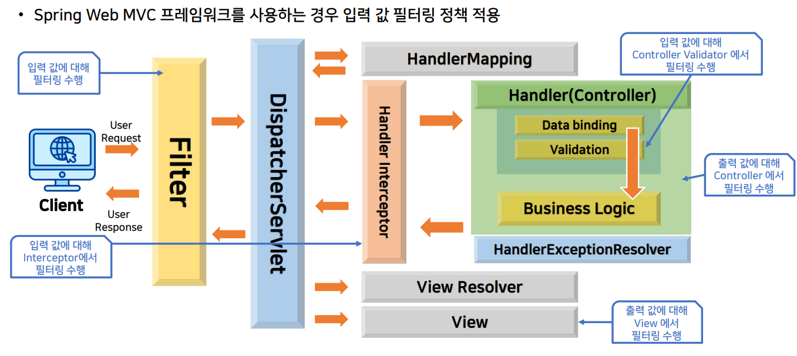

>🔒 시큐어 코딩 수업 정리

## XSS
📚**<span style="color: #008000">XSS</span>**: 검증되지 않은 외부 입력 값을 웹 응답에 그대로 반영하여 **악의적 스크립트가 실행**되는 취약점  
→ 사용자 브라우저에서 악성 코드가 동작해, 쿠키· 세션 등 민감 정보 탈취 가능

**발생 원인**  
* 외부에서 입력된 사용자 입력 값을 검증하지 않고 그대로 응답에 반영
* DB에 저장된 데이터를 읽어서 출력할 때 DB에서 읽어온 값을 검증하지 않고 출력 값으로 사용
* 자바스크립트로 DOM구조를 조작하여 페이지를 변경하는 경우 변경되는 내용을 검증하지 않고 브라우저에 표시하는 경우

### XSS 공격 흐름



### XSS 3가지 유형

#### 🔄 Reflected XSS (반사형)
* 사용자 입력이 **즉시 반영**되어 페이지에 표시
* 검색창, URL 파라미터 등을 통해 스크립트가 반사되어 실행
* 일회성 공격

#### 💾 Stored XSS (저장형)
* 게시판, 댓글, 프로필 등 DB에 악성 스크립트가 저장되어 **다수 사용자에게 전파**
* 지속적인 공격

#### 🌐 DOM-based XSS
* 클라이언트 측 스크립트(DOM 조작)에서 발생
* `location.hash`, `location.search` 등 브라우저 객체를 통한 동적 스크립트 삽입
* 서버 로그에 기록되지 않음 → 탐지가 어려움

### XSS 공격 피해
1. **세션 쿠키 탈취**
* 자동 로그인, 권한 정보 등 노출

2. **사용자 계정·개인정보 유출**
* 이메일, 전화번호, 주소 등 민감 정보 수집
* 폼에 입력한 비밀번호나 카드 정보 탈취

3. **브라우저 무단 제어**
* 임의 스크립트 실행 → 가짜 폼 표시
* 피싱 페이지로 이동
* 내부 네트워크 스캔 등

4. **기업 이미지 타격**
* 웹사이트 변조로 신뢰도 하락
* 고객 정보 유출로 인한 법적 문제

---

## XSS 취약점 진단

### Reflected XSS
* 사용자가 요청한 값을 **서버에서 검증하지 않고 응답으로 사용하는 경우** 발생





### Stored XSS
* 공격자가 서버에 저장한 스크립트를 사용자가 열람하는 경우 스크립트가 다운로드 되어 사용자의 브라우저에서 실행





### DOM 기반 XSS
* 자바스크립트로 DOM 객체 정보를 사용하여 Document에 write를 수행하는 경우 스크립트가 사용자의 브라우저에서 실행





---

## XSS 취약점 방어

### 입출력 값 검증 및 필터링
* **제한적인 입력 값 허용**
  * 클라이언트 프로그램과 서버 애플리케이션에서 [HTTP 헤더, 쿠키, 쿼리 스트링, 폼 필드, 히든 필드] 등의 모든 인자들에 대해 허용된 유형의 데이터만을 받아들이도록 **정규식을 이용하여 제한된 입력 값을 받아서 처리**
* **제한적인 출력 값 허용**
  * 입력 값이나 DB에서 조회한 결과 값을 응답으로 내보내기전에 `XssFilter`를 적용하여 동적으로 스크립트가 실행될 수 있는 요소들은 HTML인코딩을 적용하여 출력


> 필터링 또는 변환되어야 하는 특수문자들


> 차단되어야 하는 태그들

---

### HTML 엔티티 이스케이프 처리
📚**<span style="color: #008000">HTML 엔티티 이스케이프(Entity Escape)</span>**: HTML 문서에서 특수 문자가 브라우저에 의해 태그나 코드로 해석되지 않도록, **해당 문자를 엔티티 코드(예: `<` → `&lt;`)로 변환하는 기법**

✅**XSS 공격 방어 방법**  
* 사용자 입력에 포함된 `<script>` 태그 등 악의적인 스크립트가 실행되지 않도록 보호
* 서버와 클라이언트 모두에서 출력 전에 반드시 이스케이프 처리 필요
  * **동적 콘텐츠 출력 시** (특히 사용자 입력을 직접 HTML에 삽입하는 경우)

* **❌취약한 코드 예시**

```javascript
// 사용자 입력을 가져와서 그대로 innerHTML에 할당 (취약)
var userInput = getUserInput();
document.getElementById("content").innerHTML = userInput;
```

* **공격 시나리오**
  * 사용자가 `<script>alert('XSS');</script>`와 같은 입력을 전달하면, **해당 스크립트가 실행**되어 공격자가 쿠키 탈취, 세션 하이재킹 등 다양한 공격을 수행할 수 있음

* ✅**안전한 코드 예시**
* 방법 1: **사용자 입력 이스케이프 함수 적용**

```javascript
//사용자 입력을 HTML 엔티티로 변환하는 함수를 사용하여 안전하게 출력
function escapeHtml(text) {
return text.replace(/&/g, "&amp;")
    .replace(/</g, "&lt;")
    .replace(/>/g, "&gt;")
    .replace(/"/g, "&quot;")
    .replace(/'/g, "&#039;");
}

var userInput = getUserInput(); // 예: "<script>alert('XSS');</script>"
var safeInput = escapeHtml(userInput);
document.getElementById("content").innerHTML = safeInput;
```

* 방법 2: **textContent 속성 사용**

```javascript
//DOM에 텍스트만 삽입하여 브라우저가 HTML로 해석하지 않도록 함
var userInput = getUserInput(); // 사용자 입력
document.getElementById("content").textContent = userInput;
```

---

### Spring Web MVC에서 입출력 필터링



---

### CSP(Content-Security-Policy) 적용
* **HTTP 응답 헤더 CSP를 통해 설정함**

✅**XSS 공격 방어 효과**  
* **인라인 스크립트 차단**
  * 기본적으로 'unsafe-inline' 없이 **스크립트 실행을 제한**하여, 악의적으로 삽입된 인라인 코드가 실행되지 않도록 함

* **신뢰하는 스크립트만 허용**
  * 신뢰할 수 있는 도메인에서 제공하는 스크립트만 로드하게 하여, **외부 공격자의 스크립트 주입 차단**

* **동적 코드 실행 방지**
  * `eval()`이나 `new Function()` 같은 동적 코드 실행을 제한할 수 있음

* XSS 방어와 CSP의 연계
  * CSP는 XSS 취약점이 존재하더라도, 악의적 스크립트 실행을 실질적으로 차단하여 추가적인 방어층을 제공


> 예시: 웹 서버별 CSP 헤더 설정 