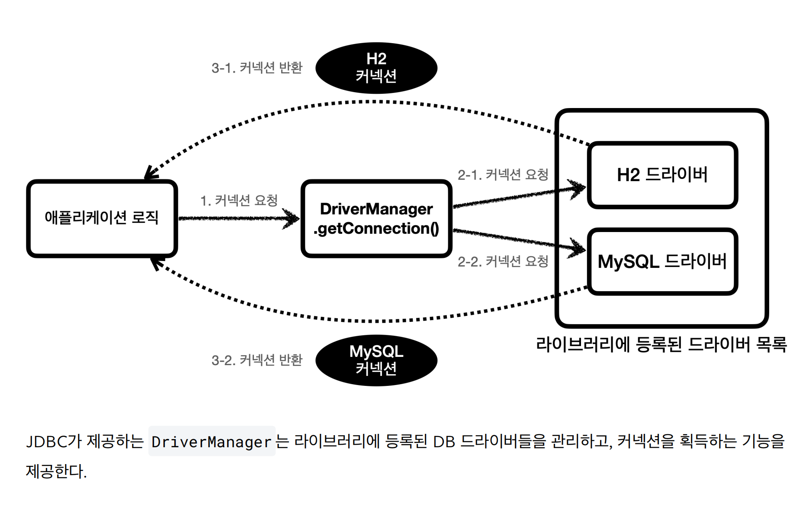

>🍃 Spring Framework 데이터베이스 연동 정리

## **<span style="color: #008000">JDBC</span>**
---
📚 **JDBC(Java Database Connectivity)**: 자바 애플리케이션에서 데이터베이스에 접근하기 위한 자바 표준 API

스프링을 사용할 때 DB와 연결, SQL 쿼리 전송 등의 목적으로 필수적으로 사용하는 라이브러리이다.

### 데이터베이스 연결
---
```java
public abstract class ConnectionConst {
    public static final String URL = "jdbc:h2:tcp://localhost/~/test";
    public static final String USERNAME = "sa";
    public static final String PASSWORD = "";
}

public class DBConnectionUtil {
    public static Connection getConnection() {
        try {
            Connection connection = DriverManager.getConnection(URL, USERNAME, PASSWORD);
            return connection;
        } catch (SQLException e) {
            throw new IllegalStateException(e);
        }
    }
}
```

### JDBC DriverManager
---


* **<span style="color: #008000">DriverManager</span>**: JDBC 드라이버를 관리하고 데이터베이스 연결을 생성하는 역할
* 애플리케이션과 데이터베이스 사이의 연결을 중개

### JDBC로 쿼리 전송하기
---
```java
public class MemberRepositoryV0 {

    public Member save(Member member) throws SQLException {
        String sql = "insert into member(member_id, money) values(?, ?)";
        Connection con = null;
        PreparedStatement pstmt = null;

        try {
            con = getConnection();
            pstmt = con.prepareStatement(sql);
            pstmt.setString(1, member.getMemberId());
            pstmt.setInt(2, member.getMoney());
            pstmt.executeUpdate();
            return member;
        } catch (SQLException e) {
            log.error("db error", e);
            throw e;
        } finally {
            close(con, pstmt, null);
        }
    }

    private void close(Connection con, Statement stmt, ResultSet rs) {
        if (rs != null) {
            try {
                rs.close();
            } catch (SQLException e) {
                log.info("error", e);
            }
        }
        if (stmt != null) {
            try {
                stmt.close();
            } catch (SQLException e) {
                log.info("error", e);
            }
        }
        if (con != null) {
            try {
                con.close();
            } catch (SQLException e) {
                log.info("error", e);
            }
        }
    }

    private Connection getConnection() {
        return DBConnectionUtil.getConnection();
    }
}
```

JDBC를 사용하면 DB 연결, 쿼리 작성, 연결 해제 등 **반복적인 보일러플레이트 코드**가 너무 많이 필요하다.

그래서 실무에서는 JDBC를 직접 사용하기보다 **JPA와 함께 사용**하여 이러한 복잡성을 줄인다.

-----

## **<span style="color: #008000">JPA</span>**
---
📚 **JPA(Java Persistence API)**: 자바 객체와 관계형 DB 테이블을 매핑해주는 ORM(Object-Relational Mapping) 기술

JPA 없이 관계형 DB와 자바가 상호작용하려면 다음과 같은 불편함이 있다:
* 연관 관계를 직접 SQL로 구현해야 함
* 자바의 상속 구조를 DB에 표현하기 어려움
* 반복적인 CRUD SQL 작성

**JPA를 사용하면 자바 객체를 다루듯이 코드를 작성하면 자동으로 SQL 쿼리가 생성되어 DB로 전송된다.**

### JPA 동작 방식
---


* JPA는 **JDBC를 내부적으로 사용**하지만 개발자가 직접 JDBC 코드를 작성할 필요가 없음
* **객체 지향적인 방식**으로 데이터베이스를 다룰 수 있게 해줌

-----

## **<span style="color: #008000">데이터베이스 연결 설정 (MySQL + JPA)</span>**
---

### 의존성 추가 (build.gradle)
---
```gradle
dependencies {
    runtimeOnly 'com.mysql:mysql-connector-j'
    implementation 'org.springframework.boot:spring-boot-starter-data-jpa'
}
```

### 스프링 설정 파일 (application.yml)
---
```yaml
spring:
  datasource:
    url: jdbc:mysql://localhost:3306/haein
    username: root
    password: password
    driver-class-name: com.mysql.cj.jdbc.Driver
  jpa:
    hibernate:
      ddl-auto: update
    properties:
      hibernate:
        format_sql: true
        show_sql: true
```

* **`ddl-auto: update`**: 엔티티 변경사항을 자동으로 DB 스키마에 반영
* **`show_sql: true`**: 실행되는 SQL 쿼리를 콘솔에 출력

-----

## **<span style="color: #008000">엔티티로 DB 테이블 구현하기 (N:1 연관관계)</span>**
---

### DB 스키마 설계
---


Member와 Post 엔티티가 **일대다(1:N) 관계**를 가진 스키마 설계 예시

> ERD 설계 도구: [https://www.erdcloud.com/](https://www.erdcloud.com/)

### Member 엔티티 구현
---
```java
@Entity // DB 테이블과 매핑되는 엔티티임을 명시
@Getter
public class Member {
    @Id // Primary Key
    @GeneratedValue(strategy = GenerationType.IDENTITY)
    @Column(name = "member_id")
    private Long id;

    private String name;
    private String email;
    private String password;

    // 일대다 관계의 '1' 쪽 설정
    // Member 하나가 여러 Post를 가질 수 있음
    // mappedBy: 연관관계의 주인이 아님을 명시 (Post의 writer 필드에서 관리)
    @OneToMany(mappedBy = "writer")
    private List<Post> posts = new ArrayList<>();
}
```

* **`@Entity`**: 이 클래스가 JPA 엔티티임을 선언
* **`@Id`**: Primary Key 필드 지정
* **`@GeneratedValue`**: PK 값 자동 생성 전략 (IDENTITY: DB의 AUTO_INCREMENT 사용)
* **`@OneToMany(mappedBy = "writer")`**: 일대다 관계 설정. `mappedBy`는 연관관계의 주인이 아님을 표시

#### @OneToMany 필드를 두는 이유
---
```java
List<Post> posts = member.getPosts(); // 매우 간단한 조회
```

JDBC를 사용하면 member의 모든 post를 조회하기 위해 직접 SQL 쿼리를 작성해야 하지만, **JPA를 사용하면 getter 하나로 객체지향적으로 조회**할 수 있다.

### Post 엔티티 구현
---
```java
@Entity
@Getter
public class Post {
    @Id
    @GeneratedValue(strategy = GenerationType.IDENTITY)
    @Column(name = "post_id")
    private Long id;

    private String title;
    private String content;

    // 다대일 관계의 'N' 쪽 설정
    // 여러 Post가 하나의 Member를 참조
    @ManyToOne
    @JoinColumn(name = "member_id") // FK 컬럼 이름 지정
    private Member writer; // 연관관계의 주인
}
```

* **`@ManyToOne`**: 다대일 관계 설정
* **`@JoinColumn(name = "member_id")`**:
  * Post 테이블에 `member_id`라는 FK 컬럼 생성
  * Member 엔티티의 PK 값을 저장
* **`@ManyToOne`을 붙인 필드는 실제 DB 컬럼에 저장됨** (연관관계의 주인)

-----

## **<span style="color: #008000">연관관계 매핑 시 고려사항</span>**
---

### 1. 지연 로딩 (Lazy Loading)
---
**문제 상황**: 게시물 100개를 조회할 때 연관된 Member 정보 100개도 함께 불러온다면?
게시물 제목만 필요한 경우, 멤버 정보 조회는 불필요한 성능 낭비다.

```java
@ManyToOne(fetch = FetchType.LAZY) // 지연 로딩 설정
@JoinColumn(name = "member_id")
private Member writer;
```

* **<span style="color: #008000">지연 로딩</span>**: 연관된 엔티티를 실제로 사용하는 시점에 조회
* `postRepository.findAll()` 실행 시 `writer` 필드에는 **프록시(가짜) 객체**가 들어감
* `post.getWriter().getName()` 등으로 실제 접근할 때 DB 쿼리 실행

#### 프록시 객체
---


* 진짜 엔티티 클래스를 상속받아 JPA가 자동으로 생성
* 실제 사용 시점까지 DB 조회를 미룸

{:.prompt-tip}
> **성능 최적화**: 연관관계는 항상 `LAZY`로 설정하는 것을 습관화하자!

**즉시 로딩(EAGER)**: 연관된 엔티티를 즉시 조회 (성능 문제로 거의 사용 안 함)

### 2. 영속성 전이 (Cascade)
---
```java
// Member 삭제 시 연관된 Post들도 함께 삭제
@OneToMany(mappedBy = "writer", cascade = CascadeType.REMOVE)
private List<Post> posts = new ArrayList<>();
```

* **`CascadeType.REMOVE`**: 부모 엔티티 삭제 시 자식 엔티티도 함께 삭제
* **`CascadeType.PERSIST`**: 부모 엔티티 저장 시 자식 엔티티도 함께 저장

멤버 탈퇴 시 게시글을 일일이 찾아 삭제할 필요 없이 JPA가 자동으로 처리한다.

-----

## **<span style="color: #008000">계층형 아키텍처: Repository-Service-Controller</span>**
---


스프링에서는 **역할을 계층별로 분리**하여 코드를 관리한다.

### Repository
---
📚 **Repository**: 데이터베이스와 직접 통신하는 계층 (Data Access Layer)

```java
public interface UserRepository extends JpaRepository<User, Long> {
    // JPA가 메서드 이름을 분석하여 자동으로 쿼리 생성
    Optional<Member> findByName(String name);
}
```

* **`JpaRepository<엔티티 타입, PK 타입>`** 상속
* **기본 CRUD 메서드 자동 제공**: `save()`, `findById()`, `findAll()`, `deleteById()` 등
* **메서드 이름 규칙**으로 커스텀 쿼리 생성: `findBy + 필드명`
* **구현 클래스를 작성할 필요 없음** (스프링이 런타임에 자동 생성)

### Service
---
📚 **Service**: 비즈니스 로직을 처리하는 계층

```java
@Service
@RequiredArgsConstructor // final 필드 생성자 자동 생성 (의존성 주입)
public class UserService {
    private final UserRepository userRepository;

    // 사용자 저장
    public User createUser(User user) {
        return userRepository.save(user);
    }

    // 사용자 삭제
    public void deleteUser(Long id) {
        userRepository.deleteById(id);
    }

    // ID로 사용자 조회 (Optional 활용)
    public Member findOne(Long memberId) {
        return memberRepository.findById(memberId)
            .orElseThrow(() -> new IllegalArgumentException("존재하지 않는 회원입니다."));
    }

    // 이름으로 사용자 조회
    public User getUserByUsername(String username) {
        return userRepository.findByUsername(username);
    }

    // 전체 사용자 조회
    public List<User> getAllUsers() {
        return userRepository.findAll();
    }
}
```

* Repository의 메서드를 조합하여 비즈니스 로직 구현
* 트랜잭션 관리

### Controller
---
```java
@Controller
@RequiredArgsConstructor
public class UserController {
    private final UserService userService;

    @GetMapping("/users/{username}")
    public User getUser(@PathVariable String username) {
        return userService.getUserByUsername(username);
    }
}
```

* HTTP 요청을 받아 Service를 호출하고 응답 반환

-----

## **<span style="color: #008000">트랜잭션 관리</span>**
---
📚 **트랜잭션**: 여러 DB 작업을 하나의 논리적 단위로 묶어 <u>모두 성공하거나 모두 실패</u>하도록 보장

### @Transactional 어노테이션
---
```java
@Service
@RequiredArgsConstructor
public class AccountService {
    private final AccountRepository accountRepository;

    @Transactional // 트랜잭션으로 묶음
    public void transferMoney(Long fromAccountId, Long toAccountId, int amount) {
        // 1. 보내는 계좌 조회
        Account fromAccount = accountRepository.findById(fromAccountId)
                .orElseThrow(() -> new IllegalArgumentException("보내는 계좌가 없습니다."));

        // 2. 받는 계좌 조회
        Account toAccount = accountRepository.findById(toAccountId)
                .orElseThrow(() -> new IllegalArgumentException("받는 계좌가 없습니다."));

        // 3. 출금
        fromAccount.withdraw(amount);

        // 4. 예외 발생 시 전체 롤백
        if (toAccount.isInactive()) {
            throw new IllegalStateException("받는 계좌가 비활성화 상태입니다.");
        }

        // 5. 입금
        toAccount.deposit(amount);

        // JPA가 트랜잭션 커밋 시 자동으로 UPDATE 쿼리 실행
    }
}
```

* **메서드 성공**: 자동 Commit
* **예외 발생**: 자동 Rollback (모든 변경사항 취소)
* **주로 Service 계층**에서 사용

-----

## **<span style="color: #008000">DTO로 데이터 전송하기</span>**
---
📚 **DTO(Data Transfer Object)**: 계층 간 데이터 전송을 위한 객체


### 일반적인 방식의 비효율
---
```java
@Service
public class WaitingService {
    @Autowired
    private WaitingRepository waitingRepository;

    // ❌ 비효율: 엔티티 전체 조회 후 DTO 변환
    public List<WaitingListDTO> getWaitingList(Long pubId) {
        // 1단계: 불필요한 컬럼까지 모두 조회
        List<Waiting> waitings = waitingRepository.findByPubId(pubId);

        // 2단계: Stream으로 DTO 변환 (메모리 2배 사용)
        return waitings.stream()
                .map(w -> new WaitingListDTO(
                    w.getId(),
                    w.getCustomerName(),
                    w.getCreatedAt()))
                .collect(Collectors.toList());
    }
}
```

### 개선된 방식: Repository에서 바로 DTO 반환
---
```java
// DTO 클래스
@Getter
@AllArgsConstructor
public class WaitingListDTO {
    private Long id;
    private String customerName;
    private LocalDateTime createdAt;
}

// Repository: JPQL로 필요한 컬럼만 SELECT하여 DTO 생성
@Repository
public interface WaitingRepository extends JpaRepository<Waiting, Long> {
    @Query("SELECT new com.example.dto.WaitingListDTO(w.id, w.customerName, w.createdAt) " +
           "FROM Waiting w WHERE w.pubId = :pubId")
    List<WaitingListDTO> findWaitingDTOByPubId(@Param("pubId") Long pubId);
}

// Service: 변환 과정 없이 바로 반환
@Service
public class WaitingService {
    @Autowired
    private WaitingRepository waitingRepository;

    public List<WaitingListDTO> getWaitingList(Long pubId) {
        return waitingRepository.findWaitingDTOByPubId(pubId);
    }
}
```

**개선 효과**:
* 필요한 컬럼만 SELECT (네트워크 부하 감소)
* 엔티티→DTO 변환 과정 생략 (메모리 절약)
* 코드 간결화

-----

## **<span style="color: #008000">Fetch Join으로 N+1 문제 해결</span>**
---

### N+1 문제란?
---
```java
// ❌ N+1 문제 발생
public void printTeamsAndMembers() {
    List<Team> teams = teamRepository.findAll();  // 1번 쿼리

    for (Team team : teams) {
        System.out.println("팀: " + team.getName());
        // 각 팀마다 members 조회 → N번 쿼리 발생!
        for (Member member : team.getMembers()) {
            System.out.println("  - 멤버: " + member.getName());
        }
    }
    // 총 1 + N번의 쿼리 실행 (비효율)
}
```

### Fetch Join으로 해결
---
```java
// Repository: Fetch Join 사용
@Query("SELECT DISTINCT t FROM Team t JOIN FETCH t.members")
List<Team> findAllWithMembers();

// Service: 1번의 쿼리로 해결
public void printTeamsAndMembers() {
    List<Team> teams = teamRepository.findAllWithMembers(); // 1번 쿼리로 Team + Member 모두 조회

    for (Team team : teams) {
        System.out.println("팀: " + team.getName());
        for (Member member : team.getMembers()) {
            System.out.println("  - 멤버: " + member.getName());
        }
    }
}
```

* **Fetch Join**: 연관된 엔티티를 한 번의 쿼리로 함께 조회
* **N+1 문제 해결**: 1 + N번 → 1번으로 쿼리 수 감소

-----

## **<span style="color: #008000">스프링의 멀티스레드와 동기 I/O</span>**
---

### 스프링의 스레드 풀
---


* **멀티스레드 방식**: 여러 사용자 요청을 동시 처리
* **스레드 풀**: 미리 생성된 워커 스레드를 재사용
* 요청 처리 완료 후 스레드는 다시 풀로 반환

### Blocking I/O 방식
---


* **동기 I/O**: I/O 작업 완료까지 스레드 대기 (Block)
* DB 조회에 1초 걸려도 다른 스레드가 처리되므로 전체 서버가 멈추지는 않음
* **단, CPU가 I/O 대기 중인 스레드를 WAIT 상태로 전환하고 다른 스레드를 실행**

### 스레드 풀 고갈 문제 (Thread Pool Exhaustion)
---
* 요청이 폭증하고 많은 스레드가 I/O 대기 상태면?
* 워커 스레드가 모두 WAIT 상태 → 새 요청 처리 불가
* **병목 현상 발생**

{:.prompt-info}
> **Non-blocking I/O**: 이 문제를 해결하는 비동기 방식도 있다
> 참고: [https://velog.io/@yjl8628/Blocking-Non-blocking-IO](https://velog.io/@yjl8628/Blocking-Non-blocking-IO)

-----
