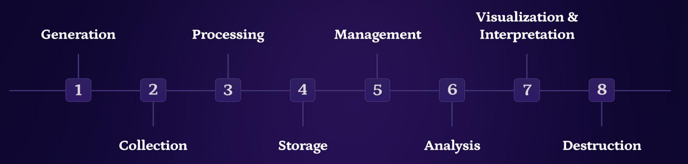
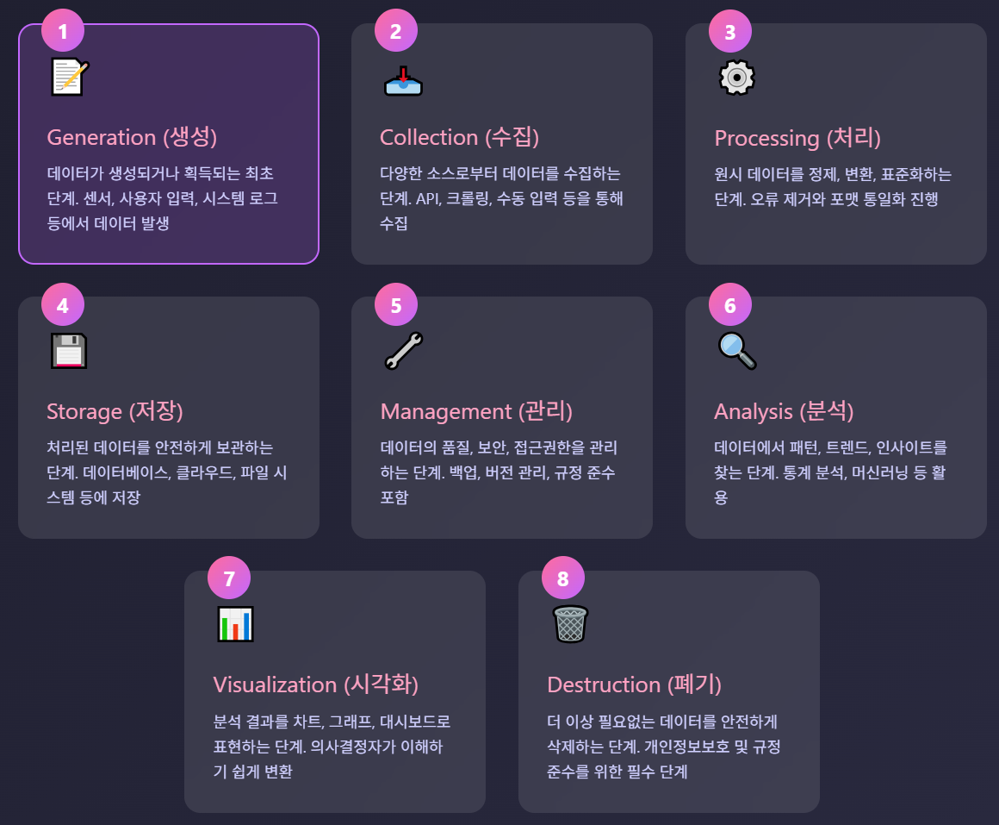
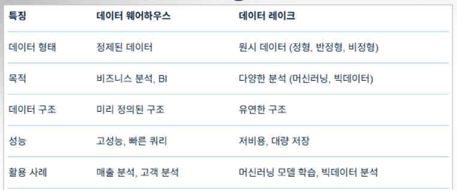
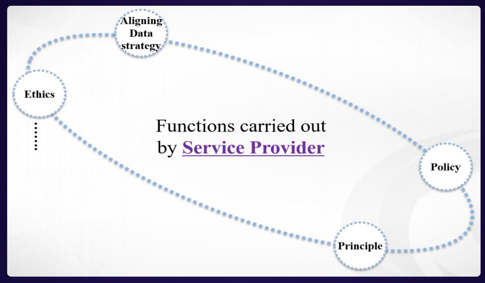
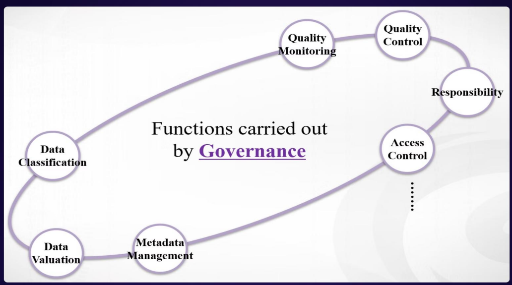
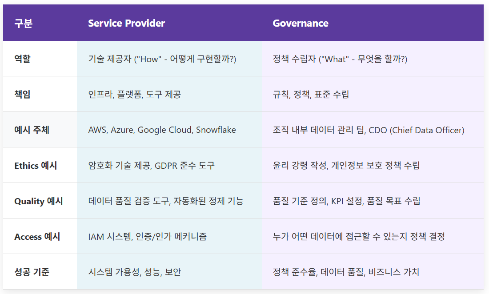
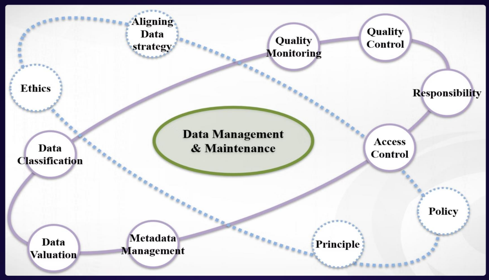

>🔒 사이버 보안 기초 수업 정리

## Data
📚**<span style="color: #008000">Data란?</span>**

1. **Raw Facts(원시 데이터)**: 센서 설문조사, 거래 등 다양한 소스에서 수집된 숫자, 텍스트, 측정값
* 그 자체로는 의미가 없음, **Data Lifecycle의 기초 블록**

2. **Information (정보)**: 원시 데이터를 데이터베이스나 스프레드시트 같은 **구조화된 형식으로 정리**한 것
* 맥락(context)을 추가하여 **분석과 의사결정에 사용 가능**하게 만듦

3. **Knowledge (지식)**: 데이터 분석, 시각화, 해석을 통해 추출된 실행 가능한 통찰
* 정보에 기반한 비즈니스 의사결정과 프로세스 개선 가능

### Data Lifecycle





### Step 1: 📚**<span style="color: #008000">Generation (Creation)</span>**
📚**<span style="color: #008000">Generation</span>**: 데이터가 조직 활동, 고객 상호작용, 제3자 소스를 통해 생성되는 최초 단계

💾**주요 데이터 소스**:  
1. **조직 활동(Organizational Activities)**
* 예: 판매 기록, 재고 관리, 직원 기록

2. **고객 상호작용 (Customer Interactions)**
* 예: 웹사이트 클릭, 앱 사용 로그

3. **제3자 소스 (Third-Party Sources)**
* 예: 시장 조사 데이터

* 일반적인 데이터 소스
  * 판매 기록 (Sales Records)
  * IoT 기기
  * 웹 애플리케이션
  * 설문조사
  * 모바일 앱

* 모든 데이터가 비즈니스 성공에 필수적인 것은 아님!

✅**Data Creation Best Practices (데이터 생성 모범 사례)**:  

1. **Define Data Requirements (데이터 요구사항 정의)**
* 필요한 구체적인 필드 식별
* 폼(Form)에 필요한 항목 결정
* 센서 측정값 명세 작성
* 데이터베이스 스키마 설계

2. **Use Standardized Formats (표준화된 형식 사용)**

3. **Validate Data Inputs (데이터 입력 검증)**

---

### Step 2: **<span style="color: #008000">Collection</span>**
✅**4가지 주요 수집 방법**:  

1. **Form**: 고객, 직원, 공급업체로부터 데이터 수집
* 예시: 회원가입 폼, 주문서, 설문지

2. **Surveys**: 많은 사람들로부터 동시에 피드백 수집
* 예시: 고객 만족도 조사, 제품 선호도 조사

3. **Interviews**: 심층적인 정보 수집
* 예시: 일대일 고객 인터뷰, 포커스 그룹 토론

4. **Direct Observation**: 실제 행동에 대한 귀중한 정보 획득

---

### Step 3: **<span style="color: #008000">Processing</span>**
원칙: **반드시 처리되어야 함**

✅**Data processing의 주요 활동**:  

1. **Data wrangling**: 원시 데이터를 분석이나 모델링에 적합하도
록 정리, 변환하는 과정
* 누락된 값 or 다양한 포맷 등으로 인해 분석에 바로 사용할 수 없는 경우, 데이터를 정제 또는 변환 등을 통해 분석에 필요한 형태로 만드는 과정

2. **Data compression**: 더 효율적으로 저장할 수 있는 형식으로 변환

3. **Data encryption**: 개인정보 보호를 위해 다른 코드 형태로 변환

---

### Step 4: **<span style="color: #008000">Storage</span>**
나중에 데이터를 사용하기 위해 어디엔가 안전하게 보관해야 함.

* 보통 **데이터베이스**에 저장
* 클라우드 또는 물리적 컴퓨터(서버)에 저장
* 백업 복사본을 여러 장소에 보관

#### Data Warehousing vs Data Lakes
📚**<span style="color: #008000">data warehousing</span>**: 구조화되고 정제된 데이터를 **빠른 쿼리를 위해 최적화**하여 저장하는 시스템

* **Schema-on-Write**: 데이터를 저장하기 전에 구조를 만듦
* **ETL process**: 데이터를 정제하고 변환한 후 저장
  * `Extract` → `Transform` → `Load` 
* **BI reporting 최적화**: 비즈니스 인텔리전스, 대시보드, 정기 보고서 생성에 이상적
* **SQL을 사용하고, Star/Snowflake 스키마 사용**

📚**<span style="color: #008000">data lakes</span>**: 원시 데이터를 네이티브 형식 그대로 저장하는 중앙 저장소

* **schema-on-read**: 데이터를 원시 형태로 저장하고, 읽을 때 구조를 해석
* **ELT process**: 원시 데이터를 먼저 저장하고, 필요 시 변환
  * `Extract` → `Load` → `Transform` 
* **ML/AI 최적화**: 데이터 사이언스, 머신러닝, 딥러닝 작업에 적합
* **Hadoop 에코시스템**: Hadoop, Spark 같은 분산 처리 시스템을 기반



---

### Step 5: **<span style="color: #008000">Management</span>**
📚**<span style="color: #008000">Data Management</span>**: 찾기 쉽게 잘 조직화된 폴더에 디지털 파일들을 유지하는 것

* 데이터가 잘 조직화되면 팀이 필요한 데이터를 빠르게 찾기 때문에 업무 효율 상승
* 데이터의 변화와 누가 보는지에 대해 안전하게 유지 가능

---

### Step 6: **<span style="color: #008000">Analysis</span>**
* 데이터를 연구하여 유용한 패턴을 찾는 과정

1. **Finding Useful Patterns**: 데이터 속에 숨겨진 규칙성과 트렌드를 찾아냄
2. **Charts and Graphs 활용**: 데이터 의미 파악
3. **Manual and Computer-Assisted Analysis(수동/자동 분석)**
4. **Working with Experts(전문가 협업)**

#### Data Mining & Business Intelligence
📚**<span style="color: #008000">Data Mining</span>**: 통계 분석과 머신러닝 알고리즘을 사용하여 대규모 데이터셋에서 패턴, 상관관계(correlations), 이상 현상(anomalies)을 발견하는 과정

📚**<span style="color: #008000">Business Intelligence(BI)</span>**: 데이터 마이닝으로 발견한 패턴들을 실행 가능한 인사이트(actionable insights)로 변환해서 전략적 계획, 운영 효율성, 그리고 수익 성장에 활용하는 과정

```
데이터 수집 → 데이터 마이닝 (패턴 발견) → BI (의사결정) → 실행 → 결과 측정
```

#### 데이터 분석의 윤리적 고려사항

1. **Privacy**: 개인정보를 보호하기 위해 데이터 암호화, 익명화 기법, 안전한 접근 제어를 구현하고, GDPR 같은 데이터 보호 규정을 준수하는 것

2. **Bias(편향성)**: 데이터셋의 인구통계학적 편향을 테스트하고, 다양한 학습 데이터를 사용하며, 차별적 패턴이 있는지 정기적으로 알고리즘을 감사하는 것

3. **Transparency(투명성)**: 데이터 출처, 분석 방법론, 그리고 한계점을 문서화하고, 명확한 데이터 사용 정책을 제공하며, 분석 프로세스의 감사 추적(audit trail)을 유지하는 것

---

### Step 7: **<span style="color: #008000">Visualization</span>**
* **데이터를 그림(pictures), 그래프(graphs), 차트(charts)로 변환**하여 이해하기 쉽게 만드는 단계

* 패턴을 즉시 파악 가능
* 의사결정자들에게 효과적으로 전달
* 비전문가도 쉽게 이해 가능

---

### Step 8: **<span style="color: #008000">Interpretation</span>**
* 분석하고 **시각화한 데이터를 보고 "이게 실제로 무엇을 의미하는지" 이해**하는 단계

* `데이터 → 정보 → 지식 → 지혜의 여정`

```
데이터: "매출이 20% 증가했다"
정보: "모바일 앱 출시 후 매출이 20% 증가했다"
지식: "모바일 사용자가 데스크톱 사용자보다 구매율이 높다"
지혜: "모바일 경험 개선에 투자하면 더 큰 성장 가능"
```

* 지식과 경험을 활용해 데이터가 말하는 바를 깊이 이해
* 발견한 것 + 중요한 이유 + 취해야 할 행동을 공유

---

### Step 9: **<span style="color: #008000">Destruction</span>**
* 더 이상 **필요 없는 데이터를 안전하게 삭제**하는 최종 단계

왜 데이터를 삭제해야하나?
* **저장 공간 확보**
  * 오래된 데이터 삭제 → 새로운 유용한 정보를 위한 공간 확보
  * 비용 절감: 클라우드 스토리지 비용 감소
* **법적 준수(GDPR, HIPAA 등)**
* **보안 위험 감소**

폐기 시점
* 더 이상 보관할 필요가 없을 때
* 더 이상 유용하지 않을 때

#### Data Disposal(처리) and Purging(삭제)

💡**3가지 안전한 데이터 폐기 방법**

1. **<span style="color: #008000">Deletion</span>**
* 파일 시스템이서 논리적으로 제거
* 파일 포인터 삭제, 디스크 공간을 "사용 가능"으로 표시
* 적용 예시
  * 일반 비즈니스 데이터
  * 민감도가 낮은 정보

2. **<span style="color: #008000">Overwriting</span>**
* 원본 데이터 위에 무작위 데이터 여려 번 덮어씀
* 적용 예시
  * 기밀 데이터(Confiential data)

3. **<span style="color: #008000">Physical Destruction</span>**
* 디스크를 물리적으로 분쇄, 소각, 분해 등 완전한 파괴
* 최고 기밀 정보(Top Secret)

#### 데이터 처리 규정 준수
📚**<span style="color: #008000">GDPR</span>**
* **제 17조 (잊혀질 관리)**: 사용자 요청 시 개인 데이터를 완전히 삭제해야 함
* **요구사항**
  * 삭제 절차 문서화
  * 준수(Compliance) 증명 자료 제공

📚**<span style="color: #008000">HIPAA</span>**
* **보호 대상 건강 정보(PHI, protected health information) 안전한 폐기 요구**
  * 인증된 데이터 소거 도구 또는 저장 매체의 물리적 파괴 필요
* **요구사항**
  * 폐기 기록 6년 보관

#### Disaster Recovery Planning
: 데이터 손실이나 시스템 장애 발생 시 비즈니스를 빠르게 복구하기 위한 체계적 계획

1. **<span style="color: #008000">Identify Risks</span>**
* **3개월마다 잠재적 문제점 점검**:
  * Equipment breakdown
  * Natural disasters - 지진, 홍수 등
  * Cybeattacs - 랜섬웨어, DDoS
  * Staff mistakes - 데이터 삭제, 잘못된 설정 등

2. **<span style="color: #008000">Create Backup Systems</span>**
* **3-2-1 backup role**
  * **3개의 사본 유지**: 원본 + 백업 2개
  * **2가지 다른 매체에 저장**: 하드 디스크+ 클라우드
  * **1개는 오프사이트 보관**: 재해로부터 물리적으로 분리
* 백업주기:
  * Daily: 중요 운영 데이터
  * Weekly: 전체 시스템
  * 보관기간: 90일

3. **<span style="color: #008000">Test Recovery Processes</span>**
* 3개월마다 복구 훈련 실시:
  * **4시간 이내** 시스템 복구 - RTO(Recovery Time Objective)
  * 최대 24시간 데이터 손실 허용 - RPO (Recovery Point Objective)
  * 명확한 복구 절차서 작성
  * 모든 직원이 자신의 역할 숙지

---

### Data Governance
데이터 관리 및 유지보수는 두 가지 주체가 각자의 역할을 수행

1. **Service Provider**: 기술적 인프라와 플랫폼 제공
2. **Governance**: 정책, 규칙, 품질 관리

#### Service Provider
📚**<span style="color: #008000">Service Provider</span>**: 데이터를 저장하고 처리하는 기술적 서비스를 제공하는 주체



1. **Ethics(윤리)**: 데이터를 윤리적으로 수집, 처리, 저장하는 기술적 프레임워크 제공
2. **Aligning Data Strategy(데이터 전략 정렬)**: 고객의 비즈니스 목표에 맞는 데이터 아키텍처와 솔루션 제공
3. **Policy(정책 지원)**: 고객이 설정한 정책을 기술적으로 구현하고 집행할 수 있는 도구 제공
4. **Principle(원칙 구현)**: 데이터 관리의 기본 원칙(무결성, 가용성, 기밀성)을 보장하는 기술 제공

#### Governance



1. **Data Classification**
2. **Data Valuation**
3. **Metadata Management**
4. **Quality Monitoring**
5. **Quality Control**
6. **Responsibility**
7. **Access Control**

#### Service Provider vs Governance



