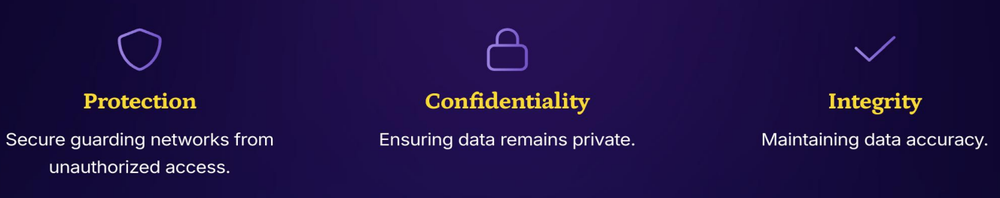
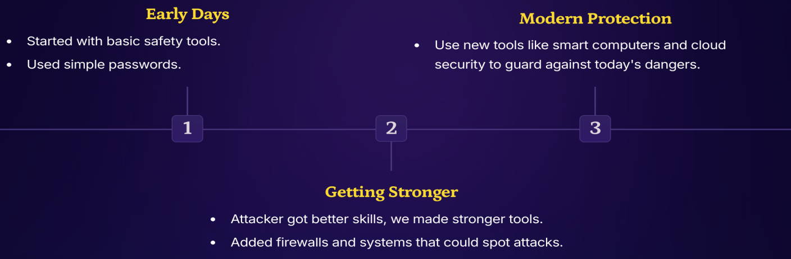
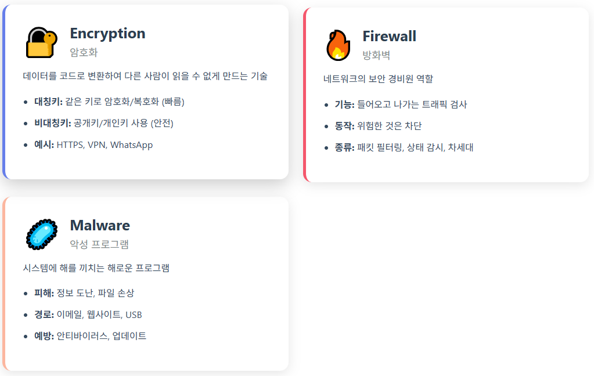
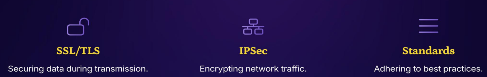

>🔒 사이버 보안 기초 수업 정리

## 네트워크 보안이란?
📚**<span style="color: #008000">Network Security</span>**: 컴퓨터 네트워크와 데이터를 **무단 접근(unauthorized access), 오용(misuse), 도난(theft)**으로부터 보호하는 것

왜 중요한가?

일상적인 운영에서 보안은 매우 중요함.
개인 기기부터 대규모 기업 시스템까지, 네트워크 보안 조치는 데이터의 **기밀성(Confidentiality), 무결성(Integrity), 가용성(Availability)**을 보장하는 데 필수적



1. **Protection**: 무단 접근으로부터 네트워크를 안전하게 지키는 것
2. **Confidentiality**: 데이터가 비공개 상태로 유지되도록 보장
3. **Integrity**: 데이터의 정확성을 유지하는 것

### Defining Network Security

#### 1. **<span style="color: #008000">Protection Policies (보호 정책)</span>**
: 네트워크를 안전하게 유지하기 위한 기본 규칙들

✅**주요 내용**:  
* 누가 네트워크를 사용할 수 있는지 결정
* 정보를 어떻게 보호할지 명시
* 문제가 발생했을 때 어떤 조치를 취할지 규정

#### 2. **<span style="color: #008000">Monitoring Tools (모니터링 도구)</span>**
: 네트워크에서 문제를 감시하는 특수 도구들

✅**주요 기능**:  
* 비정상적인 활동 탐지
* 침입 시도를 발견

#### 3. **<span style="color: #008000">Data Secure Guarding (데이터 보안 보호)</span>**
: 중요한 정보를 안전하게 유지하는 것이 주요 임무

✅**방법**:  
* **암호화(Encryption)**: 데이터를 코드로 변환하여 다른 사람이 읽을 수 없게 만듦
* **접근 제어(Access Control)**: 누가 데이터를 볼 수 있는지 통제

---

### Why Network Security Matters

#### 1. **<span style="color: #008000">Keeping Data Secure (데이터 보안 유지)</span>**
* 개인 정보를 안전하게 보호
* 데이터가 도난당하면 기업은 금전적 손실과 평판 손상을 입음
* 법적 문제 발생 가능

#### 2. **<span style="color: #008000">Stopping Online Attacks (온라인 공격 차단)</span>**
* 해로운 프로그램과 공격으로부터 네트워크를 보호
  * 공격종류: Malware, DDoS, Phishing
* 비즈니스가 원활하게 운영되도록 유지

#### 3. **<span style="color: #008000">Building Trust (신뢰 구축)</span>**
* 네트워크를 잘 보호하면 고객이 더 신뢰함
* 보안에 실패하면 신뢰를 영구적으로 잃을 수 있음

#### 4. **<span style="color: #008000">Following Rules (규정 준수)</span>**
* 법률은 기업이 중요한 정보를 보호하도록 요구
* 좋은 보안은 기업이 이러한 규칙을 따르도록 도움

---

### How Network Security Has Changed - 네트워크 보안의 진화



* **Early Days (초기 단계) - 1970-1990년대**
  * 기본적인 안전 도구로 시작
  * 단순한 비밀번호 사용
  * 주로 물리적 보안에 의존

* **Getting Stronger (강화 단계) - 1990-2000년대**
  * 공격자들의 기술이 향상됨에 따라 더 강력한 도구 개발
  * Firewall 추가: 네트워크 경계를 보호하는 방화벽
  * 공격을 탐지할 수 있는 시스템 도입

* **Modern Protection (현대 보호) - 2000년대 이후~현재**
  * 스마트 컴퓨터와 클라우드 보안 같은 새로운 도구 사용
  * 오늘날의 위험에 대비한 보호

---

## Threats, Vulnerabilities, and Risks
* **Threats**: 네트워크에 해를 끼칠 수 있는 것들
* **Vulnerabilities**: 네트워크의 약점
* **Risks**: Threat가 Vulnerabilities를 공격할 가능성과 영향

{:.prompt-tip}
> Risk = Asset x Threat × Vulnerability
>

#### Understanding Threats (위협 이해하기)
* **<span style="color: #008000">Threats</span>**: 네트워크에 해를 끼칠 수 있는 것
* 위협을 조기에 발견하면 막을 수 있음

#### Identifying Vulnerabilities (취약점 식별하기)
* **<span style="color: #008000">Vulnerabilities</span>**: 네트워크의 약점
* 컴퓨터, 프로그램, 설정 방식 등의 이유로 문제가 발생한다.

#### Assessing Risks (위험 평가하기)
* **<span style="color: #008000">Risks</span>**: 위협이 취약점을 공격했을 때 발생할 수 있는 결과
* 보호하기 위해 문제 발생 확률, 발생 시 피해 정도를 미리 파악해야 한다.

### Common Security Terms (주요 보안 용어)



---

## Types of Network Attacks - 네트워크 공격의 종류

네트워크 공격은 크게 3가지로 나눌 수 있다.

1. **Fake Message Attacks (가짜 메시지 공격)** - 사회공학적 공격
2. **Website Overload Attacks (웹사이트 과부하 공격)** - 가용성 공격
3. **Secret Spying Attacks (비밀 스파이 공격)** - 기밀성 공격

### **<span style="color: #008000">Phishing Attacks - 피싱 공격</span>**
: **사기꾼이 당신을 속여서 개인 정보를 공유하도록 만드는 공격**

* 가짜 이메일이나 가짜 웹사이트를 만들어 실제 회사인 것처럼 위장
* 사용자의 심리를 이용하여 정보를 자발적으로 제공하게 만듦

#### Common Phishing Tricks (흔한 피싱 수법)
* Scammer들이 가짜 이메일 또는 웹사이트를 만들어서 보냄
* 공포심이나 긴급성 강조 등으로 **빠른 선택을 하게 만들어서 피해를 유도**

### **<span style="color: #008000">Distributed Denial of Service (DDoS) Attacks - 분산 서비스 거부 공격</span>**
: **공격자가 엄청나게 많은 트래픽을 보내 대상 시스템을 마비시키는 공격**

어떤 피해를 입히는가?

**직접적 피해:**  
* 웹사이트 및 서비스 중단
* 고객이 서비스를 사용할 수 없음
* 매출 손실 (특히 전자상거래)

**간접적 피해:**  
* 브랜드 평판 손상
* 고객 신뢰 하락
* 복구 비용 발생

✅**어떻게 막을 것인가?**:  
1. **트래픽 모니터링**: 회사들은 비정상적인 트래픽을 감지하고 차단해서 스스로를 보호 가능
2. **트래픽 필터링**: `traffic controllers` 같은 도구를 사용하여 **나쁜 트래픽을 차단, 정상 트래픽 허용**
3. **백업 시스템**: 여러 서버에 분산하여 서비스 제공

### **<span style="color: #008000">Man-in-the-Middle (MITM) Attacks - 중간자 공격</span>**
: **공격자가 두 당사자 간의 통신을 몰래 가로채고 엿듣거나 조작하는 공격**

* 공격자가 통신 경로의 "중간"에 위치하여 모든 데이터를 가로챔

**MITM 공격 유형**

1. **Intecreption(가로채기)**
* 두 당사자 간의 통신을 가로챔

2. **Data Theft(데이터 도난)**
* 전송 중인 민감한 정보 훔침

3. **Prevention(예방 방법)**
* `HTTPS`, `VPNs` 사용

#### **<span style="color: #008000">Malware Attacks - 악성코드 공격</span>**
: **컴퓨터에 해를 끼칠 수 있는 나쁜 소프트웨어**

**Malware의 종류**  
* 파일 도난형
* 금전 요구형
* 시스템 제어형 등 존재

✅**안전하게 유지하는 방법**:  
* 소프트웨어 업데이트
* 안티바이러스 프로그램 사용
* 온라인 보안 교육

---

## Network Security Protocols - 네트워크 보안 프로토콜
: 네트워크 보안 프로토콜과 표준은 **안전한 통신과 데이터 전송을 보장**하는 데 필수적  
* `SSL/TLS`와 `IPSec` 같은 프로토콜은 민감한 정보를 보호하기 위한 암호화와 인증 메커니즘을 제공



* `SSL/TLS`(Secure Sockets Layer / Transport Layer Security): 전송 중 데이터 보안
* `IPSec` (Internet Protocol Security): 네트워크 트래픽 암호화
* Standards: 모범 사례 준수

### Overview of Security Protocols

#### 1. Data Encryption Mechanisms (데이터 암호화 메커니즘)
: `SSL/TLS`와 `IPSec`은 **전송 중 데이터를 암호화**하여 '기밀성'과 '무결성'을 보장

작동 원리:

```
평문 데이터
    ↓
암호화 알고리즘 적용 (SSL/TLS 또는 IPSec)
    ↓
암호화된 데이터 전송
    ↓
수신자가 복호화
    ↓
원본 데이터 복원
```

#### 2. Securing Communication Channels (통신 채널 보안)
: 프로토콜은 네트워크를 통한 통신 채널을 보호하여 무단 접근으로부터 민감한 정보를 보호
* 클라이언트 - 서버 간 안전한 연결

#### 3. Importance of Security Protocols (보안 프로토콜의 중요성)
* Digital communications에서 효율적인 보안을 구현할 수 있음
* 이 프로토콜들은 온라인 거래 및 데이터 교환 보안의 기본이다.

---

### Authentication, Authorization, Accounting (AAA)

#### 1. **<span style="color: #008000">Authentication Process(인증 프로세스)</span>**
: 네트워크에 접근하려는 사용자의 신원을 검증

✅**특징**:  
* Passwords
* Biometrics
* MFA(Multi-factor Authentication)

#### 2. **<span style="color: #008000">Authorization Levels (권한 부여 수준)</span>**
: 인증된 사용자가 어떤 리소스에 접근할 수 있는지 결정

**Authorization의 핵심 원칙:**  
* **최소 권한 원칙 (Principle of Least Privilege)**
  * 사용자에게 업무 수행에 필요한 최소한의 권한만 부여
* **역할 기반 접근 제어 (RBAC - Role-Based Access Control)**

#### 3. Accounting and Logging (계정 관리 및 로깅)
: 사용자의 활동을 추적하고 네트워크에서의 행동을 기록

* **Auditing(감사)**와 보안을 위해 필수적임
* 로그는 네트워크 사용과 잠재적 보안 사고를 위해 가치있는 인사이트를 제공

---

### Network Security Standards and Best Practices

#### 1️⃣ Regular Updates (정기 업데이트)
: 모든 시스템을 최신 상태로 유지하여 보안 문제를 해결
* 새로 발견된 취약점 패치
* 버그 수정
* 새로운 위협에 대한 방어

#### 2️⃣ Strong Passwords (강력한 비밀번호)
: 데이터를 보호하기 위해 강력한 비밀번호를 생성하고 사용
* 최소 12자 이상 복잡성

#### 3️⃣ Incident Response Plans (사고 대응 계획)
: 보안 문제에 대비한 명확한 계획을 준비