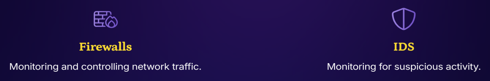
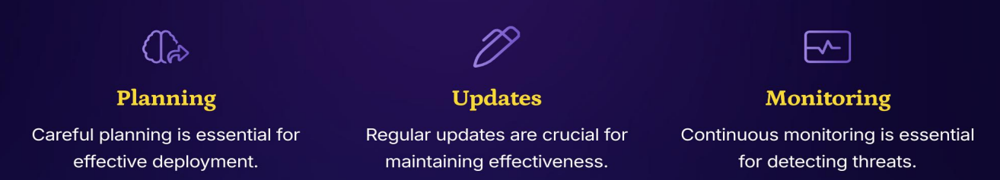

>🔒 사이버 보안 기초 수업 정리

## Firewall & IDS
📚**<span style="color: #008000">Firewall</span>**: 정해진 규칙에 따라 네트워크 트래픽을 감시하고 통제하는 방어벽

📚**<span style="color: #008000">IDS</span>**: 네트워크 트래픽을 감시, 이상 행동을 발견하면 경보를 울림



### Firewall의 종류

#### 1️⃣ Packet Filtering Firewall (패킷 필터링 방화벽)

작동원리:

```
들어오는 패킷 → IP 주소 확인 → 포트 번호 확인 → 규칙 매칭 → 허용/차단
```

* **Network Layer(L3)**에서 작동
* IP 주소, 포트 번호, 프로토콜만 확인

#### 2️⃣ Stateful Inspection Firewall (상태 검사 방화벽)
✅세션 추적: **A와 B의 연결 상태를 기억**  
- 이 패킷이 정상적인 연결의 일부인가?
- TCP 3-way handshake가 완료됐는가?
- 응답 패킷이 먼저 요청한 연결에 대한 것인가?

---

### Instrusion Detection & Prevention Sys (IDS/IPS)

#### 1. Network Traffic Monitoring (네트워크 트래픽 모니터링)
* **<span style="color: #008000">IDS and IPS</span>**는 잠재적 위협을 감지하기 위해 지속적으로 모니터링하고 차단한다.
* 의심스러운 트래픽 패턴들을 분석

#### 2. Real-Time Alerts (실시간 경보)
이 시스템은 의심스러운 패턴 발생 시 즉각적으로 경보를 울림
* 경보 전달 방식: Email, SMS, 보안 대시보드 등

#### 3. Blocking Attacks (공격 차단)

✅**IPS의 자동 대응 메커니즘:**  

```
1. 공격 탐지
   ↓
2. 즉시 분석 (False Positive 확인)
   ↓
3. 자동 차단 조치:
   - 공격자 IP 주소 블랙리스트 추가
   - 해당 세션 즉시 종료
   - 방화벽 규칙 동적 업데이트
   ↓
4. 로그 기록 & 알림
```

---

### Deploying and Managing Firewalls/IDS
📚**<span style="color: #008000">Firewall과 IDS의 배포와 관리</span>**: 방화벽(Firewall)과 침입 탐지 시스템(IDS)을 단순히 설치하는 것만으로는 충분하지 않다. 지속적인 관리와 유지보수가 필요함!

* 새로운 침입 방법에 대응하지 못함 (업데이트 부재)
* 실제 위협이 발생해도 모름 (모니터링 부재)
* 잘못된 설정으로 정상적인 활동까지 차단 (계획 부재)



---

## Network Security Devices & Tools

### Routers and Switches with Security Features
📚**<span style="color: #008000">Router</span>**: 서로 다른 네트워크를 연결(L3)

📚**<span style="color: #008000">Switch</span>**: 같은 네트워크 내에서 장치들을 연결(L2)

1. **Basic Security Functions** 
* Router와 Switch는 네트워크의 Gateway에서 작동
* 내부 네트워크로 들어오는 모든 트래픽을 검사

2. **Access Control**
* 누가 네트워크에 접속할 수 있고 무엇에 접근 가능한지 컨트롤 가능
* 네트워크 세그먼테이션
  * 최소 권한 원칙: 필요한 리소스만 접근 허용
  * 한 네트워크의 감염이 다른 곳으로 확산되지 않음

3. **Traffic Security**
* 네트워크 트래픽을 검사하고 차단함
* 한 번 침투한 공격자가 네트워크 내부에서 자유롭게 이동하는 것을 방지

---

### Virtual Private Networks (VPNs)
📚**<span style="color: #008000">VPN</span>**: Virtual (가상의) + Private (비공개) + Network (네트워크) = 공개된 인터넷을 통해 만드는 **사설 네트워크**

* VPN은 내가 사용하는 인터넷에 안전한 pathway를 만듦

**VPN 사용:**  

```
당신의 PC → [암호화 터널] → VPN 서버 → 목적지
          └─────────────────┘
           (아무도 읽을 수 없음)
```

* **Remote Access to Private Networks** (원격 프라이빗 네트워크 접근)

**작동 원리:**

```
집 컴퓨터 → VPN 연결 → 회사 VPN 게이트웨이 → 회사 내부 네트워크
                        ↓
                   인증 및 권한 확인
                        ↓
                   승인된 사용자만 접속
```

* **Data Transmission Security (데이터 전송 보안)**
  * 전송 중 데이터 보호 (Data in Transit)

---

### Network Security Monitoring (NSM) Tools
📚**<span style="color: #008000">NSM</span>**: 네트워크 트래픽과 활동을 지속적으로 감시하여 보안 위협을 탐지하고 대응하는 프로세스

#### 1. **Monitoring Network Activity (네트워크 활동 모니터링)**
**24/7** 감시 체계

무엇을 모니터링하는가?

1. 트래픽 패턴
  * 정상 트래픽 베이스라인 설정
  * 평소와 다른 패턴 감지

2. 연결 정보
  * 누가 누구에게 연결하는가?
  * 어떤 포트와 프로토콜을 사용하는가?

3. 보안 위협

#### 2. Proactive Security Management (사전 보안 관리)
: 문제가 발생하기 전에 해결

* Reactive: 사후 대응
* Proactive: 사전 대응

NSM이 찾는 것들:

1. **Weak Points**
2. **Possible Threats (잠재적 위협)**
3. **Network Safety (네트워크 안전성 유지)**

#### 3. Incident Response (즉각 대응)
: 문제 발생 시 신속한 대응

---

### Security Policies & Best Practices
📚**<span style="color: #008000">보안 정책</span>**:  조직이 정보 자산을 보호하기 위해 수립한 공식적인 규칙, 절차, 가이드라인의 집합

✅**Security Policies가 중요한 이유**:  
* 명확한 이해 제공 - 동일한 보안 기준
* 역할별 책임을 명확히 함

**Following Rules and Standards (규칙과 표준 준수)**  
* 좋은 보안 정책은 업계 모범 사례를 따른다.
* 보안 정책을 통한 예방은 사고 대응보다 저렴함!

---

###  User Education and Training
1. **Importance of User Education (사용자 교육의 중요성)**
* "People are the first defense" (사람이 첫 번째 방어선)
* Good training helps everyone spot and stop potential attacks

2. **Reducing Human Error (인적 오류 감소)**
* Traning은 네트워크 보안을 해칠 수 있는 흔한 실수들을 예방한다.
* 예를 들면 약한 비밀번호, fake email, 안전하지 않은 온라인 행동 등

3. **Enhancing Overall Security (전반적 보안 강화)**
* 보안의 기초만 이해해도 조직 전체가 안전해짐
* Well-trained users help protect the network better than technology alone